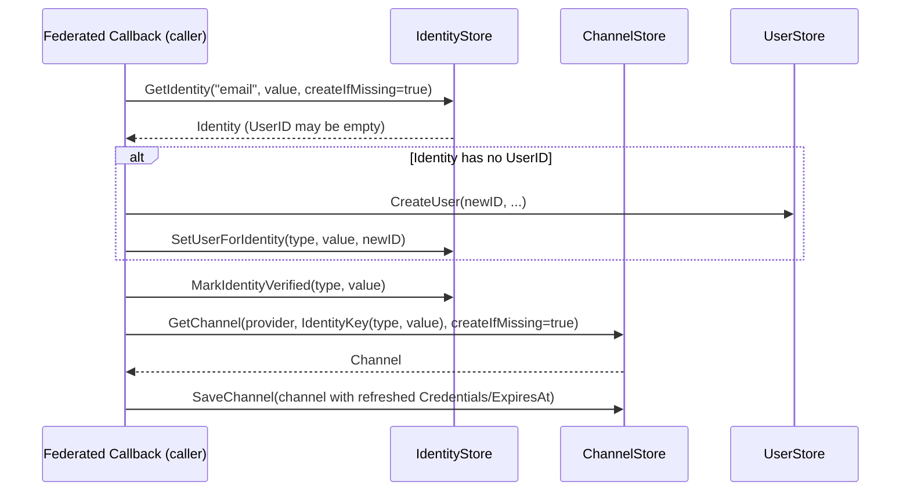
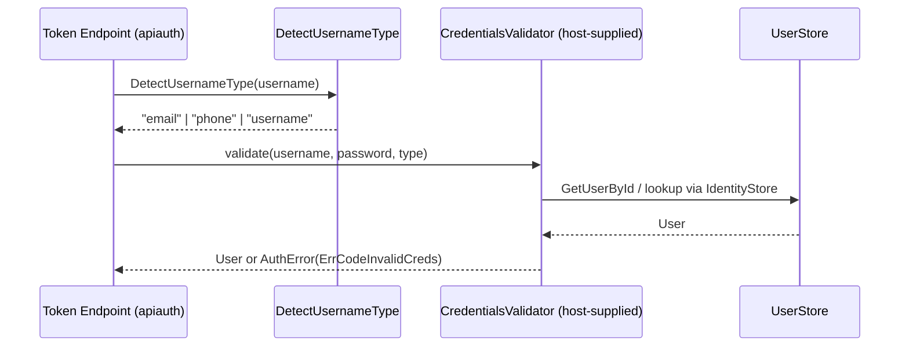

# accounts

The `accounts` package defines the federated end-user account model that both username/password (localauth) and provider-mediated (federatedauth) flows share. It owns three principals — `User`, `Identity`, `Channel` — plus their store interfaces and the structured `AuthError` type, but deliberately ships no HTTP handlers, no OAuth token shapes, and no signup policy. The split between `Identity` (a verifiable contact) and `Channel` (a per-provider credential keyed by `type:value`) is what enables account-linking: multiple providers can verify the same email without colliding, and the join key is centralized in one helper to keep stores from drifting.

## Contents

- [Entities](#entities)
- [Flows](#flows)
  - [Federated callback linking](#federated-callback-linking)
  - [Password-grant credential validation](#password-grant-credential-validation)
- [Gotchas](#gotchas)
- [Depends on](#depends-on)

## Entities

| Entity | Kind | Role | Why |
|---|---|---|---|
| `User` | interface | Minimal account principal (Id + Profile map) seen by the application. | Kept intentionally tiny so apps can wrap their own richer user types without inheriting fields they don't use. |
| `BasicUser` | struct | Trivial in-memory `User` implementation backed by ID and a profile map. | Default used by stores and tests; apps with richer users implement `User` directly. |
| `BasicUser.Id` | method | Returns the user's unique ID. | Satisfies the `User` interface; field is exported for direct serialization. |
| `BasicUser.Profile` | method | Returns the freeform profile map. | Map shape (not struct) is deliberate — host apps stuff arbitrary attributes (channels list, display name, etc.) without changing this package. |
| `Identity` | struct | A verifiable contact (email/phone) owned by exactly one `User`, with optimistic-locking `Version`. | Separating `Identity` from `User` allows one user to own multiple contacts and lets verification status live on the contact, not on the credential. |
| `Channel` | struct | Per-provider credential record (local password hash, OAuth tokens, SAML profile) tied to an `IdentityKey`. | Decoupling `Channel` from `Identity` is what makes account-linking possible — multiple providers can verify the same email without colliding. |
| `Channel.IsExpired` | method | Reports whether `ExpiresAt` is set and in the past. | Zero-time `ExpiresAt` deliberately means "never expires" — needed because local channels have no expiry while OAuth channels do. |
| `IdentityKey` | func | Builds the canonical `type:value` key (e.g. `email:john@example.com`) used to join `Identity` and `Channel`. | Centralizing the join key prevents stores from drifting on separator choice and case-sensitivity assumptions. |
| `HandleUserFunc` | type | Callback signature invoked by auth flows after successful authentication so the host can set session and redirect. | Carries both an `*oauth2.Token` (for federated) and a userInfo map (for local) so a single hook serves both flows. |
| `DetectUsernameType` | func | Heuristic that classifies a username string as `email`, `phone`, or `username`. | Lets apiauth's password-grant accept opaque username strings without forcing the host to pick a type per request. |
| `LinkedChannels` | func | Extracts the channels list from a `User` profile map, tolerating both `[]string` and `[]any` shapes. | JSON round-trip through `map[string]any` degrades `[]string` into `[]any` — this normalization spares every caller from re-doing the type switch. |
| `UserStore` | interface | CRUD interface over `User` accounts (Create, GetById, Save). | `SaveUser` is an upsert by design so federated callbacks can create-or-refresh without a separate "exists?" round trip. |
| `IdentityStore` | interface | Manages `Identity` records, identity-to-user mapping, and verification state. | `GetIdentity`'s `createIfMissing` flag plus the separate `SetUserForIdentity` reflects that an `Identity` can exist (unverified) before any user claims it. |
| `ChannelStore` | interface | Manages `Channel` records and lookups by `IdentityKey`. | `GetChannelsByIdentity` returns a slice — an identity can be backed by multiple channels (one per provider), which is the whole point of account linking. |
| `UsernameStore` | interface | Optional store for apps that need username uniqueness; provides reserve/release/change atomicity. | Split out from `UserStore` because many deployments (email-only login) never need it, and forcing it into `UserStore` would penalize them. |
| `AuthError` | struct | Structured account-level error (`Code`, `Message`, `Field`) shared by local and federated flows. | `Field` is included so a single error type can drive both form re-rendering and JSON API responses. |
| `AuthError.Error` | method | Satisfies the `error` interface by returning `Message`. | `Code` (not `Message`) is the stable identifier — callers should switch on `Code`, not parse `Error()`. |
| `NewAuthError` | func | Constructor for `AuthError`. | Exists mainly for call-site readability; `AuthError` fields are all exported. |
| `AuthErrorHandler` | type | Function type that lets the host app render auth errors (redirect, flash, JSON) and signals "handled" via bool return. | Returning `false` to fall through to default JSON keeps the library usable without forcing every caller to write an error renderer. |
| `CredentialsValidator` | type | Function signature that validates `(username, password, usernameType)` and returns a `User`. | Function-typed (not interface) so both localauth's password login and apiauth's password-grant can plug in the same callback without ceremony. |
| `ErrCodeEmailExists` | const | Stable error code for "email already in use". | Constant so callers can switch on it without string-comparing user-facing messages. |
| `ErrCodeUsernameTaken` | const | Stable error code for "username already reserved". | Same rationale as `ErrCodeEmailExists` — UI/API layers branch on `Code`. |
| `ErrCodeWeakPassword` | const | Stable error code for password policy violations. | Policy lives in localauth, but the error code is here so non-local flows can reuse it (e.g. password reset). |
| `ErrCodeInvalidUsername` | const | Stable error code for malformed username. | Distinct from `ErrCodeUsernameTaken` — "invalid" is a format issue, "taken" is a uniqueness issue. |
| `ErrCodeInvalidEmail` | const | Stable error code for malformed email. | Format errors are separate codes so UIs can hint at the right field-level fix. |
| `ErrCodeInvalidPhone` | const | Stable error code for malformed phone number. | Mirrors email for parity since `DetectUsernameType` treats both as first-class identity types. |
| `ErrCodeMissingField` | const | Stable error code for omitted required input. | Catch-all that lets handlers report `Field` without needing a code per missing field. |
| `ErrCodeInvalidCreds` | const | Stable error code for failed credential validation. | Deliberately non-specific so it can't leak whether the username or password was wrong. |

## Flows

### Federated callback linking

### Password-grant credential validation

## Gotchas

- **`IdentityKey` is the only join key, and it's a plain string concat.** `Channel.IdentityKey` must be produced via `IdentityKey(type, value)` — every store assumes the `"type:value"` shape and the lowercase-as-provided convention. Building it ad hoc (or normalizing case in only one store) will silently break account linking across backends.
- **`Channel.IsExpired` treats zero-time as "never expires".** Local channels never set `ExpiresAt`, so `IsExpired()` returns `false` for them — callers must not interpret a non-expired channel as "freshly authenticated". Use `UpdatedAt` for that.
- **`LinkedChannels` must be used to read `profile["channels"]`.** After a JSON round-trip the slice arrives as `[]any`, not `[]string`. A naive `profile["channels"].([]string)` type assertion will panic or return zero — always go through `LinkedChannels`.
- **`AuthErrorHandler` returning `false` falls back to default JSON.** A handler that writes the response *and* returns `false` will double-write headers. The bool is the contract; honor it.
- **`UserStore.SaveUser` is an upsert, not an update.** Calling it with a fresh `User` whose ID collides with an existing record will overwrite — federated linking flows depend on this, but local signup paths must check uniqueness via `IdentityStore`/`UsernameStore` first.
- **`CredentialsValidator` is `func`-typed, not an interface.** Multiple consumers (localauth login form, apiauth password-grant) share one callback — wrapping it in an adapter struct defeats the point of the type.
- **`SUMMARY.md` lists a `CreateUserFunc` that does not exist in this package.** Treat `DESIGN.md` / `.design.yaml` as authoritative; `SUMMARY.md` is stale on that line.

## Depends on

*(no sibling-folder dependencies)*
