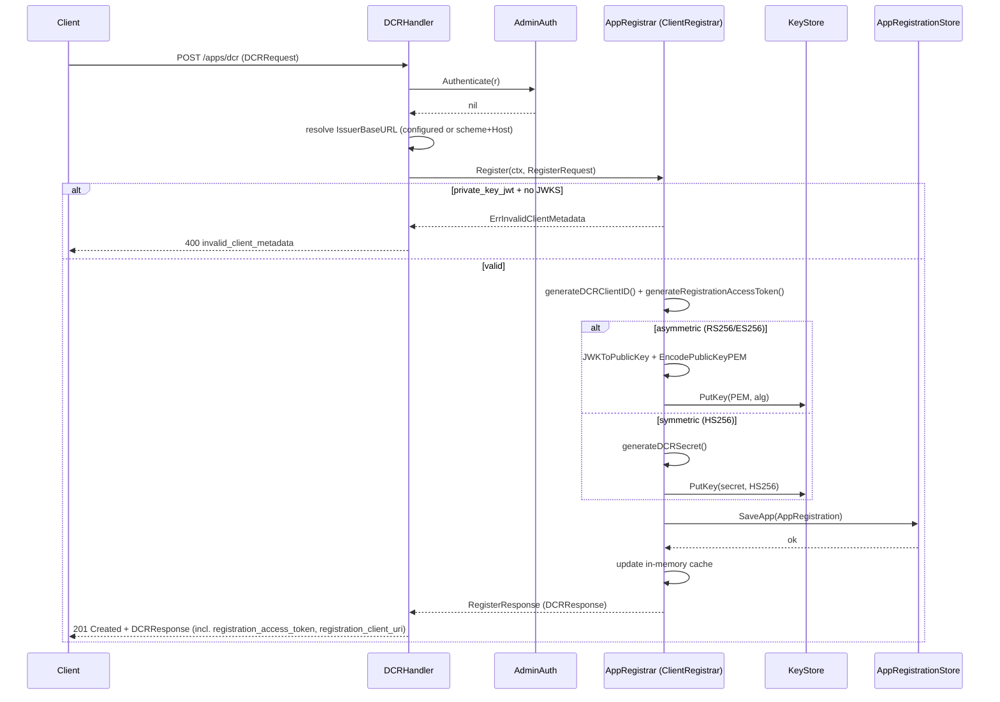
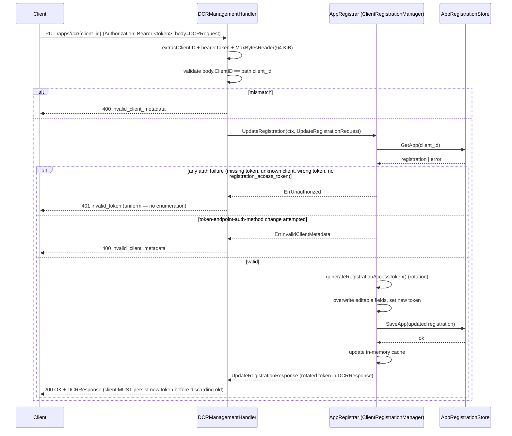
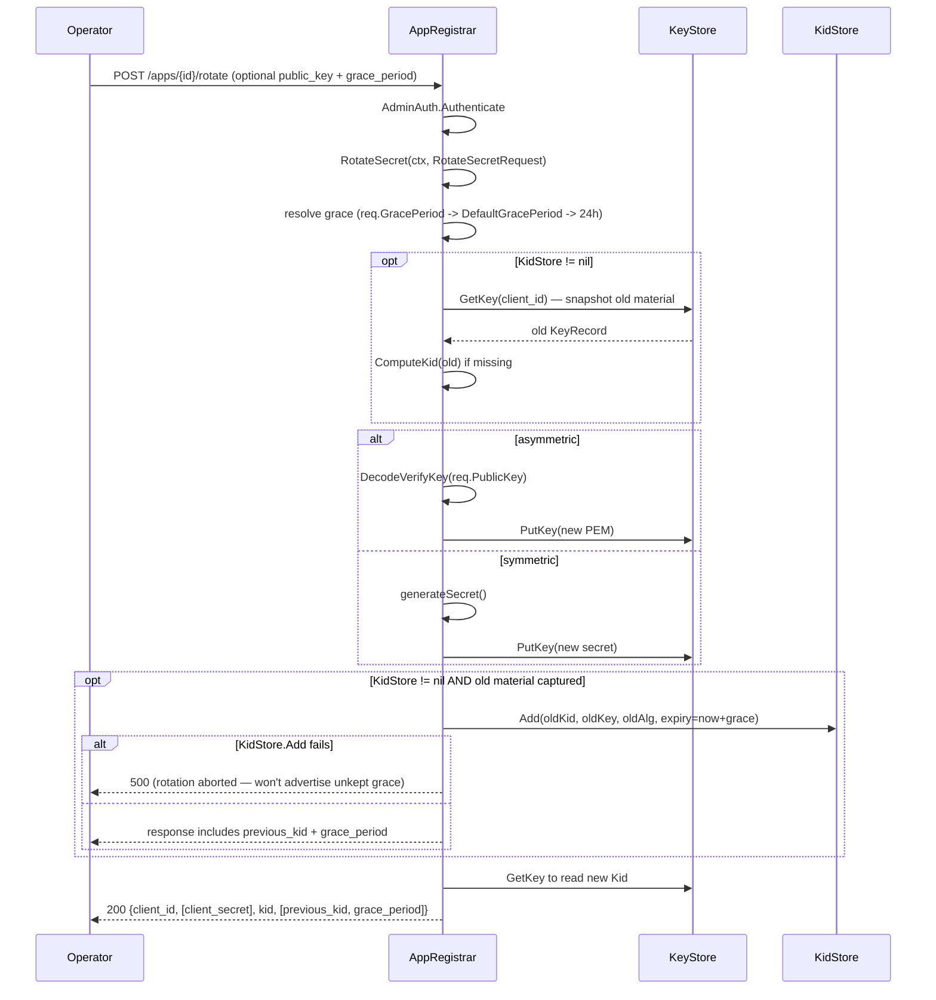
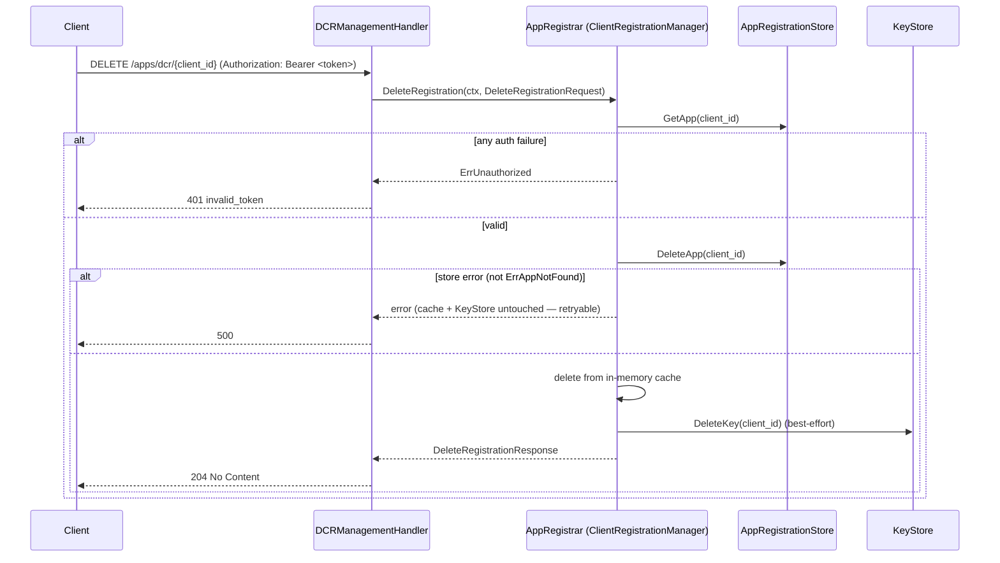

# admin

OneAuth's client-administration surface. Owns RFC 7591 Dynamic Client Registration, RFC 7592 self-service registration management, the proprietary `/apps/register` legacy path, admin-side CRUD over registrations, signing-key rotation with KidStore-backed grace periods, and resource-token minting. The folder follows the project-wide gRPC-shape convention: every transport-agnostic operation hides behind a `MethodName(ctx, *XRequest) (*XResponse, error)` interface (`ClientRegistrar` for admin, `ClientRegistrationManager` for self-service), and the HTTP handlers in this package (`DCRHandler`, `DCRManagementHandler`, `AppRegistrar.handleX`) are deliberately thin parse/format wrappers around those interfaces.

## Contents

- [Entities](#entities)
- [Flows](#flows)
  - [RFC 7591 Dynamic Client Registration](#rfc-7591-dynamic-client-registration)
  - [RFC 7592 self-service update with token rotation](#rfc-7592-self-service-update-with-token-rotation)
  - [Admin secret rotation with grace period](#admin-secret-rotation-with-grace-period)
  - [Self-service delete (RFC 7592 §2.3)](#self-service-delete-rfc-7592-23)
- [Gotchas](#gotchas)
- [Depends on](#depends-on)

## Entities

| Entity | Kind | Role | Why |
|---|---|---|---|
| `AdminAuth` | interface | Authenticates inbound admin requests; returns nil on success. | Pulled out as an interface so deployments can swap the API-key default for mTLS / OIDC bearer without touching handlers. |
| `NoAuth` | struct | `AdminAuth` that accepts every request — dev/test only. | Named `NoAuth` (not "Default") so misuse is obvious at the call site. |
| `APIKeyAuth` | struct | `AdminAuth` validating an `X-Admin-Key` header with constant-time compare. | `subtle.ConstantTimeCompare` avoids leaking key length / prefix via timing. |
| `NewNoAuth` | func | Constructs a `NoAuth`. | Symmetric with `NewAPIKeyAuth` so handler wiring reads uniformly. |
| `NewAPIKeyAuth` | func | Constructs an `APIKeyAuth` bound to a shared key. | Key captured at construction so request-time compare has no I/O and timing stays constant. |
| `NoAuth.Authenticate` | method | Always nil — every request admitted. | Same interface as `APIKeyAuth` so swapping in production never changes call sites. |
| `APIKeyAuth.Authenticate` | method | Returns `ErrAdminUnauthorized` when missing, `ErrAdminForbidden` on mismatch. | Split sentinels let wrappers pick 401 vs 403 without string-matching. |
| `ErrAdminUnauthorized` | var | Sentinel for missing admin header (→ HTTP 401). | Distinguished so the wrapper picks status without re-parsing. |
| `ErrAdminForbidden` | var | Sentinel for wrong admin key (→ HTTP 403). | Lets operators tell "client forgot the header" from "wrong key" in logs. |
| `AppRegistrationStore` | interface | `Save/Get/List/Delete` persistence contract for registrations. | Storage-agnostic per project convention — FS / GORM / GAE backends implement without dragging persistence into the registrar. |
| `InMemoryAppStore` | struct | Process-local store for tests and dev; state lost on restart. | Clones on read/write so callers can't mutate the internal map under the mutex. |
| `NewInMemoryAppStore` | func | Constructs an empty `InMemoryAppStore`. | Non-nil internal map so `SaveApp` never panics. |
| `InMemoryAppStore.SaveApp` | method | Insert-or-replace under write lock; rejects nil app or empty `ClientID`. | Defensive validation at the persistence boundary so buggy callers fail fast. |
| `InMemoryAppStore.GetApp` | method | Returns `ErrAppNotFound` or a cloned `AppRegistration`. | Clone-on-read is the cheap way to keep callers from reaching back into the map. |
| `InMemoryAppStore.ListApps` | method | Snapshot of every registration; order unspecified. | Unspecified ordering avoids locking in a property persistent backends might not provide. |
| `InMemoryAppStore.DeleteApp` | method | Removes the registration or returns `ErrAppNotFound`. | Explicit not-found vs silent no-op so the admin delete handler distinguishes 404 from 200. |
| `ErrAppNotFound` | var | Sentinel for unknown `client_id` shared by stores and registrar. | Single sentinel lets every backend signal the same condition without coupling. |
| `AppRegistration` | struct | Persisted record with both proprietary fields (MaxRooms, quota) and RFC 7591/7592 metadata + management credentials. | One row backs both paths so legacy and DCR surfaces interoperate without a second schema. |
| `AppRegistrar` | struct | Owns the hot-path cache, all CRUD verbs, key rotation, and the HTTP mux. | Concentrates state + lock + business logic so HTTP stays a thin wrapper and DCR/legacy share one source of truth. |
| `NewAppRegistrar` | func | Convenience constructor backed by `InMemoryAppStore`. | "Just works" for tests/examples; production code reaches for the with-store variant. |
| `NewAppRegistrarWithStore` | func | Wires the registrar to a caller-supplied store and hydrates cache. | Hydration errors are swallowed — a transient boot hiccup must not crash the host process. |
| `AppRegistrar.Register` | method | `ClientRegistrar` impl for RFC 7591 DCR — assigns client_id, keys, mints management credentials, persists. | Returns `ErrInvalidClientMetadata` for client errors, bubbles infra errors so wrappers map 400 vs 500 cleanly. |
| `AppRegistrar.RegisterLegacy` | method | `ClientRegistrar` impl for proprietary `/apps/register` with `MaxRooms`/`MaxMsgRate` quota. | Distinct because the wire shape diverges; fusing would force DCR to round-trip OneAuth-only quota fields. |
| `AppRegistrar.ListClients` | method | Returns cloned registrations from the cache. | O(1) per entry; never blocks on a slow backend. |
| `AppRegistrar.GetClient` | method | Admin read — returns `ErrAppNotFound` when missing. | Returns full `AppRegistration` including quota fields the DCR shape can't carry. |
| `AppRegistrar.DeleteClient` | method | Admin delete — store-first, then cache, then best-effort KeyStore wipe. | Store-first ordering keeps the registration retryable on backend failure; stranded key without registration is unreachable. |
| `AppRegistrar.RotateSecret` | method | Rotates the client's key, optionally retains the old one in KidStore. | `KidStore.Add` failures hard-fail the rotation — silently dropping the old kid would advertise a grace period that wasn't persisted. |
| `AppRegistrar.SaveRegistration` | method | Persists then updates the in-memory cache only on success. | Store-before-cache keeps the cache from drifting from the source of truth on backend errors. |
| `AppRegistrar.GetRegistration` | method | `ClientRegistrationManager` impl for RFC 7592 GET — constant-time token compare. | Blanket `ErrUnauthorized` for any failure prevents the endpoint from being used as an enumeration probe. |
| `AppRegistrar.UpdateRegistration` | method | `ClientRegistrationManager` impl for RFC 7592 PUT — full replacement, rotates registration_access_token. | Token rotation is the spec's recommended pattern; locking `TokenEndpointAuthMethod` avoids implicit re-keying. |
| `AppRegistrar.DeleteRegistration` | method | `ClientRegistrationManager` impl for RFC 7592 DELETE — authed by the registration access token. | Dropping the KeyStore entry satisfies "MUST invalidate all tokens" without extra plumbing. |
| `AppRegistrar.RLockApps` | method | Read-locked callback giving callers a transient view of the cache. | Lets validators/metrics walk registrations without exposing the mutex. |
| `AppRegistrar.Handler` | method | Builds the `/apps/...` ServeMux. | Relies on `ServeMux` longest-prefix matching so `/apps/dcr/` wins over `/apps/` without manual ordering — load-bearing property. |
| `ClientRegistrar` | interface | Transport-agnostic admin core: `Register`, `RegisterLegacy`, `ListClients`, `GetClient`, `DeleteClient`, `RotateSecret`. | gRPC-shape convention so HTTP stays thin and a future transport (#175) is a swap, not a rewrite. |
| `ClientRegistrationManager` | interface | Transport-agnostic self-service RFC 7592 core: `GetRegistration`, `UpdateRegistration`, `DeleteRegistration`. | Distinct from `ClientRegistrar` because the security models differ (registration_access_token vs `AdminAuth`). |
| `RegisterRequest` | struct | Input to `ClientRegistrar.Register` — `Metadata` + `IssuerBaseURL`. | `IssuerBaseURL` in the request lets the HTTP wrapper fall back to `scheme + r.Host` without leaking transport into the registrar. |
| `RegisterResponse` | struct | Wraps a `*DCRResponse`. | Per-method response struct futureproofs the interface (gRPC discipline). |
| `RegisterLegacyRequest` | struct | Proprietary path input: `ClientDomain`, `SigningAlg`, `PublicKey`, `MaxRooms`, `MaxMsgRate`. | Fields named to match the legacy wire shape exactly. |
| `RegisterLegacyResponse` | struct | Concrete typed output of `/apps/register`. | Concrete fields put the wire shape in one reviewable place. |
| `ListClientsRequest` | struct | Empty placeholder for `ClientRegistrar.ListClients`. | Preserves `(ctx, *Req → *Resp)` so future filters/paging fit without breaking signatures. |
| `ListClientsResponse` | struct | `[]*AppRegistration` of cloned registrations. | Clone semantics at the boundary so callers can't mutate the cache via the slice. |
| `GetClientRequest` | struct | `ClientID`-only input. | Wrapper (not bare string) for shape symmetry and future filters. |
| `GetClientResponse` | struct | Wraps an `*AppRegistration`. | Returns the proprietary fields the DCR shape can't carry. |
| `DeleteClientRequest` | struct | `ClientID`-only input. | Symmetry with `GetClientRequest`. |
| `DeleteClientResponse` | struct | Empty success marker. | Wire-format details (`{"deleted": true, ...}`) belong in the wrapper. |
| `RotateSecretRequest` | struct | `ClientID` + optional `PublicKey` + `GracePeriod`. | `PublicKey` required only for asymmetric (impl-enforced); `GracePeriod=0` defers to `AppRegistrar.DefaultGracePeriod`. |
| `RotateSecretResponse` | struct | New key material + optional `PreviousKid`/`GracePeriod` when KidStore retained the old key. | Optional fields signal whether grace retention actually happened so the wrapper emits `previous_kid` only when meaningful. |
| `ErrInvalidPublicKey` | var | Malformed PEM public-key body (→ HTTP 400). | Separated from `ErrPublicKeyRequired` so the wrapper returns specific messages. |
| `ErrPublicKeyRequired` | var | Asymmetric register/rotate missing the public key (→ HTTP 400). | Caller-fixable; distinguished from `ErrInvalidPublicKey` so the message is actionable. |
| `GetRegistrationRequest` | struct | `ClientID` + bearer registration_access_token. | Token in the request (not context) keeps the interface reusable from non-HTTP transports. |
| `GetRegistrationResponse` | struct | Wraps a `*DCRResponse` — RFC 7591/7592 client metadata. | Echoes RFC fields but omits `client_secret` on read to limit disclosure window. |
| `UpdateRegistrationRequest` | struct | PUT input: `ClientID`, `AccessToken`, full-replacement `Metadata`. | Full-replacement (not PATCH) is what RFC 7592 §2.2 specifies; omitted fields are cleared. |
| `UpdateRegistrationResponse` | struct | Post-update `DCRResponse` carrying the rotated `registration_access_token`. | Losing the new token strands the client from further self-service updates. |
| `DeleteRegistrationRequest` | struct | `ClientID` + `AccessToken`. | Same auth contract as the other manager verbs. |
| `DeleteRegistrationResponse` | struct | Empty success marker for 204 No Content. | Preserves room for future forward-compat fields. |
| `ErrUnauthorized` | var | Single failure mode for any auth problem on the management protocol. | No-enumeration guard — distinguishing "wrong token" from "unknown client" would turn `/apps/dcr/{client_id}` into a probe. |
| `ErrInvalidClientMetadata` | var | Authenticated request whose body fails RFC 7591/7592 validation (→ HTTP 400). | Only meaningful post-auth; once the caller proved token possession, hiding body errors would be cryptic. |
| `DCRHandler` | struct | HTTP wrapper at `POST /apps/dcr` delegating to `AppRegistrar.Register`. | Holds the `IssuerBaseURL` fallback so the registrar stays transport-agnostic. |
| `DCRRequest` | struct | RFC 7591/7592 client-metadata payload — reused for register and update. | Same struct on both paths because the field set is identical; the wrapper enforces `ClientID` only on PUT. |
| `DCRResponse` | struct | RFC 7591 §3.2.1 response body + RFC 7592 §3 management credentials. | Single response type for register and read so clients deserialize uniformly. |
| `DCRHandler.ServeHTTP` | method | Parses DCR request, authenticates, calls `Register`, emits response. | Falls back to `scheme + r.Host` only when no explicit `IssuerBaseURL` — fine for tests, unreliable behind proxies. |
| `DCRManagementHandler` | struct | HTTP transport for the RFC 7592 verb trio at `/apps/dcr/{client_id}`. | Single struct routes by Method and shares auth/error boilerplate; non-supported verbs get 405 + `Allow` header. |
| `DCRManagementHandler.ServeHTTP` | method | Extracts client_id, switches on method, 405 with `Allow` otherwise. | 405 emitted before any per-client lookup so unsupported methods leak no information. |
| `AppQuota` | struct | Per-app `MaxRooms`/`MaxMsgRate` embedded as custom JWT claims. | Inline claims so resource servers enforce quota without a round-trip to the AS. |
| `MintResourceToken` | func | HS256-only convenience signing a resource-scoped JWT with a string secret. | Backwards-compatible wrapper for callers that hold a string secret. |
| `MintResourceTokenWithKey` | func | Mints a resource-scoped JWT, auto-selecting HS256/RS256/ES256 from key type. | Single entry point so callers don't pick the wrong `jwt.SigningMethod` by hand; computes `kid` automatically. |

## Flows

### RFC 7591 Dynamic Client Registration

### RFC 7592 self-service update with token rotation

### Admin secret rotation with grace period

### Self-service delete (RFC 7592 §2.3)

## Gotchas

- **`ErrUnauthorized` is the universal management failure** — every failure mode on `ClientRegistrationManager` (missing token, malformed token, unknown client_id, no `registration_access_token` on a legacy entry, mismatch) collapses to the same sentinel and the same 401. This is deliberate: distinguishing them would let an attacker probe `/apps/dcr/{client_id}` for valid identifiers. Callers MUST NOT add finer-grained error messages here — that would silently re-enable the enumeration channel.
- **Legacy entries are unreachable through the self-service surface.** Registrations created via `/apps/register` have `RegistrationAccessToken == ""`. `GetRegistration` / `UpdateRegistration` / `DeleteRegistration` all reject those with `ErrUnauthorized`, so legacy clients can never escalate to RFC 7592 management even if they guess their own client_id.
- **Routing precedence depends on Go's `ServeMux` longest-prefix matching.** `Handler()` mounts `/apps/dcr` (exact, for RFC 7591), `/apps/dcr/` (prefix, for RFC 7592), and `/apps/` (prefix, catch-all). Reordering or moving to another router (e.g., a third-party mux without longest-prefix semantics) silently breaks the DCR endpoints.
- **`KeyStore.DeleteKey` is best-effort on delete paths.** Both `DeleteClient` and `DeleteRegistration` swallow KeyStore errors — once the registration row is gone, a stranded key entry is unreachable. The store deletion happens *first*; only on its success do we drop the cache and wipe the key. A backend error therefore leaves the registration intact and retryable.
- **`KidStore.Add` failures HARD-FAIL rotation.** This is asymmetric vs the deletion path. Silently dropping the old kid would advertise a grace period that wasn't actually persisted — in-flight tokens would then fail signature lookup. The rotation aborts before the response is built so the caller sees the failure and can retry.
- **`IssuerBaseURL` fallback is unreliable behind proxies.** `DCRHandler.ServeHTTP` defaults to `scheme + r.Host` when `IssuerBaseURL` is unset. Behind an L7 proxy this captures the *internal* host, producing broken `registration_client_uri` values. Production deployments must set `DCRHandler.IssuerBaseURL` explicitly — the in-code comment exists because this has bitten setups before.
- **`UpdateRegistration` rotates the `registration_access_token` unconditionally on success.** Clients that don't persist the new token from the response strand their registration — subsequent GET/PUT/DELETE will fail with `ErrUnauthorized`. There's no way to recover except an admin-side `DeleteClient` followed by re-registration.
- **`NewAppRegistrarWithStore` swallows hydration errors.** A transient store failure at boot returns a registrar with an empty cache instead of panicking — the project explicitly chose this so a flaky store doesn't kill the host process. Callers that need strict startup semantics must call `store.ListApps` themselves first.
- **Token endpoint auth method is locked on PUT.** Changing `TokenEndpointAuthMethod` via `UpdateRegistration` would imply silent re-keying (symmetric to/from asymmetric), which is outside the spec's update scope. The manager returns `ErrInvalidClientMetadata` (HTTP 400) so the client knows to DELETE and re-register if they really need to change auth method.
- **Symmetric secrets are not echoed back on GET.** `GetRegistration` intentionally omits `client_secret` from `DCRResponse`. Clients that lose their secret must rotate via the admin `RotateSecret` endpoint — RFC 7592 §3 permits but does not require re-emitting credentials on every management read, and echoing them on every authenticated GET widens the disclosure window.
- **`MintResourceToken` is HS256-only.** It calls `MintResourceTokenWithKey` with `[]byte(secret)`, which always selects HS256. Callers needing RS256/ES256 must use the `WithKey` variant directly with the appropriate key type.

## Depends on

- [`core/`](../core/DESIGN.md) — `AuthorizationDetail`
- [`keys/`](../keys/DESIGN.md) — `KeyStorage`, `KidStorage`, `KeyRecord`
- [`utils/`](../utils/DESIGN.md) — `JWKSet`, `IsAsymmetricAlg`, `JWKToPublicKey`, `EncodePublicKeyPEM`, `DecodeVerifyKey`, `ComputeKid`
