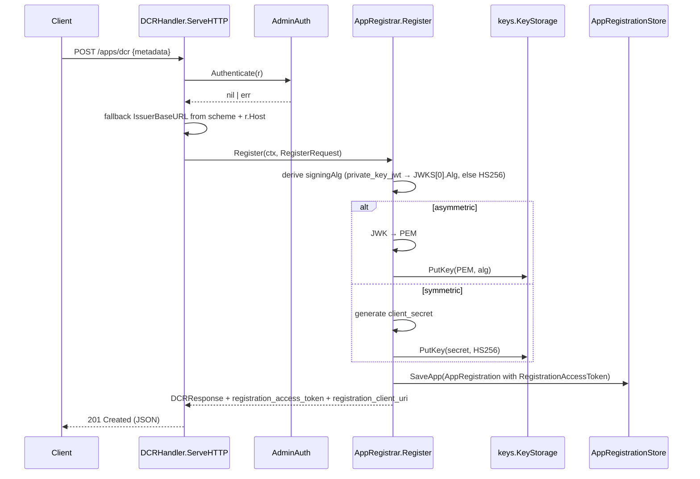
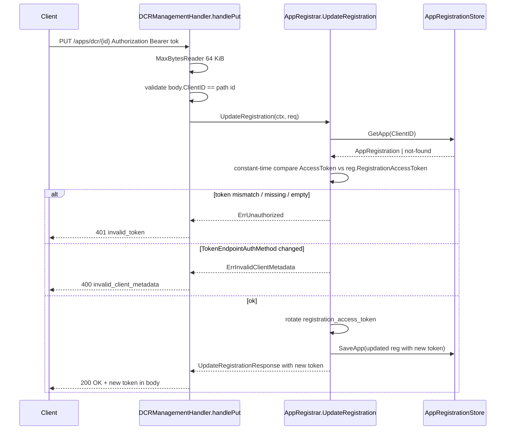
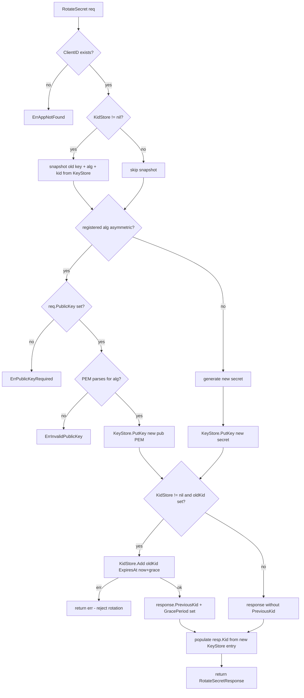

# admin

OneAuth's client-administration surface. The package owns three layers: an authentication boundary (`AdminAuth`), two transport-agnostic interfaces that split the registration domain by security model (`ClientRegistrar` for operator-level CRUD, `ClientRegistrationManager` for client self-service per RFC 7592), and thin HTTP wrappers (`DCRHandler`, `DCRManagementHandler`, and `AppRegistrar.Handler`) that adapt those interfaces to the wire. Both interfaces are implemented by a single concrete `AppRegistrar` that owns an `AppRegistrationStore` (source of truth), an in-memory cache hydrated at construction, a `keys.KeyStorage` for signing material, and an optional `keys.KidStorage` for rotation grace periods. The package also mints resource-scoped JWTs through `MintResourceTokenWithKey`, the only piece that does not pass through the registrar.

## Contents

- [Entities](#entities)
- [Flows](#flows)
  - [Dynamic client registration (RFC 7591)](#dynamic-client-registration-rfc-7591)
  - [Self-service update (RFC 7592 PUT)](#self-service-update-rfc-7592-put)
  - [Secret / key rotation with grace period](#secret--key-rotation-with-grace-period)
- [Gotchas](#gotchas)
- [Depends on](#depends-on)

## Entities

| Entity | Kind | Role | Why |
|---|---|---|---|
| `AdminAuth` | interface | Authenticates inbound admin requests; returns nil on success or an error describing rejection. | Pulled out as an interface so deployments can swap the API-key default for stronger mechanisms (mTLS, OIDC bearer) without touching handlers. |
| `NoAuth` | struct | `AdminAuth` that accepts every request — explicitly marked dev/test only. | Named `NoAuth` (not "Default") so misuse is obvious at the call site and in config. |
| `APIKeyAuth` | struct | `AdminAuth` that validates an `X-Admin-Key` header with constant-time comparison. | `subtle.ConstantTimeCompare` avoids leaking key length / prefix via timing differences. |
| `NewNoAuth` | func | Constructs a `NoAuth` admin authenticator. | Constructor kept symmetric with `NewAPIKeyAuth` so handler wiring reads uniformly across auth modes. |
| `NewAPIKeyAuth` | func | Constructs an `APIKeyAuth` bound to the given shared key. | Key is captured at construction so request-time comparison has no I/O and timing stays constant. |
| `NoAuth.Authenticate` | method | Always returns nil — every request is admitted. | Lives behind the same interface as `APIKeyAuth` so swapping in production never changes call sites. |
| `APIKeyAuth.Authenticate` | method | Reads `X-Admin-Key`; returns `ErrAdminUnauthorized` when missing, `ErrAdminForbidden` on mismatch. | Split sentinels let the HTTP wrapper map missing vs wrong credentials to 401 vs 403 without re-parsing the header. |
| `ErrAdminUnauthorized` | var | Sentinel returned when the admin auth header is missing (→ HTTP 401). | Distinguished from `ErrAdminForbidden` so HTTP wrappers can pick the right status without string-matching the error. |
| `ErrAdminForbidden` | var | Sentinel returned when admin credentials were supplied but do not match (→ HTTP 403). | Lets operators distinguish "client forgot the header" from "wrong key" in logs and metrics. |
| `AppRegistrationStore` | interface | Persistence contract (Save/Get/List/Delete) for app registration metadata; source of truth behind `AppRegistrar`'s in-memory cache. | Storage-agnostic per project convention — FS / GORM / GAE backends implement this without dragging persistence concerns into the registrar. |
| `InMemoryAppStore` | struct | Process-local `AppRegistrationStore` for tests and dev; state lost on restart. | Stored values are cloned on every read/write so callers cannot mutate the map under the mutex. |
| `NewInMemoryAppStore` | func | Constructs an empty in-memory app registration store. | Zero-config default — used as the fallback inside `NewAppRegistrar` so the registrar always has a store. |
| `ErrAppNotFound` | var | Sentinel returned when the requested `client_id` is unknown. | Single sentinel across both store and manager surfaces so wrappers map a missing client to HTTP 404 uniformly. |
| `SaveAppRequest` / `SaveAppResponse` | struct | gRPC-shape wrappers for `AppRegistrationStore.SaveApp`. | Keeps the store interface uniform with the rest of OneAuth and reserves room for future fields. |
| `GetAppRequest` / `GetAppResponse` | struct | gRPC-shape wrappers for `AppRegistrationStore.GetApp`. | Same convention; `GetAppResponse` wraps the pointer so extra metadata can be added later. |
| `ListAppsRequest` / `ListAppsResponse` | struct | gRPC-shape wrappers for `AppRegistrationStore.ListApps`. | Empty request today so paging / filters can be added without breaking the method signature. |
| `DeleteAppRequest` / `DeleteAppResponse` | struct | gRPC-shape wrappers for `AppRegistrationStore.DeleteApp`. | Mirrors the other store request shapes so the interface reads uniformly and stays mockable. |
| `InMemoryAppStore.SaveApp` | method | Inserts or replaces the registration for `req.App.ClientID` under a write lock. | Defensive clone before storing so the caller cannot later mutate the persisted struct via aliased pointer. |
| `InMemoryAppStore.GetApp` | method | Returns a clone of the stored registration or `ErrAppNotFound`. | Returns a clone so concurrent readers can mutate locally without racing the cache. |
| `InMemoryAppStore.ListApps` | method | Returns clones of every stored registration; order unspecified. | Clones (rather than aliased pointers) so callers cannot reach into the map after the read lock is released. |
| `InMemoryAppStore.DeleteApp` | method | Removes the registration for `req.ClientID`; returns `ErrAppNotFound` when absent. | Distinguishing missing-on-delete lets callers preserve 404 semantics for idempotency. |
| `AppRegistration` | struct | Persisted metadata for a registered client — RFC 7591 / 7592 fields plus OneAuth-specific quota and management credentials. | One persisted shape across DCR and legacy `/apps/register` so storage backends do not need a per-flavor schema. |
| `AppRegistrar` | struct | Central handler for all admin client-registration verbs; implements both `ClientRegistrar` and `ClientRegistrationManager` and owns the cache + `KeyStore` + `KidStore` wiring. | Single concrete owner keeps cache, key material, and grace-period book-keeping in one place — splitting admin and self-service into separate types would duplicate that state. |
| `NewAppRegistrar` | func | Constructs an `AppRegistrar` backed by an in-memory app store. | Zero-config default for tests and demos. |
| `NewAppRegistrarWithStore` | func | Constructs an `AppRegistrar` backed by the given store and hydrates the in-memory cache from existing rows. | Hydration at construction means a single read path (the cache) suffices on the hot path; startup hydration errors are swallowed so a transient store hiccup never crashes the host. |
| `AppRegistrar.Register` | method | Implements `ClientRegistrar.Register` — RFC 7591 DCR. Generates `client_id`, allocates secret or stores supplied JWK, mints RFC 7592 management credentials, persists. | Mints the `registration_access_token` at create time so RFC 7592 management is usable immediately without a second round-trip. |
| `AppRegistrar.RegisterLegacy` | method | Implements `ClientRegistrar.RegisterLegacy` — proprietary `/apps/register` path with OneAuth quota fields. | Kept distinct because DCR has no place for `MaxRooms` / `MaxMsgRate`; eventual deprecation tracked under issue #189. |
| `AppRegistrar.ListClients` | method | Implements `ClientRegistrar.ListClients` — admin read from the in-memory cache. | Reads from the cache (not the store) on the hot path; entries are cloned so callers cannot mutate the cache. |
| `AppRegistrar.GetClient` | method | Implements `ClientRegistrar.GetClient` — admin lookup by `client_id`. | Distinct from `GetRegistration` (self-service) so admins do not need the per-client `registration_access_token` to read. |
| `AppRegistrar.DeleteClient` | method | Implements `ClientRegistrar.DeleteClient` — persists deletion then drops cache + `KeyStore` entry. | Store-first ordering means a failed store write leaves the registration intact and retryable instead of stranding dangling credentials. |
| `AppRegistrar.RotateSecret` | method | Implements `ClientRegistrar.RotateSecret` — issues new secret (symmetric) or accepts new public key (asymmetric); retains old key in `KidStore` for the grace period. | Surfacing `KidStore.Add` errors as rotation failures avoids advertising a grace period that did not actually persist, which would silently kill in-flight tokens. |
| `AppRegistrar.SaveRegistration` | method | Persists the registration to the store and refreshes the in-memory cache. | Cache-after-store ordering keeps the store authoritative on failure — a store error never produces a phantom in-memory entry. |
| `AppRegistrar.GetRegistration` | method | Implements `ClientRegistrationManager.GetRegistration` — RFC 7592 self-service read gated by the `registration_access_token`. | All auth failures collapse to `ErrUnauthorized` (constant-time compare) so the endpoint cannot be probed for valid `client_id`s. |
| `AppRegistrar.UpdateRegistration` | method | Implements `ClientRegistrationManager.UpdateRegistration` — RFC 7592 §2.2 full replacement; rotates the `registration_access_token` on success. | Token rotation invalidates the old credential immediately so a leaked-then-rotated token cannot be replayed; locked-field changes (`TokenEndpointAuthMethod`) are rejected to keep re-keying out of scope. |
| `AppRegistrar.DeleteRegistration` | method | Implements `ClientRegistrationManager.DeleteRegistration` — RFC 7592 §2.3 self-service delete; invalidates the `KeyStore` entry so existing tokens fail validation. | Same uniform `ErrUnauthorized` envelope as the other manager methods so second-delete idempotency does not leak which IDs ever existed. |
| `AppRegistrar.RLockApps` | method | Calls `fn` under the registrar's read lock with a view of the live `apps` map. | Lets callers (e.g., `apiauth/`) iterate the cache without re-exporting the mutex or copying the whole map. |
| `AppRegistrar.Handler` | method | Returns the `http.Handler` that mounts `/apps/register`, `/apps/dcr`, `/apps/dcr/{id}`, `/apps`, `/apps/{id}`, `/apps/{id}/rotate`. | Relies on Go `ServeMux` longest-prefix routing so the DCR-management subtree wins over `/apps/` without per-route ordering work. |
| `ClientRegistrar` | interface | Transport-agnostic admin surface — `Register`, `RegisterLegacy`, `ListClients`, `GetClient`, `DeleteClient`, `RotateSecret`. | Methods follow the gRPC ctx/req/resp shape (#175) so HTTP handlers stay thin and a gRPC layer can be generated later without touching the registrar. |
| `RegisterRequest` / `RegisterResponse` | struct | Inputs / outputs for `Register`; `IssuerBaseURL` is plumbed through so one registrar can serve multiple hostnames. | Wrapping (vs returning `*DCRResponse` directly) leaves room for future protocol fields without changing the signature. |
| `RegisterLegacyRequest` / `RegisterLegacyResponse` | struct | Proprietary `/apps/register` shapes — `ClientDomain`, `SigningAlg`, `PublicKey`, `MaxRooms`, `MaxMsgRate`. | Separate types keep DCR's schema free of OneAuth-specific quota concepts. |
| `ListClientsRequest` / `ListClientsResponse` | struct | Empty input today; response returns cloned `*AppRegistration` entries. | Wrapper exists so paging / filters can be added without breaking the interface; clones prevent caller mutation of the cache. |
| `GetClientRequest` / `GetClientResponse` | struct | Admin lookup input keyed by `ClientID`; response wraps the cloned registration. | Wrapper kept parallel with RFC 7592 `GetRegistration` for symmetry. |
| `DeleteClientRequest` / `DeleteClientResponse` | struct | Admin delete input; empty success response. | Reserved-extensibility wrappers — match the rest of the manager interface even when the body is empty. |
| `RotateSecretRequest` / `RotateSecretResponse` | struct | Input: `ClientID`, optional `PublicKey`, optional `GracePeriod`. Output: new `ClientSecret` (symmetric), `Kid`, optional `PreviousKid` + `GracePeriod`. | Carrying `GracePeriod` per-call lets ops shorten retention for compromised-key rotations without changing the registrar default; `PreviousKid` is set only when `KidStore` actually retained the old key. |
| `ErrInvalidPublicKey` | var | Sentinel for a supplied PEM public key that fails parsing or does not match the registered alg. | Distinguished from `ErrPublicKeyRequired` so wrappers can return a precise error description on HTTP 400. |
| `ErrPublicKeyRequired` | var | Sentinel for an asymmetric registration / rotation submitted without a `public_key`. | Pulled out as a sentinel so the registrar stays wrapper-free. |
| `ClientRegistrationManager` | interface | Transport-agnostic RFC 7592 self-service surface — `GetRegistration`, `UpdateRegistration`, `DeleteRegistration`. | Split from `ClientRegistrar` because the security model differs — self-service requires possession of the `registration_access_token` rather than an admin credential. |
| `GetRegistrationRequest` / `GetRegistrationResponse` | struct | Self-service GET — `ClientID` + `AccessToken` in; `*DCRResponse` out (no `client_secret`). | Token in the request rather than a separate auth call lets the manager run unchanged behind HTTP, gRPC, or in-process; secret omitted per RFC 7592 §3 latitude to minimize disclosure. |
| `UpdateRegistrationRequest` / `UpdateRegistrationResponse` | struct | Self-service PUT — full-replacement `Metadata`; response includes the rotated `registration_access_token`. | Full replacement matches RFC 7592 §2.2 (not PATCH merge); the rotated token in the response is the only way the client can keep managing its registration after the rotation. |
| `DeleteRegistrationRequest` / `DeleteRegistrationResponse` | struct | Self-service DELETE input; empty success response. | Empty body matches RFC 7592 §2.3 (204 No Content); response struct exists for forward-compat. |
| `ErrUnauthorized` | var | Single sentinel for every auth failure on the management protocol. | One envelope across all auth-failure modes prevents `/apps/dcr/{client_id}` from being used as a client_id-existence probe. |
| `ErrInvalidClientMetadata` | var | Sentinel for an authenticated request whose body fails RFC 7591 / 7592 validation (mapped to HTTP 400). | Kept distinct from `ErrUnauthorized` so authenticated callers get useful diagnostics; pre-auth callers cannot reach this branch. |
| `DCRHandler` | struct | HTTP wrapper for `ClientRegistrar.Register` — parses RFC 7591 body, calls the registrar, formats the response. | Thin transport adapter so the registrar can be reused from gRPC / in-process callers without HTTP boilerplate (#172). |
| `DCRHandler.ServeHTTP` | method | POST handler — authenticates, decodes `DCRRequest`, computes `IssuerBaseURL` fallback, invokes `Registrar.Register`, maps errors to RFC 7591 shapes. | `IssuerBaseURL` falls back to scheme + `r.Host` so tests work without configuration; production deployments behind a proxy should set `IssuerBaseURL` explicitly (Host header is unreliable). |
| `DCRRequest` | struct | RFC 7591 registration body, also reused as the RFC 7592 PUT body. | Shared shape so JSON parsing is the same — register vs update is a routing concern, not a schema concern. |
| `DCRResponse` | struct | RFC 7591 response extended with RFC 7592 §3 management credentials. | Embedding `registration_access_token` + `registration_client_uri` in the create response is what makes RFC 7592 usable without a second round-trip. |
| `DCRManagementHandler` | struct | HTTP wrapper for `ClientRegistrationManager` — routes GET / PUT / DELETE on `/apps/dcr/{client_id}`. | All protocol decisions live behind the manager interface so the same logic is reachable from gRPC, in-process callers, and tests without HTTP machinery. |
| `DCRManagementHandler.ServeHTTP` | method | Extracts `client_id` from the path, dispatches by method, returns 405 with an `Allow` header for unsupported verbs. | The 405 path is auth-independent so it leaks no per-client info — every unknown method gets the same response regardless of credentials. |
| `AppQuota` | struct | Per-app quota limits (`MaxRooms`, `MaxMsgRate`) embedded as custom claims when minting resource-scoped JWTs. | Quota lives on the App registration (legacy schema), then rides inside the resource JWT so downstream resource servers do not need a registry callback. |
| `MintResourceToken` | func | Mints a resource-scoped HS256 JWT (legacy convenience wrapper). | Backwards-compatible signature for callers that only ever used symmetric keys before `MintResourceTokenWithKey` existed. |
| `MintResourceTokenWithKey` | func | Mints a resource-scoped JWT using any supported key type (`[]byte` / `*rsa.PrivateKey` / `*ecdsa.PrivateKey`); algorithm auto-detected. | Key-type-driven signing-method selection avoids a separate "algorithm" parameter that could be set inconsistently with the supplied key. |

## Flows

### Dynamic client registration (RFC 7591)

The HTTP transport extracts an issuer-base fallback (so tests work without configuration), delegates to the registrar (the algorithm choice plus key-vs-secret allocation lives there), then persists the registration and returns RFC 7592 §3 management credentials in the same response so the client can immediately self-manage.

### Self-service update (RFC 7592 PUT)

The HTTP wrapper enforces the path-vs-body `client_id` invariant before calling the manager so the manager only sees validated requests. Authentication is by `registration_access_token` and uses a constant-time compare; on success the manager rotates the token (invalidating the credential the caller just used) and returns the new value in the response — clients that ignore this lose access permanently.

### Secret / key rotation with grace period

Symmetric and asymmetric flows diverge on whether the server generates new material or accepts caller-supplied material. The `KidStore.Add` failure is surfaced (rather than swallowed) because silently dropping the old kid would advertise a grace period to clients that did not actually persist, killing in-flight tokens at the worst possible moment.

## Gotchas

- **One concrete type implements two interfaces by design.** `AppRegistrar` is both `ClientRegistrar` (admin) and `ClientRegistrationManager` (self-service). The interfaces exist so callers — and HTTP wrappers — pick the right security model at the call site; the implementation collapses to one struct because cache + `KeyStore` + `KidStore` state would otherwise have to be duplicated and kept in sync.
- **Uniform `ErrUnauthorized` on the management path is intentional.** `GetRegistration`, `UpdateRegistration`, `DeleteRegistration` return the same sentinel for missing token, wrong token, unknown `client_id`, and registrations without a token (legacy `/apps/register` entries). Distinguishing these would turn `/apps/dcr/{id}` into a probe for valid identifiers. The constant-time compare on the token is the same defense at the byte level.
- **Store write is authoritative; cache update follows.** `SaveRegistration`, `DeleteClient`, and `DeleteRegistration` all persist first and only then mutate the in-memory cache. A failed store write returns early with the cache untouched — the call is retryable and there are no phantom in-memory entries.
- **`KidStore.Add` errors fail the rotation rather than being swallowed.** Advertising a grace period that did not persist would silently invalidate in-flight tokens signed with the old key. Failing the rotation lets the caller retry or fall back; the old key remains active in `KeyStore` if the new put already succeeded, but the caller knows rotation did not fully complete.
- **`IssuerBaseURL` fallback is for tests, not production.** When `DCRHandler.IssuerBaseURL` is empty the handler synthesizes one from `r.TLS` + `r.Host`. Behind a proxy the Host header is whatever the operator allows through, so production deployments must set `IssuerBaseURL` explicitly or the `registration_client_uri` returned to clients will be wrong.
- **`UpdateRegistration` rotates the token; clients that ignore the response lose access.** RFC 7592 §2.2 recommends rotation and this implementation does it on every successful PUT. The old token is invalid the moment `SaveApp` succeeds — clients must persist the new token before discarding the request.
- **`UpdateRegistration` is full replacement, not merge.** Fields omitted from `req.Metadata` are cleared. `TokenEndpointAuthMethod` is a locked field (changing it would require re-keying) and attempts to change it return `ErrInvalidClientMetadata`; `SigningAlg`, `ClientID`, `CreatedAt`, `RegistrationClientURI`, and the key material are silently retained.
- **`Handler` routing relies on Go `ServeMux` longest-prefix.** `/apps/dcr` (exact) handles RFC 7591 registration, `/apps/dcr/` (prefix) handles RFC 7592 management, `/apps/` (prefix) catches the proprietary admin verbs. The DCR-management subtree wins over `/apps/` for free — do not re-order without thinking about which path bites which suffix.
- **DCR vs legacy: two separate registration methods on purpose.** `Register` (RFC 7591) and `RegisterLegacy` (`/apps/register`) wrap different request shapes — DCR uses JWKS for asymmetric keys and has no concept of `MaxRooms` / `MaxMsgRate`, while the legacy path takes a raw PEM `PublicKey` and OneAuth quota fields. Eventual deprecation of the legacy path is tracked under issue #189.
- **`AdminAuth` does not gate the manager interface.** `ClientRegistrationManager` methods are authenticated by the per-client `registration_access_token` carried in the request, not by `AdminAuth`. `DCRManagementHandler` therefore does not wrap calls in `AdminAuth.Authenticate`. Mounting `DCRManagementHandler` outside `AppRegistrar.Handler` requires no separate admin gate.
- **`MintResourceTokenWithKey` algorithm is implied by the key.** `MintResourceTokenWithKey` picks the signing method from the key's Go type (`[]byte` → HS256, `*rsa.PrivateKey` → RS256, `*ecdsa.PrivateKey` → ES256). There is no separate algorithm parameter, so callers cannot accidentally claim RS256 while passing an HS256 secret.

## Depends on

- [`core/`](../core/DESIGN.md) — `AuthorizationDetail`
- [`keys/`](../keys/DESIGN.md) — `KeyStorage`, `KidStorage`, `KeyRecord`, `GetKeyRequest`, `PutKeyRequest`, `DeleteKeyRequest`, `AddKidRequest`
- [`utils/`](../utils/DESIGN.md) — `ComputeKid`, `DecodeVerifyKey`, `EncodePublicKeyPEM`, `IsAsymmetricAlg`, `JWKSet`, `JWKToPublicKey`
