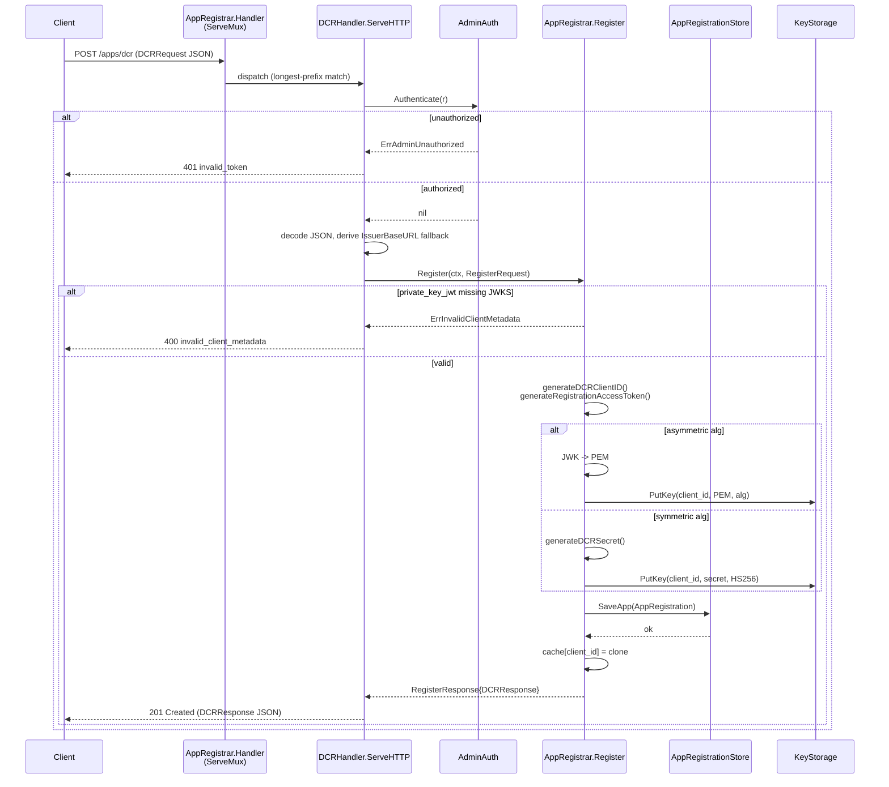
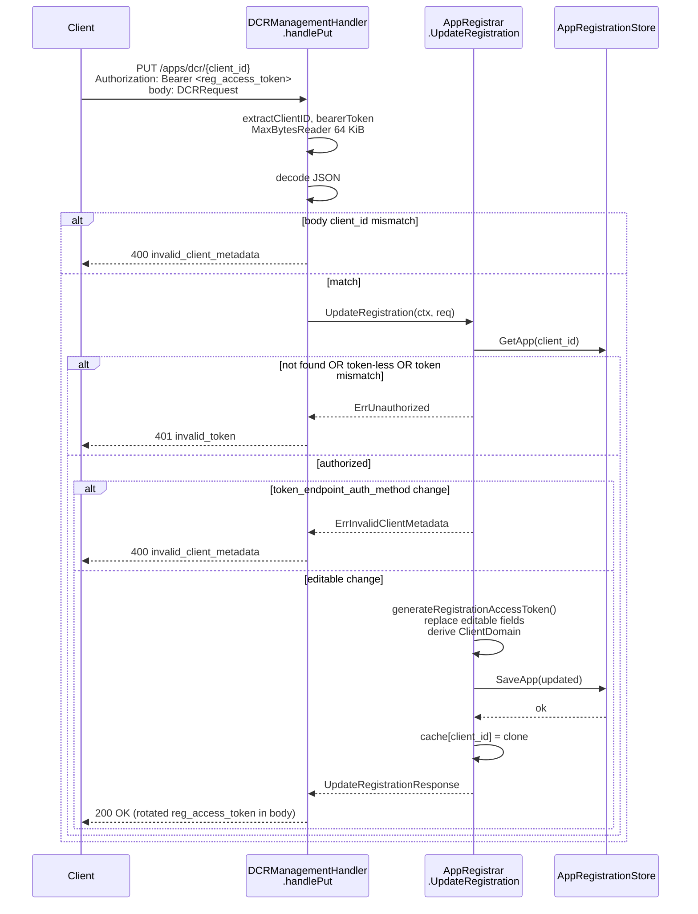
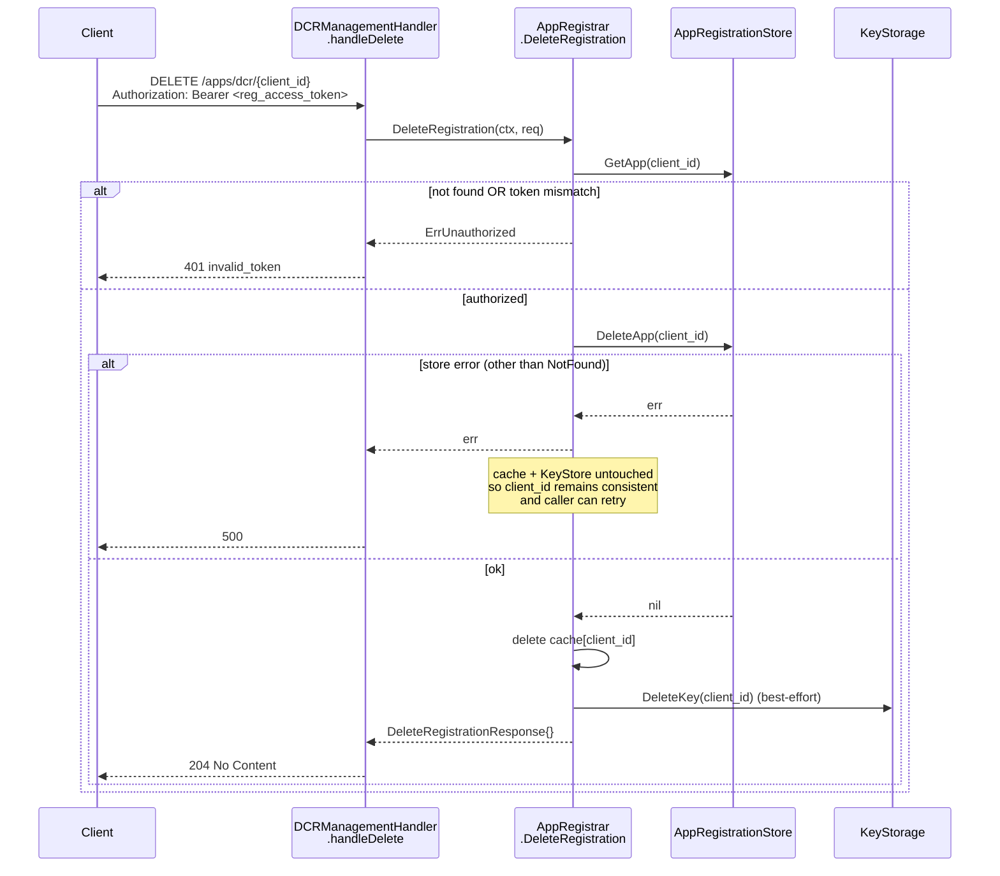
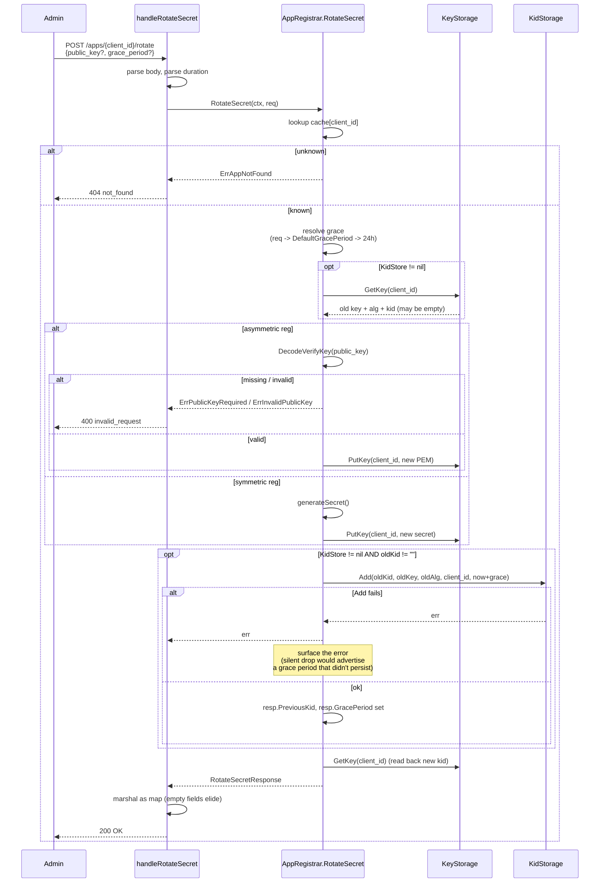

# admin

OneAuth's client-administration surface. The package owns RFC 7591 Dynamic Client Registration, RFC 7592 self-service registration management, the proprietary `/apps` registry that predates DCR, admin-side CRUD across all registrations, signing-key rotation with KidStore-backed grace periods, and resource-token minting. Two transport-agnostic interfaces — `ClientRegistrar` (admin, post-`AdminAuth`) and `ClientRegistrationManager` (self-service, gated by per-client `registration_access_token`) — describe the protocol surface; `AppRegistrar` is the single concrete implementation behind both. HTTP handlers (`DCRHandler`, `DCRManagementHandler`, the `/apps/*` mux from `AppRegistrar.Handler`) are deliberately thin parsers around the interface methods, matching the gRPC-shape convention adopted across OneAuth (#110 / #172 / #175). The folder is the source of truth for the `AppRegistration` schema and the `AppRegistrationStore` contract that backends elsewhere implement.

## Contents

- [Entities](#entities)
- [Flows](#flows)
  - [RFC 7591 Dynamic Client Registration](#rfc-7591-dynamic-client-registration)
  - [RFC 7592 Update Registration](#rfc-7592-update-registration)
  - [RFC 7592 Delete Registration](#rfc-7592-delete-registration)
  - [Secret rotation with grace period](#secret-rotation-with-grace-period)
- [Gotchas](#gotchas)
- [Depends on](#depends-on)

## Entities

| Entity | Kind | Role | Why |
|---|---|---|---|
| `AdminAuth` | interface | Authenticates inbound admin requests; returns nil on success. | Pluggable so deployments swap the API-key default for mTLS / OIDC without touching handlers. |
| `NoAuth` | struct | `AdminAuth` that accepts every request — dev/test only. | Name (not "Default") makes misuse obvious in config. |
| `APIKeyAuth` | struct | `AdminAuth` validating `X-Admin-Key` with constant-time compare. | `subtle.ConstantTimeCompare` avoids leaking key length / prefix via timing. |
| `ErrAdminUnauthorized` | const | Sentinel for missing admin header (→ HTTP 401). | Wrapper maps missing vs wrong credentials to 401 vs 403. |
| `ErrAdminForbidden` | const | Sentinel for wrong admin key (→ HTTP 403). | Operators can distinguish "forgot header" from "wrong key" in logs. |
| `AppRegistrationStore` | interface | Persistence contract (`SaveApp` / `GetApp` / `ListApps` / `DeleteApp`) — source of truth behind `AppRegistrar`'s cache. | Storage-agnostic per project convention; FS / GORM / GAE implement it. |
| `ErrAppNotFound` | const | Sentinel for unknown client_id. | Lets callers branch on lookup misses without string-matching. |
| `InMemoryAppStore` | struct | Process-local `AppRegistrationStore` that clones values on every IO. | Same defensive clone-on-IO pattern `AppRegistrar` uses internally. |
| `AppRegistration` | struct | Persistent record — DCR metadata, OneAuth quota fields, RFC 7592 management credentials. | Schema is stable from #165 so legacy and DCR entries coexist without migration. |
| `ClientRegistrar` | interface | Transport-agnostic ADMIN surface (`Register`, `RegisterLegacy`, `ListClients`, `GetClient`, `DeleteClient`, `RotateSecret`). | Methods are post-auth — interface itself is unauthenticated by design. |
| `ClientRegistrationManager` | interface | Transport-agnostic SELF-SERVICE surface (RFC 7592 `GetRegistration` / `UpdateRegistration` / `DeleteRegistration`). | Same domain as `ClientRegistrar` but a different security model — split rather than overloaded. |
| `ErrUnauthorized` | const | Uniform failure mode for every `ClientRegistrationManager` auth issue. | Refusing to distinguish prevents `/apps/dcr/{client_id}` from being a client_id-enumeration probe. |
| `ErrInvalidClientMetadata` | const | Authenticated request with body that fails RFC 7591/7592 validation (→ HTTP 400). | Distinct from `ErrUnauthorized` — caller has already proven possession of the management token. |
| `AppRegistrar` | struct | Embeddable `http.Handler` and single concrete implementation of both interfaces above. | Source of truth is `AppRegistrationStore`; in-memory cache is hydrated on construction and updated synchronously on every write. |
| `NewAppRegistrar` | func | Constructor with `InMemoryAppStore` — test/dev default. | Keeps the simple case one call. |
| `NewAppRegistrarWithStore` | func | Constructor that hydrates the cache from a persistent store. | `ListApps` errors during hydration are intentionally swallowed — a transient store hiccup at startup should not crash the host. |
| `AppRegistrar.Register` | method | RFC 7591 DCR — generates client_id, allocates secret or stores JWK, issues RFC 7592 §3 management credentials, persists. | `ErrInvalidClientMetadata` → 400; KeyStore / RNG failures → 500. |
| `AppRegistrar.RegisterLegacy` | method | Proprietary `/apps/register` carrying OneAuth-specific `MaxRooms` / `MaxMsgRate`. | Distinct wire shape; eventual removal tracked under issue #189. |
| `AppRegistrar.ListClients` | method | Admin read of every registration; serves clones. | Clones prevent callers mutating the cache through the response. |
| `AppRegistrar.GetClient` | method | Admin read of a single registration. | Distinct from `ClientRegistrationManager.GetRegistration` — admin path is only reachable post-`AdminAuth`. |
| `AppRegistrar.DeleteClient` | method | Admin delete — removes from Store + cache and invalidates the KeyStore entry. | Store delete first so a store error leaves the registration intact and retryable. |
| `AppRegistrar.RotateSecret` | method | Generates a fresh symmetric secret (or accepts a new asymmetric PEM); optionally retains the old key in KidStore. | `KidStore.Add` errors are surfaced — silently dropping the old kid would advertise a grace period that didn't persist. |
| `AppRegistrar.GetRegistration` | method | RFC 7592 §2.1 self-service read; constant-time bearer compare. | Omits client_secret intentionally — re-emitting on every read enlarges the disclosure window. |
| `AppRegistrar.UpdateRegistration` | method | RFC 7592 §2.2 full-replacement update; rotates `registration_access_token` on success. | Rejects `token_endpoint_auth_method` changes (out of scope for #169 — would require re-keying). |
| `AppRegistrar.DeleteRegistration` | method | RFC 7592 §2.3 self-service delete; invalidates KeyStore credentials so issued tokens fail validation. | Store delete before cache / KeyStore mutation keeps state consistent on partial failure. |
| `AppRegistrar.SaveRegistration` | method | Persists a registration, then updates the cache. | Ordering keeps the cache from drifting ahead of the store on persist failure. |
| `AppRegistrar.RLockApps` | method | Read-locked callback view of the apps cache. | External code (apiauth) can iterate without seeing the lock or the map. |
| `AppRegistrar.Handler` | method | `http.ServeMux` mounting `/apps`, `/apps/{id}`, `/apps/{id}/rotate`, `/apps/register`, `/apps/dcr`, `/apps/dcr/{client_id}`. | Relies on Go ServeMux longest-prefix matching so `"/apps/dcr/"` wins over `"/apps/"` without explicit ordering. |
| `RegisterRequest` | struct | Input to `Register` — RFC 7591 metadata + IssuerBaseURL. | IssuerBaseURL is a manager input so non-HTTP callers can supply it explicitly. |
| `RegisterResponse` | struct | Wraps `DCRResponse`. | gRPC-shape envelope for forward-compat fields. |
| `RegisterLegacyRequest` | struct | `ClientDomain`, `SigningAlg`, raw-PEM `PublicKey`, `MaxRooms`, `MaxMsgRate`. | Concrete fields (not a map) so the proprietary wire shape stays reviewable in one place. |
| `RegisterLegacyResponse` | struct | Proprietary `/apps/register` response. | Typed struct for the same wire-format-visibility reason. |
| `ListClientsRequest` | struct | Empty placeholder. | Exists so future pagination / filters need no signature change. |
| `ListClientsResponse` | struct | Cloned `AppRegistration` slice. | Clones protect the cache. |
| `GetClientRequest` | struct | `ClientID` only. | Wrapped per convention. |
| `GetClientResponse` | struct | The requested `AppRegistration`. | Wrapped per convention. |
| `DeleteClientRequest` | struct | `ClientID` only. | Wrapped per convention. |
| `DeleteClientResponse` | struct | Empty success signal. | Wire body `{deleted:true,...}` is a wrapper concern. |
| `RotateSecretRequest` | struct | `ClientID`, optional `PublicKey`, optional `GracePeriod`. | GracePeriod defaults walk down: request → `DefaultGracePeriod` → 24h. |
| `RotateSecretResponse` | struct | `ClientSecret` (symmetric only), `Kid`, `PreviousKid` + `GracePeriod` (only when KidStore retained the old key). | Empty fields signal "feature inactive for this rotation"; wrapper marshals via map so they vanish on the wire. |
| `ErrInvalidPublicKey` | const | PEM fails parse / does not match registered alg (→ 400). | Clean `errors.Is` switching for the wrapper. |
| `ErrPublicKeyRequired` | const | Asymmetric register / rotate without `public_key` (→ 400). | Clean `errors.Is` switching for the wrapper. |
| `GetRegistrationRequest` | struct | `ClientID` + bearer token. | Wrapped per convention. |
| `GetRegistrationResponse` | struct | Wraps `DCRResponse` for the management read. | Wrapped per convention. |
| `UpdateRegistrationRequest` | struct | `ClientID`, bearer token, full-replacement `DCRRequest` body. | Wrapper guarantees `req.ClientID == req.Metadata.ClientID` before the manager runs. |
| `UpdateRegistrationResponse` | struct | Post-update registration including the rotated `registration_access_token`. | Callers MUST persist the new token before discarding the old. |
| `DeleteRegistrationRequest` | struct | `ClientID` + bearer token. | Wrapped per convention. |
| `DeleteRegistrationResponse` | struct | Empty (RFC 7592 §2.3 returns 204). | Forward-compat envelope. |
| `DCRHandler` | struct | HTTP wrapper for `Register` — parses RFC 7591 body, enforces `AdminAuth`, derives IssuerBaseURL fallback, formats response. | Thin transport adapter; all protocol logic lives in `ClientRegistrar`. |
| `DCRHandler.ServeHTTP` | method | `http.Handler` for POST `/apps/dcr`; 405 on other methods. | scheme+host fallback for IssuerBaseURL works in tests but is proxy-fragile — production should set IssuerBaseURL explicitly. |
| `DCRRequest` | struct | RFC 7591 register body, reused as RFC 7592 §2.2 update body. | `ClientID` is ignored on register, validated by the wrapper on update — single struct documents both shapes. |
| `DCRResponse` | struct | RFC 7591 response extended with RFC 7592 §3 management credentials. | Single wire shape covers both initial registration and management read/update. |
| `DCRManagementHandler` | struct | HTTP wrapper for `ClientRegistrationManager` (GET / PUT / DELETE `/apps/dcr/{client_id}`). | Routes by method; 405 depends on neither client_id nor auth so it leaks no info. |
| `DCRManagementHandler.ServeHTTP` | method | Dispatches by method; extracts client_id from URL tail; bounds PUT bodies at 64 KiB. | `MaxBytesReader` prevents unbounded JSON from exhausting memory. |
| `MintResourceToken` | func | Backwards-compatible HS256 resource-token issuer. | Wrapper over `MintResourceTokenWithKey` for legacy callers that always use a shared secret. |
| `MintResourceTokenWithKey` | func | 15-min resource-scoped JWT, auto-selecting HS256 / RS256 / ES256 from the key type, kid header derived from the key. | Auto-selection prevents the caller from setting `alg=HS256` with an RSA key — the most common JWT footgun. |
| `AppQuota` | struct | Per-app `MaxRooms` / `MaxMsgRate` carried as custom claims. | Named struct (not free-form map) so callers cannot typo claim names. |

## Flows

### RFC 7591 Dynamic Client Registration

### RFC 7592 Update Registration

### RFC 7592 Delete Registration

### Secret rotation with grace period

## Gotchas

- **Two interfaces, one implementer.** `ClientRegistrar` (admin) and `ClientRegistrationManager` (self-service) live side by side and are both implemented by `AppRegistrar`. The two surfaces address the *same* domain (registrations) but encode different security models — admin methods run only after the wrapper enforces `AdminAuth`, manager methods run after constant-time comparison of the per-client `registration_access_token`. Adding a verb to one interface does not automatically add it to the other; an "admin delete" and a "self-service delete" are deliberately different methods so the two security models can evolve independently.

- **Uniform `ErrUnauthorized` is intentional and load-bearing.** Every failure path in `GetRegistration` / `UpdateRegistration` / `DeleteRegistration` — wrong token, missing token, unknown client_id, registration that simply lacks a management token (legacy `/apps/register` entries) — collapses to `ErrUnauthorized`. Refactoring to "be helpful" by surfacing "client_id not found" would turn `/apps/dcr/{client_id}` into a probe for valid identifiers and break the no-enumeration guard.

- **Store-first ordering on delete / save.** `DeleteRegistration` / `DeleteClient` / `SaveRegistration` all persist to `AppRegistrationStore` *before* touching the in-memory cache or `KeyStore`. The reverse order would leave dangling key material (or a cache out of sync with truth) on partial failure. `KeyStore.DeleteKey` is intentionally best-effort after the store delete succeeds — the registration is the user-visible deletion contract, a stranded key is unreachable without it.

- **`UpdateRegistration` rejects `token_endpoint_auth_method` changes.** Per #169, switching the auth method would require re-keying (asymmetric ↔ symmetric, or a new asymmetric keypair) which the update flow doesn't perform. Such requests return `ErrInvalidClientMetadata` (→ 400). Clients that genuinely need to change auth method DELETE and re-register. The new `registration_access_token` returned on every successful update means callers MUST persist it before discarding the old — the old token becomes invalid as soon as `SaveRegistration` succeeds.

- **`GetRegistration` strips `client_secret` on read.** RFC 7592 §3 permits but does not require echoing the secret. Re-emitting symmetric credentials on every management read enlarges the disclosure window if the management token is ever logged or proxied; clients that lose the secret rotate via PUT (or `/apps/{id}/rotate`) rather than re-reading.

- **`RotateSecret` surfaces `KidStore.Add` errors instead of swallowing them.** Persistence failures on the old-key retention path are returned, not logged-and-ignored. Silently dropping the old kid while still returning the new key would advertise a grace period that didn't actually persist, causing in-flight tokens signed with the previous material to fail verification — worse than a loud rotation failure that the operator can retry.

- **`Handler` mux relies on Go ServeMux longest-prefix matching.** `/apps/dcr` (exact) routes to `DCRHandler`, `/apps/dcr/` (prefix) routes to `DCRManagementHandler`, `/apps/` (prefix) routes to legacy admin CRUD. The longer prefix wins automatically — no manual ordering — but anyone refactoring the routes onto a different router (chi, gorilla) must reproduce this precedence explicitly.

- **`DCRHandler.IssuerBaseURL` fallback is proxy-fragile.** When `IssuerBaseURL` is empty, the handler synthesizes the registration_client_uri from the request's scheme + `r.Host`. Behind a reverse proxy this can produce `http://internal:8080` instead of the public URL. Production deployments should set `IssuerBaseURL` explicitly; the fallback exists so tests work without configuration.

- **`MintResourceTokenWithKey` auto-selects the algorithm from the key type.** `[]byte` → HS256, `*rsa.PrivateKey` → RS256, `*ecdsa.PrivateKey` → ES256. Callers cannot manually request `alg=HS256` with an RSA key (or vice versa) — the most common JWT confusion bug — because the signing method is derived, not configured.

- **`InMemoryAppStore` (and `AppRegistrar`'s cache) lose state on restart.** Production deployments must use a persistent `AppRegistrationStore` (FS/GORM/GAE). `NewAppRegistrarWithStore` swallows `ListApps` errors during hydration on purpose — a transient store hiccup at startup should not crash the host — but this means callers wanting strict semantics should call `ListApps` themselves first to surface any error.

- **Legacy `/apps/register` is on a removal track.** `RegisterLegacy` is kept for the OneAuth-specific `MaxRooms` / `MaxMsgRate` quota that DCR cannot express, but eventual removal is tracked under issue #189. New integrations should prefer `/apps/dcr`.

## Depends on

- [`core/`](../core/DESIGN.md) — `AuthorizationDetail`
- [`keys/`](../keys/DESIGN.md) — `KeyStorage`, `KidStorage`, `KeyRecord`
- [`utils/`](../utils/DESIGN.md) — `DecodeVerifyKey`, `EncodePublicKeyPEM`, `IsAsymmetricAlg`, `JWKToPublicKey`, `JWKSet`, `ComputeKid`
