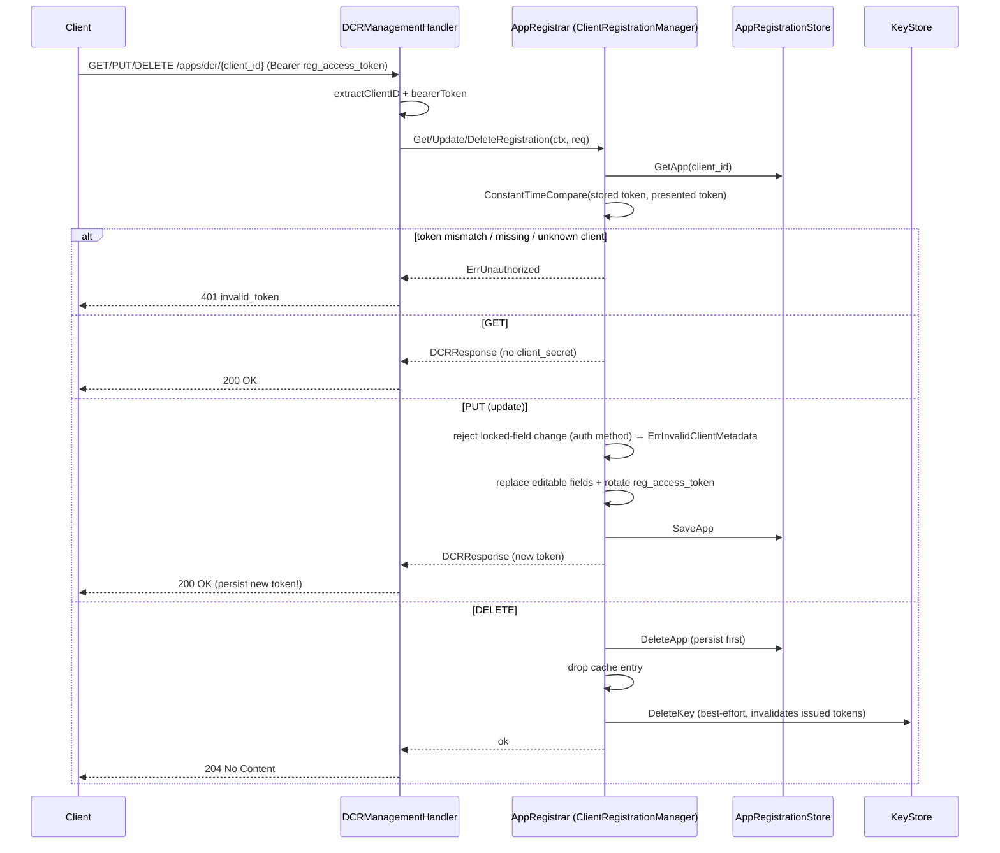

# admin — flows

### RFC 7591 Dynamic Client Registration

Registration via `POST /apps/dcr`. The HTTP handler authenticates and parses;
all protocol logic lives in `AppRegistrar.Register`, which provisions key
material and issues RFC 7592 §3 management credentials.

```mermaid
sequenceDiagram
    participant C as Client
    participant H as DCRHandler
    participant A as AdminAuth
    participant R as AppRegistrar (ClientRegistrar)
    participant K as KeyStore
    participant S as AppRegistrationStore

    C->>H: POST /apps/dcr (DCRRequest JSON)
    H->>A: Authenticate(r)
    A-->>H: nil (or 401)
    H->>H: derive IssuerBaseURL (config or scheme+Host)
    H->>R: Register(ctx, RegisterRequest)
    R->>R: pick signing alg (HS256 default; private_key_jwt→from JWKS)
    R->>R: generate client_id + registration_access_token
    alt asymmetric (RS256/ES256)
        R->>K: PutKey(JWK→PEM public key)
    else symmetric (HS256)
        R->>R: generate client_secret
        R->>K: PutKey(secret)
    end
    R->>S: SaveApp(AppRegistration)
    R->>R: update in-memory cache
    R-->>H: RegisterResponse (DCRResponse)
    H-->>C: 201 Created (client_id, secret?, registration_access_token, registration_client_uri)
```

### RFC 7592 management (read / update / delete)

`GET / PUT / DELETE /apps/dcr/{client_id}` authenticated by the
`registration_access_token`. Every auth failure returns the uniform
`ErrUnauthorized` so the endpoint can't be probed for valid client_ids.



### Secret/key rotation with grace-period retention

`POST /apps/{id}/rotate` (admin path). When a `KidStore` is configured the
previous key is retained for a grace period so in-flight tokens stay
verifiable; a retention persistence failure fails the whole rotation.

```mermaid
sequenceDiagram
    participant Op as Admin caller
    participant H as AppRegistrar (handleRotateSecret)
    participant R as RotateSecret
    participant K as KeyStore
    participant KS as KidStore

    Op->>H: POST /apps/{id}/rotate (optional public_key, grace_period)
    H->>R: RotateSecret(ctx, RotateSecretRequest)
    R->>R: resolve grace (req → DefaultGracePeriod → 24h)
    opt KidStore configured
        R->>K: GetKey(client_id)  %% snapshot old key/alg/kid
    end
    alt asymmetric
        R->>R: validate supplied PEM (ErrPublicKeyRequired / ErrInvalidPublicKey)
        R->>K: PutKey(new public key)
    else symmetric
        R->>R: generate new secret
        R->>K: PutKey(new secret)
    end
    opt old key snapshotted
        R->>KS: Add(oldKid, oldKey, oldAlg, expiry=now+grace)
        Note over R,KS: persistence failure → fail rotation (don't advertise a grace that didn't persist)
    end
    R->>K: GetKey → new Kid
    R-->>H: RotateSecretResponse (ClientSecret?, Kid, PreviousKid?, GracePeriod?)
    H-->>Op: 200 OK (map; empty fields omitted)
```
