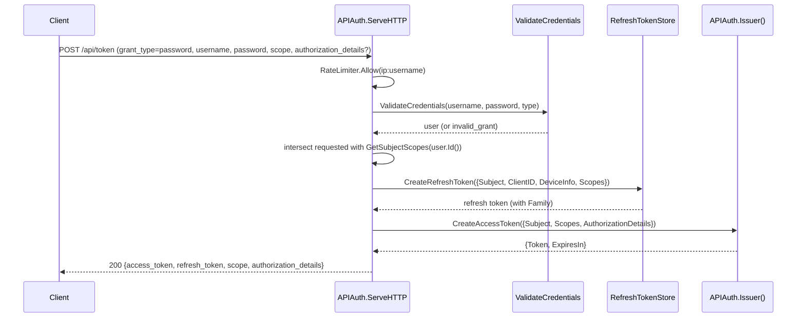
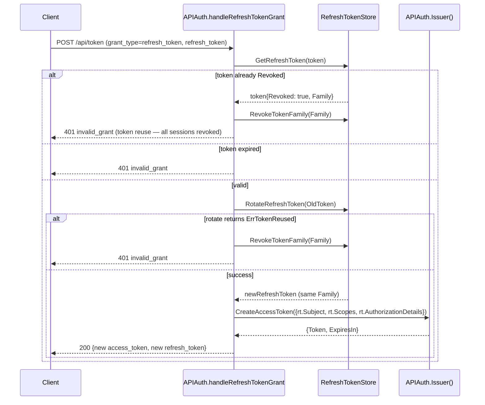
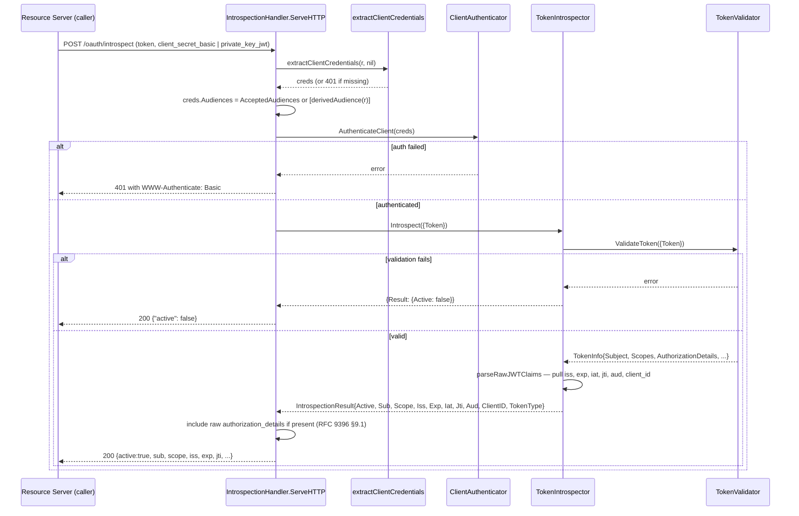
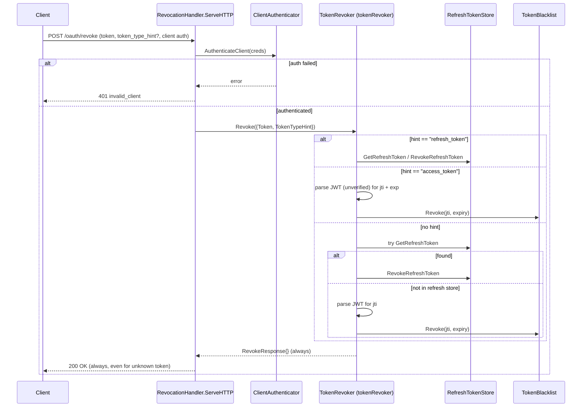

# apiauth

`apiauth` is OneAuth's API-token core. It owns every standard OAuth 2.0 grant served at `POST /api/token` (password, refresh_token, client_credentials, RFC 7523 `urn:...:jwt-bearer`, RFC 8693 `urn:...:token-exchange`), the three token-endpoint client-auth methods (`client_secret_basic`, `client_secret_post`, RFC 7523 §2.2 / OIDC Core §9 `private_key_jwt`), the resource-server `APIMiddleware` (JWT, API keys, introspection fallback), RFC 7662 introspection (both server and client sides), RFC 7009 revocation, RFC 8414 / OIDC discovery and the matching upstream-proxy bridge, RFC 9728 protected-resource metadata, and end-to-end RFC 9396 `authorization_details` plumbing. Two entry points coexist by design: the legacy `APIAuth` struct (still the production token-endpoint handler whose `ServeHTTP` dispatches all five grants) and the newer composition root `OneAuth` (built by `NewOneAuth`, the path new transports — gRPC, MCP — should adopt). Per #218 these are no longer parallel implementations: `APIAuth.Issuer()` and `APIAuth.Validator()` lazy-build the same gRPC-shape interfaces that `NewOneAuth` wires (`(ctx, *XRequest) → (*XResponse, error)` per #175), and the old inline `CreateAccessToken` / `ValidateAccessToken*` / `VerifyTokenFunc` methods on `APIAuth` have been removed — every grant handler funnels through the `Issuer()` accessor and every middleware path through the `Validator()` accessor. HTTP handlers in this package are thin wrappers — refresh-token *creation* with transport metadata stays in `APIAuth` rather than being pushed into the core so device info / IP / user-agent leakage stops at the HTTP boundary.

## Contents

- [Entities](#entities)
- [Flows](#flows)
  - [Password grant via APIAuth](#password-grant-via-apiauth)
  - [Refresh token rotation with theft detection](#refresh-token-rotation-with-theft-detection)
  - [client_credentials with private_key_jwt](#client_credentials-with-private_key_jwt)
  - [Token introspection RFC 7662](#token-introspection-rfc-7662)
  - [Token revocation RFC 7009](#token-revocation-rfc-7009)
- [Gotchas](#gotchas)
- [Depends on](#depends-on)

## Entities

| Entity | Kind | Role | Why |
|---|---|---|---|
| `APIAuth` | struct | `/api/token` HTTP handler — `ServeHTTP` dispatches on `grant_type` (password / refresh_token / client_credentials / jwt-bearer / token-exchange); also hosts API-key and session management endpoints | Legacy entry point still owns the `/api/token` shape (form + JSON, rate limiting, custom claims, callbacks); per #218 it routes token minting and validation through `Issuer()` / `Validator()` instead of inline JWT logic. |
| `APIAuth.Issuer` | method | Lazy-builds the `TokenIssuer` from `APIAuth` fields (signing key/alg, issuer/audience, `ClientKeyStore`, `RefreshTokenStore`, `ValidateCredentials`, `GetSubjectScopes`, `CustomClaimsFunc`) | Callers populate `APIAuth` fields after construction (existing pattern); the `sync.Once` cache funnels every grant handler through one issuer instance. |
| `APIAuth.Validator` | method | Lazy-builds the `TokenValidator` from `APIAuth` fields (signing/verify key, alg, blacklist, issuer/audience) | Same lazy-build pattern as `Issuer()`; `APIMiddleware` reuses the same path when no explicit `Validator` is wired. |
| `APIMiddleware` | struct | Bearer-token middleware (`ValidateToken`, `RequireScopes`, `Optional`, `RequireAuthorizationDetails`) | Resource-server entry point; chains JWT (single- or multi-tenant via `KeyStore`), `oa_`-prefixed API keys, and `IntrospectionValidator` fallback in one path. |
| `OneAuth` | struct | Transport-independent composition root with `Issuer` / `Validator` / `Introspector` / `Revoker` / `Authenticator` + shared `KeyStore` / `Blacklist` / `RefreshStore` + grouped `Hooks` | Issue 110's no-god-object refactor; `IntrospectionHTTPHandler` / `RevocationHTTPHandler` / `HTTPMiddleware` return thin HTTP wrappers. |
| `NewOneAuth` | func | Builds a fully wired `*OneAuth` from `OneAuthConfig` | Each composed implementation receives only the deps it actually needs. |
| `OneAuthConfig` | struct | Single config surface (KeyStore, signing key/alg, issuer/audience, expiry, Blacklist, RefreshStore, password-grant callbacks, Hooks) | Fans out into `NewJWTIssuer` / `NewJWTValidator` / `NewTokenRevoker` / `NewClientAuthenticator`. |
| `TokenIssuer` | interface | `CreateAccessToken` / `ClientCredentials` / `RefreshGrant` / `PasswordGrant` — all `(ctx, *XRequest) → (*XResponse, error)` | gRPC-shape convention (#175); transport bindings call these instead of `APIAuth`. |
| `TokenValidator` | interface | `ValidateToken` / `CheckScopes` / `CheckAuthorizationDetails` | Shared by middleware and introspector. |
| `TokenIntrospector` | interface | RFC 7662 `Introspect` returning `{Active: false}` for any invalid token | Decouples introspection from the validation backend; in-process impl delegates to a `TokenValidator`. |
| `TokenRevoker` | interface | RFC 7009 `Revoke` with `token_type_hint` | Separates revocation policy from the HTTP wrapper. |
| `ClientAuthenticator` | interface | `AuthenticateClient` covering `client_secret_basic` / `client_secret_post` / `private_key_jwt` | Shared by token + introspection + revocation handlers via `extractClientCredentials`. |
| `TokenInfo` | struct | Validated claims: `Subject`, `Scopes`, `AuthorizationDetails`, `CustomClaims`, `AuthType` | Single shape consumed by middleware and the in-process introspector. |
| `jwtValidator` | type | Local JWT validator: resolves keys by `kid` then `client_id` claim; cross-checks kid owner vs claim; validates type/iss/aud/exp/blacklist; self-validates against `signingKey` when no `KeyLookup` resolves | The kid-vs-`client_id`-claim cross-check prevents cross-app token forgery; self-validation fallback supports the "APIAuth holds its own key" mode (no KeyStore needed). |
| `NewJWTValidator` | func | Constructor for `jwtValidator` | Shared by `APIMiddleware` (lazy) and `OneAuth`. |
| `jwtIssuer` | type | `TokenIssuer` signing HS/RS/ES JWTs with `jti` + RFC 9396 `authorization_details`; runs theft detection on `RefreshGrant` | Transport-free counterpart to per-grant minting; what both `NewOneAuth` and `APIAuth.Issuer()` wire. |
| `NewJWTIssuer` | func | Constructor for `jwtIssuer` | |
| `tokenRevoker` | type | `TokenRevoker` over `RefreshTokenStore` + `core.TokenBlacklist` | No hint → tries refresh first (cheaper), then access — matches RFC 7009's permissive behaviour. |
| `NewTokenRevoker` | func | Constructor for `tokenRevoker` | |
| `tokenIntrospector` | type | `TokenIntrospector` delegating to `TokenValidator`; re-parses raw JWT for the full RFC 7662 response | Keeps the local-introspection path consistent with middleware validation. |
| `NewTokenIntrospector` | func | Constructor for `tokenIntrospector` | |
| `clientAuthenticator` | type | `ClientAuthenticator` with secret (constant-time compare) and `private_key_jwt` (RFC 7523 §2.2 / OIDC Core §9) paths | Locks assertion algorithm via `jwt.WithValidMethods(rec.Algorithm)` — defeats CVE-2016-10555 alg-confusion. |
| `NewClientAuthenticator` | func | Builds the default authenticator with in-memory `JTIStore` | Wired by `NewOneAuth` and lazily cached inside `APIAuth.authenticateTokenEndpointClient` so the JTIStore survives across requests. |
| `NewClientAuthenticatorWithJTIStore` | func | Same but with a custom `JTIStore` | Multi-node deployments need cross-process `jti` replay protection. |
| `ClientAssertionTypeJWTBearer` | const | The `client_assertion_type` URN required by RFC 7521 §4.2 | Any other value is rejected. |
| `MaxClientAssertionLifetime` | const | 5-minute cap on `exp - iat` for client assertions | Bounds JTIStore memory; matches OIDC Core §9's "short-lived" hint. |
| `JTIStore` | interface | `SeenWithin(jti, lifetime) bool` (atomic check-and-set) | Swap-in seam for distributed `jti` replay protection. |
| `NewInMemoryJTIStore` | func | Lazy-GC, mutex-guarded default | No background goroutine — GC amortized into `SeenWithin`. |
| `TrustedAssertionIssuer` | struct | Upstream IdP for `jwt-bearer` and `token-exchange` grants — `Issuer`, `PublicKey` / `KeyFunc`, `Audiences`, `AcceptedAlgorithms` | `KeyFunc` enables JWKS-by-`kid` resolution; `AcceptedAlgorithms` locks out alg-confusion. |
| `JwtBearerGrantType` | const | `urn:ietf:params:oauth:grant-type:jwt-bearer` (RFC 7523 §2.1) | Distinct from RFC 7523 §2.2 client-auth assertions. |
| `TokenExchangeGrantType` | const | `urn:ietf:params:oauth:grant-type:token-exchange` (RFC 8693 §2.1) | Phase 1: JWT `subject_token` → access_token only. |
| `TokenTypeJWT` | const | `urn:ietf:params:oauth:token-type:jwt` | Only supported `subject_token_type`. |
| `TokenTypeAccessToken` | const | `urn:ietf:params:oauth:token-type:access_token` | Default `requested_token_type`. |
| `ASServerMetadata` | struct | RFC 8414 + OIDC Discovery document — `ClaimsSupported`, `AuthorizationDetailsTypesSupported`, `TokenEndpointAuthSigningAlgValuesSupported`, RFC 9207 `AuthorizationResponseIssParameterSupported` | Pointer-typed RFC 9207 flag distinguishes "advertised false" from "absent". |
| `NewASMetadataHandler` | func | Returns a pre-serialized AS metadata handler | Failure to marshal panics loudly at construction. |
| `MountASMetadata` | func | Registers the same handler at both well-known paths | OAuth-only and OIDC-only clients both auto-discover the AS. |
| `ASMetadataProxy` | struct | Lazy-fetching, TTL-cached proxy that fetches upstream metadata (RFC 8414 first, then OIDC) | Bridges OIDC-only providers (Keycloak) for clients (VS Code MCP) that only try RFC 8414. |
| `NewASMetadataProxy` | func | Constructor (default TTL 1 hour) | |
| `ProtectedResourceMetadata` | struct | RFC 9728 PRM — `Resource`, `AuthorizationServers`, scopes, token formats, signing algs, introspection endpoint | Lets clients discover which AS to trust before calling protected endpoints. |
| `NewProtectedResourceHandler` | func | HTTP handler for PRM JSON | |
| `MountProtectedResource` | func | Mounts the PRM well-known and optionally an AS-metadata proxy on the resource server | MCP-spec discovery workflow. |
| `IntrospectionHandler` | struct | `POST /oauth/introspect` (RFC 7662) over `TokenIntrospector` + `ClientAuthenticator` + `AcceptedAudiences` | `derivedAudience(r)` fallback only safe for single-host deployments. |
| `NewIntrospectionHandler` | func | Bridge constructor that adapts an `APIAuth` into the new interface-based handler | Lets legacy callers pick up `private_key_jwt` caller-auth automatically. |
| `RevocationHandler` | struct | `POST /oauth/revoke` (RFC 7009) — always 200 | Same `ClientAuthenticator` plumbing as introspection. |
| `NewRevocationHandler` | func | Bridge constructor over `APIAuth` | |
| `IntrospectionValidator` | struct | RFC 7662 client — POSTs the token to an upstream endpoint with Basic auth; optional response cache via `CacheTTL` | Middleware fallback when local JWT validation fails or when no key material is available. |
| `IntrospectionResult` | struct | Parsed RFC 7662 response | Single type returned by the local `TokenIntrospector` and the remote `IntrospectionValidator`. |
| `Hooks` | struct | Grouped lifecycle callbacks — `Token` / `Auth` / `Client` / `Security` | Avoids the "120-field hook struct" antipattern. |
| `TokenHooks` | struct | `OnIssued` / `OnRefreshed` / `OnRevoked` | |
| `AuthHooks` | struct | `OnLoginSuccess` / `OnLoginFailure` / `OnScopeStepUp` | |
| `ClientHooks` | struct | `OnRegistered` / `OnDeleted` / `OnKeyRotated` | |
| `SecurityHooks` | struct | `OnTokenRejected` / `OnBlacklistHit` / `OnAlgorithmMismatch` | `OnAlgorithmMismatch` flags CVE-2015-9235. |
| `CredentialsValidator` | type | Type alias re-exported from `accounts` for the password-grant validator | Cross-package assignability with `localauth` without conversion. |
| `extractClientCredentials` | func | Inspects an HTTP request for client credentials across the three OAuth-defined channels (assertion → Basic → form) and populates an `AuthenticateClientRequest` | Centralizes precedence (strongest credential wins) so token / introspection / revocation accept the same channels identically. |
| `derivedAudience` | func | Derives the absolute endpoint URL from a request (honoring `X-Forwarded-*`) as audience fallback | Single-host deployments don't need explicit `AcceptedAudiences`; production behind a path-rewriting proxy must populate the list. |
| `GetSubjectFromAPIContext` | func | Retrieves the JWT subject (RFC 7519 `sub` — user ID for human flows, client_id for client_credentials) from the request context | Renamed from `GetUserIDFromAPIContext` to reflect dual usage. |
| `GetScopesFromAPIContext` | func | Retrieves granted scopes from the request context | |
| `GetAuthTypeFromAPIContext` | func | Retrieves `"jwt"` / `"api_key"` / `"introspection"` | Lets handlers behave differently for opaque API keys vs JWTs. |
| `GetCustomClaimsFromContext` | func | Retrieves non-standard JWT claims | |
| `GetAuthorizationDetailsFromContext` | func | Retrieves RFC 9396 `authorization_details` from the request context | Dedicated key (not the customClaims bag) so RAR is first-class. |
| `APIMiddleware.RequireAuthorizationDetails` | method | Middleware factory requiring `authorization_details` types | Type-level RAR enforcement — finer-grained than scopes. |

## Flows

### Password grant via APIAuth

`POST /api/token` with `grant_type=password`. `APIAuth.ServeHTTP` dispatches to `handlePasswordGrant`, which authenticates credentials, intersects requested vs allowed scopes, creates a refresh token in the store (so transport metadata — device, IP, user-agent — stays at the HTTP boundary), and then routes through `APIAuth.Issuer().CreateAccessToken` for the signed JWT.



### Refresh token rotation with theft detection

`grant_type=refresh_token` rotates the refresh token (issues a new one, invalidates the old). The reuse-detection trick: if the presented token is already `Revoked`, the entire `Family` (every token descended from the same original login) is revoked, not just this one — token reuse signals theft. Same logic appears in both `APIAuth.handleRefreshTokenGrant` and `jwtIssuer.RefreshGrant`; the HTTP handler keeps it because the transport response needs `tokenResponse` formatting.



### client_credentials with private_key_jwt

`grant_type=client_credentials` with a signed JWT in `client_assertion` (RFC 7523 §2.2). `APIAuth.authenticateTokenEndpointClient` runs the request through `ClientAuthenticator` (the only channel that supports assertions), which parses the assertion, looks up the registered client key, locks the algorithm to what the client registered, and verifies signature + audience + lifetime + `jti` replay-window before the token is minted. Symmetric-keyed clients are rejected (`private_key_jwt` is asymmetric-only; `client_secret_jwt` lives in a separate ticket).

```mermaid
sequenceDiagram
    participant C as Client
    participant H as APIAuth.handleClientCredentialsGrant
    participant E as extractClientCredentials
    participant A as ClientAuthenticator (clientAuthenticator)
    participant K as keys.KeyLookup
    participant J as JTIStore
    participant I as APIAuth.Issuer()
    C->>H: POST /api/token (grant_type=client_credentials, client_assertion_type=urn:...:jwt-bearer, client_assertion=JWT)
    H->>E: extractClientCredentials(r, req)
    E-->>H: AuthenticateClientRequest{ClientAssertion, ClientAssertionType, Audiences}
    H->>A: AuthenticateClient(creds)
    A->>A: ParseUnverified — pull iss, sub, jti
    A->>A: require iss == sub == implicit client_id; require client_id form param matches if set
    A->>K: GetKey(ClientID=iss)
    K-->>A: KeyRecord{Algorithm, Key}
    A->>A: reject symmetric algs (private_key_jwt is asymmetric-only)
    A->>A: jwt.Parse with WithValidMethods(rec.Algorithm) — locks alg, defeats CVE-2016-10555
    A->>A: matchesAudience(verified aud, Audiences)
    A->>A: enforce lifetime <= MaxClientAssertionLifetime
    A->>J: SeenWithin(jti, replayWindow)
    alt jti already seen
        J-->>A: true
        A-->>H: invalid_client (assertion replayed)
        H-->>C: 401 invalid_client
    else first time
        J-->>A: false (now marked seen)
        A-->>H: {ClientID, Method: "private_key_jwt"}
        H->>I: CreateAccessToken({Subject: ClientID, Scopes, AuthorizationDetails})
        I-->>H: {Token, ExpiresIn}
        H-->>C: 200 {access_token, scope, authorization_details}
    end
```

### Token introspection RFC 7662

`POST /oauth/introspect`. `IntrospectionHandler` authenticates the caller (resource server) via `ClientAuthenticator`, then delegates the token check to a `TokenIntrospector`. Per RFC 7662 §2.2 invalid tokens return `{"active": false}` — never an error, never a reason. The legacy bridge `apiauthIntrospector` runs the introspection through `APIAuth.Validator()` so single-host deployments share one validation path with `APIMiddleware`.



### Token revocation RFC 7009

`POST /oauth/revoke`. `RevocationHandler` authenticates the caller, then hands off to `TokenRevoker`. Per RFC 7009 §2.2 the response is always 200 OK with no body — error responses would leak token existence. The revoker picks refresh-store-first / blacklist-first based on `token_type_hint`; with no hint, it tries refresh first (cheaper lookup), then access.



## Gotchas

- **Two entry points, one core.** `APIAuth` (legacy) and `OneAuth` (new) are not parallel implementations any more — per #218, `APIAuth.Issuer()` / `APIAuth.Validator()` lazy-build the same gRPC-shape interfaces `NewOneAuth` wires. Don't add new minting/validation logic to `APIAuth` directly; extend the `TokenIssuer` / `TokenValidator` implementations.
- **Removed methods.** `APIAuth.CreateAccessToken`, `APIAuth.ValidateAccessToken`, `APIAuth.ValidateAccessTokenFull`, and `APIAuth.VerifyTokenFunc` were deleted in #218. Existing callers must move to `APIAuth.Issuer().CreateAccessToken(ctx, &CreateAccessTokenRequest{...})` and `APIAuth.Validator().ValidateToken(ctx, &ValidateTokenRequest{...})`.
- **`GetUserIDFromAPIContext` renamed.** It's now `GetSubjectFromAPIContext` — the same context key is reused but the name reflects that the value is `client_id` for `client_credentials` tokens, not just a user ID.
- **`derivedAudience` fallback is single-host only.** When `AcceptedAudiences` is empty the handlers fall back to building the audience from the request URL (honoring `X-Forwarded-*`). Behind a path-rewriting proxy this breaks — populate `AcceptedAudiences` explicitly in production.
- **`private_key_jwt` is asymmetric-only.** The authenticator rejects symmetric-keyed clients on the assertion path; `client_secret_jwt` is a separate ticket. Don't try to "make it work" by treating an HMAC key as a public key — that's exactly the CVE-2016-10555 alg-confusion attack the authenticator blocks.
- **JTIStore must be cached across requests.** A fresh authenticator per request means a fresh in-memory `JTIStore`, which defeats replay protection. `APIAuth.authenticateTokenEndpointClient` uses `sync.Once` to cache the lazily-built authenticator for exactly this reason; multi-node deployments should wire `NewClientAuthenticatorWithJTIStore` with a distributed store (Redis SETNX).
- **Refresh token *creation* lives in `APIAuth`, not `jwtIssuer.PasswordGrant`.** Device info / IP / user-agent metadata stops at the HTTP boundary. `jwtIssuer.PasswordGrant` returns the access token + subject + scopes; the caller decides whether to create a refresh token and what device context to attach.
- **Token-exchange `audience` / `resource` params are advisory.** Phase 1 issues access tokens with the AS's default `JWTAudience`; audience-targeting is future work. The handler logs when these params are set so the gap surfaces in production.

## Depends on

| Sibling | Entities |
|---|---|
| [`../accounts`](../accounts/DESIGN.md) | `CredentialsValidator`, `DetectUsernameType` |
| [`../core`](../core/DESIGN.md) | `APIKeyStore`, `AuthorizationDetail`, `ContainsAllScopes`, `CreateAPIKeyRequest`, `CreateRefreshTokenRequest`, `ErrAPIKeyNotFound`, `ErrTokenNotFound`, `ErrTokenReused`, `GenerateSecureToken`, `GetAPIKeyByIDRequest`, `GetRefreshTokenRequest`, `GetSubjectFromContext`, `GetSubjectScopesFunc`, `GetSubjectTokensRequest`, `IntersectScopes`, `JoinScopes`, `ListSubjectAPIKeysRequest`, `ParseScopes`, `RateLimiter`, `RefreshTokenStore`, `RevokeAPIKeyRequest`, `RevokeRefreshTokenRequest`, `RevokeSubjectTokensRequest`, `RevokeTokenFamilyRequest`, `RotateRefreshTokenRequest`, `ScopeOffline`, `ScopeProfile`, `ScopeRead`, `ScopeWrite`, `SetSubjectInContext`, `TokenBlacklist`, `TokenError`, `TokenExpiryAccessToken`, `TokenPair`, `TokenRequest`, `UpdateAPIKeyLastUsedRequest`, `ValidateAll`, `ValidateAPIKeyRequest` |
| [`../keys`](../keys/DESIGN.md) | `GetKeyByKidRequest`, `GetKeyRequest`, `KeyLookup`, `KeyStorage` |
| [`../utils`](../utils/DESIGN.md) | `ComputeKid`, `DecodeVerifyKey`, `IsAsymmetricAlg`, `SigningMethodForAlg` |
