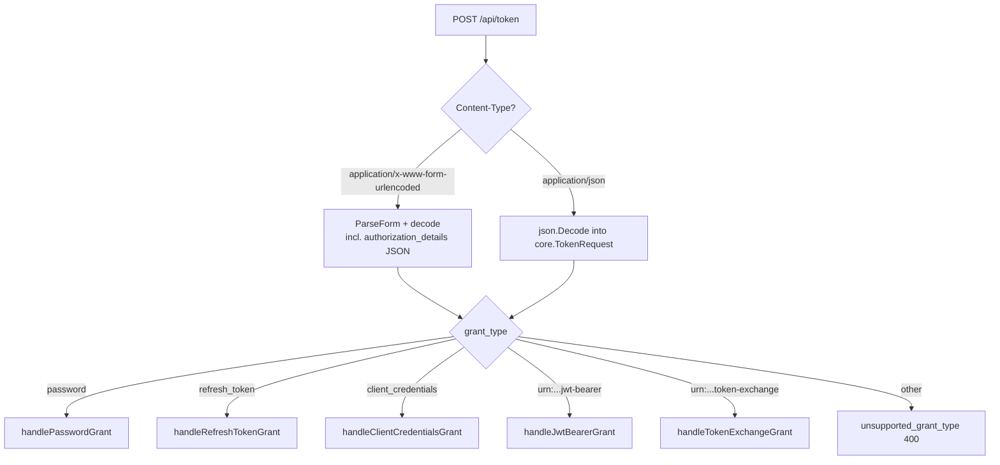
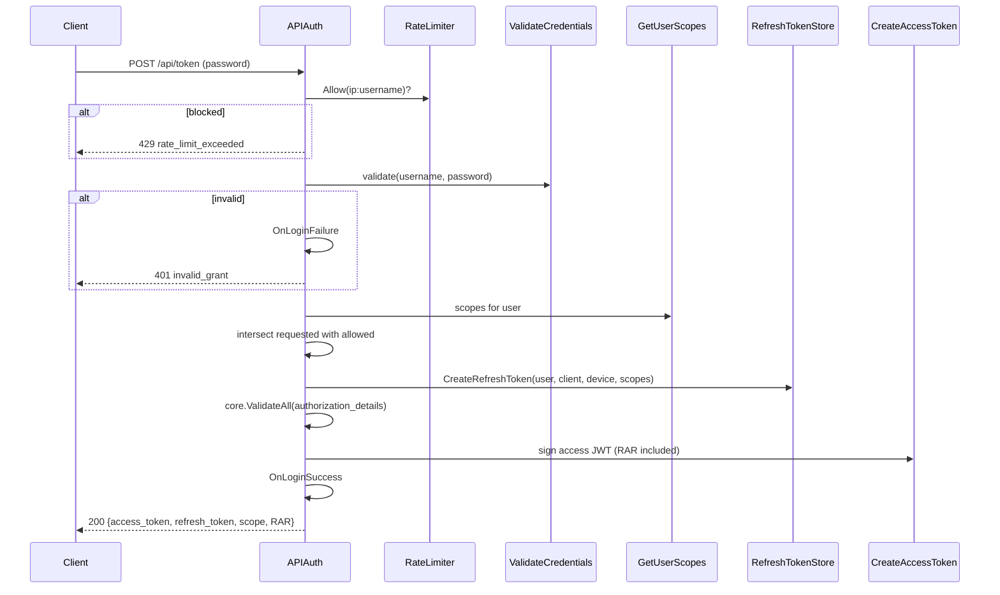
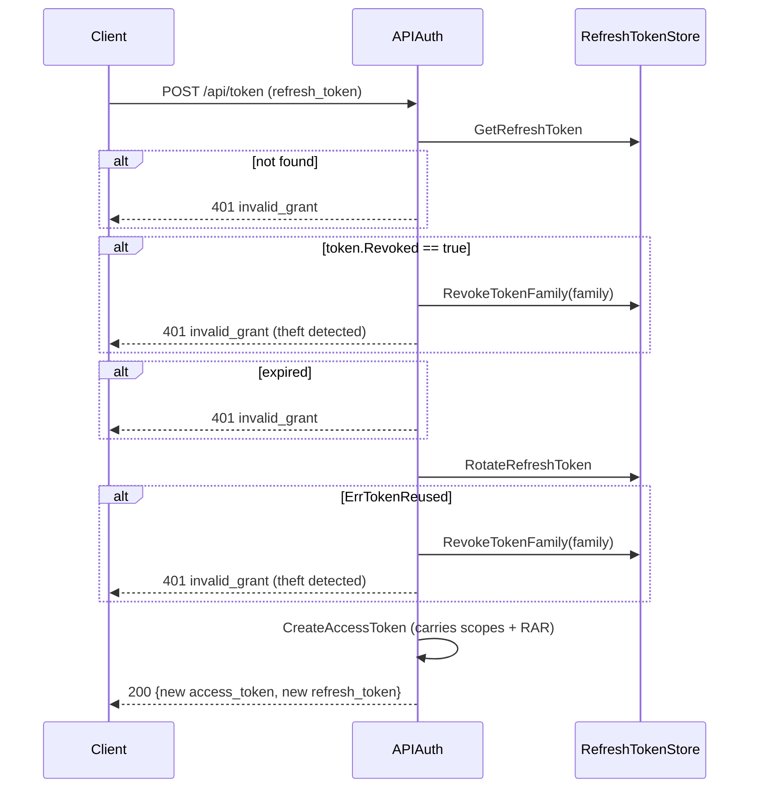
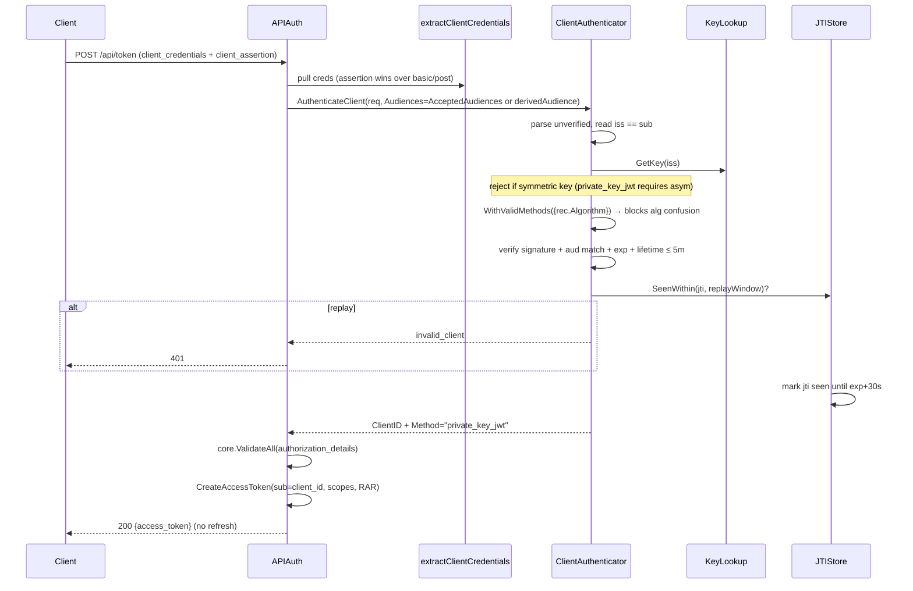
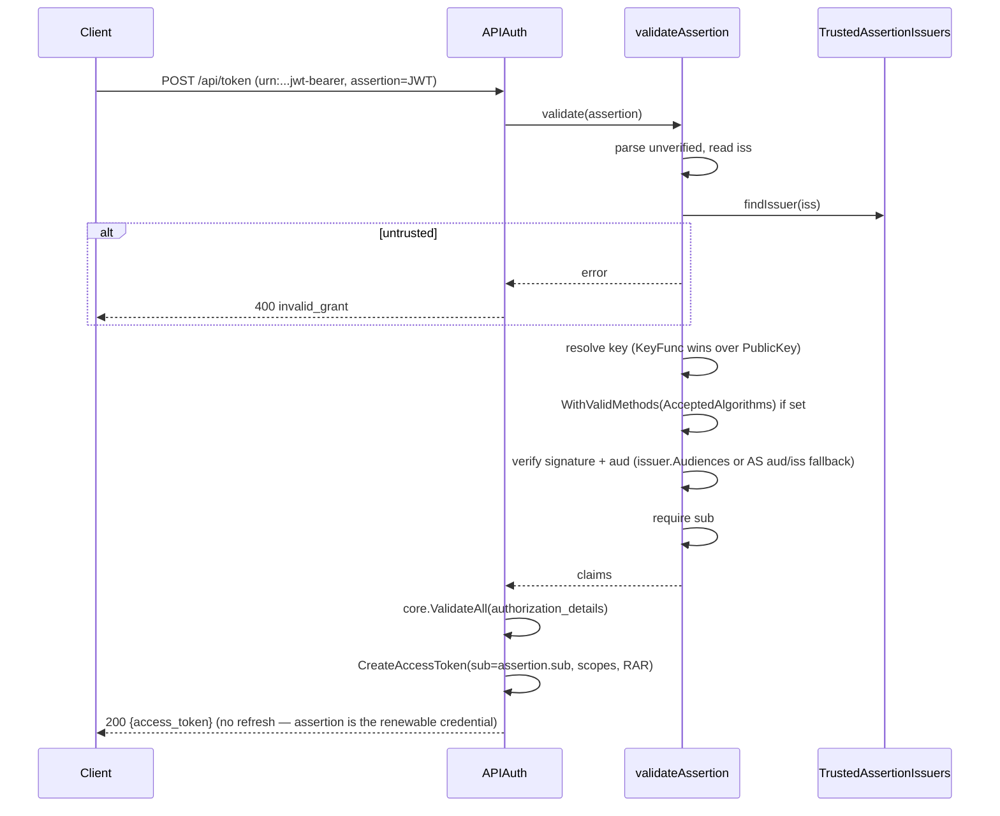
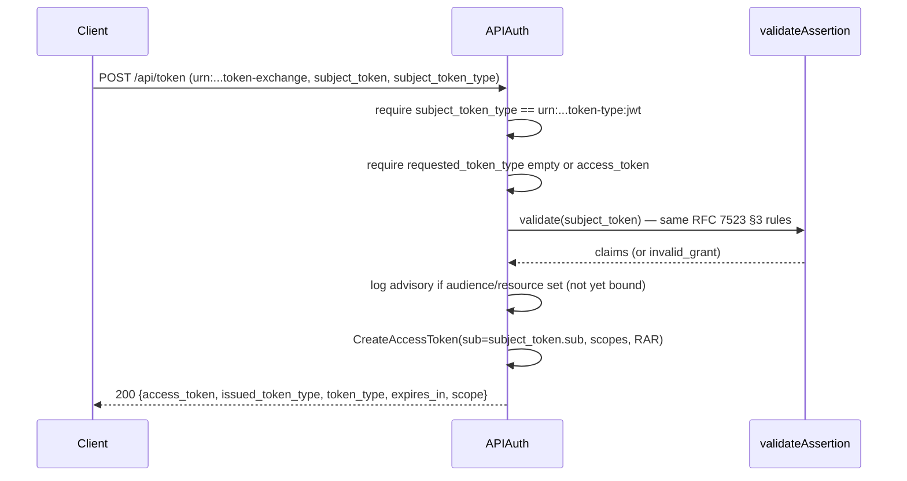
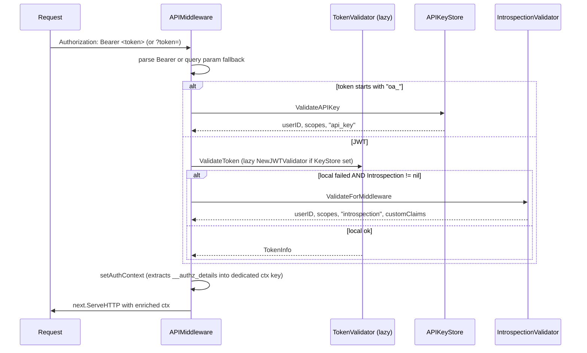

# apiauth

`apiauth` is the OAuth 2.0 core of OneAuth: a transport-independent set of focused interfaces (`TokenIssuer`, `TokenValidator`, `TokenIntrospector`, `TokenRevoker`, `ClientAuthenticator`) plus thin HTTP bindings for the token endpoint, RFC 7662 introspection, RFC 7009 revocation, RFC 8414 / OIDC Discovery AS metadata, RFC 9728 protected-resource metadata, and resource-server middleware. It owns every standard grant (password, refresh_token, client_credentials, urn:ietf:params:oauth:grant-type:jwt-bearer, urn:ietf:params:oauth:grant-type:token-exchange), RFC 9396 `authorization_details` plumbing end-to-end, the three token-endpoint client-auth methods (`client_secret_basic`, `client_secret_post`, `private_key_jwt`), and the lifecycle hook surface — but deliberately keeps refresh-token creation in caller hands so transport metadata stays out of the core. Two parallel entry points coexist by design: the legacy `APIAuth` struct (still the production token-endpoint handler with its 5-grant `ServeHTTP`) and the newer `OneAuth` composition root (built by `NewOneAuth`, the path new callers should take).

## Contents

- [Entities](#entities)
- [Flows](#flows)
  - [Token endpoint dispatch (ServeHTTP)](#token-endpoint-dispatch-servehttp)
  - [password grant](#password-grant)
  - [refresh_token grant with theft detection](#refresh_token-grant-with-theft-detection)
  - [client_credentials with private_key_jwt](#client_credentials-with-private_key_jwt)
  - [jwt-bearer grant (RFC 7523 §2.1)](#jwt-bearer-grant-rfc-7523-21)
  - [token-exchange grant (RFC 8693)](#token-exchange-grant-rfc-8693)
  - [Resource-server middleware request validation](#resource-server-middleware-request-validation)
  - [RFC 7662 introspection](#rfc-7662-introspection)
  - [RFC 7009 revocation](#rfc-7009-revocation)
- [Gotchas](#gotchas)
- [Depends on](#depends-on)

## Entities

| Entity | Kind | Role | Why |
|---|---|---|---|
| `TokenIssuer` | interface | Mints access tokens via the four standard grants. | Focused capability; refresh-token creation stays with the caller. |
| `TokenValidator` | interface | Parses + validates tokens (sig / exp / iss / aud / blacklist) and checks scopes + RAR. | Read-only counterpart shared by middleware, introspection, scope checks. |
| `TokenIntrospector` | interface | RFC 7662 introspection — collapses any failure to `{Active:false}`. | §2.2 confidentiality requirement. |
| `TokenRevoker` | interface | RFC 7009 revocation dispatched by `token_type_hint`. | One endpoint, both token types, no HTTP coupling. |
| `ClientAuthenticator` | interface | Verifies caller creds across `client_secret_basic` / `client_secret_post` / `private_key_jwt`. | Unifies the three endpoints behind one verifier. |
| `OneAuth` | struct | Composition root wiring all five interfaces + shared stores + `Hooks`. | Option A — no god object; shared state across implementations. |
| `OneAuthConfig` | struct | Dependency bundle consumed by `NewOneAuth`. | Stable constructor surface as knobs grow. |
| `NewOneAuth` | func | Wires every interface + shared store. | Single place that knows the dependency graph. |
| `OneAuth.IntrospectionHTTPHandler` | method | Returns an `IntrospectionHandler` wired to the core. | One-line HTTP mount. |
| `OneAuth.RevocationHTTPHandler` | method | Returns a `RevocationHandler` wired to the core. | Symmetric with introspection mount. |
| `OneAuth.HTTPMiddleware` | method | Returns an `APIMiddleware` delegating to the OneAuth validator. | Bridge core onto a resource-server pipeline. |
| `APIAuth` | struct | Legacy/standalone token endpoint with `ServeHTTP` + all five grants. | Production token-endpoint handler today; new code composes `OneAuth`. |
| `APIAuth.ServeHTTP` | method | POST /api/token — form or JSON in, dispatches by `grant_type`. | Owns request decoding + OAuth error mapping. |
| `APIAuth.CreateAccessToken` | method | Builds + signs the JWT (sub/scopes/jti/iat/exp/iss/aud/RAR + custom claims). | Single chokepoint; enforces `standardClaims` allow-list. |
| `APIAuth.ValidateAccessToken` | method | Verifies signature, type, iss, aud, sub, scopes, blacklist. | Powers `VerifyTokenFunc` for the legacy middleware path. |
| `APIAuth.ValidateAccessTokenFull` | method | Same plus returns custom claims. | Feeds the bridge introspector. |
| `APIAuth.authenticateTokenEndpointClient` | method | Routes client auth through `ClientAuthenticator`, lazily building one over `ClientKeyStore`. | Lazy build is `sync.Once`-cached — a fresh JTIStore per request would break replay protection. |
| `APIAuth.HandleLogout` | method | POST /api/logout — revokes the given refresh token. | Lightweight session-end. |
| `APIAuth.HandleLogoutAll` | method | POST /api/logout-all — revokes every refresh token for the user. | Single-call account kill switch. |
| `APIAuth.HandleListSessions` | method | GET /api/sessions — list active refresh tokens with device info. | "Signed in on N devices" UI without leaking raw hashes. |
| `APIAuth.HandleAPIKeys` | method | GET/POST /api/keys — list or create API keys (`oa_` prefix). | Parallel credential type managed alongside JWTs. |
| `APIAuth.HandleRevokeAPIKey` | method | DELETE /api/keys/{id} — revoke after ownership check. | Safe shared-handler usage. |
| `APIMiddleware` | struct | Bearer-token middleware (JWT, `oa_*` API key, optional remote introspection fallback) that stamps user/scopes/authType/customClaims on the request context. | Covers single-tenant + multi-tenant configs; lazy `NewJWTValidator` promotion preserves the inline fallback. |
| `APIMiddleware.ValidateToken` | method | Reject requests without a valid token. | Hard-fail path. |
| `APIMiddleware.RequireScopes` | method | Additionally require every named scope. | Compose-time scope guard. |
| `APIMiddleware.RequireAuthorizationDetails` | method | Require ≥1 RAR entry per type. | RFC 9396 enforcement at the edge. |
| `APIMiddleware.Optional` | method | Populate context if present, otherwise pass through. | Public endpoints that personalize when signed in. |
| `jwtIssuer` | struct | Concrete `TokenIssuer` (HS256/RS256/ES256 via golang-jwt). | Single sign chokepoint with jti, kid, RAR encoding. |
| `jwtIssuer.PasswordGrant` | method | Validate creds + intersect scopes + issue access token (no refresh). | Caller owns refresh-token creation. |
| `jwtIssuer.RefreshGrant` | method | Rotate refresh + re-issue access (carries forward scopes + RAR). | Reuse triggers `RevokeTokenFamily`. |
| `jwtIssuer.ClientCredentials` | method | Authenticate by secret + issue sub=client_id token. | No refresh for M2M. |
| `jwtValidator` | struct | Concrete `TokenValidator`; kid → client_id key lookup + claim checks + blacklist. | kid owner must match `client_id` claim — blocks cross-app forgery. |
| `JWTValidatorConfig` | struct | Config for `NewJWTValidator`. | Stable constructor surface. |
| `NewJWTValidator` | func | Constructor. | Hides the struct. |
| `JWTIssuerConfig` | struct | Config for `NewJWTIssuer`. | Explicit dependency wiring per grant. |
| `NewJWTIssuer` | func | Constructor; defaults expiry. | Hides the struct. |
| `clientAuthenticator` | struct | Concrete `ClientAuthenticator` (constant-time secret + private_key_jwt). | Dispatch lives in the interface, not in HTTP code. |
| `NewClientAuthenticator` | func | Builds one with an in-memory JTIStore. | Single-process default. |
| `NewClientAuthenticatorWithJTIStore` | func | Variant taking caller-supplied JTIStore. | Multi-node cluster-wide replay protection. |
| `clientAuthenticator.AuthenticateClient` | method | Dispatch secret vs assertion, return `ClientID` + method tag. | Tag is informational for telemetry. |
| `ClientAssertionTypeJWTBearer` | const | The RFC 7521 §4.2 assertion-type URN. | Strict equality on the form param. |
| `MaxClientAssertionLifetime` | const | 5-minute ceiling on `exp - iat`. | Bounds JTIStore footprint; matches OIDC §9 guidance. |
| `JTIStore` | interface | Atomic `SeenWithin` check-and-set for assertion replay. | Narrow API — swap in Redis with one method. |
| `NewInMemoryJTIStore` | func | Default in-memory store with lazy eviction. | No background goroutine. |
| `tokenIntrospector` | struct | Concrete `TokenIntrospector` built on a `TokenValidator`. | Composition over inheritance; uses `parseRawJWTClaims` to expose stripped claims. |
| `NewTokenIntrospector` | func | Wrap any `TokenValidator`. | Local introspection = wrapped validator. |
| `tokenRevoker` | struct | Concrete `TokenRevoker` — refresh-first when no hint, then blacklist by jti. | Single endpoint covers both types. |
| `TokenRevokerConfig` | struct | Config for `NewTokenRevoker`. | Either store may be nil. |
| `NewTokenRevoker` | func | Constructor. | Hides struct. |
| `IntrospectionHandler` | struct | HTTP wrapper for POST /oauth/introspect. | All semantics live in `TokenIntrospector`. |
| `IntrospectionHandler.ServeHTTP` | method | Parse, authenticate, introspect, emit RFC 7662 JSON (with RAR when present). | §2.2 — `{active:false}` 200 instead of OAuth error. |
| `NewIntrospectionHandler` | func | Bridges `APIAuth.ValidateAccessTokenFull` as a `TokenIntrospector`. | Legacy powers introspection without losing custom claims. |
| `RevocationHandler` | struct | HTTP wrapper for POST /oauth/revoke. | Always 200 OK per §2.2. |
| `RevocationHandler.ServeHTTP` | method | Parse, authenticate, delegate to `TokenRevoker.Revoke`. | Symmetric with introspection. |
| `NewRevocationHandler` | func | Builds a `TokenRevoker` from an `APIAuth`'s stores. | Legacy bridge constructor. |
| `extractClientCredentials` | func | Pulls creds from any of the three OAuth channels, preferring strongest. | §2.3 forbids multiple methods; helper picks one when a client misbehaves. |
| `derivedAudience` | func | Builds the absolute request URL for assertion `aud` fallback. | Single-host convenience default. |
| `errMissingClientCredentials` | const | Sentinel separating "no creds" → 400 vs 401 per endpoint. | Different RFC error mappings. |
| `ASServerMetadata` | struct | RFC 8414 + OIDC Discovery §4 metadata. | One struct, two well-known paths. |
| `NewASMetadataHandler` | func | GET-only handler that pre-serializes JSON. | Encode once at construction. |
| `MountASMetadata` | func | Mount at both `oauth-authorization-server` and `openid-configuration`. | No-fallback discovery for both client families. |
| `ASMetadataProxy` | struct | Lazy + cached upstream-AS metadata proxy. | Bridges OIDC-only providers (Keycloak) to RFC-8414-only clients (VS Code MCP). |
| `NewASMetadataProxy` | func | Constructor with 1-hour default TTL. | Lazy first-request fetch. |
| `ProtectedResourceMetadata` | struct | RFC 9728 PRM struct. | Resource-server discovery of trusted ASes. |
| `NewProtectedResourceHandler` | func | GET-only pre-serialized PRM handler. | Same pattern as AS metadata. |
| `MountProtectedResource` | func | Mount PRM + optionally proxy AS metadata for each `authorization_server`. | Complete MCP-client discovery surface in one call. |
| `IntrospectionValidator` | struct | HTTP client validating tokens via remote RFC 7662. | Alternative to local JWT/JWKS for opaque tokens or central blacklist. |
| `IntrospectionValidator.Validate` | method | POST to introspection with `client_secret_basic`. | Inactive token ≠ error. |
| `IntrospectionValidator.ValidateForMiddleware` | method | Adapter returning the tuple `APIMiddleware` wants. | Lets remote introspection slot in as fallback. |
| `IntrospectionResult` | struct | Parsed RFC 7662 response shared by local + remote paths. | Consistent shape regardless of validation locus. |
| `TokenInfo` | struct | Validated-token payload returned wrapped in `ValidateTokenResponse`. | One result type for middleware / introspection / CheckScopes. |
| `Hooks` | struct | Lifecycle callbacks grouped (Token / Auth / Client / Security). | Each impl receives only its relevant group. |
| `TokenHooks` | struct | `OnIssued` / `OnRefreshed` / `OnRevoked`. | Most commonly audited surface. |
| `SecurityHooks` | struct | `OnTokenRejected` / `OnBlacklistHit` / `OnAlgorithmMismatch`. | Pre-wired alerting; `OnAlgorithmMismatch` catches CVE-2015-9235. |
| `AuthHooks` | struct | `OnLoginSuccess` / `OnLoginFailure` / `OnScopeStepUp`. | Auth-side observability. |
| `ClientHooks` | struct | `OnRegistered` / `OnDeleted` / `OnKeyRotated`. | Client-lifecycle observability. |
| `JwtBearerGrantType` | const | RFC 7523 §2.1 grant URI. | Strict match in dispatch. |
| `TokenExchangeGrantType` | const | RFC 8693 §2.1 grant URI. | Strict match in dispatch. |
| `TrustedAssertionIssuer` | struct | Allowlisted upstream IdP (Issuer + PublicKey/KeyFunc + Audiences + AcceptedAlgorithms). | `AcceptedAlgorithms` locks out alg-confusion per issuer. |
| `validateAssertion` | func | Shared validator for both assertion-bearing grants. | Same RFC 7523 §3 rules apply to both. |
| `APIAuth.handleJwtBearerGrant` | method | RFC 7523 §2.1 — validate assertion, mint token with `sub`=assertion.sub. | No refresh token — assertion itself is the renewable credential. |
| `APIAuth.handleTokenExchangeGrant` | method | RFC 8693 phase 1 — JWT subject token + access token output only. | Response shape must include `issued_token_type` per §2.2. |
| `TokenTypeJWT` | const | `urn:...:token-type:jwt` — phase-1 subject_token_type. | Other types need per-type validators. |
| `TokenTypeAccessToken` | const | `urn:...:token-type:access_token` — phase-1 requested_token_type. | Non-access output is future work. |
| `parseAuthorizationDetailsFromClaims` | func | Lift raw JWT slices into typed `core.AuthorizationDetail`. | Typed values for handlers at the boundary. |
| `matchesAudience` | func | Match expected aud against string or array claim. | RFC 7519 §4.1.3 — both shapes exist in the wild. |
| `standardClaims` | const | Allow-list of claims `CustomClaimsFunc` cannot override. | Defense in depth — no forged security-critical fields. |
| `constantTimeEqual` | func | Constant-time byte comparison. | Timing-side-channel defense for secret comparison. |
| `GetUserIDFromAPIContext` | func | Reads user/client id from context. | Public accessor for handlers. |
| `GetScopesFromAPIContext` | func | Reads granted scopes from context. | Public accessor. |
| `GetAuthTypeFromAPIContext` | func | Reads `"jwt"` / `"api_key"` / `"introspection"`. | Lets handlers diverge by modality. |
| `GetCustomClaimsFromContext` | func | Reads non-standard JWT claims. | Surfaces caller-injected claims downstream. |
| `GetAuthorizationDetailsFromContext` | func | Reads RFC 9396 details. | Value-level RAR checks beyond `RequireAuthorizationDetails`. |

## Flows

### Token endpoint dispatch (ServeHTTP)



### password grant



### refresh_token grant with theft detection



### client_credentials with private_key_jwt



### jwt-bearer grant (RFC 7523 §2.1)



### token-exchange grant (RFC 8693)



### Resource-server middleware request validation



### RFC 7662 introspection

```mermaid
sequenceDiagram
    participant C as Caller (resource server)
    participant H as IntrospectionHandler
    participant CA as ClientAuthenticator
    participant TI as TokenIntrospector
    participant V as TokenValidator
    C->>H: POST /oauth/introspect (token + creds)
    H->>H: ParseForm; extractClientCredentials
    H->>CA: AuthenticateClient
    alt unauthorized
        H-->>C: 401 + WWW-Authenticate
    end
    H->>TI: Introspect(token)
    TI->>V: ValidateToken
    alt invalid
        TI-->>H: {Active:false}
        H-->>C: 200 {"active":false}
    end
    TI->>TI: parseRawJWTClaims for iss/exp/iat/jti/aud/client_id
    TI-->>H: IntrospectionResult{Active:true,...}
    H->>H: include authorization_details if present (RFC 9396 §9.1)
    H-->>C: 200 {active:true, sub, scope, ...}
```

### RFC 7009 revocation

```mermaid
sequenceDiagram
    participant C as Client
    participant H as RevocationHandler
    participant CA as ClientAuthenticator
    participant TR as TokenRevoker
    participant RS as RefreshTokenStore
    participant BL as Blacklist
    C->>H: POST /oauth/revoke (token, token_type_hint)
    H->>H: ParseForm; extractClientCredentials
    H->>CA: AuthenticateClient
    alt unauthorized
        H-->>C: 401 invalid_client
    end
    H->>TR: Revoke(token, hint)
    alt hint == "refresh_token" OR no hint
        TR->>RS: GetRefreshToken → RevokeRefreshToken
    end
    alt hint == "access_token" OR refresh miss
        TR->>TR: parse JWT, extract jti + exp
        TR->>BL: Revoke(jti, exp)
    end
    TR-->>H: ok
    H-->>C: 200 OK (always — §2.2)
```

## Gotchas

- **Two parallel entry points, one core.** `APIAuth` (legacy config-bag) and `OneAuth` (Option-A composition root) coexist. `APIAuth.ServeHTTP` is still the token-endpoint handler in production deployments; `OneAuth.HTTPMiddleware` / `IntrospectionHTTPHandler` / `RevocationHTTPHandler` are the convenience mounts for new code. The bridge constructors `NewIntrospectionHandler` and `NewRevocationHandler` deliberately let an `APIAuth` power the new HTTP wrappers, so introspection and revocation work the same whichever entry point you chose.
- **Refresh token creation is the caller's job.** `TokenIssuer.PasswordGrant` returns `UserID + AccessToken + GrantedScopes + AuthorizationDetails` — no refresh token. The contract is intentional: refresh tokens carry transport-specific metadata (device info, IP, user-agent) that the core has no business knowing. The HTTP token endpoint (`APIAuth.handlePasswordGrant`) calls `RefreshTokenStore.CreateRefreshToken` itself before responding.
- **Lazy `ClientAuthenticator` must be cached.** `APIAuth.authenticateTokenEndpointClient` builds an authenticator over `ClientKeyStore` on first use and stashes it under `sync.Once`. Building one per request would mean a fresh in-memory `JTIStore`, which destroys replay protection for `private_key_jwt` assertions — every assertion would look "first seen".
- **Refresh-token theft detection is total-family.** A `Revoked == true` row on lookup AND a `core.ErrTokenReused` from `RotateRefreshToken` both trigger `RevokeTokenFamily(family)` — every sibling session born of that initial login dies. This is the standard OAuth defense for stolen-then-rotated refresh tokens; the trade-off is that a network blip that causes the client to retry an already-rotated token will sign out every device.
- **`authorization_details` carry forward through refresh, but not scopes-on-refresh.** `RefreshGrant` re-issues with `rt.Scopes` and `rt.AuthorizationDetails` from the original grant — there is no scope/RAR step-up at refresh time. A scope step-up requires a new password / authorization-code grant. The `AuthHooks.OnScopeStepUp` hook exists for callers that wire step-up at the application layer.
- **Token type is rejected only when explicitly wrong.** Validators check `claims["type"]` and reject when it equals anything other than `"access"`. External IdP tokens (Keycloak, Auth0) don't set this claim and are accepted — the check exists to prevent OneAuth refresh tokens (which set `type=refresh`) being presented as access tokens, not to police external issuers.
- **`CustomClaimsFunc` cannot override standard claims.** `standardClaims` is an allow-list (`sub`, `iss`, `aud`, `exp`, `iat`, `type`, `scopes`, `jti`, `authorization_details`). Attempting to set any of these from `CustomClaimsFunc` logs a warning and the value is silently dropped. This is the chokepoint that keeps a careless custom-claims callback from forging security-critical fields.
- **`private_key_jwt` requires asymmetric registration.** A client whose registered key is `[]byte` (HMAC secret) is rejected from `authenticateAssertion` with "not registered for private_key_jwt". `client_secret_jwt` (the symmetric counterpart) is a separate ticket — present in the constants but not yet implemented.
- **Algorithm is locked to the registered alg per client/issuer.** Both `clientAuthenticator.authenticateAssertion` (per-client) and `validateAssertion` (per `TrustedAssertionIssuer`) use `jwt.WithValidMethods({alg})` to lock signature verification to exactly one algorithm. This is the defense against CVE-2016-10555-class alg-confusion (RS256-as-HS256 attacks using the public key as the HMAC secret). `SecurityHooks.OnAlgorithmMismatch` fires on detection.
- **kid lookup cross-checks `client_id` claim.** When the validator finds a key by `kid` header, it asserts `rec.ClientID == claims["client_id"]` before accepting the signature. Otherwise app A could sign a token claiming `client_id=B` with its own key and pass validation. The cross-check is skipped when `rec.ClientID` is empty (e.g., `JWKSKeyStore` doesn't carry client_id metadata).
- **Audience handling is array-aware.** `matchesAudience` covers both `aud` shapes (string and array per RFC 7519 §4.1.3) — uniformly across `APIAuth.ValidateAccessToken*`, `jwtValidator`, `clientAuthenticator.authenticateAssertion`, and `validateAssertion`. The token endpoint's `AcceptedAudiences` list accepts both the token endpoint URL and the AS issuer URL because real-world clients (Auth0, Keycloak, Authlete) send one or the other.
- **`derivedAudience` is a single-host fallback only.** When `AcceptedAudiences` is unset, the introspection / revocation / token endpoints fall back to the absolute URL of the request. This breaks behind reverse proxies that rewrite paths — populate `AcceptedAudiences` explicitly in production.
- **`extractClientCredentials` resolves channel conflicts silently.** RFC 6749 §2.3 says a client MUST NOT use more than one auth method per request; reality is messier. The helper picks the strongest signal in order (assertion → basic → post) and ignores the rest. No error, no log — callers see only the winning credential.
- **`errMissingClientCredentials` exists to break the symmetry.** The token endpoint maps "no creds at all" to RFC 6749 §5.2 `invalid_request` (400); introspection and revocation map it to `invalid_client` (401). The sentinel error lets the shared `extractClientCredentials` helper preserve that endpoint-specific divergence.
- **Introspection collapses every failure to `{Active:false}`.** RFC 7662 §2.2 forbids leaking why a token failed. `tokenIntrospector.Introspect` and `apiauthIntrospector.Introspect` both swallow validator errors and return `{Active:false}` with a 200. Don't let new code break this — any error path that surfaces as a non-200 introspection response is a confidentiality leak.
- **Revocation always returns 200.** `RevocationHandler.ServeHTTP` returns 200 OK even when the token doesn't exist, can't be parsed, or was already revoked. Per RFC 7009 §2.2 the client cannot distinguish those cases. The only non-200 path is auth failure (401 `invalid_client`).
- **`token-exchange` is phase-1.** Only `subject_token_type=urn:...:token-type:jwt` and (default) `requested_token_type=urn:...:token-type:access_token` are accepted; `audience` and `resource` params are parsed but advisory (logged so the gap is visible in production logs). Active audience targeting and other token types land in future commits.
- **`jwt-bearer` deliberately returns no refresh token.** RFC 7523 says the assertion itself is the renewable credential — the upstream IdP re-issues it. Returning a refresh token would create two parallel lifetimes (the assertion and the refresh token) that have no shared revocation surface.
- **`type=access` in the `aud` validation log.** When a deployment has neither an `Audiences` list on the `TrustedAssertionIssuer` nor `APIAuth.JWTAudience` nor `APIAuth.JWTIssuer`, `validateAssertion` accepts any `aud` and logs loudly. Don't let this log message become noise — it means a deployment is mis-configured.
- **`APIMiddleware` has two validator paths.** When `KeyStore` is set, lazy `NewJWTValidator` takes over (multi-tenant, kid + client_id lookup). When only `JWTSecretKey` is set, `validateJWTInline` runs — it's the original single-tenant implementation, preserved as a fallback. The two paths share the same blacklist + iss/aud checks but live in different functions; bug fixes that touch validation logic must update both.
- **`__authz_details` is a context-handoff hack.** The lazy `TokenValidator` path stashes `[]core.AuthorizationDetail` under the magic key `"__authz_details"` in `customClaims`; `setAuthContext` extracts it into a dedicated context key and deletes it from the map. Don't surface this key to userland — it's an implementation detail of the boundary between the validator's typed `TokenInfo` and the middleware's `customClaims` map.
- **`MountASMetadata` mounts both well-known paths from a single handler.** RFC 8414 requires `/.well-known/oauth-authorization-server`; OIDC Discovery places the same document at `/.well-known/openid-configuration`. The two paths serve byte-identical responses so OAuth-only clients (which only know RFC 8414) and OIDC clients (which look up the OIDC path) both succeed without a fallback round-trip.
- **`MountProtectedResource` proxies upstream AS metadata into the resource server's well-known namespace.** When `proxyASMetadata=true`, each `authorization_server` URL gets an `ASMetadataProxy` mounted at `/.well-known/oauth-authorization-server[+asPath]` on the resource server. This is the workaround for MCP clients (VS Code) that only try RFC 8414 — they hit the proxy on the resource server and get the upstream OIDC document re-served.
- **Custom claims live in two places.** `APIAuth.CreateAccessToken` honors `CustomClaimsFunc` (set on `APIAuth`); the newer `jwtIssuer.CreateAccessToken` does not have a `CustomClaimsFunc` knob — its claim set is fixed. Callers needing custom claims on the new path must wrap the issuer themselves.

## Depends on

- [`core/`](../core/DESIGN.md) — `AuthorizationDetail`, `ValidateAll`, `RefreshTokenStore`, `APIKeyStore`, `TokenRequest`, `TokenError`, `TokenPair`, `TokenBlacklist`, `RateLimiter`, `CredentialsValidator`, `GetUserScopesFunc`, `ScopeRead`, `ScopeWrite`, `ScopeProfile`, `ScopeOffline`, `ContainsAllScopes`, `IntersectScopes`, `JoinScopes`, `ParseScopes`, `DetectUsernameType`, `GenerateSecureToken`, `ErrTokenNotFound`, `ErrTokenReused`, `ErrAPIKeyNotFound`, `GetUserIDFromContext`, `SetUserIDInContext`
- [`keys/`](../keys/DESIGN.md) — `KeyLookup`, `KeyStorage`
- [`utils/`](../utils/DESIGN.md) — `ComputeKid`, `DecodeVerifyKey`, `IsAsymmetricAlg`, `SigningMethodForAlg`
