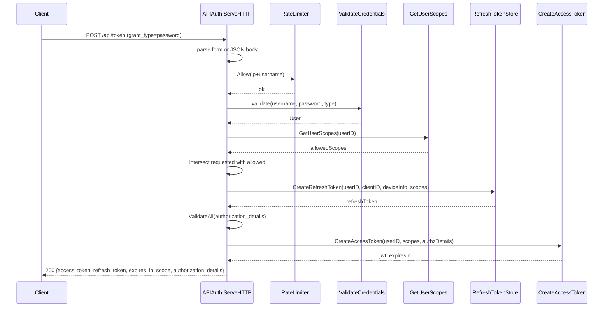
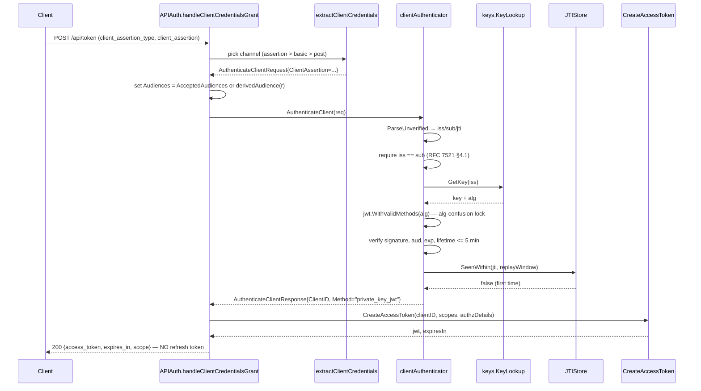
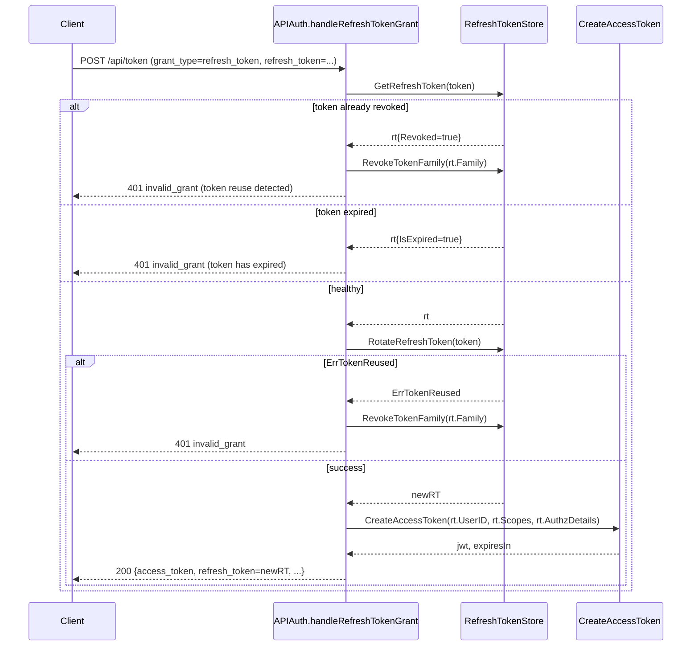
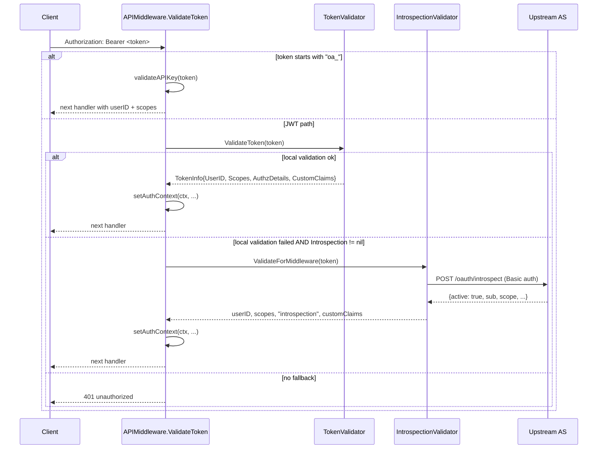
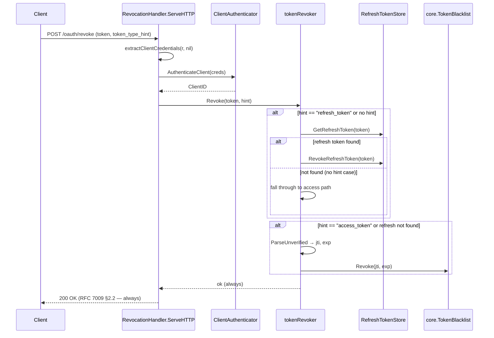

# apiauth

`apiauth` is OneAuth's API-token core. It owns every standard OAuth 2.0 grant served at `POST /api/token` (password, refresh_token, client_credentials, RFC 7523 `urn:...:jwt-bearer`, RFC 8693 `urn:...:token-exchange`), the three token-endpoint client-auth methods (`client_secret_basic`, `client_secret_post`, RFC 7523 §2.2 / OIDC Core §9 `private_key_jwt`), the resource-server `APIMiddleware` (JWT, API keys, introspection fallback), RFC 7662 introspection (both server and client sides), RFC 7009 revocation, RFC 8414 / OIDC discovery and the matching upstream-proxy bridge, RFC 9728 protected-resource metadata, and end-to-end RFC 9396 `authorization_details` plumbing. Two entry points coexist by design: the legacy `APIAuth` struct (still the production token-endpoint handler whose `ServeHTTP` dispatches all five grants) and the newer composition root `OneAuth` (built by `NewOneAuth`, the path new transports — gRPC, MCP — should adopt). The split is deliberate: every transport-independent interface (`TokenIssuer` / `TokenValidator` / `TokenIntrospector` / `TokenRevoker` / `ClientAuthenticator`) follows the gRPC-shape convention from issue 175 (`(ctx, *XRequest) → (*XResponse, error)`), and the HTTP handlers in this package are thin wrappers — refresh-token *creation* with transport metadata stays in `APIAuth` rather than being pushed into the core so device info / IP / user-agent leakage stops at the HTTP boundary.

## Contents

- [Entities](#entities)
- [Flows](#flows)
  - [Password grant via APIAuth](#password-grant-via-apiauth)
  - [client_credentials with private_key_jwt](#client_credentials-with-private_key_jwt)
  - [Refresh token rotation with theft detection](#refresh-token-rotation-with-theft-detection)
  - [Middleware token validation with introspection fallback](#middleware-token-validation-with-introspection-fallback)
  - [Token revocation](#token-revocation)
- [Gotchas](#gotchas)
- [Depends on](#depends-on)

## Entities

| Entity | Kind | Role | Why |
|---|---|---|---|
| `APIAuth` | struct | `/api/token` handler — `ServeHTTP` dispatches on `grant_type`, plus `CreateAccessToken` / `ValidateAccessToken` / `ValidateAccessTokenFull` and API-key + session management endpoints | Owns the legacy `/api/token` shape (form + JSON, rate limiting, custom claims, callbacks); still the production handler. |
| `APIMiddleware` | struct | Bearer-token middleware (`ValidateToken`, `RequireScopes`, `Optional`, `RequireAuthorizationDetails`) | Resource-server entry point; chains JWT (single- or multi-tenant), `oa_`-prefixed API keys, and `IntrospectionValidator` fallback. |
| `OneAuth` | struct | Transport-independent composition root with `Issuer` / `Validator` / `Introspector` / `Revoker` / `Authenticator` + shared `KeyStore` / `Blacklist` / `RefreshStore` + grouped `Hooks` | Issue 110's no-god-object refactor; `IntrospectionHTTPHandler` / `RevocationHTTPHandler` / `HTTPMiddleware` return thin HTTP wrappers. |
| `NewOneAuth` | func | Builds a fully wired `*OneAuth` from `OneAuthConfig` | Each composed implementation receives only the deps it actually needs. |
| `OneAuthConfig` | struct | Single config surface (KeyStore, signing key/alg, issuer/audience, expiry, Blacklist, RefreshStore, password-grant callbacks, Hooks) | Fans out into `NewJWTIssuer` / `NewJWTValidator` / `NewTokenRevoker` / `NewClientAuthenticator`. |
| `TokenIssuer` | interface | `CreateAccessToken` / `ClientCredentials` / `RefreshGrant` / `PasswordGrant` | gRPC-shape convention (issue 175); transport bindings call these instead of `APIAuth`. |
| `TokenValidator` | interface | `ValidateToken` / `CheckScopes` / `CheckAuthorizationDetails` | Shared by middleware and introspector. |
| `TokenIntrospector` | interface | RFC 7662 `Introspect` returning `{Active: false}` for any invalid token | Decouples introspection from the validation backend; in-process impl delegates to a `TokenValidator`. |
| `TokenRevoker` | interface | RFC 7009 `Revoke` with `token_type_hint` | Separates revocation policy from the HTTP wrapper. |
| `ClientAuthenticator` | interface | `AuthenticateClient` covering `client_secret_basic` / `client_secret_post` / `private_key_jwt` | Shared by token + introspection + revocation handlers via `extractClientCredentials`. |
| `TokenInfo` | struct | Validated claims: `UserID`, `Scopes`, `AuthorizationDetails`, `CustomClaims`, `AuthType` | Single shape consumed by middleware and the in-process introspector. |
| `jwtValidator` | type | Local JWT validator: resolves keys by `kid` then `client_id` claim; cross-checks kid owner vs claim; validates type/iss/aud/exp/blacklist | The kid-vs-`client_id`-claim cross-check prevents cross-app token forgery. |
| `NewJWTValidator` | func | Constructor for `jwtValidator` | Shared by `APIMiddleware` (lazy) and `OneAuth`. |
| `jwtIssuer` | type | `TokenIssuer` signing HS/RS/ES JWTs with `jti` + RFC 9396 `authorization_details` | Transport-free counterpart to `APIAuth.CreateAccessToken`. |
| `NewJWTIssuer` | func | Constructor for `jwtIssuer` | |
| `tokenRevoker` | type | `TokenRevoker` over `RefreshTokenStore` + `core.TokenBlacklist` | No hint → tries refresh first (cheaper), then access — matches RFC 7009's permissive behaviour. |
| `NewTokenRevoker` | func | Constructor for `tokenRevoker` | |
| `tokenIntrospector` | type | `TokenIntrospector` delegating to `TokenValidator`; re-parses raw JWT for the full RFC 7662 response | Keeps the local-introspection path consistent with middleware validation. |
| `NewTokenIntrospector` | func | Constructor for `tokenIntrospector` | |
| `clientAuthenticator` | type | `ClientAuthenticator` with secret (constant-time compare) and `private_key_jwt` (RFC 7523 §2.2 / OIDC Core §9) paths | Locks assertion algorithm via `jwt.WithValidMethods(rec.Algorithm)` — defeats CVE-2016-10555 alg-confusion. |
| `NewClientAuthenticator` | func | Builds the default authenticator with in-memory `JTIStore` | Wired by `NewOneAuth` and lazily cached inside `APIAuth.authenticateTokenEndpointClient` so the JTIStore survives across requests. |
| `NewClientAuthenticatorWithJTIStore` | func | Same but with a custom `JTIStore` | Multi-node deployments need cross-process `jti` replay protection. |
| `ClientAssertionTypeJWTBearer` | const | The `client_assertion_type` URN required by RFC 7521 §4.2 | Any other value is rejected. |
| `MaxClientAssertionLifetime` | const | 5-minute cap on `exp - iat` for client assertions | Bounds JTIStore memory; matches OIDC Core §9's "short-lived" hint. |
| `JTIStore` | interface | `SeenWithin(jti, lifetime) bool` (atomic check-and-set) | Swap-in seam for distributed `jti` replay protection. |
| `NewInMemoryJTIStore` | func | Lazy-GC, mutex-guarded default | No background goroutine — GC amortized into `SeenWithin`. |
| `TrustedAssertionIssuer` | struct | Upstream IdP for `jwt-bearer` and `token-exchange` grants — `Issuer`, `PublicKey` / `KeyFunc`, `Audiences`, `AcceptedAlgorithms` | `KeyFunc` enables JWKS-by-`kid` resolution; `AcceptedAlgorithms` locks out alg-confusion. |
| `JwtBearerGrantType` | const | `urn:ietf:params:oauth:grant-type:jwt-bearer` (RFC 7523 §2.1) | Distinct from RFC 7523 §2.2 client-auth assertions. |
| `TokenExchangeGrantType` | const | `urn:ietf:params:oauth:grant-type:token-exchange` (RFC 8693 §2.1) | Phase 1: JWT `subject_token` → access_token only. |
| `TokenTypeJWT` | const | `urn:ietf:params:oauth:token-type:jwt` | Only supported `subject_token_type`. |
| `TokenTypeAccessToken` | const | `urn:ietf:params:oauth:token-type:access_token` | Default `requested_token_type`. |
| `ASServerMetadata` | struct | RFC 8414 + OIDC Discovery document — `ClaimsSupported`, `AuthorizationDetailsTypesSupported`, `TokenEndpointAuthSigningAlgValuesSupported`, RFC 9207 `AuthorizationResponseIssParameterSupported` | Pointer-typed RFC 9207 flag distinguishes "advertised false" from "absent". |
| `NewASMetadataHandler` | func | Returns a pre-serialized AS metadata handler | Failure to marshal panics loudly at construction. |
| `MountASMetadata` | func | Registers the same handler at both well-known paths | OAuth-only and OIDC-only clients both auto-discover the AS. |
| `ASMetadataProxy` | struct | Lazy-fetching, TTL-cached proxy that fetches upstream metadata (RFC 8414 first, then OIDC) | Bridges OIDC-only providers (Keycloak) for clients (VS Code MCP) that only try RFC 8414. |
| `NewASMetadataProxy` | func | Constructor (default TTL 1 hour) | |
| `ProtectedResourceMetadata` | struct | RFC 9728 PRM — `Resource`, `AuthorizationServers`, scopes, token formats, signing algs, introspection endpoint | Lets clients discover which AS to trust before calling protected endpoints. |
| `NewProtectedResourceHandler` | func | HTTP handler for PRM JSON | |
| `MountProtectedResource` | func | Mounts the PRM well-known and optionally an AS-metadata proxy on the resource server | MCP-spec discovery workflow. |
| `IntrospectionHandler` | struct | `POST /oauth/introspect` (RFC 7662) over `TokenIntrospector` + `ClientAuthenticator` + `AcceptedAudiences` | `derivedAudience(r)` fallback only safe for single-host deployments. |
| `NewIntrospectionHandler` | func | Bridge constructor that adapts an `APIAuth` into the new interface-based handler | Lets legacy callers pick up `private_key_jwt` caller-auth automatically. |
| `RevocationHandler` | struct | `POST /oauth/revoke` (RFC 7009) — always 200 | Same `ClientAuthenticator` plumbing as introspection. |
| `NewRevocationHandler` | func | Bridge constructor over `APIAuth` | |
| `IntrospectionValidator` | struct | RFC 7662 client — POSTs the token to an upstream endpoint with Basic auth; optional response cache via `CacheTTL` | Middleware fallback when local JWT validation fails or when no key material is available. |
| `IntrospectionResult` | struct | Parsed RFC 7662 response | Single type returned by the local `TokenIntrospector` and the remote `IntrospectionValidator`. |
| `Hooks` | struct | Grouped lifecycle callbacks — `Token` / `Auth` / `Client` / `Security` | Avoids the "120-field hook struct" antipattern. |
| `TokenHooks` | struct | `OnIssued` / `OnRefreshed` / `OnRevoked` | |
| `AuthHooks` | struct | `OnLoginSuccess` / `OnLoginFailure` / `OnScopeStepUp` | |
| `ClientHooks` | struct | `OnRegistered` / `OnDeleted` / `OnKeyRotated` | |
| `SecurityHooks` | struct | `OnTokenRejected` / `OnBlacklistHit` / `OnAlgorithmMismatch` | `OnAlgorithmMismatch` flags CVE-2015-9235. |
| `CredentialsValidator` | type | Type alias re-exported from `accounts` for the password-grant validator | Cross-package assignability with `localauth` without conversion. |
| `GetUserIDFromAPIContext` | func | Retrieves the JWT subject from the request context | |
| `GetScopesFromAPIContext` | func | Retrieves granted scopes from the request context | |
| `GetAuthTypeFromAPIContext` | func | Retrieves `"jwt"` / `"api_key"` / `"introspection"` | Lets handlers behave differently for opaque API keys vs JWTs. |
| `GetCustomClaimsFromContext` | func | Retrieves non-standard JWT claims | |
| `GetAuthorizationDetailsFromContext` | func | Retrieves RFC 9396 `authorization_details` from the request context | Dedicated key (not the customClaims bag) so RAR is first-class. |
| `APIMiddleware.RequireAuthorizationDetails` | method | Middleware factory requiring `authorization_details` types | Type-level RAR enforcement — finer-grained than scopes. |

## Flows

### Password grant via APIAuth

### client_credentials with private_key_jwt

### Refresh token rotation with theft detection

### Middleware token validation with introspection fallback

### Token revocation

## Gotchas

- **`APIAuth` and `OneAuth` both exist by design.** `APIAuth.ServeHTTP` is still the production token endpoint. `OneAuth` (issue 110) is the new no-god-object composition root that wires the interface implementations. The HTTP introspection / revocation handlers in this package can be built either way — `NewIntrospectionHandler(auth, kl)` (legacy bridge) or `oa.IntrospectionHTTPHandler()` (new). New transports (gRPC, MCP) should call the interfaces directly, not `APIAuth`.

- **Token-endpoint client auth lives in a single helper.** `extractClientCredentials` is shared by the token, introspection, and revocation handlers. It picks the *strongest* credential channel present (`private_key_jwt` > `client_secret_basic` > `client_secret_post`) even when the caller violates RFC 6749 §2.3 by sending multiple. The `_post` path on the token endpoint also reads from the already-decoded `core.TokenRequest` when the request was JSON (since `http.Request.FormValue` can't see the JSON body).

- **`APIAuth.lazyAuthenticator` must be cached.** When `ClientAuthenticator` isn't wired but `ClientKeyStore` is, `APIAuth` lazily builds one — guarded by `sync.Once`. A fresh authenticator per request would mean a fresh in-memory `JTIStore`, defeating `jti` replay protection for `private_key_jwt` assertions. This is the one piece of mutable state in `APIAuth` that *cannot* be reset without breaking security.

- **`private_key_jwt` algorithm is locked at verification.** `clientAuthenticator.authenticateAssertion` calls `jwt.NewParser(jwt.WithValidMethods([]string{rec.Algorithm}))` — using only the algorithm the client registered. Without this, an attacker who knows a client registered RS256 could submit an HS256-signed assertion using the public key as the HMAC secret (CVE-2016-10555 class). The same defence applies in `jwtValidator.resolveKey` via the algorithm cross-check + `SecurityHooks.OnAlgorithmMismatch`.

- **`kid` resolution cross-checks `client_id`.** In `jwtValidator.resolveKey` (and the inline middleware fallback), once a key record is fetched by `kid`, its owning `ClientID` is compared against the token's `client_id` claim. If they disagree, the token is rejected — this stops app A from minting a token claiming to be app B by signing with its own key but setting a different `client_id`. The check is skipped when the key record has no `ClientID` (e.g., `JWKSKeyStore` which doesn't carry that metadata).

- **`JWTAudience` accepts both string and array `aud` claims.** `matchesAudience` handles `string`, `[]interface{}`, and `[]string` shapes (RFC 7519 §4.1.3, issue 52). Real-world IdPs differ — Keycloak emits arrays, others emit strings — so accepting both is required for interop.

- **`standardClaims` cannot be overridden by `CustomClaimsFunc`.** The standard JWT claims (`sub`, `iss`, `aud`, `exp`, `iat`, `type`, `scopes`, `jti`, `authorization_details`) are protected against host code that tries to inject them — overrides are logged and ignored. This is what lets `CustomClaimsFunc` be wired without auditing every host application.

- **`type` claim asymmetry.** OneAuth-minted tokens carry `"type": "access"` to prevent refresh tokens from being used as access tokens. External IdP tokens (Keycloak, Auth0) don't include this claim — the validators *only* reject if `type` is set to something other than `"access"`. Missing `type` is accepted. This is what makes the multi-tenant `KeyStore` path work with upstream IdPs.

- **Introspection fallback ordering.** `APIMiddleware.validateRequest` tries local JWT validation first; only if local validation fails (and `Introspection != nil`) does it call the upstream introspection endpoint. When local validation isn't even configured (no `JWTSecretKey`, no `KeyStore`), introspection becomes the *only* validation path. The `lazyValidator` in `APIMiddleware` is `nil` for the single-tenant `JWTSecretKey` case — `validateJWTInline` is the fallback because `jwtValidator` needs `kid`/`client_id` lookup that single-key configs don't provide.

- **`RevocationHandler` always returns 200.** RFC 7009 §2.2 explicitly forbids revealing whether a token existed — so even missing tokens, malformed JWTs, and unknown `jti` values return 200 OK. The only 401 path is failed *client* auth (which is per-RFC the correct response).

- **`token-exchange` is Phase 1.** Only `subject_token_type=urn:ietf:params:oauth:token-type:jwt` and `requested_token_type=urn:ietf:params:oauth:token-type:access_token` are honored; `audience` / `resource` parameters are accepted but currently *advisory* (logged so the gap is visible in production). The response shape includes the RFC 8693 §2.2-required `issued_token_type`, which is *not* in the standard `tokenResponse` helper — `handleTokenExchangeGrant` encodes the response inline.

- **`jwt-bearer` does not issue refresh tokens.** RFC 7523 treats the assertion itself as the renewable credential — the client re-presents a fresh assertion from the upstream IdP rather than holding a refresh token. Returning one would muddle session semantics. (Same for `client_credentials` — RFC 6749 §4.4.3 says SHOULD NOT.)

- **`MountProtectedResource` can proxy AS metadata.** When `proxyASMetadata=true`, the resource server registers an `ASMetadataProxy` at its own `/.well-known/oauth-authorization-server` for each upstream AS. This bridges OIDC-only providers (Keycloak) for clients that only try RFC 8414 (VS Code MCP). The proxy tries RFC 8414 first, then OIDC discovery — same fallback as `client.DiscoverAS`.

- **`ASMetadataProxy` is lazy.** Metadata isn't fetched at construction — only on the first request. Combined with the per-request TTL check (default 1 hour), startup is decoupled from upstream AS availability. A 502 propagates if upstream is unreachable on a cold cache.

- **`Audiences` on assertion auth is mandatory.** `clientAuthenticator.authenticateAssertion` returns an explicit error (not `invalid_client`) if `req.Audiences` is empty — that's a *handler misconfiguration*, not a client problem. Each HTTP handler (`APIAuth`, `IntrospectionHandler`, `RevocationHandler`) sets `creds.Audiences = AcceptedAudiences` or falls back to `derivedAudience(r)` (the request URL). The fallback only works for single-host deployments — production should populate `AcceptedAudiences` explicitly.

- **`MaxClientAssertionLifetime` is 5 minutes.** Both as a security cap (RFC 7523 §3 item 4) and as the upper bound on JTIStore memory growth. An assertion with `exp - iat > 5min` is rejected. Absent `iat` is treated as `exp - MaxClientAssertionLifetime` (i.e., assume the worst case). The JTIStore window is `exp + 30s skew` to outlive the assertion itself.

- **`__authz_details` is a private context-passing key.** `APIMiddleware` stashes RFC 9396 `authorization_details` under a `__`-prefixed key inside `customClaims` so `setAuthContext` can hoist it into a dedicated context value (and delete it from the bag) before handlers see it. This keeps the public `GetCustomClaimsFromContext` API clean — RAR is first-class via `GetAuthorizationDetailsFromContext`, not a custom claim.

- **Hooks groups are pointer-safe but not nil-safe at the field level.** `(*TokenHooks).fireOnIssued` checks `h != nil` and `h.OnIssued != nil` — both individual callbacks and the entire group can be absent. Callers wire only what they care about.

## Depends on

- [`accounts/`](../accounts/DESIGN.md) — `User`, `BasicUser`, `Identity`, `IdentityKey`, `DetectUsernameType`, `CredentialsValidator`
- [`admin/`](../admin/DESIGN.md) — `MintResourceToken`, `MintResourceTokenWithKey`, `AppQuota`
- [`core/`](../core/DESIGN.md) — `RefreshToken`, `TokenPair`, `TokenRequest`, `TokenError`, `RefreshTokenStore`, `APIKeyStore`, `TokenBlacklist`, `InMemoryBlacklist`, `RateLimiter`, `AuthorizationDetail`, `ValidateAll`, `GenerateSecureToken`, `GetUserScopesFunc`, `ParseScopes`, `JoinScopes`, `IntersectScopes`, `ContainsAllScopes`, `ScopeRead`, `ScopeWrite`, `ScopeProfile`, `ScopeOffline`, `ScopeAdmin`, `TokenExpiryAccessToken`, `TokenExpiryRefreshToken`, `ErrInvalidGrant`, `ErrTokenNotFound`, `ErrTokenReused`, `ErrAPIKeyNotFound`, `GetUserIDFromContext`, `SetUserIDInContext`
- [`keys/`](../keys/DESIGN.md) — `KeyRecord`, `KeyLookup`, `KeyStorage`, `InMemoryKeyStore`
- [`localauth/`](../localauth/DESIGN.md) — `LocalAuth`, `Credentials`, `ConsoleEmailSender`, `NewCredentialsValidator`, `NewCreateUserFunc`, `NewVerifyEmailFunc`, `NewUpdatePasswordFunc`
- [`stores/fs/`](../stores/fs/DESIGN.md) — `FSUserStore`, `FSIdentityStore`, `FSChannelStore`, `FSTokenStore`, `FSRefreshTokenStore`, `FSAPIKeyStore`
- [`utils/`](../utils/DESIGN.md) — `GenerateRSAKeyPair`, `GenerateECDSAKeyPair`, `ParsePrivateKeyPEM`, `ParsePublicKeyPEM`, `EncodePublicKeyPEM`, `DecodeVerifyKey`, `IsAsymmetricAlg`, `SigningMethodForAlg`, `ComputeKid`
