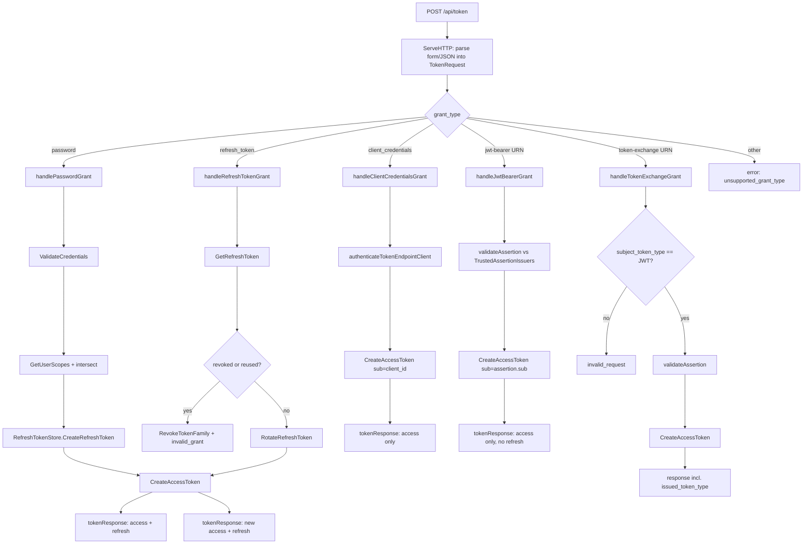
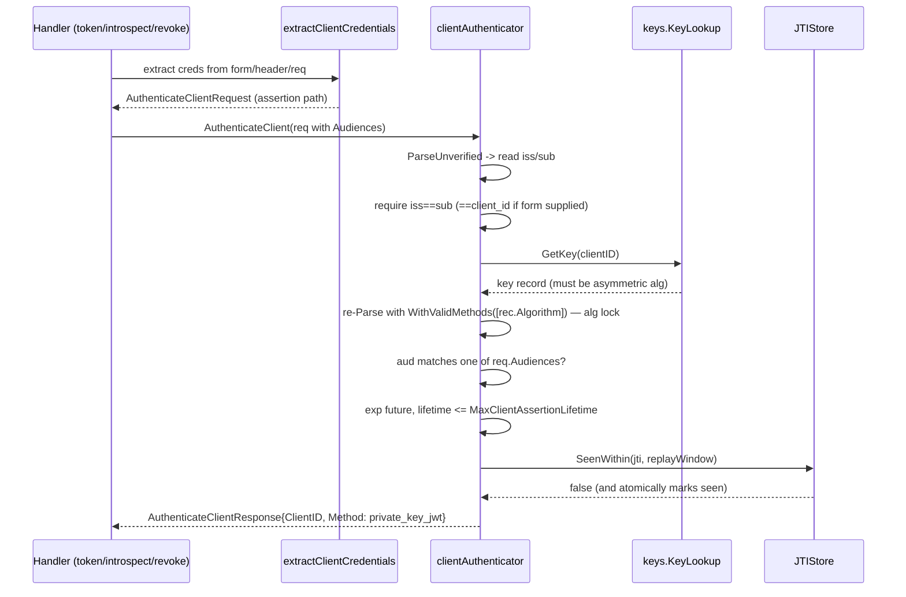
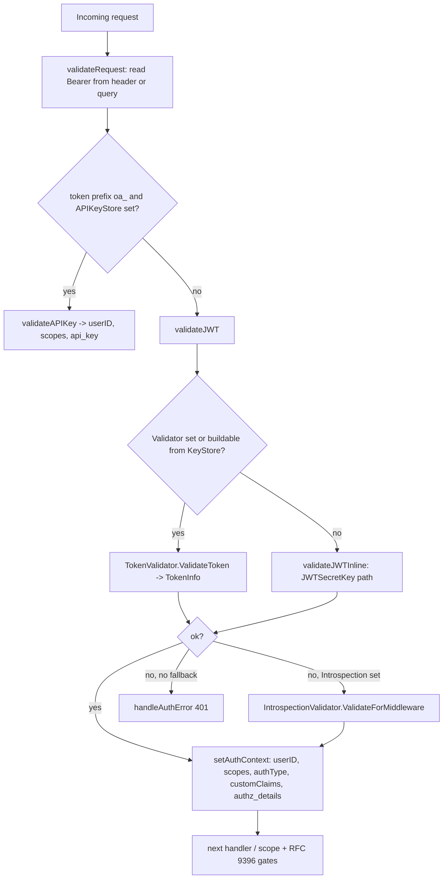
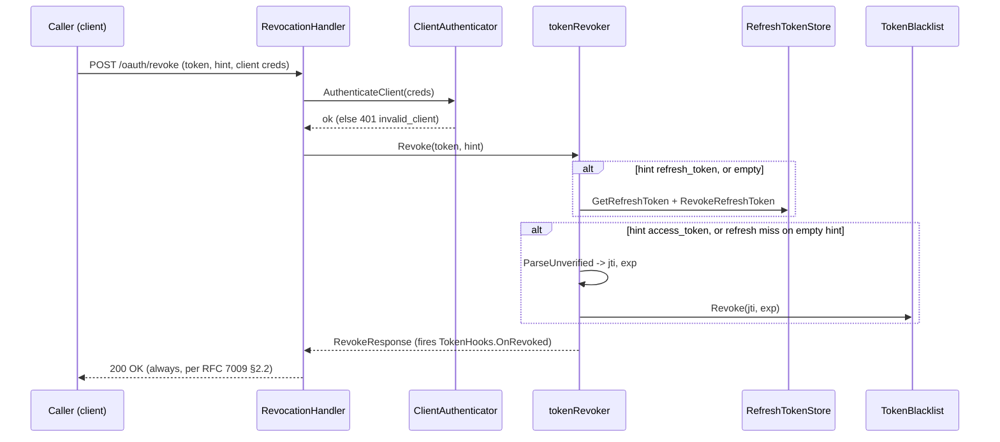

# apiauth — Flow Diagrams

Sequence diagrams for the non-trivial interactions in this package. Generated
by `/design-rebuild-go`; regenerate rather than hand-editing.

### Token endpoint grant dispatch (POST /api/token)

`APIAuth.ServeHTTP` parses the body (form or JSON) and dispatches on
`grant_type`. Each grant validates RFC 9396 `authorization_details` before
minting via `CreateAccessToken`.

### private_key_jwt client authentication (clientAuthenticator)

The assertion path of `AuthenticateClient`. Parsed once unverified to pick the
issuer/key, then re-parsed under a locked algorithm.

### Resource-server middleware validation (APIMiddleware)

`validateRequest` tries API key, then local JWT, then remote introspection.

### Token revocation (RevocationHandler + tokenRevoker)

