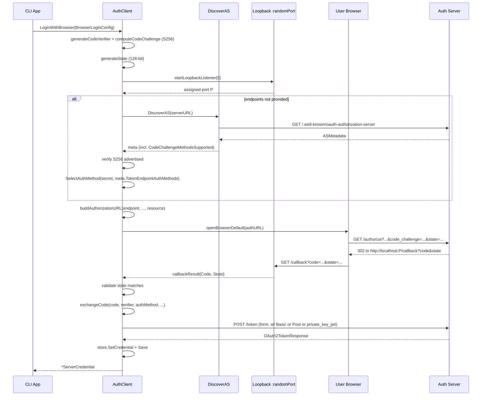
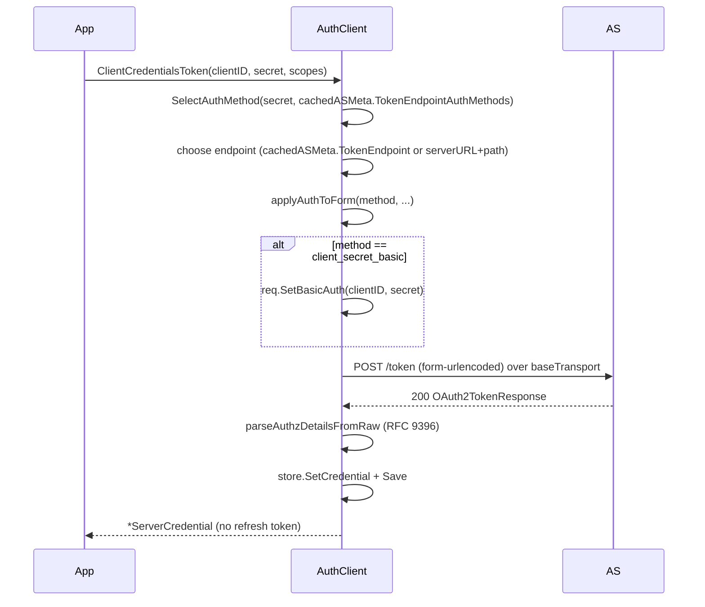
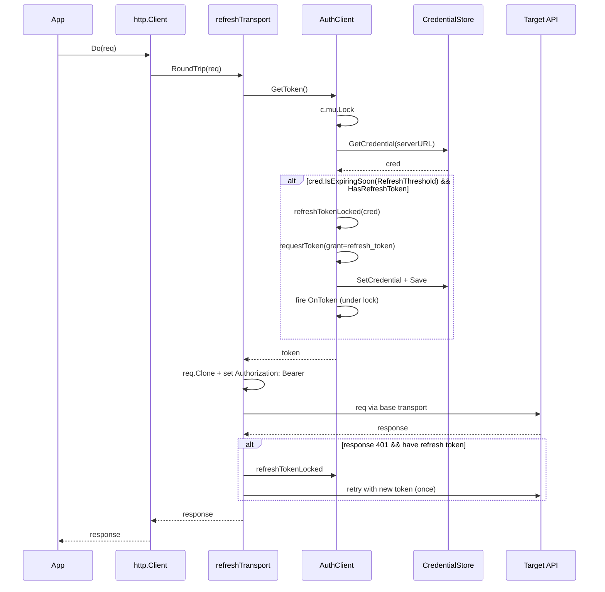
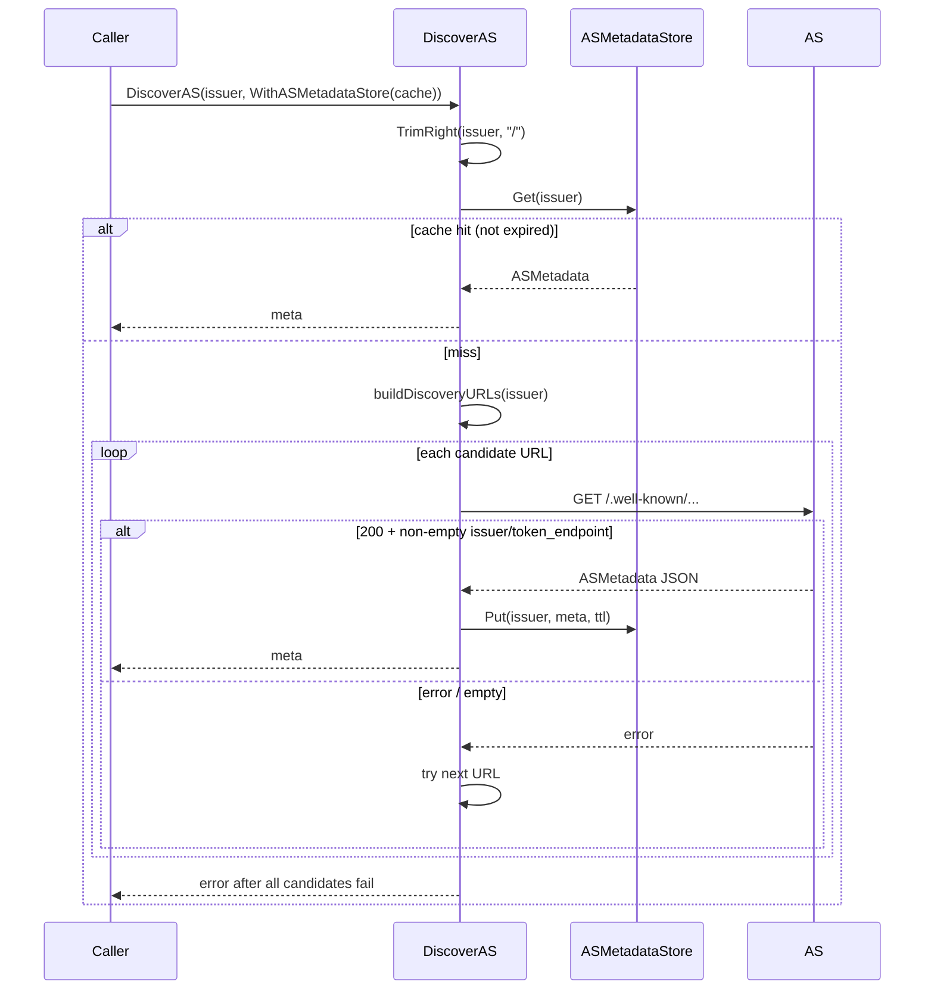
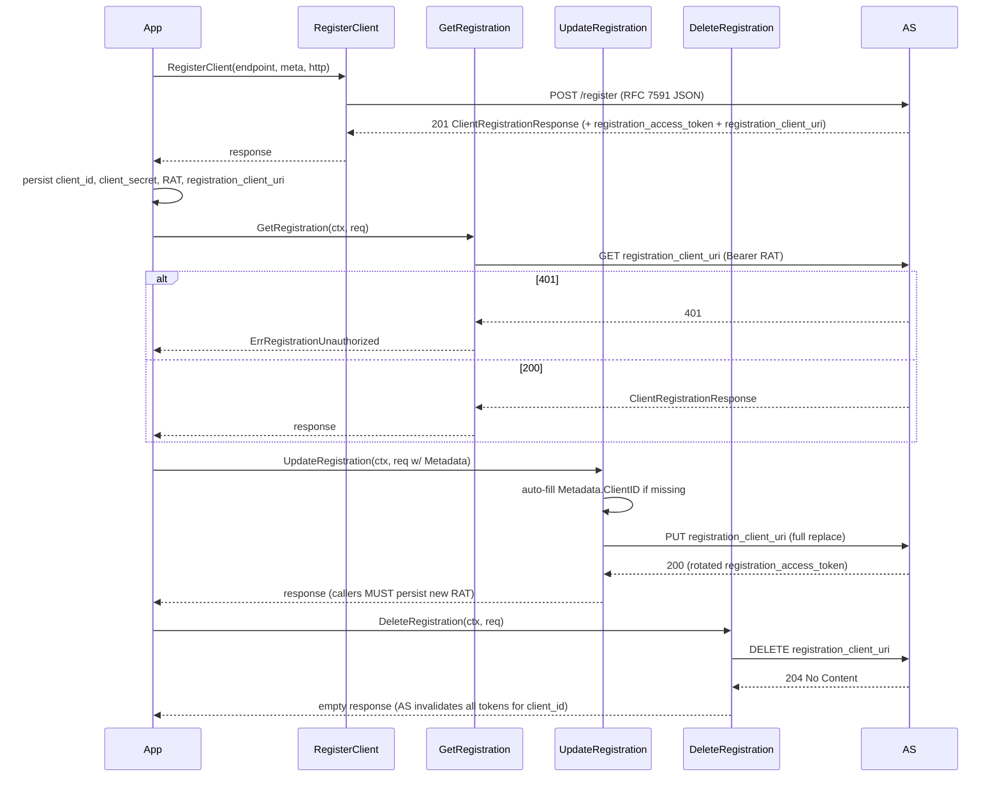

# client

Go SDK for talking to an OAuth 2.0 / OIDC authorization server. Owns server discovery (RFC 8414 + OIDC Discovery), the three login shapes a real client needs (browser + PKCE, machine-to-machine `client_credentials`, and the legacy username/password JSON path), token caching with refresh-on-expiry, transparent `Authorization: Bearer` injection into outbound HTTP, dynamic client registration management (RFC 7591/7592), and the helper types (`TokenSource`, `ClientCredentialsSource`) that mcpkit-style consumers plug into.

The package deliberately doesn't own credential persistence (that's `CredentialStore` implementations in `client/stores/`), AS-side issuance (that lives in `apiauth/`), or anything HS256 / introspection / revocation related — those are server concerns. It also doesn't try to be a full OIDC RP: there's no ID-token validation, userinfo, or session state. It's the client side of the token endpoint plus the minimum dance to get there.

## Contents

- [Entities](#entities)
- [Flows](#flows)
  - [Browser login (auth code + PKCE)](#browser-login-auth-code--pkce)
  - [client_credentials acquisition](#client_credentials-acquisition)
  - [private_key_jwt client authentication](#private_key_jwt-client-authentication)
  - [Transparent token refresh on HTTP request](#transparent-token-refresh-on-http-request)
  - [AS discovery with shared cache](#as-discovery-with-shared-cache)
  - [ClientCredentialsSource with proactive refresh](#clientcredentialssource-with-proactive-refresh)
  - [Dynamic client registration lifecycle](#dynamic-client-registration-lifecycle)
- [Gotchas](#gotchas)
- [Depends on](#depends-on)

## Entities

| Entity | Kind | Role | Why |
|---|---|---|---|
| `AuthClient` | struct | HTTP client bound to one server URL with automatic token storage, refresh, and login flows. | Central type that wires `CredentialStore`, the auth-injecting transport, and token-endpoint calls. |
| `NewAuthClient` | func | Constructs an `AuthClient`, normalizing the server URL and wrapping the base transport with `refreshTransport`. | A nil store becomes a no-op store so single-shot login flows work without persistence. |
| `ClientOption` | type | Functional option for `AuthClient`. | Enables `WithTokenEndpoint`, `WithHTTPClient`, `WithTransport`, `WithASMetadata` without expanding the constructor. |
| `WithTokenEndpoint` | func | Overrides the default `/auth/cli/token` path. | Lets callers point at non-default token URLs (e.g. `/oauth/token`). |
| `WithHTTPClient` | func | Adopts a user `*http.Client`'s transport plus timeout / redirect / jar. | Preserves TLS, timeout, and cookie configuration while still wrapping for auth. |
| `WithTransport` | func | Sets a custom base `http.RoundTripper`. | Lets callers plug in pools, proxies, or test transports without losing auth wrapping. |
| `WithASMetadata` | func | Pre-populates cached AS discovery metadata. | Skips a redundant discovery round-trip and feeds `SelectAuthMethod`. |
| `AuthClient.HTTPClient` | method | Returns the auth-injecting `*http.Client`. | Drop-in `*http.Client`; Bearer header and refresh are transparent. |
| `AuthClient.ServerURL` | method | Returns the normalized server URL. | Used as the `CredentialStore` key — exposed for diagnostics. |
| `AuthClient.GetToken` | method | Returns the current access token, refreshing if within `RefreshThreshold`. | Single read path used by `refreshTransport` before every request. |
| `AuthClient.GetCredential` | method | Returns the raw stored `ServerCredential`. | Lets callers inspect refresh token, scope, expiry, or RFC 9396 details. |
| `AuthClient.Login` | method | OAuth `password` grant against the legacy JSON `/auth/cli/token` endpoint. | First-party username/password login for OneAuth's own server. |
| `AuthClient.ClientCredentialsToken` | method | RFC 6749 §4.4 `client_credentials` grant with form-encoded body and negotiated client auth. | M2M token acquisition that respects AS-advertised auth methods. |
| `AuthClient.ClientCredentialsTokenWithAssertion` | method | `client_credentials` variant using `private_key_jwt`. | Strongest standard client auth — no shared secret to leak. |
| `AuthClient.LoginWithBrowser` | method | RFC 8252 + RFC 7636 authorization-code-with-PKCE flow with loopback callback. | CLI/headless apps still need user-context tokens. |
| `AuthClient.Logout` | method | Removes the credential for this server and persists. | Local logout — no server-side revocation implied. |
| `AuthClient.IsLoggedIn` | method | Reports whether a non-expired credential exists. | Cheap UI/CLI check that doesn't trigger a refresh. |
| `AuthClient.OnToken` | field | Callback fired after a successful `refresh_token` grant. | External persistence + metrics hook; only the auto-refresh path fires it. |
| `refreshTransport` | struct | `RoundTripper` that fetches the token, sets Bearer, and retries once on 401 after refresh. | Makes auth invisible to callers. |
| `AuthClient.refreshTokenLocked` | method | Exchanges the stored refresh token for a new credential and persists it. | Single chokepoint for refresh — keeps lock contract and `OnToken` ordering consistent. |
| `OAuth2TokenRequest` | struct | JSON body shape for the legacy `/auth/cli/token` endpoint. | JSON path stays separate from the form path so they can't drift. |
| `OAuth2TokenResponse` | struct | Parsed token endpoint response. | Single shape lets both JSON and form paths share the decode + error mapping. |
| `parseAuthzDetailsFromRaw` | func | Re-marshals raw `authorization_details []any` into typed `core.AuthorizationDetail`. | Avoids leaking `core` types into the wire struct while round-tripping RFC 9396. |
| `RefreshThreshold` | const | 5-minute window before expiry that triggers proactive refresh. | Keeps refresh decisions in one place. |
| `ServerCredential` | struct | Token bundle (access + refresh + scope + RFC 9396 details + expiry) persisted per server URL. | One value handed to callers, the store, and `OnToken`. |
| `ServerCredential.IsExpired` | method | Reports whether `ExpiresAt` is in the past. | Hot-path check used everywhere. |
| `ServerCredential.IsExpiringSoon` | method | Reports whether the token will expire within a window. | Drives proactive refresh inside `RefreshThreshold`. |
| `ServerCredential.HasRefreshToken` | method | Reports whether a refresh token is available. | Skips refresh attempts for grants that don't issue one. |
| `CredentialStore` | interface | Persistence contract — get/set/remove a credential keyed by server URL, plus `Save` and `ListServers`. | Lets callers swap in file, keychain, or test stores. |
| `noopCredentialStore` | struct | `CredentialStore` that silently discards writes. | Default when `NewAuthClient` is called with nil. |
| `TokenSource` | interface | `Token() (string, error)`. | Decouples consumers from any particular OAuth grant; structurally compatible with mcpkit. |
| `ScopeAwareTokenSource` | interface | `TokenSource` + `TokenForScopes`. | Lets resource clients request elevated scopes on demand. |
| `ClientCredentialsSource` | struct | `TokenSource` impl that caches a `client_credentials` token and refreshes on expiry. | Standard M2M entry point — drop-in for any `TokenSource` consumer. |
| `ClientCredentialsSource.Token` | method | Returns cached token if still valid (30s skew buffer) or fetches a new one. | Hot-path read; also lazily starts the background refresher. |
| `ClientCredentialsSource.TokenForScopes` | method | Invalidates the cache, unions extra scopes, fetches a fresh token. | Scope step-up entry point. |
| `ClientCredentialsSource.Close` | method | Stops the background refresh goroutine; safe to call multiple times. | `io.Closer` compliance for long-lived processes. |
| `ClientCredentialsSource.fetchTokenLocked` | method | Lazily constructs the underlying `AuthClient` and calls `ClientCredentialsToken`. | Atomic fetch + cache update; returns the cred so `OnToken` fires outside the lock. |
| `ClientCredentialsSource.backgroundRefresh` | method | Goroutine sleeping until (expiry − `Refresher.Buffer`) then refreshing. | Tail-latency hiding for predictable token rotation. |
| `ClientCredentialsSource.OnToken` | field | Callback fired after every successful fetch. | External persistence without implementing the full `CredentialStore`. |
| `ProactiveRefresher` | struct | Buffer policy + runtime state for the background refresh goroutine. | Bundles policy + lifecycle; makes lazy goroutine start explicit. |
| `tokenExpiryBuffer` | const | 30s subtracted from expiry in the freshness check. | Absorbs clock skew + network latency. |
| `ASMetadata` | struct | Parsed RFC 8414 / OIDC Discovery 1.0 AS metadata. | One typed shape used by discovery, the cache, and auth-method negotiation. |
| `DiscoverAS` | func | Fetches AS metadata, trying RFC 8414 then OIDC Discovery (path-aware). | Single entry point abstracting over the two conflicting well-known specs. |
| `DiscoveryOption` | type | Functional option for `DiscoverAS`. | Lets callers share a cache across token sources. |
| `WithHTTPClientForDiscovery` | func | Plugs a custom HTTP client into `DiscoverAS`. | Composable without exposing internal config. |
| `WithASMetadataStore` | func | Enables caching via an `ASMetadataStore`. | Opt-in dedup of discovery fetches across N sources sharing one AS. |
| `WithASCacheTTL` | func | Overrides the cache TTL for one `DiscoverAS` call. | Tighten freshness without touching the store's default. |
| `buildDiscoveryURLs` | func | Constructs the ordered list of well-known URLs to try. | Centralizes path-handling rules. |
| `splitOriginPath` | func | Splits an issuer URL into origin and path. | RFC 8414 vs OIDC Discovery differ on path placement — quirk lives here. |
| `fetchMetadata` | func | One GET + JSON decode + sanity check. | Lets `DiscoverAS` iterate over candidate URLs cleanly. |
| `ASMetadataStore` | interface | Concurrency-safe cache of `ASMetadata` keyed by issuer URL with TTL. | Decouples `DiscoverAS` from a concrete cache implementation. |
| `MemoryASMetadataStore` | struct | In-memory store backed by `sync.RWMutex` map with lazy TTL eviction. | Single-process default; no goroutines to manage. |
| `NewMemoryASMetadataStore` | func | Constructs a `MemoryASMetadataStore`. | One-line wiring for the common case. |
| `cachedAS` | struct | Internal entry pairing metadata with expiry. | Keeps the map's value type self-describing. |
| `DefaultASCacheTTL` | const | One-hour default TTL. | AS metadata changes rarely. |
| `TokenEndpointAuthMethod` | type | Enum of token endpoint auth methods. | RFC 6749 §2.3 / RFC 8414 vocabulary, typed to prevent drift. |
| `AuthMethodNone` | const | Public client — no secret. | Native/SPA + PKCE clients legitimately lack a secret. |
| `AuthMethodClientSecretPost` | const | Credentials in form body. | Required by some AS implementations. |
| `AuthMethodClientSecretBasic` | const | HTTP Basic auth in the Authorization header. | RFC 6749 §2.3.1 default; credentials stay out of the body. |
| `AuthMethodPrivateKeyJWT` | const | Client signs a JWT as `client_assertion`. | Strongest standard method. |
| `SelectAuthMethod` | func | Picks the best supported method given a secret + AS-advertised list. | One source of truth for negotiation. |
| `applyAuthToForm` | func | Writes client-auth parameters onto a `url.Values`. | Pairs with `req.SetBasicAuth` so creds never leak into both header and body. |
| `ClientAssertionConfig` | struct | Private key, alg, optional `kid`, lifetime for `client_assertion`. | One value threaded through browser login and `client_credentials`. |
| `MintClientAssertion` | func | Signs a fresh JWT (`iss`/`sub`=clientID, `aud`=endpoint, random `jti`, short `exp`). | Centralizes claim shape so every call site is spec-compliant. |
| `applyAssertionToForm` | func | Writes `client_id`, `client_assertion_type`, `client_assertion`. | Mirrors `applyAuthToForm` so `private_key_jwt` looks the same at call sites. |
| `randomJTI` | func | 128-bit random `jti` (base64-RawURL). | Single-use assertions for AS replay protection. |
| `DefaultClientAssertionLifetime` | const | 60s assertion lifetime. | OIDC Core §9 short-lived recommendation. |
| `BrowserLoginConfig` | struct | All inputs to `LoginWithBrowser`. | One struct beats a growing positional signature. |
| `exchangeCodeParams` | struct | Internal bundle of inputs to `AuthClient.exchangeCode`. | Same rationale as `BrowserLoginConfig`. |
| `AuthClient.exchangeCode` | method | Exchanges an auth code for tokens using the negotiated client auth. | Single chokepoint for the code → token step. |
| `buildAuthorizationURL` | func | Composes `/authorize` URL with PKCE, state, scopes, optional resource. | Keeps query-param ordering consistent. |
| `startLoopbackListener` | func | Opens a TCP listener on `localhost:<port>`. | RFC 8252 native-app redirect target. |
| `generateState` | func | 128-bit random `state` for CSRF protection. | Required by RFC 6749 §10.12. |
| `generateCodeVerifier` | func | 256-bit random PKCE verifier (RFC 7636 §4.1). | 32 bytes → 43 base64url chars; hits the spec minimum without padding. |
| `computeCodeChallenge` | func | SHA-256 of the verifier, base64-RawURL. | PKCE S256 — only place the hash is computed. |
| `containsString` | func | Linear lookup helper. | One-off used to verify `S256` is advertised. |
| `FollowRedirects` | func | Returns an `OpenBrowser` function that GETs the auth URL via an HTTP client. | Headless CI / conformance / test — same loopback dance, no real browser. |
| `openBrowserDefault` | func | Platform-aware browser launcher (`open` / `xdg-open` / `rundll32`). | Default `OpenBrowser` so the common case needs no config. |
| `callbackResult` | struct | Result delivered onto the result channel by the loopback handler. | Either-or shape keeps the caller's `select` clean. |
| `AuthTransport` | struct | Standalone `RoundTripper` that injects a static Bearer token. | Lightweight escape hatch when refresh isn't needed. |
| `NewAuthTransport` | func | `AuthTransport` over `http.DefaultTransport`. | Common-case helper. |
| `NewAuthTransportWithBase` | func | `AuthTransport` with a caller-supplied base. | Keep your own pool/proxy settings. |
| `AuthTransport.RoundTrip` | method | Clones the request and sets the Bearer header. | Clone-before-mutate per `http.RoundTripper` contract. |
| `ClientRegistrationRequest` | struct | RFC 7591 DCR / RFC 7592 update body. | One struct for both register and update. |
| `ClientRegistrationResponse` | struct | Parsed DCR response including RFC 7592 management credentials. | Lets callers plug straight into `GetRegistration` / `UpdateRegistration` / `DeleteRegistration`. |
| `RegisterClient` | func | POST RFC 7591 registration to the DCR endpoint. | Pre-convention helper sufficient for one-shot registration. |
| `GetRegistration` | func | RFC 7592 §2.1 GET against the management endpoint. | gRPC-shape `(ctx, *Req) → (*Resp, err)`. |
| `GetRegistrationRequest` | struct | Inputs (URI, token, optional HTTPClient). | HTTPClient lives on the request (gRPC-CallOption analog). |
| `GetRegistrationResponse` | struct | Wraps the parsed registration. | Wrapper preserves headroom for future fields. |
| `UpdateRegistration` | func | RFC 7592 §2.2 full-replace PUT. | Surfaces the AS-rotated `registration_access_token`. |
| `UpdateRegistrationRequest` | struct | Inputs + full replacement metadata. | `ClientID` mandatory per RFC 7592 §2.2; auto-filled into metadata. |
| `UpdateRegistrationResponse` | struct | Wraps the post-update registration. | Same wrapping rationale. |
| `DeleteRegistration` | func | RFC 7592 §2.3 DELETE. | AS invalidates all tokens issued for the `client_id`. |
| `DeleteRegistrationRequest` | struct | Inputs to delete. | Stays in the `(ctx, *Req)` shape. |
| `DeleteRegistrationResponse` | struct | Intentionally empty (AS returns 204). | Preserves the convention. |
| `ErrRegistrationUnauthorized` | var | Sentinel returned on 401 from RFC 7592 management calls. | Lets callers `errors.Is` to detect token-rotation drift. |
| `ValidateHTTPS` | func | Checks AS endpoints use HTTPS (localhost exempt). | RFC 6749 §3.1.2.1. |
| `IsLocalhost` | func | True for `localhost` / `127.0.0.1` / `::1`. | One definition of "loopback". |
| `ValidateCIMDURL` | func | Checks Client ID Metadata Document URLs (HTTPS + non-root path). | Encodes the draft CIMD rules. |

## Flows

### Browser login (auth code + PKCE)



### client_credentials acquisition



### private_key_jwt client authentication

```mermaid
sequenceDiagram
    participant App
    participant AC as AuthClient
    participant Mint as MintClientAssertion
    participant AS

    App->>AC: ClientCredentialsTokenWithAssertion(clientID, ClientAssertionConfig, scopes)
    AC->>AC: pick audience = cachedASMeta.TokenEndpoint or serverURL+path
    AC->>Mint: MintClientAssertion(clientID, audience, cfg)
    Mint->>Mint: randomJTI; iss/sub=clientID; iat/exp(=now+Lifetime)
    Mint->>Mint: sign w/ cfg.PrivateKey + cfg.SigningAlg (RS256/ES256)
    Mint-->>AC: compact JWS
    AC->>AC: applyAssertionToForm(clientID, jws, data)
    AC->>AS: POST /token (form, client_assertion_type + client_assertion)
    AS-->>AC: 200 OAuth2TokenResponse
    AC-->>App: *ServerCredential
```

### Transparent token refresh on HTTP request



### AS discovery with shared cache



### ClientCredentialsSource with proactive refresh

```mermaid
sequenceDiagram
    participant Consumer
    participant S as ClientCredentialsSource
    participant BG as backgroundRefresh goroutine
    participant AC as AuthClient
    participant CB as OnToken

    Consumer->>S: Token()
    alt Refresher.Buffer > 0
        S->>S: once.Do — start BG
        S->>BG: go backgroundRefresh()
    end
    S->>S: mu.Lock
    alt token cached && now+30s < expiry
        S-->>Consumer: cached token
    else
        S->>AC: ClientCredentialsToken(...)
        AC-->>S: *ServerCredential
        S->>S: token=cred.AccessToken; expiry=cred.ExpiresAt
        S->>S: mu.Unlock
        S->>CB: fireOnToken (copy, outside lock)
        S-->>Consumer: cred.AccessToken
    end

    loop while !stopped
        BG->>BG: sleep min(minWait, expiry - Buffer)
        alt now > expiry - Buffer
            BG->>AC: ClientCredentialsToken(...)
            alt success
                BG->>S: update token + expiry
                BG->>CB: fireOnToken
            else failure
                BG->>BG: log; fall through to reactive
            end
        end
    end

    Consumer->>S: Close()
    S->>BG: close(stop) — Close is idempotent
```

### Dynamic client registration lifecycle



## Gotchas

- **`OnToken` runs while `AuthClient.mu` is held** — the refresh-grant callback fires from inside `refreshTokenLocked`, which is invoked under `c.mu`. If the callback re-enters any `AuthClient` method that takes that mutex (`GetToken`, `Login`, `Logout`, `IsLoggedIn` via the path that locks, etc.) the goroutine deadlocks. The doc on the field calls this out — keep callbacks lightweight and non-blocking. `ClientCredentialsSource.OnToken` has the opposite contract (fired outside the source's mutex), so don't carry the wrong assumption across the two callbacks.

- **`refreshTransport` retries 401 exactly once, with a tiny race window** — when a 401 comes back the transport locks `c.mu`, refreshes, unlocks, then calls `GetToken` again before retrying. Another goroutine can squeeze in between unlock and `GetToken` and refresh the credential again; the second refresh will succeed but it's a wasted network round-trip. Tolerable because 401s are rare on the hot path, but worth knowing if you're hammering the same client from many goroutines.

- **`Login` / `LoginWithBrowser` / `ClientCredentialsToken*` don't fire `OnToken`** — only the automatic refresh path does. Initial logins return the credential to the caller, who is expected to persist it themselves (the store call inside the login method already did). If you've wired `OnToken` to side-effects like metrics or external persistence, remember to do an equivalent action on the credential the login method returns.

- **Two token-request code paths, one for JSON and one for forms** — `requestToken` posts JSON to `c.serverURL + c.tokenEndpoint` (the OneAuth-native `/auth/cli/token` shape used by `Login` + refresh). `requestTokenForm` / `requestTokenFormWithAssertion` post `application/x-www-form-urlencoded` to the (possibly discovered) token endpoint, which is the RFC-correct path. The two share `OAuth2TokenResponse` parsing but not the request side — adding a new grant means picking the right one. New OAuth-spec work goes through the form path.

- **`private_key_jwt` audience varies by AS** — `MintClientAssertion` puts the token endpoint URL into `aud`. OIDC Core §9 says the AS *should* accept the token endpoint as a valid audience identifier; OneAuth's server accepts either the token endpoint or the issuer. Third-party ASes are stricter (Auth0 wants the issuer, Keycloak the endpoint), so when integrating with one of those you may need to override the audience by passing a pre-computed endpoint into `ClientCredentialsTokenWithAssertion` (it uses `cachedASMeta.TokenEndpoint` when present).

- **Discovery has two well-known shapes, tried in order** — for a plain origin we try `/.well-known/oauth-authorization-server` first, then `/.well-known/openid-configuration`. For an issuer with a path (`https://host/tenant1`) we try `/.well-known/oauth-authorization-server/tenant1` (RFC 8414) then `/tenant1/.well-known/openid-configuration` (OIDC Discovery). The first 200 with a non-empty issuer or token endpoint wins. If your AS only serves one shape make sure you know which — and if you're hitting Keycloak realms remember the realm path is part of the issuer URL.

- **`MemoryASMetadataStore` evicts lazily on Get only** — there's no background sweeper. Expired entries sit in the map until something asks for them. Fine for bounded workloads (one entry per unique issuer URL) but if you're synthesizing thousands of distinct issuer URLs in a test, the map will grow.

- **`ProactiveRefresher.Close` must be idempotent because `Token()` may never have been called** — the stop channel is created lazily inside `Token()`'s `once.Do`. `Close` guards on `closed` to avoid the double-close panic. The same flag also short-circuits subsequent `Close` calls. After `Close`, the source still serves reactive refreshes — closing only stops the proactive goroutine.

- **`ServerCredential.IsExpired` uses local wall-clock time** — no skew handling. The 30-second `tokenExpiryBuffer` in `ClientCredentialsSource` is the only place we account for clock drift; `AuthClient.GetToken` relies on `IsExpired` + `IsExpiringSoon(RefreshThreshold)` and trusts that 5 minutes of headroom is enough to outlast typical skew + network RTT. Heavily-skewed clients will see "valid" tokens rejected by the AS — fix the client clock.

- **`refreshTransport` uses the base transport for token requests, not the wrapped one** — `requestToken` and `executeTokenRequest` explicitly construct an `http.Client{Transport: c.baseTransport}` so the token endpoint isn't itself Bearer-authenticated by a stale token. If you wrap the AuthClient's HTTP client in another auth layer outside, that outer layer is bypassed too — by design, but surprising the first time you debug it.

- **RFC 7592 token rotation is mandatory** — `UpdateRegistration` *must* persist the new `registration_access_token` in the response before discarding the old one. Forget this and the next management call gets `ErrRegistrationUnauthorized`. The response type wraps the registration specifically to make the new token impossible to miss.

- **`ErrRegistrationUnauthorized` is fuzzy on purpose** — the AS returns 401 for wrong token, missing token, or unknown `client_id` — same status, no discriminator. Callers cannot distinguish those cases from this error alone; treat it as "your management credentials are no longer valid, re-register or re-fetch them" and move on.

- **`LoginWithBrowser` only enforces PKCE S256 when it ran discovery itself** — if you pass explicit `AuthorizationEndpoint` + `TokenEndpoint`, the check against `code_challenge_methods_supported` is skipped, because the caller has already decided what the AS supports. Combined with `TokenEndpointAuthMethods` (which carries the same caller-supplied negotiation hint for the token endpoint), this lets MCP-style PRM-then-AS flows skip a second discovery round-trip while still picking the right auth method.

- **The static `AuthTransport` is a footgun for long-lived processes** — it captures a single token at construction and never refreshes. Use it when you have a short-lived token and a short-lived job; for anything that runs longer than the token's lifetime, use `AuthClient.HTTPClient` or thread a `TokenSource.Token()` call into your request builder.

## Depends on

- [`../core/`](../core/DESIGN.md) — `core.AuthorizationDetail` is the typed shape on `ServerCredential.AuthorizationDetails`, `ClientCredentialsSource.AuthorizationDetails`, and the slice rebuilt by `parseAuthzDetailsFromRaw` for RFC 9396 round-tripping; `core.UnionScopes` powers `ClientCredentialsSource.TokenForScopes` so step-up calls merge with the source's existing scope set.
- [`../utils/`](../utils/DESIGN.md) — `utils.SigningMethodForAlg` resolves `ClientAssertionConfig.SigningAlg` to a `jwt.SigningMethod` inside `MintClientAssertion`, so `private_key_jwt` works for any supported alg without duplicating the alg → method mapping.
