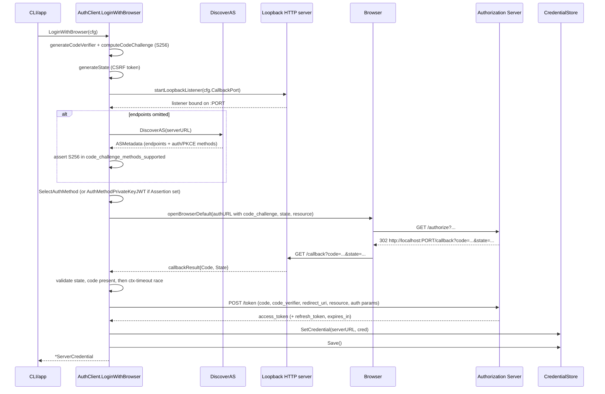
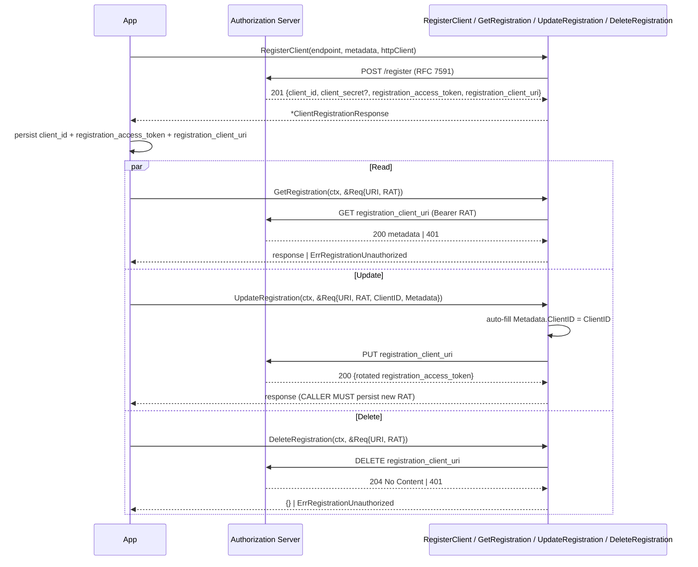
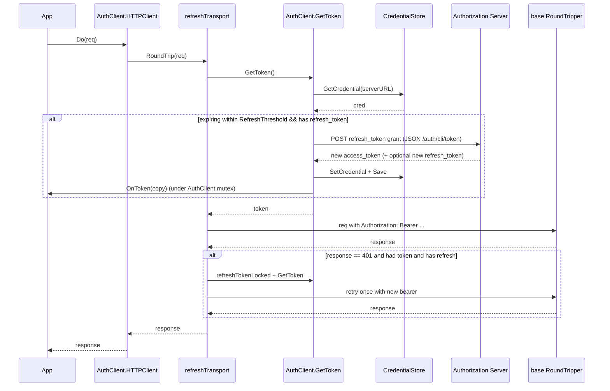

# client

Client-side OAuth SDK for OneAuth. Discovers authorization servers (RFC 8414 / OIDC), drives the three login flows applications actually need — browser code+PKCE for humans (RFC 8252 + RFC 7636), client_credentials for machines (RFC 6749 §4.4), and dynamic client registration (RFC 7591 / RFC 7592) for bootstrap — then caches the resulting tokens and injects them into outbound HTTP requests via a transparent `http.RoundTripper`. The package is deliberately split into two layers: a user-facing `AuthClient` bound to one server URL with auto-refresh, and a leaner `ClientCredentialsSource` purpose-built for hot-path M2M callers that just want a `Token()` method with optional proactive refresh.

## Contents

- [Entities](#entities)
- [Flows](#flows)
  - [Browser login (authorization code + PKCE)](#browser-login-authorization-code--pkce)
  - [Client credentials grant with auth-method negotiation](#client-credentials-grant-with-auth-method-negotiation)
  - [Dynamic client registration and management](#dynamic-client-registration-and-management)
  - [AS discovery cache lifecycle](#as-discovery-cache-lifecycle)
  - [Transparent refresh on every HTTP request](#transparent-refresh-on-every-http-request)
- [Gotchas](#gotchas)
- [Depends on](#depends-on)

## Entities

| Entity | Kind | Role | Why |
|---|---|---|---|
| `AuthClient` | struct | HTTP client bound to one server URL with automatic token storage, refresh, and login flows. | Central type wiring `CredentialStore`, auth-injecting transport, and token-endpoint calls together. |
| `NewAuthClient` | func | Constructs an `AuthClient`, normalizing the server URL and wrapping the base transport with `refreshTransport`. | A nil store becomes a no-op store so single-shot login flows work without persistence. |
| `ClientOption` | type | Functional option for `AuthClient`. | Enables `WithTokenEndpoint`, `WithHTTPClient`, `WithTransport`, `WithASMetadata` without expanding the constructor. |
| `WithTokenEndpoint` | func | Sets a custom token endpoint path on `AuthClient`. | Lets callers point at non-default token URLs (e.g. `/oauth/token`). |
| `WithHTTPClient` | func | Copies timeout / redirect / jar from a user-supplied `http.Client` and adopts its transport. | Preserves user TLS, timeout, and cookie config while still wrapping for auth. |
| `WithTransport` | func | Sets a custom base `http.RoundTripper`. | Plug in connection pools, proxies, or test transports without losing auth wrapping. |
| `WithASMetadata` | func | Pre-populates cached AS discovery metadata on the `AuthClient`. | Skips a redundant discovery round-trip and feeds `SelectAuthMethod` for `client_credentials`. |
| `AuthClient.HTTPClient` | method | Returns the auth-injecting `http.Client`. | Callers use it as a drop-in `*http.Client`; Bearer header and refresh are transparent. |
| `AuthClient.ServerURL` | method | Returns the normalized server URL the client is bound to. | Used as the `CredentialStore` key — exposed for diagnostics and round-tripping. |
| `AuthClient.GetToken` | method | Returns the current access token, refreshing if within `RefreshThreshold` of expiry. | Single read path used by `refreshTransport` before every request. |
| `AuthClient.GetCredential` | method | Returns the raw stored `ServerCredential`. | Lets callers inspect refresh token, scope, expiry, or RFC 9396 `authorization_details`. |
| `AuthClient.Login` | method | Password grant against the legacy JSON `/auth/cli/token` endpoint. | Convenience path for first-party CLIs talking to an OneAuth server. |
| `AuthClient.ClientCredentialsToken` | method | RFC 6749 §4.4 `client_credentials` grant with auth-method negotiation from cached AS metadata. | Standards-compliant M2M path — form-encoded, picks Basic / Post / none via `SelectAuthMethod`. |
| `AuthClient.ClientCredentialsTokenWithAssertion` | method | `private_key_jwt` variant of `ClientCredentialsToken` using a signed assertion instead of a secret. | For confidential clients that registered a public key via DCR (no shared secret to leak). |
| `AuthClient.Logout` | method | Removes the credential for this server from the store and persists. | Mirror of `Login` — clears local state without revoking server-side. |
| `AuthClient.IsLoggedIn` | method | Cheap "is there a non-expired credential?" check. | Used by CLIs to decide whether to prompt for login. |
| `AuthClient.LoginWithBrowser` | method | RFC 8252 + RFC 7636 authorization-code + PKCE flow driving a loopback callback. | The browser-login orchestration — generates verifier, opens browser, validates state, exchanges code. |
| `AuthClient.OnToken` | field | Callback fired after every successful `refresh_token` grant, post-store. | Lets callers persist refreshed credentials to side stores without subclassing `CredentialStore`. |
| `refreshTransport` | struct | `http.RoundTripper` that adds the Bearer header and retries once on 401 after refresh. | Decouples auth from application code — every request through `HTTPClient` gets fresh tokens. |
| `RefreshThreshold` | const | 5-minute lead time before expiry that triggers proactive refresh in `GetToken`. | Hard-coded to avoid edge-of-expiry races; refresh runs under the `AuthClient` mutex. |
| `OAuth2TokenRequest` | struct | Request body for the legacy JSON token endpoint. | Used by `Login` and `refreshTokenLocked` only; standards-compliant paths use `url.Values`. |
| `OAuth2TokenResponse` | struct | Parsed token response shared by JSON and form paths. | Carries access/refresh/expires_in plus optional error + RFC 9396 raw `authorization_details`. |
| `BrowserLoginConfig` | struct | Configuration for `LoginWithBrowser` — endpoints, scopes, callback port, resource, client secret/assertion. | Single struct so the flow can be configured fully without method-overload soup. |
| `exchangeCodeParams` | struct | Bundle of inputs to the authorization-code → token exchange step. | Keeps the internal call signature readable; new fields land here without rippling callers. |
| `FollowRedirects` | func | Returns an `OpenBrowser` hook that follows HTTP redirects instead of launching a browser. | Enables headless conformance tests and CI for the browser-login flow. |
| `ClientCredentialsSource` | struct | `TokenSource` implementation that caches `client_credentials` tokens with optional proactive refresh. | Hot-path M2M token provider — single in-process cache shared by multiple call sites. |
| `TokenSource` | interface | Minimal `Token() (string, error)` contract matched by `ClientCredentialsSource`. | Structurally compatible with `mcpkit/core.TokenSource` — no cross-module import needed. |
| `ScopeAwareTokenSource` | interface | `TokenSource` + `TokenForScopes(scopes []string)` for scope step-up. | Lets resource clients widen the cached scope set without dropping the source. |
| `ProactiveRefresher` | struct | Holds the proactive-refresh policy (`Buffer`) and goroutine lifecycle state. | Encapsulates the start-once + `Close` machinery for the background refresher. |
| `ClientCredentialsSource.Token` | method | Returns a cached token if still valid, otherwise fetches via `client_credentials` and fires `OnToken`. | Lazy start of the background refresher; mutex held only for cache check + fetch. |
| `ClientCredentialsSource.TokenForScopes` | method | Invalidates the cache, merges scopes via `core.UnionScopes`, fetches fresh. | Step-up path — scopes monotonically grow, never shrink. |
| `ClientCredentialsSource.Close` | method | Idempotent stop of the background refresh goroutine. | `io.Closer`-compliant; subsequent `Token()` calls still work reactively. |
| `tokenExpiryBuffer` | const | 30s buffer subtracted from expiry to absorb clock skew and network latency. | Prevents tokens from expiring between freshness check and server arrival. |
| `ServerCredential` | struct | Stored credential — access/refresh tokens, scope, expiry, RFC 9396 `authorization_details`. | Single value persisted per server URL by the `CredentialStore`. |
| `ServerCredential.IsExpired` | method | True when access token has expired. | Drives gating in `GetToken` / `IsLoggedIn`. |
| `ServerCredential.IsExpiringSoon` | method | True when expiry is within `within` of now. | `GetToken` uses this with `RefreshThreshold` for proactive refresh. |
| `ServerCredential.HasRefreshToken` | method | True when a refresh token is present. | Refresh paths bail early if there's nothing to refresh with. |
| `CredentialStore` | interface | Per-server credential persistence — Get/Set/Remove/ListServers/Save. | Pluggable so backends can be FS, OS keychain, or in-memory. |
| `noopCredentialStore` | struct | Discards writes, returns nil on reads. | Used when callers pass nil — single-shot logins still return the credential to the caller. |
| `ASMetadata` | struct | RFC 8414 / OIDC Discovery authorization-server metadata. | Source of truth for endpoints, supported auth methods, PKCE methods. |
| `DiscoverAS` | func | Fetches AS metadata trying RFC 8414 then OIDC paths, with optional cache and HTTP client. | Handles path-based issuers (e.g. Keycloak realms) and caches by issuer URL. |
| `WithHTTPClientForDiscovery` | func | Discovery option to supply an `http.Client`. | Tests and custom-TLS environments inject their own client. |
| `WithASMetadataStore` | func | Discovery option enabling a shared cache across token sources. | One discovery fetch per issuer regardless of how many sources point at it. |
| `WithASCacheTTL` | func | Sets the TTL applied to cache writes during discovery. | Override the store default per call when the AS rotates fast (or slow). |
| `ASMetadataStore` | interface | Get/Put contract for AS metadata caches, safe for concurrent use. | Lets a single in-process cache serve many `DiscoverAS` callers. |
| `MemoryASMetadataStore` | struct | `sync.RWMutex`-protected map with lazy TTL eviction. | Default single-process implementation; no background goroutine. |
| `NewMemoryASMetadataStore` | func | Constructs a `MemoryASMetadataStore` with a default TTL. | Zero defaults to `DefaultASCacheTTL` so callers can pass 0. |
| `DefaultASCacheTTL` | const | 1-hour default TTL for cached AS metadata. | AS endpoints rotate rarely — balances freshness with HTTP load. |
| `TokenEndpointAuthMethod` | type | Enum of RFC 6749 §2.3 client authentication methods. | Strongly-typed argument for the auth-method negotiation helpers. |
| `AuthMethodNone` | const | Public-client method — `client_id` only, no secret. | For PKCE-only native/SPA clients. |
| `AuthMethodClientSecretPost` | const | `client_id` + `client_secret` in form body. | Required by some AS implementations that don't accept Basic. |
| `AuthMethodClientSecretBasic` | const | Credentials in HTTP Basic Authorization header (RFC 6749 §2.3.1 default). | Preferred when supported — credentials stay out of bodies and access logs. |
| `AuthMethodPrivateKeyJWT` | const | RFC 7521 §4.2 / 7523 §2.2 — client signs a JWT, presents as `client_assertion`. | Strongest standard method; no shared secret to leak. |
| `SelectAuthMethod` | func | Picks the best auth method given the client's secret and AS-advertised methods. | Prefers Basic, falls back to Post, defaults to Basic when AS metadata is silent. |
| `applyAuthToForm` | func | Writes auth params into `url.Values` per the selected method. | For Basic, leaves the form clean — caller must still call `req.SetBasicAuth`. |
| `ClientAssertionConfig` | struct | Material to mint a `private_key_jwt` assertion — key, alg, kid, lifetime. | Reusable per `AuthClient`; each `Mint` call produces fresh `jti`/`iat`/`exp`. |
| `MintClientAssertion` | func | Signs a single-use JWT bearing `iss`/`sub`=clientID, `aud`=audience, fresh `jti`. | Used by both `ClientCredentialsTokenWithAssertion` and `LoginWithBrowser` when `ClientAssertion` is set. |
| `applyAssertionToForm` | func | Sets `client_id`, `client_assertion_type`, `client_assertion` on form data. | Some IdPs require `client_id` even though it duplicates the assertion's `iss`. |
| `DefaultClientAssertionLifetime` | const | 60s default lifetime for minted assertions. | Matches OIDC Core §9 short-lived recommendation; under OneAuth server cap. |
| `ClientRegistrationRequest` | struct | RFC 7591 DCR registration body + RFC 7592 §2.2 update body. | Same wire shape covers both registration and full-replace updates. |
| `ClientRegistrationResponse` | struct | Parsed DCR response including RFC 7592 §3 `registration_access_token` and `registration_client_uri`. | Surfaces the management credentials needed for Get/Update/DeleteRegistration. |
| `RegisterClient` | func | POST to the registration endpoint and parse the response. | Pre-convention helper retained until issue 175 — minimal RFC 7591 driver. |
| `GetRegistration` | func | RFC 7592 §2.1 read using `registration_access_token`. | Lets clients re-fetch their current metadata after registration. |
| `UpdateRegistration` | func | RFC 7592 §2.2 full-replace update; auto-fills `client_id` when caller omits. | Returns the rotated `registration_access_token` — callers MUST persist before discarding. |
| `DeleteRegistration` | func | RFC 7592 §2.3 deletion. | After return, AS has invalidated the client — any outstanding tokens stop validating. |
| `ErrRegistrationUnauthorized` | var | Sentinel returned on 401 from any RFC 7592 management call. | Single error to branch on with `errors.Is` — AS doesn't distinguish auth failure modes. |
| `GetRegistrationRequest` | struct | `(ctx, *Req)` input bundle for `GetRegistration`. | Method-shape convention (issue 169) — `HTTPClient` lives on the struct like a CallOption. |
| `GetRegistrationResponse` | struct | Wrapper over `*ClientRegistrationResponse`. | Forward-compat headroom; symmetric with server-side `ClientRegistrationManager`. |
| `UpdateRegistrationRequest` | struct | `(ctx, *Req)` input for `UpdateRegistration` with required `ClientID`. | Same convention; `ClientID` is required by RFC 7592 §2.2 — SDK auto-fills into `Metadata`. |
| `UpdateRegistrationResponse` | struct | Wrapper carrying the post-update `Registration` with rotated token. | Forces callers to recognize the rotation by going through the wrapper. |
| `DeleteRegistrationRequest` | struct | `(ctx, *Req)` input for `DeleteRegistration`. | Method-shape convention. |
| `DeleteRegistrationResponse` | struct | Intentionally empty — AS returns 204 No Content. | Reserved shape for future fields without breaking the signature. |
| `AuthTransport` | struct | Simple `http.RoundTripper` that adds a static Bearer header. | Lightweight alternative to `AuthClient` when the caller manages tokens themselves. |
| `NewAuthTransport` | func | Builds an `AuthTransport` over `http.DefaultTransport`. | One-liner for static-token use. |
| `NewAuthTransportWithBase` | func | Builds an `AuthTransport` over a caller-supplied base transport. | Lets callers compose with their own connection pooling / proxy transports. |
| `ValidateHTTPS` | func | Asserts `ASMetadata` endpoints use HTTPS (localhost exempt). | Spec-compliance guard for callers handling untrusted issuer URLs. |
| `IsLocalhost` | func | True for `localhost` / `127.0.0.1` / `::1` URLs. | Single source of truth for the HTTPS exemption per RFC 8252 §8.3. |
| `ValidateCIMDURL` | func | Validates a Client ID Metadata Document URL (HTTPS + non-root path). | Pre-flight check for the draft-parecki CIMD profile. |

## Flows

### Browser login (authorization code + PKCE)



### Client credentials grant with auth-method negotiation

```mermaid
sequenceDiagram
    participant App
    participant Client as AuthClient
    participant Auth as SelectAuthMethod / MintClientAssertion
    participant AS as Authorization Server
    participant Store as CredentialStore

    App->>Client: ClientCredentialsToken(clientID, secret, scopes)
    Client->>Auth: SelectAuthMethod(secret, cachedASMeta.TokenEndpointAuthMethods)
    Auth-->>Client: AuthMethodClientSecretBasic / Post / None
    Client->>Client: resolve token endpoint (cached AS metadata wins over serverURL+path)
    Client->>Client: applyAuthToForm (Post writes form; Basic leaves it clean)
    alt Basic
        Client->>AS: POST /token Authorization: Basic ...
    else Post / None
        Client->>AS: POST /token (client_id [+secret] in form body)
    end
    AS-->>Client: access_token (+ expires_in, scope, RFC 9396 details)
    Client->>Store: SetCredential + Save
    Client-->>App: *ServerCredential
    note over App,Client: With ClientCredentialsTokenWithAssertion, MintClientAssertion replaces<br/>secret-based auth: aud = discovered token endpoint, fresh jti per call.
```

### Dynamic client registration and management



### AS discovery cache lifecycle

```mermaid
sequenceDiagram
    participant Caller
    participant Disc as DiscoverAS
    participant Cache as ASMetadataStore (Memory)
    participant AS as Authorization Server

    Caller->>Disc: DiscoverAS(issuer, WithASMetadataStore(cache))
    Disc->>Disc: TrimRight(issuer, "/")
    Disc->>Cache: Get(issuer)
    alt cache hit and not expired
        Cache-->>Disc: (md, true)
        Disc-->>Caller: md
    else miss or expired
        Cache-->>Disc: (nil, false)
        Disc->>Disc: buildDiscoveryURLs (RFC 8414 + OIDC fallbacks; path-aware)
        loop until success
            Disc->>AS: GET .well-known/...
            AS-->>Disc: 200 JSON | error
        end
        Disc->>Cache: Put(issuer, md, cfg.cacheTTL or default)
        Disc-->>Caller: md
    end
    note over Cache: Lazy eviction: expired entries removed only on next Get.<br/>No background sweeper.
```

### Transparent refresh on every HTTP request



## Gotchas

- **`AuthClient.OnToken` runs under the internal mutex.** It fires only from the `refresh_token` grant path (not from `Login` / `LoginWithBrowser` / `ClientCredentialsToken`), and it runs synchronously while `c.mu` is held — the same lock that `GetToken`, `GetCredential`, `Login`, and `refreshTokenLocked` acquire. Re-entering any of those from within the callback deadlocks. Compare with `ClientCredentialsSource.OnToken`, which fires *outside* its mutex and tolerates re-entrancy. Keep `AuthClient` callbacks lightweight and non-blocking.
- **Two different token-request code paths.** `Login` and `refreshTokenLocked` POST JSON to the OneAuth-specific `/auth/cli/token`. `ClientCredentialsToken`, `ClientCredentialsTokenWithAssertion`, and `exchangeCode` POST `application/x-www-form-urlencoded` with full RFC 6749 auth-method negotiation. The legacy JSON path doesn't apply `SelectAuthMethod` and hardcodes `client_id: "cli"` — fine for first-party CLIs against OneAuth, wrong for anything else. New flows should never reach for `requestToken` (the JSON helper).
- **Token endpoint resolution is biased toward cached AS metadata.** When `cachedASMeta.TokenEndpoint` is set, both `client_credentials` paths use it instead of `serverURL + tokenEndpoint`. This is required for Keycloak (realm-scoped paths like `/realms/X/protocol/openid-connect/token`) but means `WithASMetadata` silently overrides `WithTokenEndpoint`. The two options are not symmetric; metadata always wins.
- **PKCE S256 enforcement only fires when discovery ran.** `LoginWithBrowser` rejects an AS that doesn't advertise S256 in `code_challenge_methods_supported` — but *only* on the path where it auto-discovered. If the caller supplies both `AuthorizationEndpoint` and `TokenEndpoint` explicitly, no metadata is fetched and no PKCE check happens. The caller is then on the hook for knowing their AS supports S256.
- **`ProactiveRefresher.Buffer` doubles as the on/off switch.** Background refresh only starts if `Refresher != nil && Refresher.Buffer > 0`. Set `Buffer = 0` and the source falls back to purely reactive refresh on the next `Token()` call after expiry — the `Refresher` struct otherwise looks identical. The goroutine starts lazily on the first `Token()` (via `once.Do`) and is *only* stopped by `Close()`; abandoning the source without `Close` leaks the goroutine until process exit.
- **Background refresh errors are swallowed by design.** `doBackgroundRefresh` logs the failure via the standard `log` package and returns. There's no error channel, no exponential backoff, no failure-count metric — the assumption is that the next `Token()` call will trip the reactive path if the token has actually expired by then. Operators watching log output is the only signal that proactive refresh is failing.
- **`AuthMethodClientSecretBasic` requires a two-step write.** `applyAuthToForm` intentionally writes *nothing* for Basic — the caller must also call `req.SetBasicAuth`. Forget it and the server receives no credentials at all (and a confusing 401). The form/header split is to avoid accidentally sending the secret in both the body and the header at once.
- **`UpdateRegistration` rotates the registration access token.** RFC 7592 §2.2 mandates the AS issue a new `registration_access_token` on every successful update. The new token comes back in the response wrapper; the old token is invalidated server-side immediately. Callers MUST persist the new token before discarding the old one or they lose management access to their own registration.
- **`ErrRegistrationUnauthorized` collapses all auth failures.** RFC 7592 forbids the AS from distinguishing between a wrong token, missing token, or unknown `client_id` — all return 401. Callers branching on `errors.Is(err, ErrRegistrationUnauthorized)` cannot tell why; the only recovery is fresh registration.
- **`MemoryASMetadataStore` has no upper bound and no background eviction.** Entries expire lazily on `Get` only. For bounded workloads (one entry per unique issuer URL) this is fine; for callers that synthesize issuer URLs from untrusted input this is a slow leak. There is no `Clear` method — drop the store and rebuild.
- **`FollowRedirects` works for auto-approve ASes only.** It substitutes for `OpenBrowser` in headless contexts by performing a single `GET` of the authorization URL. That works when the AS auto-approves (test/mock servers, pre-authenticated sessions). For Keycloak or anything that renders a login form, the supplied `http.Client` would need to drive cookies and form POST itself — well beyond what `FollowRedirects` does.
- **`exchangeCode` doesn't populate `CreatedAt`.** The browser-login code path returns a `ServerCredential` with `ExpiresAt` set but `CreatedAt` zero, while every other path sets both. Consumers relying on `CreatedAt` for telemetry or staleness checks will see a zero value for browser-acquired credentials only.

## Depends on

- [`core/`](../core/DESIGN.md) — `AuthorizationDetail`, `UnionScopes`
- [`utils/`](../utils/DESIGN.md) — `SigningMethodForAlg`
