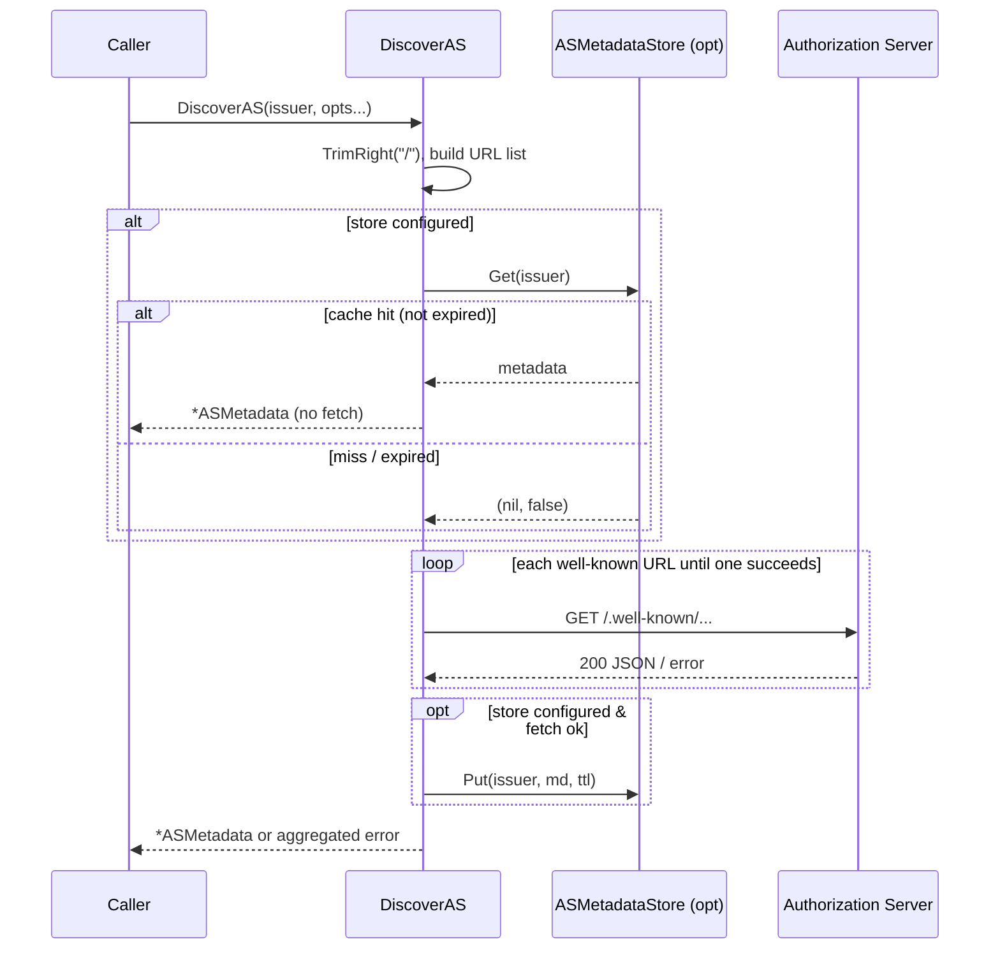
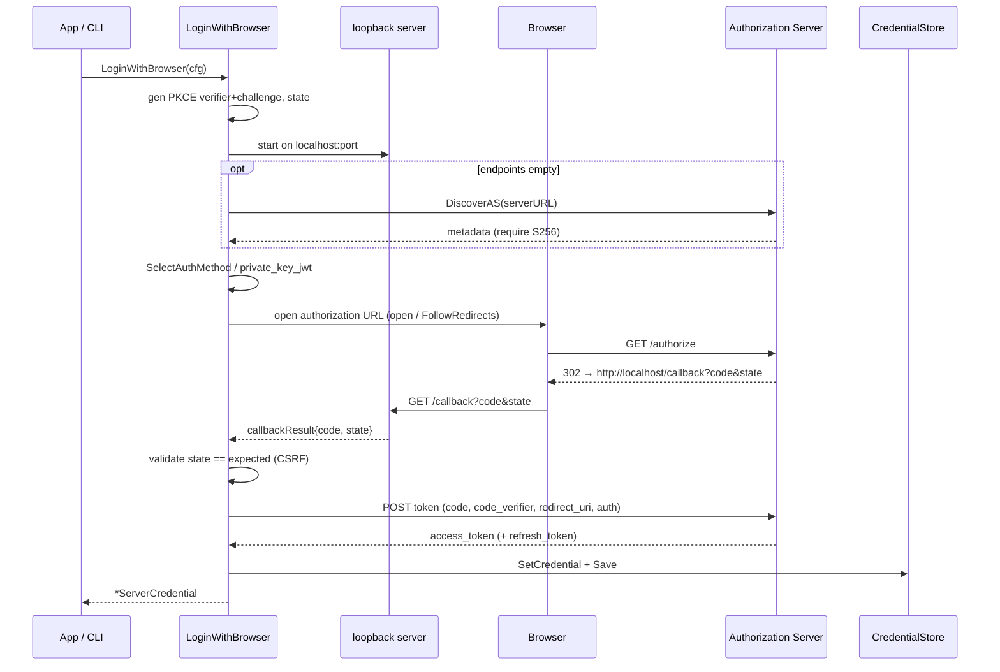

# client — Flows

### AS discovery with shared metadata cache

`DiscoverAS` resolves an issuer's OAuth endpoints, optionally short-circuiting
through a shared `ASMetadataStore` so multiple token sources on the same AS
fetch once. Path-based issuers (multi-tenant) get both well-known layouts tried
in order.



### Client-credentials token acquisition with reactive + proactive refresh

`ClientCredentialsSource.Token()` serves a cached token until it nears expiry,
then re-fetches via the embedded `AuthClient`. With a `ProactiveRefresher`, a
lazily-started background goroutine refreshes ahead of expiry. `OnToken` always
fires outside the mutex.

```mermaid
sequenceDiagram
    participant App
    participant Src as ClientCredentialsSource
    participant BG as background goroutine
    participant AC as AuthClient
    participant AS as Token Endpoint

    App->>Src: Token()
    opt Refresher.Buffer > 0 (first call)
        Src->>BG: start (once)
    end
    Src->>Src: lock; cached && now+30s < expiry?
    alt fresh
        Src-->>App: cached token
    else stale / empty
        Src->>AC: ClientCredentialsToken(id, secret, scopes)
        AC->>AS: POST grant_type=client_credentials (negotiated auth)
        AS-->>AC: access_token + expires_in
        AC-->>Src: ServerCredential (cache token+expiry)
        Src->>Src: unlock
        Src->>App: fireOnToken(copy) outside lock
        Src-->>App: access_token
    end

    Note over BG: loop: sleep until expiry-Buffer
    BG->>BG: wake; past refresh time?
    BG->>AC: fetchTokenLocked()
    AC->>AS: POST client_credentials
    AS-->>AC: new token
    AC-->>BG: ServerCredential (refresh cache)
    BG->>BG: fireOnToken(copy)
    Note over BG: failure → log + retry reactively next Token()
    App->>Src: Close() → stop goroutine
```

### Browser / PKCE authorization-code login

`AuthClient.LoginWithBrowser` runs the RFC 8252 native-app flow: a loopback
server catches the redirect, state guards against CSRF, and the code is
exchanged with the negotiated client-auth method (or private_key_jwt when a
`ClientAssertion` is set).


