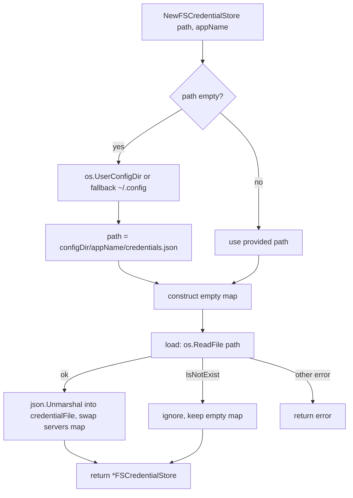
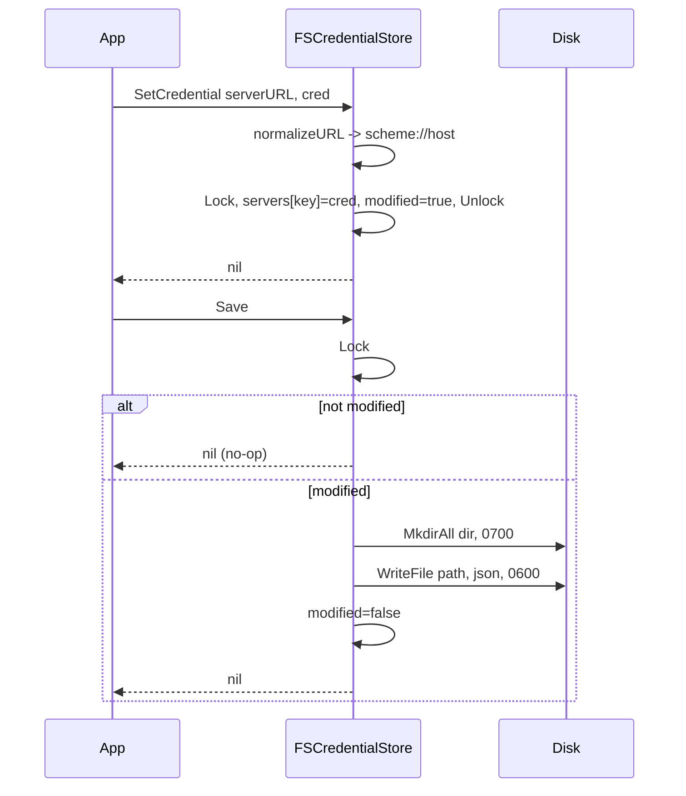

# fs

Filesystem-backed implementation of the oneauth client's credential store. It keeps server credentials in an in-memory map guarded by a `sync.RWMutex` and persists them, on explicit `Save`, to a single JSON file at `~/.config/<appName>/credentials.json` (or a caller-supplied path) with directory permissions `0700` and file permissions `0600`. Keys are normalized to `scheme://host` so trailing paths or queries from the caller all collapse onto one entry, and a missing file is treated as an empty-but-usable store rather than an error — making it suitable as the default credential backend for CLIs and desktop apps that need OAuth tokens to survive across runs.

## Contents

- [Entities](#entities)
- [Flows](#flows)
- [Gotchas](#gotchas)
- [Depends on](#depends-on)

## Entities

| Entity | Kind | Role | Why |
|---|---|---|---|
| `FSCredentialStore` | struct | In-memory map of server credentials backed by a JSON file, guarded by a RWMutex. | Mutations stay in memory until `Save`, so callers control when secrets touch disk. |
| `credentialFile` | struct | On-disk JSON shape wrapping the servers map under a `"servers"` key. | Gives the file a single top-level object so the format can grow without breaking older readers. |
| `NewFSCredentialStore` | func | Constructs a store, defaulting the path to `~/.config/<appName>/credentials.json` and eagerly loading any existing file. | A missing file is not an error so first-run callers get an empty but usable store. |
| `normalizeURL` | func | Reduces a server URL to `scheme://host`, defaulting a missing scheme to `https`. | Variant URLs (trailing slashes, paths, queries) must collapse onto one credential entry. |
| `FSCredentialStore.GetCredential` | method | Looks up a credential by normalized server URL. | Returns `(nil, nil)` on a miss so callers must nil-check rather than relying on an error. |
| `FSCredentialStore.SetCredential` | method | Stores a credential under its normalized URL key and marks the store dirty. | Defers the file write to `Save` so callers can batch updates. |
| `FSCredentialStore.RemoveCredential` | method | Deletes a credential by normalized URL key and marks the store dirty. | Defers the file rewrite to `Save`, matching `SetCredential`'s batching model. |
| `FSCredentialStore.ListServers` | method | Returns all normalized server URL keys currently in the store. | Callers see the canonical `scheme://host` form, not the original input strings. |
| `FSCredentialStore.Save` | method | Persists the map to disk as indented JSON when modified. | Creates the directory `0700` and file `0600` because the contents are secrets; no-ops when unchanged. |
| `FSCredentialStore.Path` | method | Returns the resolved path to the credentials file. | After default-path resolution callers often need the actual location for logging or display. |

## Flows

### Construction and lazy load

### Write path (Set/Remove then Save)

## Gotchas

- **Save is the only persistence trigger.** `SetCredential` and `RemoveCredential` flip a `modified` flag but never touch disk; callers that forget to invoke `Save` on shutdown lose every change. The `modified` flag also short-circuits `Save` to a no-op, so an externally edited file will not be rewritten unless an in-process mutation has happened first.
- **URL normalization is lossy and intentional.** `normalizeURL` discards path, query, port-less behavior aside, and userinfo — only `scheme://host` (with `https` defaulted) survives as the key. Two callers using `http://localhost:8080/v1` and `http://localhost:8080/v2` share a single credential entry, which is the intended dedup behavior but is surprising if you expected path-scoped tokens.
- **`GetCredential` signals "missing" as `(nil, nil)`.** The error return is reserved for URL-parsing failures; a successful lookup that finds nothing returns no error. Callers that only check `err` will silently treat an unauthenticated server as authenticated with a nil credential.
- **Load failures other than "missing file" abort construction.** A malformed `credentials.json` makes `NewFSCredentialStore` return an error rather than starting fresh, so a single corrupt file can lock a user out of their CLI until they delete it manually.
- **The whole map is rewritten on every `Save`.** There is no per-key partial write, so concurrent processes pointing at the same path will clobber each other — the file is single-writer by design.
- **Default-path discovery silently falls back.** If `os.UserConfigDir` fails, the constructor falls back to `~/.config` via `os.UserHomeDir`; on platforms where the user's config dir differs from `~/.config` (notably macOS, where it is `~/Library/Application Support`), the actual location can differ from what tests or docs assume — `Path()` is the source of truth.

## Depends on

- [`client/`](../../DESIGN.md) — `ServerCredential`
