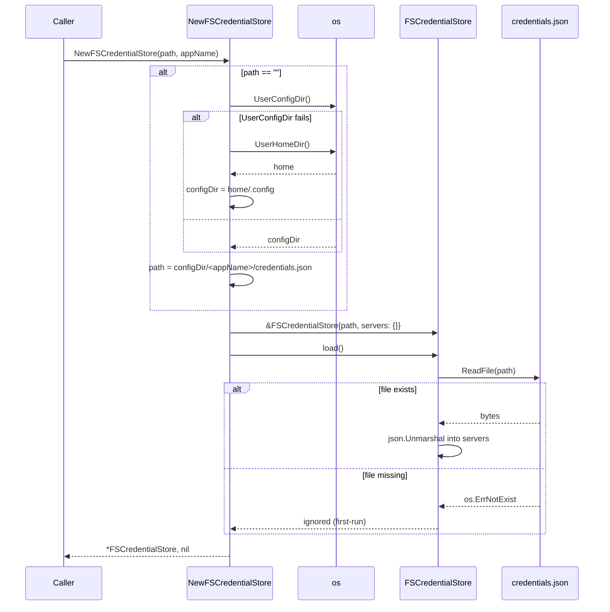

# fs — sequence diagrams

## Construction with default-path resolution

`NewFSCredentialStore` resolves the file path, eagerly loads any existing
credentials, and returns an empty-but-usable store when the file does
not yet exist.



## Mutate-then-Save write-back cycle

Set and Remove only touch memory and flip the modified flag. Save is the
only path that writes to disk, and it no-ops when nothing changed.

```mermaid
sequenceDiagram
    participant Caller
    participant Store as FSCredentialStore
    participant Disk as credentials.json

    Caller->>Store: SetCredential(url, cred)
    Store->>Store: normalizeURL(url) -> key
    Store->>Store: Lock(); servers[key] = cred; modified = true
    Store-->>Caller: nil

    Caller->>Store: RemoveCredential(otherURL)
    Store->>Store: normalizeURL -> key
    Store->>Store: Lock(); delete(servers, key); modified = true
    Store-->>Caller: nil

    Caller->>Store: Save()
    alt modified == false
        Store-->>Caller: nil (no-op)
    else
        Store->>Disk: MkdirAll(dir, 0700)
        Store->>Store: json.MarshalIndent({servers})
        Store->>Disk: WriteFile(path, data, 0600)
        Store->>Store: modified = false
        Store-->>Caller: nil
    end
```
