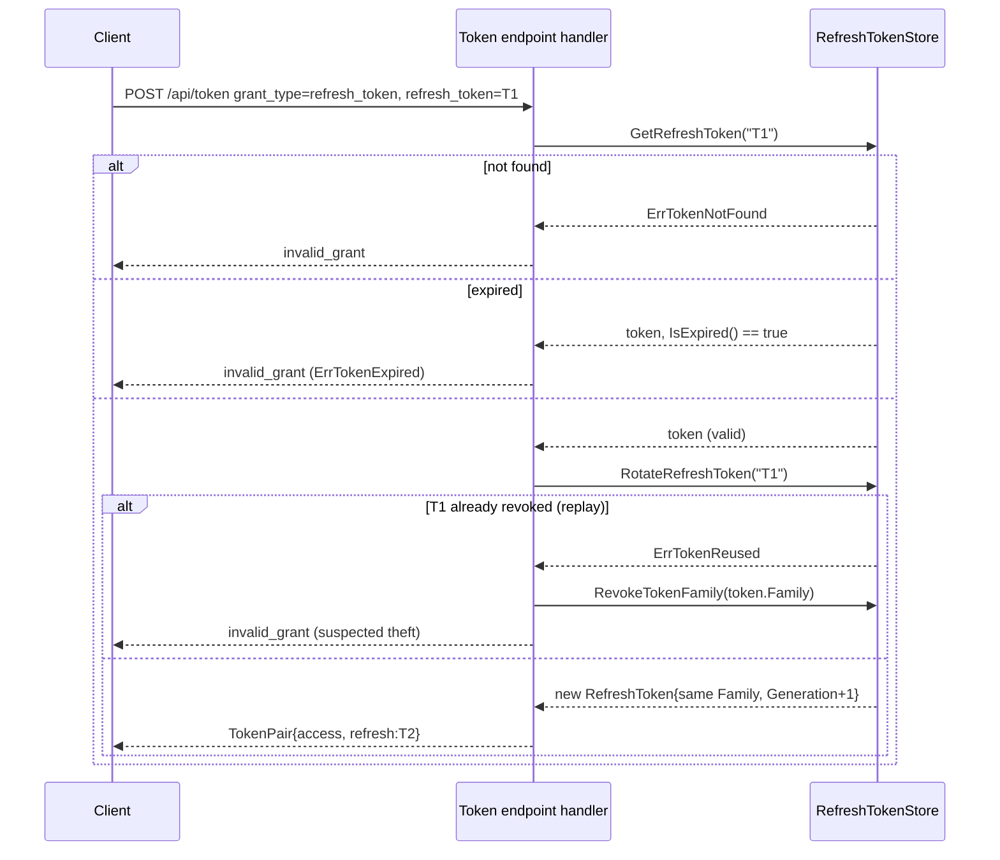

# core

`package core` is the transport-level foundation of OneAuth. After the account-model extraction (User / Identity / Channel and their stores moved to `accounts/`, signup policy and email tokens moved to `localauth/`, OAuth callback orchestration moved to `federatedauth/`), this package holds only the wire shapes and pluggable primitives that *every* OneAuth subpackage needs: refresh-token + API-key types and their store contracts, OAuth token-endpoint request/response structs spanning RFC 6749 / 7523 / 8693, the RFC 9396 `AuthorizationDetail` with its flat-JSON marshaller, scope vocabulary and set operations, a JWT `TokenBlacklist`, a `RateLimiter`, an `AccountLockout`, and a typed user-id context shim. It ships no HTTP, no JWT signing, no storage backends, and no business logic — so siblings can compose these primitives without inheriting any deployment opinion.

## Contents

- [Entities](#entities)
- [Flows](#flows)
  - [RFC 9396 authorization\_details flat-JSON round-trip](#rfc-9396-authorizationdetails-flat-json-round-trip)
  - [Refresh-token rotation with theft detection](#refresh-token-rotation-with-theft-detection)
- [Gotchas](#gotchas)
- [Depends on](#depends-on)

## Entities

| Entity | Kind | Role | Why |
|---|---|---|---|
| `RefreshToken` | struct | Long-lived OAuth refresh token with `Family` / `Generation` rotation lineage, RAR details, and revocation flag. | Rotation detection (token reuse / family revocation) requires per-token lineage state that lives outside any JWT claim. |
| `APIKey` | struct | Long-lived programmatic credential split into public `KeyID` + bcrypt-hashed secret. | Bearer-style alternative to OAuth flows for service-to-service callers that can rotate independently of user tokens. |
| `TokenPair` | struct | OAuth token-endpoint response payload (access + refresh + scope + RAR + RFC 8693 `IssuedTokenType`). | One shape for every grant the AS supports, so handlers don't fork response builders per `grant_type`. |
| `TokenRequest` | struct | Union of every field the token endpoint accepts across `password`, `refresh_token`, `client_credentials`, `jwt-bearer` (RFC 7523), and `token-exchange` (RFC 8693) grants. | Single struct keeps the transport-agnostic `TokenIssuer` signature stable as new grant types arrive. |
| `TokenError` | struct | OAuth 2.0 compliant `error` / `error_description` response body. | Matches the wire shape RFC 6749 §5.2 mandates so handlers can `json`-encode directly. |
| `RefreshTokenStore` | interface | CRUD + rotation / revocation / family-revoke / cleanup operations over refresh tokens. | Split from `APIKeyStore` so backends can implement one without the other; rotation semantics encoded in the interface (`RotateRefreshToken` returns `ErrTokenReused`). |
| `APIKeyStore` | interface | CRUD + validation over API keys; `CreateAPIKey` returns the plaintext `fullKey` exactly once. | Mirror of `RefreshTokenStore` but with secret-shown-once semantics that callers must not forget. |
| `GenerateSecureToken` | func | `crypto/rand`-backed 32-byte → 64-char hex token generator. | One audited entry point for "give me an opaque token" so callers can't roll their own with `math/rand`. |
| `GenerateAPIKeyID` | func | Generates the public half of an API key with the `oa_` prefix. | Prefix makes leaked keys greppable in logs / secret scanners; centralised so the prefix is unmissable. |
| `GenerateAPIKeySecret` | func | Generates the secret half of an API key (32 random bytes hex-encoded). | Pair with `GenerateAPIKeyID`; kept separate so the secret can be bcrypt-hashed without the prefix interfering. |
| `ErrTokenNotFound` | var | Sentinel for store lookups that find nothing. | Stable sentinel lets upper layers map storage misses to OAuth `invalid_grant` without type-asserting on store-specific errors. |
| `ErrTokenExpired` | var | Sentinel for tokens past their `ExpiresAt`. | Distinguishes "expired" from "revoked" so refresh handlers can decide whether to rotate vs. reject outright. |
| `ErrTokenRevoked` | var | Sentinel for tokens explicitly revoked via store or blacklist. | Separate from `ErrTokenExpired` so revocation observability (counts, alerts) stays clean. |
| `ErrTokenReused` | var | Sentinel returned by `RefreshTokenStore.RotateRefreshToken` when a revoked token is presented for rotation. | Theft-detection trigger — handlers must respond by revoking the whole family, not just the one token. |
| `ErrInvalidGrant` | var | Sentinel for grant-validation failures inside grant handlers. | Maps directly to RFC 6749 §5.2 `invalid_grant`; avoids re-creating it in every grant handler. |
| `ErrInvalidScope` | var | Sentinel for unsupported / disallowed scopes. | Lets `ValidateRequestedScopes` callers produce RFC 6749 `invalid_scope` without depending on the scope helpers themselves. |
| `ErrAPIKeyNotFound` | var | Sentinel for `APIKeyStore.GetAPIKeyByID` / `APIKeyStore.ValidateAPIKey` misses. | Distinct from `ErrTokenNotFound` so API-key flows don't accidentally share error-handling branches with refresh tokens. |
| `TokenExpiryAccessToken` | const | Default access-token TTL (15m). | Matches the most common OAuth deployment guidance; concentrated here so all token issuers see the same default. |
| `TokenExpiryRefreshToken` | const | Default refresh-token TTL (7 days). | Same as above — single knob the rest of the lib can override per-deployment. |
| `AuthorizationDetail` | struct | One RFC 9396 `authorization_details` object; common fields (`type` / `locations` / `actions` / `datatypes` / `identifier` / `privileges`) plus a typed `Extra` map for API-specific extensions. | RFC 9396 mandates a flat JSON shape where extensions live alongside common fields; the `Extra` map + custom marshallers preserve that shape without forcing each consumer to reimplement it. |
| `AuthorizationDetail.MarshalJSON` | method | Flattens `Extra` into the top-level JSON object (skipping collisions with common field names). | Without this Go would nest extensions under an `"extra"` key, breaking RFC 9396 wire compatibility. |
| `AuthorizationDetail.UnmarshalJSON` | method | Two-pass decode that lifts unknown fields into `Extra` while keeping common fields strongly typed. | Lets handlers downcast known fields (`Locations` / `Actions`) without losing API-specific extensions they don't know about. |
| `AuthorizationDetail.Validate` | method | Enforces the one hard requirement from RFC 9396 §2 — non-empty `type`. | Validation lives on the value rather than at the boundary so RAR objects coming from any source (token request, introspection, db) get the same check. |
| `ValidateAll` | func | Slice-wide `AuthorizationDetail.Validate` convenience. | Token issuers process `[]AuthorizationDetail`; a single-call validator keeps grant handlers clean. |
| `FilterByType` | func | Selects RAR entries whose `Type` matches a string. | API resource servers care only about their own type; this is the canonical way to slice the bag. |
| `ErrInvalidAuthorizationDetails` | var | Sentinel mapped to the RFC 9396 §5.2 `invalid_authorization_details` OAuth error code. | Wraps every RAR validation failure so transport layers can detect it via `errors.Is` and emit the right OAuth error code. |
| `ScopeRead` | const | Built-in `read` scope identifier. | Lets apps reference a stable name instead of stringly-typed literals scattered through callers. |
| `ScopeWrite` | const | Built-in `write` scope identifier. | Same rationale as `ScopeRead`. |
| `ScopeProfile` | const | Built-in `profile` scope identifier. | Same rationale as `ScopeRead`. |
| `ScopeOffline` | const | Built-in `offline` scope; presence enables refresh-token issuance. | Encodes the OIDC convention that `offline_access` / `offline` gates long-lived sessions, so issuers don't need to hardcode the string. |
| `ScopeAdmin` | const | Built-in `admin` scope identifier. | Same rationale as `ScopeRead`; reserved name so applications don't accidentally redefine it with a different meaning. |
| `AllBuiltinScopes` | func | Returns the canonical slice of built-in scope names. | Lets discovery / metadata handlers advertise the same set the validator accepts without manual sync. |
| `GetUserScopesFunc` | type | Callback signature an application implements to declare what scopes a user is allowed to request. | Keeps scope-authorization policy in app code (roles, plans, groups) without `core` having to model any of it. |
| `DefaultGetUserScopes` | func | Pre-baked `GetUserScopesFunc` granting `read` / `write` / `profile` / `offline` to every user. | Sensible default so demos and the reference server work out of the box; production deployments override it. |
| `ParseScopes` | func | Splits a space-separated scope string and deduplicates. | RFC 6749 §3.3 wire format is space-separated; one parser everywhere prevents subtle disagreements (e.g., tabs vs. spaces). |
| `JoinScopes` | func | Inverse of `ParseScopes`. | Symmetric round-trip with `ParseScopes` for token responses and introspection output. |
| `IntersectScopes` | func | Returns scopes present in both `requested` and `allowed`; preserves requested order. | Core operation for "downscope to what's actually permitted" — used during token issuance after policy lookup. |
| `UnionScopes` | func | Sorted, deduplicated union of two scope slices. | Complement of `IntersectScopes` for combining existing + newly-requested scopes (e.g., consent updates); sorted result gives deterministic comparison. |
| `ContainsScope` | func | Linear scan for one scope. | Tiny helper that keeps callers from sprinkling for-range loops; scope lists are short so O(n) is fine. |
| `ContainsAllScopes` | func | True iff every required scope is present in `granted`. | Used by middleware deciding whether a token satisfies an endpoint's scope requirement. |
| `ValidateRequestedScopes` | func | Partitions requested scopes into valid / invalid relative to an allowed set. | Lets the AS return both — issue the valid subset and report the invalid ones in `error_description`. |
| `ScopesEqual` | func | Order-independent slice equality. | Refresh-token rotation requires "same scopes as before"; order varies between requests so set-equality is the right check. |
| `TokenBlacklist` | interface | Tracks revoked JWT `jti` claims with auto-expiry semantics. | JWTs are self-contained — without a blacklist there is no way to revoke a still-valid access token mid-flight; pluggable so single-node and Redis-backed deployments share callers. |
| `InMemoryBlacklist` | struct | Thread-safe `map[jti]expiry` `TokenBlacklist` implementation. | Zero-dep default that lets single-process deployments revoke without external infrastructure. |
| `InMemoryBlacklist.CleanupExpired` | method | Removes entries whose expiry has passed. | Without periodic cleanup the map grows forever; entries past expiry are already inert but waste memory. |
| `RateLimiter` | interface | One-method `Allow(key) bool` primitive. | Single-method interface lets callers swap algorithms (token bucket, sliding window) without changing call sites. |
| `InMemoryRateLimiter` | struct | Token-bucket `RateLimiter` with per-key independent buckets. | Default implementation suited to login-attempt throttling; per-key isolation prevents one bad actor from starving everyone. |
| `InMemoryRateLimiter.CleanupStale` | method | Drops buckets idle longer than `maxAge`. | Same memory-hygiene rationale as `InMemoryBlacklist.CleanupExpired` — abandoned keys leak otherwise. |
| `AccountLockout` | struct | Tracks consecutive auth failures per key and locks accounts after `MaxAttempts` for `LockDuration`. | Distinct from rate-limiting — lockout is binary (locked / unlocked) and gets reset on success, where a rate limiter only smooths request bursts. |
| `AccountLockout.IsLocked` | method | Returns whether `key` is currently locked; auto-expires entries past `LockDuration`. | Self-clearing semantics mean callers don't need a background sweeper just to honour `LockDuration`. |
| `AccountLockout.RecordFailure` | method | Increments failure count; returns `true` when threshold tips into lockout. | Boolean return lets login flows emit a "now locked" signal at the moment of locking without a follow-up `IsLocked` call. |
| `AccountLockout.RecordSuccess` | method | Clears counter on successful login. | Successful auth proves the account isn't under attack from this key, so resetting avoids penalising legitimate users for past typos. |
| `AccountLockout.Reset` | method | Admin-action unlock. | Operators need an out-of-band way to clear a lockout (e.g., user recovered their password); distinct method name documents intent. |
| `GetUserIDFromContext` | func | Reads the logged-in user ID from `context.Context` under a private key. | Private context-key type prevents accidental collisions with other libraries; helper avoids exposing the key type itself. |
| `SetUserIDInContext` | func | Writes the user ID into `context.Context` using the same private key. | Symmetric with `GetUserIDFromContext`; centralising the key means middleware and handlers stay in sync. |
| `DefaultUserParamName` | const | The string (`"loggedInUserId"`) used as the context-key value. | Exposed for templates / external code that need to reference the same name — but real lookups still go through the typed helpers. |

## Flows

### RFC 9396 authorization\_details flat-JSON round-trip

`AuthorizationDetail` keeps common fields strongly typed *and* preserves arbitrary API-specific extensions, but on the wire RFC 9396 §2 demands a single flat object — extensions live alongside common fields, not under any nested key. The custom `MarshalJSON` / `UnmarshalJSON` pair makes the round-trip lossless without leaking the `Extra` key into the wire format.

```mermaid
sequenceDiagram
    participant Caller
    participant AD as AuthorizationDetail
    participant JSON as encoding/json
    participant Net as Wire

    Caller->>AD: build {Type, Locations, Extra:{instructedAmount,...}}
    Caller->>JSON: json.Marshal(ad)
    JSON->>AD: MarshalJSON()
    AD->>AD: build map{type, locations, ...} + flatten Extra (skip commonFields collisions)
    AD-->>JSON: flat JSON object bytes
    JSON-->>Net: {"type":"payment_initiation","locations":[...],"instructedAmount":{...}}

    Net->>JSON: incoming bytes
    JSON->>AD: UnmarshalJSON(data)
    AD->>AD: pass 1 — decode into Alias for common fields
    AD->>AD: pass 2 — decode raw map; collect non-common keys into Extra
    AD-->>Caller: AuthorizationDetail{Type, Locations, Extra}
    Caller->>AD: Validate()
    alt Type == ""
        AD-->>Caller: fmt.Errorf("%w: type field is required", ErrInvalidAuthorizationDetails)
    else
        AD-->>Caller: nil
    end
```

### Refresh-token rotation with theft detection

`RefreshTokenStore.RotateRefreshToken` is the only place `ErrTokenReused` is returned, and the sentinel exists *only* so callers can react with whole-family revocation rather than treating a reused token like any other invalid grant. The rotation contract — old token invalidated, new token created with the same `Family` but incremented `Generation` — is encoded in the interface; backends pick the storage.



## Gotchas

- **`commonFields` collisions on RAR unmarshal are silently dropped, not rejected.** `AuthorizationDetail.UnmarshalJSON` collects every non-common key into `Extra` — but `MarshalJSON` only emits `Extra` entries *if* their key isn't a common field. A round-trip of `{"type":"x","locations":["legit"]}` plus an `Extra["locations"] = ["sneaky"]` from caller code will drop the sneaky one rather than error. The contract is "extensions cannot shadow common fields"; current code enforces that by omission, not by error. Callers building RARs by hand should validate keys themselves if they care.
- **`AuthorizationDetail.Validate` only checks `type`.** RFC 9396 §2 lists `type` as the only required field, and `core` deliberately doesn't validate the meaning of `actions` / `locations` / extensions — those are API-specific. Resource servers MUST do their own deeper validation per type (see `tests/keycloak/` for the RAR conformance suite that proves this is intentional).
- **`RefreshTokenStore.RotateRefreshToken` returning `ErrTokenReused` is the *only* signal of theft.** Backends that don't faithfully track `Family` / `Generation` (e.g., a "rotate = delete-and-recreate" shortcut) will leak. The interface comment makes the contract explicit but Go can't enforce it; new backends need integration tests against this case.
- **`ScopeOffline` is a magic string by convention, not by enforcement here.** `core` exposes the constant; whether refresh tokens actually require it is decided by token issuers in `apiauth/`. If a deployment changes the magic string, every issuer that special-cases `ScopeOffline` must be updated in lockstep.
- **`UnionScopes` sorts; `IntersectScopes` preserves input order.** This is intentional — union is for storage / comparison (so equality is deterministic), intersection is for response generation (so callers can see "we honoured your priority order"). Don't normalise either to the other without a reason.
- **`InMemoryBlacklist` and `InMemoryRateLimiter` leak without periodic cleanup.** Their `CleanupExpired` / `CleanupStale` methods are *not* called automatically. The package deliberately doesn't spawn goroutines on its own (callers control lifecycle); single-process deployments should kick these from a `time.Ticker` somewhere in main.
- **`AccountLockout` is *not* a `RateLimiter`.** They share a "per-key state" feel but have opposite semantics: rate-limit lets you keep going at a reduced pace; lockout cuts you off entirely until a clock expires or an admin calls `Reset`. Don't unify them under one interface "for tidiness".
- **`DefaultUserParamName` is a string but the real context key is a private type.** Code that does `ctx.Value("loggedInUserId")` (using the bare string) will not find anything — only the `userParamNameKey("loggedInUserId")` typed key works. The constant is exposed for template / form-field names; for context lookup always go through `GetUserIDFromContext`.
- **Stores are split per resource, never unified.** `RefreshTokenStore` and `APIKeyStore` are separate interfaces on purpose: a deployment can ship one backend for refresh tokens (e.g., Redis for fast rotation) and another for API keys (e.g., Postgres for audit), and the rest of the library composes them. The historical "one god UserStore" pattern lives in [`memories/feedback_god_interface.md`](../memories/feedback_god_interface.md) — don't merge these.
- **`GenerateAPIKeyID` prefixes `oa_`; `GenerateAPIKeySecret` does not.** The full key callers should give end-users is `keyID + "_" + secret` (the `APIKeyStore.CreateAPIKey` doc states this). The `oa_` prefix appears exactly once at the start of `keyID` so that the full key starts with `oa_<id>_<secret>` — useful for secret-scanner rules.

## Depends on

*(no sibling-folder dependencies)*
