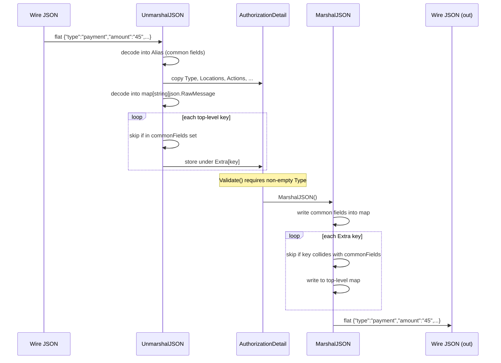
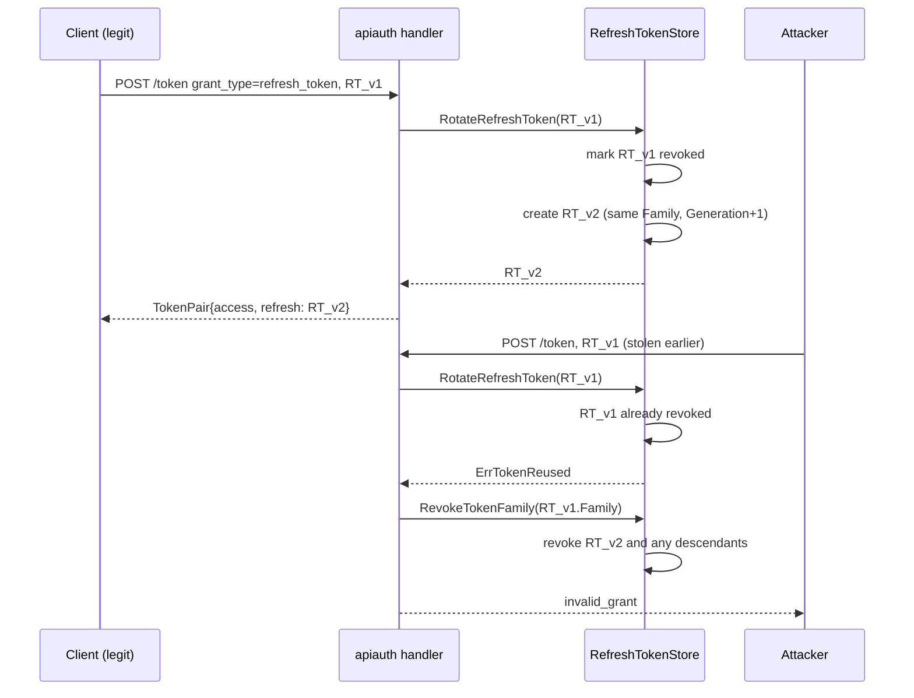
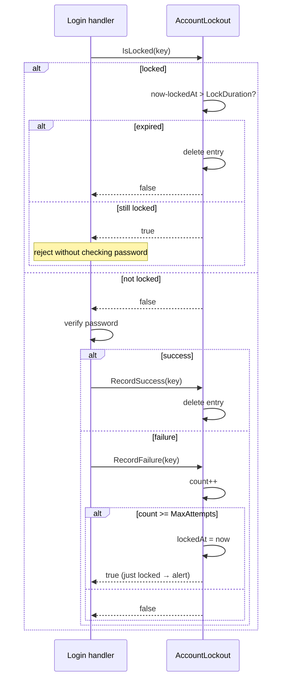

# core

`package core` is the shared foundation that every other OneAuth package imports. It defines the user/identity/channel model, the gRPC-shape store interfaces backends must implement, the OAuth token wire shapes (including RFC 9396 authorization details and RFC 8693 token-exchange fields), the scope vocabulary, pluggable security primitives (`TokenBlacklist`, `RateLimiter`, `AccountLockout`), the signup/credential policy data, and the canonical request-context helpers. It deliberately ships *only* types, interfaces, and pure helpers — no HTTP, no JWT signing, no storage, no business flows — so that sibling packages can compose them without inheriting any deployment opinion.

## Contents

- [Entities](#entities)
- [Flows](#flows)
  - [AuthorizationDetail JSON round-trip](#authorizationdetail-json-round-trip)
  - [Refresh-token rotation with theft detection](#refresh-token-rotation-with-theft-detection)
  - [Account lockout lifecycle](#account-lockout-lifecycle)
- [Gotchas](#gotchas)
- [Depends on](#depends-on)

## Entities

| Entity | Kind | Role | Why |
|---|---|---|---|
| `User` | interface | Unified account abstraction exposing `Id()` and `Profile()`. | Lets backends supply their own row type while the rest of OneAuth talks to a stable shape. |
| `BasicUser` | struct | Trivial in-memory `User` implementation with `ID` + `ProfileData`. | Default fallback so callers and tests do not need a backing store row to satisfy `User`. |
| `Identity` | struct | Verifiable contact (email/phone) owned by one user, with optimistic-locking `Version`. | Tracks verification per-contact so a single user can own multiple addresses safely under concurrent writes. |
| `Channel` | struct | Per-provider auth credentials (local/google/github) keyed by `IdentityKey`, with `ExpiresAt`. | Layers multiple login methods onto a single `Identity` while keeping a re-auth signal. |
| `Channel.IsExpired` | method | True when `ExpiresAt` is set and in the past. | Lets higher layers force re-auth without provider-specific clock logic. |
| `IdentityKey` | func | Builds the canonical `"type:value"` key that links `Channel`s to `Identity`s. | Single source of truth for the key format so callers cannot drift on separator or casing. |
| `HandleUserFunc` | type | Callback invoked after successful auth with provider, oauth token, userinfo, and the HTTP pair. | Hook seam so apps decide what to do post-auth without coupling core to a session library. |
| `UserStore` | interface | CRUD for `User` accounts (`CreateUser`, `GetUserById`, `SaveUser`). | gRPC-shape store seam so any backend (FS/GORM/GAE) can plug in without changing callers. |
| `IdentityStore` | interface | CRUD for `Identity` plus `SetUserForIdentity`, `MarkIdentityVerified`, `GetUserIdentities`. | Separates contact data from user data so identity-ownership transfers and verification flows stay isolated. |
| `ChannelStore` | interface | CRUD for `Channel` plus `GetChannelsByIdentity` lookup. | Lets login subsystems enumerate every provider attached to one identity without owning the storage shape. |
| `RefreshTokenStore` | interface | Full lifecycle for refresh tokens: create, get, rotate, revoke (single/user/family), list, cleanup. | Captures rotation + family semantics in the interface so theft detection (`ErrTokenReused` on rotate) is mandatory across backends. |
| `APIKeyStore` | interface | Issue, validate, revoke, list, and touch long-lived API keys. | Distinct from `RefreshTokenStore` because API keys have different lifetimes, naming, and per-key scopes. |
| `UsernameStore` | interface | Optional username uniqueness store (`Reserve`, `GetUserByUsername`, `Release`, `Change`). | Optional so apps that authenticate purely by email/phone do not pay the uniqueness cost. |
| `TokenStore` | interface | CRUD for short-lived `AuthToken` values (email verification, password reset). | Kept separate from `RefreshTokenStore` because lifetimes, retrieval patterns, and one-shot semantics differ. |
| `TokenType` | type | String enum identifying short-lived auth token kinds. | Lets one `TokenStore` back several token uses without a dedicated table per kind. |
| `AuthToken` | struct | Short-lived single-use token for email-verification / password-reset flows. | Captures the minimum shape needed by every backend so flow code stays storage-agnostic. |
| `AuthToken.IsExpired` | method | Wall-clock expiry check against `ExpiresAt`. | Centralises the comparison so callers do not reinvent expiry semantics. |
| `AuthToken.IsValid` | method | Combines type-match and non-expiry into a single check. | Forces callers to pass the expected `TokenType`, catching type-confusion bugs by construction. |
| `RefreshToken` | struct | Long-lived OAuth refresh token with `Family`/`Generation` rotation metadata, scopes, RFC 9396 details, device info. | `Family` + `Generation` enable refresh-token rotation with reuse detection without changing the wire format. |
| `RefreshToken.IsValid` | method | Not-revoked-and-not-expired check. | Single helper so backends and middleware agree on validity rules. |
| `APIKey` | struct | Long-lived programmatic credential carrying `KeyHash` (bcrypt of secret), scopes, optional expiry. | Stores only the hash so a leaked DB cannot reveal usable secrets. |
| `TokenPair` | struct | OAuth 2.0 token endpoint success response (access + refresh + expires_in + scope + authorization_details + issued_token_type). | `IssuedTokenType` is the RFC 8693 token-exchange marker; carried here so one struct serves every grant. |
| `TokenRequest` | struct | Aggregated token request covering password, refresh, client_credentials, jwt-bearer, and token-exchange grants. | One struct covers every supported grant so the dispatcher in `apiauth/` can decode once and switch on `GrantType`. |
| `TokenError` | struct | RFC 6749 §5.2 OAuth error envelope (`error` + `error_description`). | Forces all transport layers to emit the spec-mandated wire shape. |
| `GenerateSecureToken` | func | 32-byte crypto/rand hex token for `AuthToken`. | Centralises entropy so flow code cannot accidentally use weak randomness. |
| `GenerateAPIKeyID` | func | 16-byte crypto/rand hex ID prefixed `oa_` for `APIKey.KeyID`. | The `oa_` prefix lets ops and logs identify OneAuth-issued keys at a glance. |
| `GenerateAPIKeySecret` | func | 32-byte crypto/rand hex secret for the post-underscore portion of an API key. | Pairs with `GenerateAPIKeyID` so the full `keyID_secret` format stays consistent. |
| `ErrTokenNotFound` | const | Sentinel for missing tokens. | Shared identity for `errors.Is` comparisons across backends. |
| `ErrTokenExpired` | const | Sentinel for expired tokens. | Lets transports translate uniformly to `invalid_grant`. |
| `ErrTokenRevoked` | const | Sentinel for revoked tokens. | Distinct from expired so audit can tell user revocation from natural expiry. |
| `ErrTokenReused` | const | Sentinel raised by `RotateRefreshToken` when a previously rotated token is re-presented. | Mandatory signal for refresh-token theft detection — backends must surface it. |
| `ErrInvalidGrant` | const | Sentinel for OAuth `invalid_grant`. | Single source of truth for the wire error. |
| `ErrInvalidScope` | const | Sentinel for OAuth `invalid_scope`. | Same as above for scope failures. |
| `ErrAPIKeyNotFound` | const | Sentinel for missing API keys. | Parallel to `ErrTokenNotFound` but kept separate because the two stores have independent lifetimes. |
| `AuthorizationDetail` | struct | RFC 9396 fine-grained authorization object with common fields plus an `Extra` map for extensions. | Custom JSON codecs flatten `Extra` into the top-level object as the spec requires — the wire shape would otherwise nest extensions. |
| `AuthorizationDetail.Validate` | method | Enforces the required `Type` field per RFC 9396 §2. | Catches malformed details at the boundary before they leak into storage or tokens. |
| `AuthorizationDetail.MarshalJSON` | method | Custom marshaller that flattens `Extra` alongside common fields. | RFC 9396 requires a flat object — the struct field has to be tag-ignored and merged manually. |
| `AuthorizationDetail.UnmarshalJSON` | method | Two-pass decoder that splits common fields from extensions. | Prevents extensions from shadowing reserved fields (security and round-trip stability). |
| `ValidateAll` | func | Validates every element of an `AuthorizationDetail` slice. | Slice-level helper so request handlers do not loop manually. |
| `FilterByType` | func | Returns the subset of details with a matching `Type`. | Common pattern for resource servers checking only the types they care about. |
| `ErrInvalidAuthorizationDetails` | const | RFC 9396 §5.2 error sentinel. | Mapped by transports to the exact OAuth error name the spec mandates. |
| `SignupPolicy` | struct | Configurable signup requirements (required fields, uniqueness, password min length, username pattern). | Policy is data not behaviour — apps can swap presets or build their own without subclassing the signup flow. |
| `DefaultSignupPolicy` | func | Returns the conventional default policy (email + password required, username optional). | Sensible baseline so most apps need zero policy configuration. |
| `PolicyUsernameRequired` | const | Preset policy requiring username + email + password. | Captures a common deployment shape so apps do not assemble the struct by hand. |
| `PolicyEmailOnly` | const | Preset policy with only email + password required. | Default for modern web apps that key off email. |
| `PolicyFlexible` | const | OAuth-friendly preset where all fields are optional. | Lets federated signups proceed without forcing a local password. |
| `SignupPolicy.GetUsernamePattern` | method | Compiles `UsernamePattern`, falling back to a default regex. | Single place to enforce the fallback so an empty pattern never crashes the validator. |
| `SignupPolicy.GetMinPasswordLength` | method | Returns `MinPasswordLength` with an 8-char default. | Same fallback discipline as the username pattern — never trust a zero value. |
| `AuthError` | struct | Structured auth error with stable `Code`, human `Message`, and offending `Field`. | Lets handlers and templates render field-targeted error messages without parsing error strings. |
| `AuthError.Error` | method | Satisfies the `error` interface by returning `Message`. | `AuthError` must round-trip through standard error plumbing. |
| `NewAuthError` | func | Constructor for `AuthError`. | Keeps the field order/names off call sites. |
| `AuthErrorHandler` | type | App-supplied function rendering auth errors (returns true if it handled the response). | Lets apps choose redirect-with-flash, JSON, or HTML rendering without core dictating UI. |
| `Credentials` | struct | Username/Email/Phone/Password bundle used during signup and login. | `Username` is overloaded to also hold email/phone on login so `DetectUsernameType` can route appropriately. |
| `SignupValidator` | type | Function type validating a `Credentials` at signup. | Allows per-app rules (e.g., corporate email domain) without forking core. |
| `CredentialsValidator` | type | Function type validating login credentials and returning the `User`. | Apps that store passwords differently (bcrypt, external HSM) plug in here. |
| `CreateUserFunc` | type | Function type that materialises a `User` from signup `Credentials`. | Keeps user-creation policy (defaults, role assignment) in the application, not core. |
| `DefaultSignupValidator` | var | Stock `SignupValidator` enforcing username/email/phone/password format defaults. | Ships sensible behaviour so apps can opt out only when needed. |
| `DetectUsernameType` | func | Returns `"email"` / `"phone"` / `"username"` based on the input shape. | Single place for the heuristic so login forms and validators agree on classification. |
| `ScopeRead` | const | Built-in scope for read access. | Named constant prevents typos like `"read "` across handlers. |
| `ScopeWrite` | const | Built-in scope for write access. | Same reason as `ScopeRead` — typo defense. |
| `ScopeProfile` | const | Built-in scope granting access to profile data. | Mirrors OIDC convention. |
| `ScopeOffline` | const | Built-in scope that enables refresh-token issuance. | Matches OIDC `offline_access` so refresh tokens are opt-in. |
| `ScopeAdmin` | const | Built-in scope for administrative endpoints. | Admin handlers gate solely on scope without inventing a parallel role system. |
| `AllBuiltinScopes` | func | Returns every built-in scope as a slice. | Useful for seeding allow-lists and admin UIs. |
| `GetUserScopesFunc` | type | Callback returning scopes a user is allowed to hold. | Apps decide entitlement from roles/groups/profile without core dictating the source. |
| `DefaultGetUserScopes` | func | Returns a `GetUserScopesFunc` granting read/write/profile/offline to all users. | Reasonable default so apps without RBAC still get sensible scopes. |
| `ParseScopes` | func | Splits a space-delimited scope string into a deduped slice. | Hides OAuth wire-format quirks so callers work with slices. |
| `JoinScopes` | func | Joins a scope slice into the OAuth space-delimited form. | Inverse of `ParseScopes`; centralises the separator. |
| `IntersectScopes` | func | Returns scopes present in both requested and allowed (in requested order). | The OAuth downgrade primitive — only ever grant the intersection. |
| `ContainsScope` | func | Linear membership check. | Trivial helper avoiding a map allocation when callers check just one scope. |
| `ContainsAllScopes` | func | Checks every required scope appears in granted scopes. | The canonical "is this token strong enough" predicate for middleware. |
| `ValidateRequestedScopes` | func | Splits requested scopes into (valid, invalid) buckets against an allowed list. | Lets handlers report unknown scopes back to clients per RFC 6749 `invalid_scope`. |
| `UnionScopes` | func | Sorted, deduped union of two scope slices. | Complement of `IntersectScopes` — used when merging existing and freshly requested scopes. |
| `ScopesEqual` | func | Order-independent scope-set equality. | Lets tests and rotation logic compare scope sets without sorting boilerplate. |
| `SendEmail` | interface | Two-method sender for verification and password-reset emails. | Keeps SMTP/SendGrid choice in the application; core only knows the verbs. |
| `ConsoleEmailSender` | struct | Development `SendEmail` implementation that `log.Printf`s every "email". | Lets local dev and tests proceed without an SMTP relay while still surfacing the link. |
| `TokenBlacklist` | interface | `Revoke` and `IsRevoked` by JWT `jti`, with per-entry expiry. | Pluggable so single-node deployments use memory and distributed deployments swap in Redis without changing call sites. |
| `InMemoryBlacklist` | struct | Thread-safe `map[jti]expiry` implementation of `TokenBlacklist`. | Auto-expires on read so memory stays bounded even between cleanups. |
| `InMemoryBlacklist.Revoke` | method | Stores `jti` with its expiry under a write lock. | Keeps the entry only until the natural token expiry so memory stays bounded. |
| `InMemoryBlacklist.IsRevoked` | method | Lock-free read returning false for missing or expired entries. | Past-expiry entries silently report "not revoked" so callers do not need to know about cleanup state. |
| `InMemoryBlacklist.CleanupExpired` | method | Sweeps and deletes entries whose expiry has passed. | Called by a background goroutine so memory does not grow under high revocation churn. |
| `InMemoryBlacklist.Len` | method | Returns entry count including expired-but-unswept rows. | Diagnostic only; intentionally includes stale rows because that is what consumes memory. |
| `RateLimiter` | interface | Single-method `Allow(key)` predicate. | Minimal seam so production deployments can substitute Redis-backed limiters without touching call sites. |
| `InMemoryRateLimiter` | struct | Per-key token-bucket limiter with steady refill rate and burst cap. | Token bucket gives smooth steady-state plus burst tolerance — better UX than fixed windows. |
| `NewInMemoryRateLimiter` | func | Constructor taking rate (tokens/sec) and burst (bucket size). | Forces both parameters at construction so misconfigurations surface immediately. |
| `InMemoryRateLimiter.Allow` | method | Refills the bucket, consumes a token if available, returns true. | Lazy refill on access avoids a background goroutine per limiter. |
| `InMemoryRateLimiter.CleanupStale` | method | Deletes buckets idle longer than `maxAge`. | Per-IP buckets would otherwise grow unbounded under scan attacks. |
| `AccountLockout` | struct | Tracks consecutive failures per key and locks the account for `LockDuration` after `MaxAttempts`. | Separate from `RateLimiter` because account lockout has reset-on-success and `lockedAt` semantics that don't fit a token bucket. |
| `NewAccountLockout` | func | Constructor with explicit thresholds. | Forces the deployment to choose lockout policy rather than inherit a hidden default. |
| `AccountLockout.IsLocked` | method | Returns true when key has an active (unexpired) lock. | Self-cleans expired entries during read so callers never see stale locks. |
| `AccountLockout.RecordFailure` | method | Increments counter; returns true and stamps `lockedAt` when threshold reached. | Returning the just-locked boolean lets callers emit an alert exactly once per lockout. |
| `AccountLockout.RecordSuccess` | method | Drops the failure entry entirely on success. | Avoids "almost locked" carryover after a legitimate login. |
| `AccountLockout.Reset` | method | Admin-action unlock that removes any entry. | Operators need a kill switch independent of `LockDuration`. |
| `GetUserIDFromContext` | func | Reads the logged-in user ID from request context under `DefaultUserParamName`. | Centralises the context key so middleware and handlers cannot drift on the lookup name. |
| `SetUserIDInContext` | func | Writes the logged-in user ID into a derived context. | Single helper guarantees the typed key used in `GetUserIDFromContext` is honoured. |
| `DefaultUserParamName` | const | String literal `"loggedInUserId"` — the default context key. | Exposed so tests and adapters can opt into the same key without importing the unexported type. |

## Flows

### AuthorizationDetail JSON round-trip

`AuthorizationDetail` has a hand-written codec because RFC 9396 requires extension fields to appear at the top level of the JSON object alongside the common fields, not nested. The two-pass unmarshal pattern is the core of this folder's most subtle code.

### Refresh-token rotation with theft detection

`RefreshTokenStore.RotateRefreshToken` plus the `Family`/`Generation` fields on `RefreshToken` define the theft-detection contract that every backend must honour. The `ErrTokenReused` sentinel is the trigger that distinguishes innocent re-use from an attacker replaying a stolen token.

### Account lockout lifecycle

`AccountLockout` is the failure-counter complement to `RateLimiter`. The state machine matters because `RecordFailure` returns a "just-locked" boolean that callers use to emit a one-shot alert, and `IsLocked` self-cleans expired entries.

## Gotchas

- **`AuthorizationDetail.Extra` must round-trip through the custom codec.** The `Extra map[string]any` field has `json:"-"` so the default encoder/decoder will silently drop it. Any code that reflects over the struct or builds JSON by hand (rather than calling `json.Marshal` on the value) will lose extensions. The unmarshaller also rejects extension keys that collide with `commonFields` to prevent shadow attacks — third-party detail types must not reuse the reserved names.
- **`InMemoryBlacklist.IsRevoked` returns `false` for entries past their expiry even though they are still in the map.** This is intentional: the entry only acts as a revocation until the token would have naturally expired anyway. `Len()` still reports those rows because they consume memory — diagnostic dashboards must not assume `Len() == active revocations`. `CleanupExpired` must be called on a timer or memory grows under sustained revocation churn.
- **`Credentials.Username` is overloaded for login.** During signup it is strictly the username, but on login it may carry an email or phone — `DetectUsernameType` is the canonical classifier and every login path must route through it. Mixing the two semantics directly (e.g., looking up `UsernameStore` with what is actually an email) silently fails to find the user.
- **`TokenRequest` packs five grant types into one struct.** Only a subset of fields is meaningful per `GrantType`; the dispatcher must validate which fields are populated, because untouched zero-value fields will deserialize as `""` and look indistinguishable from "client didn't send it." Particularly: `Assertion` (jwt-bearer subject) vs `ClientAssertion` (private_key_jwt / client_secret_jwt client auth) are distinct credentials and must never be confused.
- **`RefreshTokenStore.RotateRefreshToken` must return `ErrTokenReused` on replay.** This is the only signal that drives `RevokeTokenFamily`. A backend that returns a generic "not found" or silently issues a new token defeats theft detection — there is no compile-time check, only the interface contract.
- **`JWKS only exposes asymmetric keys.** This is a project-wide gotcha but bites here: `SignupPolicy.MinPasswordLength` defaulting to 8 and `DefaultGetUserScopes` granting read/write/profile/offline are *silent* defaults — zero values trigger fallbacks rather than rejection. Deployments that intend to require stricter policy must set explicit non-zero values.

## Depends on

*(none — `core/` is the foundation package and depends only on stdlib + third-party)*
