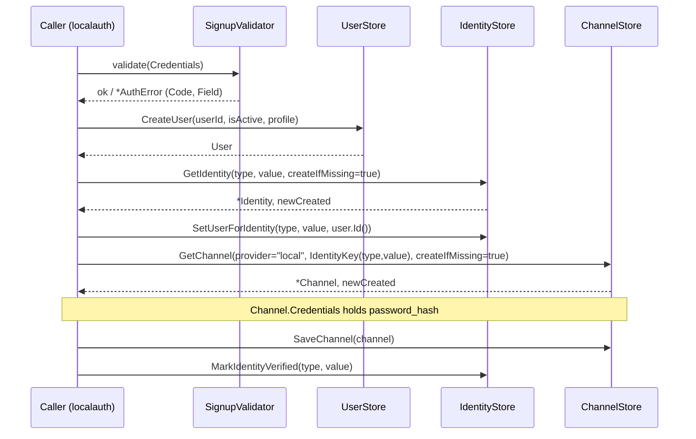

# core diagrams

These flows describe how core's store contracts are intended to be composed by
caller packages. core defines the interfaces and value types; the orchestration
shown here is the contract those interfaces imply.

### Local Signup

Provisioning a new account links a Channel to an Identity to a User. The
get-or-create stores (`createIfMissing`) and `IdentityKey` are the join points.



### Refresh-Token Rotation with Theft Detection

`RotateRefreshToken` is the heart of the contract: a presented token that was
already revoked means the lineage was stolen, so the whole Family is revoked.

```mermaid
sequenceDiagram
    participant C as Client
    participant RS as RefreshTokenStore

    C->>RS: RotateRefreshToken(oldToken)
    alt oldToken valid (not yet revoked)
        RS->>RS: revoke old; mint new in same Family, Generation+1
        RS-->>C: *RefreshToken (new)
    else oldToken already revoked (reuse)
        RS->>RS: RevokeTokenFamily(family)
        RS-->>C: ErrTokenReused
    end
```
