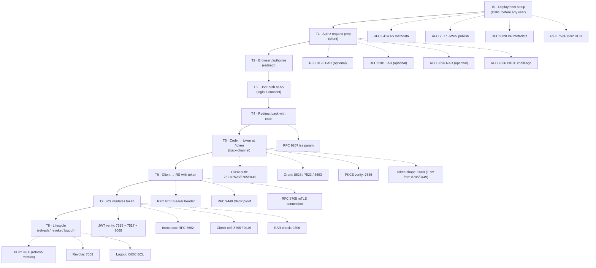

# OAuth Landscape

A zoom-in / zoom-out map of OAuth 2.1 and the RFCs that plug into it.

This is the umbrella doc for `docs/oauth/`. Per-RFC summaries live in sibling
`RFC_xxxx.md` files (linked from the diagrams in §3 and §4). Each per-RFC doc
follows the template in §8 — short, with a relatable example, a wire sample,
and OneAuth-specific notes.

> **Related reading already in the repo.** This doc is the *map*; existing
> docs are the *territory*:
> - [`docs/OAUTH21_ALIGNMENT.md`](../OAUTH21_ALIGNMENT.md) — gap analysis vs OAuth 2.1
> - [`docs/AUTH_FLOWS.md`](../AUTH_FLOWS.md) — sequence diagrams for built flows
> - [`docs/JWT_SIGNING.md`](../JWT_SIGNING.md) — key/JWKS internals
> - [`docs/gaps/AUTHLETE_GAP_ANALYSIS.md`](../gaps/AUTHLETE_GAP_ANALYSIS.md) — Authlete-superset gap analysis (tracked under #163)
> - [`docs/gaps/AUTH0_GAP_ANALYSIS.md`](../gaps/AUTH0_GAP_ANALYSIS.md) — Auth0 gap analysis

---

## How to use this document

- **Want the big picture?** Read [§1](#1-what-oauth-21-actually-is) and skim the L-tier diagram in §3.
- **Want to know when a particular RFC kicks in?** Jump to the T-tier diagram in §4.
- **Working on a feature?** Find the slot it fills in [§2](#2-the-slots-abstraction--implementation), then click through to the per-RFC doc.
- **Auditing OneAuth coverage?** [§6](#6-oneauth-coverage-matrix) is the matrix.
- **Want a worked example?** [§7](#7-worked-examples) traces real-world scenarios across the L and T axes.
- **Filling in a new RFC doc?** [§8](#8-template-for-per-rfc-docs) is the template.

---

## 1. What OAuth 2.0 and 2.1 are

**OAuth 2.0** ([RFC 6749](https://datatracker.ietf.org/doc/rfc6749/), 2012) is the
framework the world deploys. Every major IdP — Google, GitHub, Microsoft Azure
AD, Okta, Auth0, AWS Cognito, Keycloak — speaks 2.0, usually layered with a
selection of the BCP defenses.

**OAuth 2.1** ([draft-ietf-oauth-v2-1](https://datatracker.ietf.org/doc/draft-ietf-oauth-v2-1/),
still an active Internet-Draft — *not yet an RFC*) is the strict-mode
consolidation. It bakes in PKCE (RFC 7636), the Security BCP (RFC 9700), and
Bearer Token Usage (RFC 6750), and drops the grants two decades of attacks
killed (implicit, ROPC).

### Both share the same skeleton

Whether you read 2.0 or 2.1, the core is only four things:

1. **Four roles** — *resource owner* (you), *client* (the app asking for
   access), *authorization server* (the AS, who issues tokens), *resource
   server* (the RS, who holds the protected data).
2. **Two endpoints on the AS** — `/authorize` (browser-mediated, redirect-based)
   and `/token` (back-channel, HTTP POST).
3. **A small set of built-in grant types** — 2.0 ships five
   (`authorization_code`, `implicit`, `password`/ROPC, `client_credentials`,
   `refresh_token`); 2.1 keeps three (`authorization_code` + PKCE,
   `refresh_token`, `client_credentials`).
4. **A bearer-token contract** — the RS treats whoever presents the token as
   authorized; the AS decides what's inside.

**A relatable example.** When you click *"Sign in with Google"* on a new app:

- *You* are the resource owner; *the new app* is the client; *Google* is the AS;
  *Google's user-info / Gmail API* is the resource server.
- Your browser hits Google's `/authorize`. You log in, consent, get bounced back
  to the app with a one-time `code`.
- The app's backend POSTs that `code` to Google's `/token` and gets back an
  access token.
- The app calls Google's API with `Authorization: Bearer <token>`. Google
  decides what claims the token carries.

This walkthrough is 2.0 *and* 2.1 simultaneously — they share the wire shape.

### Where 2.0 and 2.1 differ

2.1 doesn't add protocol surface; it *constrains* 2.0's. Each tightening
corresponds to a defense in RFC 9700 (the Security BCP):

| Defense | 2.0 default | 2.1 mandate |
|---|---|---|
| PKCE | optional; SHOULD for public clients (per 7636) | **MUST for all clients** on auth-code |
| PKCE methods | `plain` and `S256` | **`S256` only** (`plain` rejected) |
| Implicit grant (§4.2) | allowed | **removed** |
| ROPC password grant (§4.3) | allowed | **removed** |
| Redirect URI matching | various (vendor) | **exact string match** |
| Redirect URI scheme | any | **HTTPS** (loopback exempt per RFC 8252) |
| Bearer token in query string (6750 §2.3) | discouraged | **forbidden** |
| Refresh token rotation | not specified | **required + family-revoke on reuse** |
| `iss` on auth-response redirect | not required | **required** (per RFC 9207) |

For the row-by-row OneAuth audit against 2.1, see
[`docs/OAUTH21_ALIGNMENT.md`](../OAUTH21_ALIGNMENT.md). For the per-RFC
"what does this RFC require under 2.0 vs 2.1" breakdown, every per-RFC doc
in this folder has paired *OAuth 2.0 status* and *OAuth 2.1 status* sections
(§8 template).

### OneAuth's stance: 2.1 posture, 2.0 interop

OneAuth's AS aims for **2.1 strictness internally** — PKCE everywhere,
S256-only, exact redirect match, refresh-token rotation with family revoke.
Its client SDK and middleware **interop with 2.0 deployments** because that's
what the production world advertises.

Some 2.0-legal-but-2.1-illegal features are retained with deprecation flags
and migration paths in flight:

- ROPC password grant ([issue 294](https://github.com/panyam/oneauth/issues/294))
- Query-param bearer fallback ([issue 295](https://github.com/panyam/oneauth/issues/295))

These are *transition states*, not non-compliance. A deployment that needs
strict 2.1 turns them off; a deployment migrating off a legacy IdP keeps them
on while it bakes the alternative. Both stances are legitimate.

### What's deliberately left open

Everything else — *token format, client auth method, how clients are
registered, how requests get integrity, how tokens are bound to a sender,
how identity is conveyed, how you discover any of this* — both 2.0 and 2.1
**deliberately leave open.** Those open holes are the **extension slots**
that the rest of the RFC ecosystem fills.

---

## 2. The slots (abstraction → implementation)

OAuth 2.1 is the *interface*; most other RFCs are *implementations* of one slot.

| Slot left open by 2.1 | 2.1 default | RFCs that plug in | Example bite |
|---|---|---|---|
| **Token format** | opaque string | RFC 9068 (JWT AT) — or stay opaque + use introspection | RS wants to authorize per-request without a network hop → JWT |
| **Token validation at RS** | "ask the AS somehow" | 7662 (introspect) · 7519+7517+9068 (verify JWT via JWKS) | Multi-region RS can't tolerate AS RTT → JWT verify locally |
| **Client auth at `/token`** | client_secret_basic / _post | 7521 (assertion) · 7523 (client_secret_jwt + private_key_jwt) · 8705 (mTLS) · 9449 (DPoP) | Leaked client secret = full impersonation → private_key_jwt or mTLS |
| **Client onboarding** | out-of-band, manual | 7591 (DCR) · 7592 (DCR mgmt) | SaaS with thousands of integrating apps can't manually provision each |
| **AS / RS discovery** | hardcoded URLs | 8414 (AS metadata) · 9728 (PR metadata) · 9207 (`iss` in redirect) | Client library needs to "just work" against any compliant AS |
| **Authorization request transport** | query string on `/authorize` | 9126 PAR (push before redirect) · 9101 JAR (signed request object) | Banking regulator says the request itself must be integrity-protected → JAR |
| **Authorization data shape** | space-separated `scope` string | 9396 RAR (structured `authorization_details`) | *"transfer £500 from acct A to acct B"* doesn't fit in a scope name |
| **Token-to-sender binding** | none — bearer = whoever holds it | 8705 (cert-bound, `cnf.x5t#S256`) · 9449 (DPoP-bound, `cnf.jkt`) | Stolen access token replays from anywhere → sender constraint kills replay |
| **Additional grant types** | only 3 baked in | 8628 (device) · 7523 (jwt-bearer) · 8693 (token-exchange) · 7522 (saml-bearer) · OIDC CIBA | Smart TV has no keyboard → device flow |
| **Token revocation** | "tokens expire" | 7009 (revocation endpoint) | User clicks "Disconnect app" → revoke now, don't wait for expiry |
| **Key publication / rotation** | impl detail | 7517 (JWKS) · 7518 (algs) | RS verifies JWT without static key pinning |
| **Identity of the user** | not OAuth's job | OIDC Core (`id_token`) | App needs *"who is this user"* not just *"can they access X"* |
| **Logout / session end** | not OAuth's job | OIDC Back-Channel / Front-Channel Logout | User logs out at IdP → app sessions must also end |
| **Security guidance** | scattered through 6749 | RFC 9700 (BCP) — *the* normative "how to not get pwned" | The footguns 2.1 closes are catalogued here |

**Mental shortcut.** If an RFC's title contains *"metadata," "registration,"
"introspection," "revocation," "exchange," "bearer," "binding," "rich,"
"pushed," "DPoP,"* or *"JWT profile"* — it's filling one of the slots above. The
OAuth 2.1 core stays small forever; the ecosystem grows by adding slot-fillers.

---

## 3. L-tiers — topical zoom levels

Each tier is a *category of slot-fillers*. Lower tiers depend on higher ones:
you need L1 (token format) and L2 (lifecycle) before L5 (sender binding) is
meaningful. Click any RFC node to jump to its summary doc (most are stubs at
the moment — see [§7 index](#9-per-rfc-docs-index)).

```mermaid
flowchart LR
    Core["OAuth 2.1 Core<br/>4 roles · 2 endpoints · 3 grants"]:::core

    Core --> L0["L0 · Spine"]:::tier
    Core --> L1["L1 · Token format / JOSE"]:::tier
    Core --> L2["L2 · Lifecycle & discovery"]:::tier
    Core --> L3["L3 · Client onboarding"]:::tier
    Core --> L4["L4 · Grant types"]:::tier
    Core --> L5["L5 · Client auth strength"]:::tier
    Core --> L6["L6 · Request integrity"]:::tier
    Core --> L7["L7 · Identity (OIDC)"]:::tier
    Core --> L8["L8 · Profiles / FAPI / GNAP"]:::tier

    L0 --> R6749["RFC 6749 OAuth 2.0"]
    L0 --> R6750["RFC 6750 Bearer"]
    L0 --> R7636["RFC 7636 PKCE"]
    L0 --> R9700["RFC 9700 Security BCP"]
    L0 --> R21["OAuth 2.1 draft"]

    L1 --> R7515["RFC 7515 JWS"]
    L1 --> R7516["RFC 7516 JWE"]
    L1 --> R7517["RFC 7517 JWK / JWKS"]
    L1 --> R7518["RFC 7518 JWA"]
    L1 --> R7519["RFC 7519 JWT"]
    L1 --> R9068["RFC 9068 JWT AT"]

    L2 --> R7662["RFC 7662 Introspect"]
    L2 --> R7009["RFC 7009 Revoke"]
    L2 --> R8414["RFC 8414 AS Meta"]
    L2 --> R9728["RFC 9728 PR Meta"]
    L2 --> R9207["RFC 9207 iss param"]

    L3 --> R7591["RFC 7591 DCR"]
    L3 --> R7592["RFC 7592 DCR Mgmt"]

    L4 --> R8628["RFC 8628 Device"]
    L4 --> R7523g["RFC 7523 JWT-bearer grant"]
    L4 --> R8693["RFC 8693 Token Exchange"]
    L4 --> CIBA["OIDC CIBA"]

    L5 --> R7521["RFC 7521 Assertion fwk"]
    L5 --> R7523c["RFC 7523 JWT client auth"]
    L5 --> R8705["RFC 8705 mTLS"]
    L5 --> R9449["RFC 9449 DPoP"]

    L6 --> R9126["RFC 9126 PAR"]
    L6 --> R9101["RFC 9101 JAR"]
    L6 --> R9396["RFC 9396 RAR"]

    L7 --> OIDC["OIDC Core"]
    L7 --> OIDCD["OIDC Discovery"]
    L7 --> OIDCBCL["OIDC Back-Channel Logout"]

    L8 --> FAPI["FAPI 1.0 / 2.0"]
    L8 --> GNAP["GNAP (future)"]

    click R6749 "RFC_6749.md" "OAuth 2.0 Framework"
    click R6750 "RFC_6750.md" "Bearer Token Usage"
    click R7636 "RFC_7636.md" "PKCE"
    click R9700 "RFC_9700.md" "Security BCP"
    click R21 "RFC_oauth21.md" "OAuth 2.1 draft"
    click R7515 "RFC_7515.md" "JWS"
    click R7516 "RFC_7516.md" "JWE"
    click R7517 "RFC_7517.md" "JWK / JWKS"
    click R7518 "RFC_7518.md" "JWA"
    click R7519 "RFC_7519.md" "JWT"
    click R9068 "RFC_9068.md" "JWT Access Token Profile"
    click R7662 "RFC_7662.md" "Introspection"
    click R7009 "RFC_7009.md" "Revocation"
    click R8414 "RFC_8414.md" "AS Metadata"
    click R9728 "RFC_9728.md" "Protected Resource Metadata"
    click R9207 "RFC_9207.md" "Authorization Server Issuer Identification"
    click R7591 "RFC_7591.md" "Dynamic Client Registration"
    click R7592 "RFC_7592.md" "DCR Management"
    click R8628 "RFC_8628.md" "Device Authorization Grant"
    click R7523g "RFC_7523.md" "JWT Bearer (grant + client auth)"
    click R8693 "RFC_8693.md" "Token Exchange"
    click R7521 "RFC_7521.md" "Assertion Framework"
    click R7523c "RFC_7523.md" "JWT Bearer (client auth)"
    click R8705 "RFC_8705.md" "Mutual TLS"
    click R9449 "RFC_9449.md" "DPoP"
    click R9126 "RFC_9126.md" "PAR"
    click R9101 "RFC_9101.md" "JAR"
    click R9396 "RFC_9396.md" "RAR"
    click OIDC "OIDC_Core.md" "OIDC Core"
    click OIDCD "OIDC_Discovery.md" "OIDC Discovery"
    click OIDCBCL "OIDC_BCL.md" "OIDC Back-Channel Logout"
    click FAPI "FAPI.md" "FAPI 1.0 / 2.0"
    click GNAP "GNAP.md" "GNAP"
    click CIBA "OIDC_CIBA.md" "OIDC CIBA"

    classDef core fill:#1e293b,color:#fff,stroke:#0f172a,stroke-width:2px
    classDef tier fill:#3730a3,color:#fff,stroke:#312e81,stroke-width:1.5px
```



### Quick-reference table

| Tier | Theme | Read first | Implies |
|------|-------|-----------|---------|
| L0 | The spine | RFC 9700 (BCP), then 2.1 draft | Everything else assumes L0 |
| L1 | Token format / JOSE | RFC 7519 (JWT) → 9068 | Enables L2 introspection-vs-JWT choice, L5 sender-binding via `cnf` |
| L2 | Lifecycle & discovery | RFC 8414 | Makes a deployment *operable* (introspect / revoke / discover) |
| L3 | Client onboarding | RFC 7591 | Enables programmatic-onboarding apps (SaaS, marketplaces) |
| L4 | Additional grant types | RFC 8628 (device) | Each grant is a slot-filler for `/token` |
| L5 | Client auth strength | RFC 7523 | Replaces shared-secret auth; required for FAPI |
| L6 | Authz request integrity | RFC 9126 PAR | Makes the `/authorize` request itself trustworthy |
| L7 | Identity (OIDC) | OIDC Core | Adds *who is this user* on top of *can they access X* |
| L8 | Profiles | FAPI 2.0 | Composes L5+L6 with strict configuration |

---

## 4. T-tiers — temporal "when it kicks in"

T0–T8 is the temporal sequence of a single login + resource access + lifecycle
event. Same click-through to per-RFC docs.



### What happens at each T-step

| Step | What | Required RFCs | Optional / when-applicable |
|------|------|--------------|----------------------------|
| **T0** | AS publishes metadata + JWKS; clients are registered | 6749 | 8414, 7517, 9728, 7591/7592 |
| **T1** | Client builds auth request, computes PKCE challenge | 6749, 7636 | 9126, 9101, 9396 |
| **T2** | Browser hits `/authorize` | 6749 | — |
| **T3** | User logs in + consents at the AS | (not OAuth) | OIDC for ID claims |
| **T4** | AS redirects back with `code` (+ `iss`) | 6749 | 9207 |
| **T5** | Client POSTs code to `/token`; AS issues access (+ refresh, + id_token) | 6749, 7636 | 7523/8705/9449 client auth; 9068 JWT shape; 8628/7523/8693 alt grants |
| **T6** | Client calls RS with the token | 6750 | 9449 (DPoP header), 8705 (mTLS) |
| **T7** | RS validates the token | 7519+7517+9068 *or* 7662 | 8705/9449 cnf check; 9396 RAR check |
| **T8** | Refresh / revoke / logout | 6749 (refresh), 9700 (rotation rules) | 7009, OIDC BCL |

---

## 5. How L-tiers and T-tiers cross-reference

Each RFC has a **topical home** (L-tier) and one or more **moments in time**
when it activates (T-tiers). The two axes are orthogonal — L tells you *what
kind of thing* it is, T tells you *when it fires*.

| RFC | L-tier | T-tier(s) | Doc |
|------|--------|-----------|-----|
| 6749 OAuth 2.0 framework | L0 | T2, T5 | [RFC_6749.md](RFC_6749.md) |
| 6750 Bearer token usage | L0 | T6 | [RFC_6750.md](RFC_6750.md) |
| 7636 PKCE | L0 | T1, T5 | [RFC_7636.md](RFC_7636.md) |
| 9700 Security BCP | L0 | *always-on* | [RFC_9700.md](RFC_9700.md) |
| OAuth 2.1 draft | L0 | T0–T8 | [RFC_oauth21.md](RFC_oauth21.md) |
| 7515 JWS | L1 | T5, T7 | [RFC_7515.md](RFC_7515.md) |
| 7516 JWE | L1 | T5, T7 (if encrypted) | [RFC_7516.md](RFC_7516.md) |
| 7517 JWK / JWKS | L1 | T0, T7 | [RFC_7517.md](RFC_7517.md) |
| 7518 JWA | L1 | T5, T7 | [RFC_7518.md](RFC_7518.md) |
| 7519 JWT | L1 | T5, T7 | [RFC_7519.md](RFC_7519.md) |
| 9068 JWT AT profile | L1 | T5, T7 | [RFC_9068.md](RFC_9068.md) |
| 7662 Introspection | L2 | T7 | [RFC_7662.md](RFC_7662.md) |
| 7009 Revocation | L2 | T8 | [RFC_7009.md](RFC_7009.md) |
| 8414 AS metadata | L2 | T0 | [RFC_8414.md](RFC_8414.md) |
| 9728 PR metadata | L2 | T0 | [RFC_9728.md](RFC_9728.md) |
| 9207 Issuer ID | L2 | T4 | [RFC_9207.md](RFC_9207.md) |
| 7591 DCR | L3 | T0 | [RFC_7591.md](RFC_7591.md) |
| 7592 DCR mgmt | L3 | T0 | [RFC_7592.md](RFC_7592.md) |
| 8628 Device | L4 | T5 (alt to T2–T4) | [RFC_8628.md](RFC_8628.md) |
| 7523 JWT bearer (grant + client auth) | L4, L5 | T5 | [RFC_7523.md](RFC_7523.md) |
| 8693 Token Exchange | L4 | T5 | [RFC_8693.md](RFC_8693.md) |
| 7521 Assertion fwk | L5 | T5 | [RFC_7521.md](RFC_7521.md) |
| 8705 mTLS | L5 | T5, T6, T7 | [RFC_8705.md](RFC_8705.md) |
| 9449 DPoP | L5 | T5, T6, T7 | [RFC_9449.md](RFC_9449.md) |
| 9126 PAR | L6 | T1 | [RFC_9126.md](RFC_9126.md) |
| 9101 JAR | L6 | T1 | [RFC_9101.md](RFC_9101.md) |
| 9396 RAR | L6 | T1, T5, T7 | [RFC_9396.md](RFC_9396.md) |
| OIDC Core | L7 | T3, T5 | [OIDC_Core.md](OIDC_Core.md) |
| OIDC Discovery | L7 | T0 | [OIDC_Discovery.md](OIDC_Discovery.md) |
| OIDC BCL | L7 | T8 | [OIDC_BCL.md](OIDC_BCL.md) |
| FAPI 1.0 / 2.0 | L8 | T0 (profile of all) | [FAPI.md](FAPI.md) |
| GNAP | L8 (future) | replacement, not extension | [GNAP.md](GNAP.md) |

---

## 6. OneAuth coverage matrix

Status legend:

- **Implemented** — handler/code exists and is exercised by tests
- **Partial** — some sub-features only (notes column says which)
- **Gap** — not implemented; candidate work
- **N/A (positioning)** — deliberately outside OneAuth's scope

> Coverage is seeded from the standards table in `CLAUDE.md`. Per-RFC docs
> verify by grep and update this column as we go. If you spot a row that's
> stale, fix it here *and* in the per-RFC doc.

> **The status column is OneAuth's *deployment posture* — not a 2.0/2.1
> version verdict.** "Implemented" means the wire surface is built and tested;
> it does not mean the deployment is fully 2.1-conformant (or 2.0-conformant
> for that matter). Per-version detail lives in each `RFC_*.md` under its
> *OAuth 2.0 status* and *OAuth 2.1 status* sections, and the 2.1 audit
> proper is in [`docs/OAUTH21_ALIGNMENT.md`](../OAUTH21_ALIGNMENT.md).

| RFC | OneAuth status | Where it lives | Notes |
|------|---------------|----------------|-------|
| 6749 OAuth 2.0 | Implemented | `apiauth/api_auth.go`, `apiauth/oneauth.go`, `apiauth/authorize*.go` | `/authorize` + `authorization_code` grant added in #297 (see `apiauth.MountAuthorize`) |
| 6750 Bearer | Implemented | `apiauth/`, `httpauth/` | Opt-in query-param fallback deprecated (see `OAUTH21_ALIGNMENT.md`) |
| 7009 Revocation | Implemented | `apiauth/RevocationHandler` | — |
| 7515–7519 JOSE | Implemented (via libs) | `keys/`, `apiauth/` | — |
| 7517 JWKS | Implemented | `keys/jwks_handler.go` | Asymmetric only — HS256 secrets correctly omitted |
| 7521 Assertion fwk | Implemented (transitively via 7523) | `apiauth/` | — |
| 7523 JWT client auth | Partial | `apiauth/` (PR #293) | `client_secret_jwt` landed; `private_key_jwt` status — verify |
| 7523 JWT-bearer grant | Implemented | `apiauth/api_auth.go` | — |
| 7591 DCR | Implemented | `admin/DCRHandler` | — |
| 7592 DCR mgmt | Implemented | `admin/DCRManagementHandler` | — |
| 7636 PKCE | Implemented | `client/browser_login.go` (client) · `apiauth/authorize.go`, `apiauth/authorize_grant.go` (server, via #297) | Server-side rejects missing/plain `code_challenge`; only S256 accepted |
| 7662 Introspection | Implemented | `apiauth/IntrospectionHandler` | — |
| 8414 AS metadata | Implemented | `apiauth.MountASMetadata` | — |
| 8628 Device | Implemented | `apiauth.MountDeviceFlow` | — |
| 8693 Token Exchange | Implemented | `apiauth/api_auth.go` | — |
| 8705 mTLS | Gap | — | Candidate for FAPI track |
| 9068 JWT AT | Implemented | `apiauth/`, `keys/` | — |
| 9101 JAR | Gap | — | Candidate for #116 / FAPI track |
| 9126 PAR | Gap | — | Candidate for #116 / FAPI track |
| 9207 iss param | Implemented | `apiauth/authorize.go` (`EmitIssParameter` toggle, emitted on `/authorize` redirect — landed in #297) | Opt-in per deployment via `AuthorizationHandlerConfig.EmitIssParameter` |
| 9396 RAR | Implemented | `core/authorization_details.go` + `apiauth/` | Token endpoint + introspection + middleware |
| 9449 DPoP | Gap | — | Candidate for L5 work |
| 9700 Security BCP | Adopted as baseline | (cross-cutting) | PR #296 baseline; gaps in `docs/OAUTH21_ALIGNMENT.md` |
| 9728 PR metadata | Implemented | `apiauth.NewProtectedResourceHandler` | — |
| OIDC Core | Partial | — | `/authorize` pending #116; see `docs/gaps/AUTHLETE_GAP_ANALYSIS.md` |
| OIDC Discovery | Implemented | `apiauth.MountASMetadata` (combined with 8414) | — |
| OIDC BCL | Implemented | `apiauth/BCLDispatcher` + `LogoutTokenIssuer` | — |
| FAPI 1.0 / 2.0 | Not claimed | — | Unlocks once L5 (DPoP/mTLS) + L6 (PAR/JAR) land |
| GNAP | N/A (future) | — | Watch-only |

**Where the obvious frontier is.** Looking at the matrix:

1. **L5 sender constraint** — DPoP (9449) first, then mTLS (8705). Both
   slot-fillers behind a `TokenBindingValidator` interface.
2. **L6 request integrity** — PAR (9126) → JAR (9101). PAR is the lower-effort
   precursor; JAR is needed for FAPI.
3. **OIDC Core full** — needs `/authorize` (#116) and refresh of consent UX.

Those three unlock the L8 FAPI 2.0 conformance story.

---

## 7. Worked examples

Each example walks through the L and T tiers on a scenario you've actually
used. Useful as a sanity check on the abstractions in §1–§5.

### Example A: "Sign in to Notion with Google" (the everyday case)

- **L0** Auth-code grant + PKCE; bearer token over HTTPS.
- **L1** Google issues a JWT-shaped ID token (OIDC); the access token to Google
  APIs is opaque (Google chose introspection-style over RFC 9068).
- **L2** Notion discovered Google via OIDC discovery (a sibling of RFC 8414).
- **L3** Notion was registered with Google's developer console *out of band* —
  not RFC 7591 DCR.
- **L4** Just the built-in `authorization_code` grant — nothing exotic.
- **L5** `client_secret_post`. Notion's backend holds the secret; the browser
  half is a public client using PKCE.
- **L6** Plain query-string `/authorize` request — no PAR, no JAR, no RAR.
- **L7** **This is the OIDC moment** — the `id_token` is what tells Notion
  *"this is the same Sri who logged in last week."* Without OIDC, Notion would
  only have an opaque token to Google's API, no identity.

**T-trace:**

- T0: Notion already has client_id + client_secret. Google's discovery doc and
  JWKS are stable URLs.
- T1: Notion server generates state + PKCE pair.
- T2: Browser redirects to `accounts.google.com/o/oauth2/v2/auth?...`
- T3: User picks account, consents to scopes (`openid email profile`).
- T4: Google redirects to `notion.so/callback?code=...&state=...&iss=https://accounts.google.com`.
- T5: Notion server POSTs to `/token` with code + verifier + client creds; gets
  back access_token + refresh_token + id_token.
- T6: Notion calls Google's userinfo / Gmail with the access token.
- T7: Google validates the token internally (no JWT exposed to Notion).
- T8: User clicks "Disconnect" → Notion calls revoke; refresh token rotates on
  use.

### Example B: "GitHub Actions deploying to AWS without static creds"

- **L4 + L5 are the whole point.** The CI job has no AWS secret; it has a
  short-lived OIDC token signed by GitHub.
- **L4** `urn:ietf:params:oauth:grant-type:jwt-bearer` (RFC 7523 grant) — the
  GitHub-issued JWT is exchanged for an AWS access token. (AWS calls this "OIDC
  federation"; it's RFC 7523 under the hood.)
- **L1 / L2** AWS verifies GitHub's JWT against GitHub's JWKS — RFC 7517 is
  doing the heavy lifting here.

This is the bread-and-butter case for OneAuth's `jwt-bearer` grant in `apiauth/`.

### Example C: "Sign in to Disney+ on your TV"

- **L4 Device flow** (RFC 8628). The TV displays a code and a URL; you go to
  the URL on your phone, log in, type the code. The TV polls `/token` until
  the AS says yes.
- **L7 OIDC** layers in for the actual identity.
- This is the example that motivates *why* OAuth 2.1 keeps grant types
  pluggable — the slot at T5 means "if your client has no browser, plug in a
  different grant."

### Example D: "EU open banking: transfer £500 from A to B"

- **L6 RAR (RFC 9396)** carries the structured detail of the transfer —
  amount, source, destination. A scope name can't express "£500 from acct A to
  acct B."
- **L6 PAR (RFC 9126)** pushes the request to the bank's AS first, so the
  user's browser only carries an opaque `request_uri` — request is integrity
  protected and not leaked into browser history.
- **L5 mTLS or DPoP** binds the resulting access token so a stolen token can't
  be replayed from another machine.
- **L8 FAPI 2.0** is the *profile* that says "you must use all of the above
  together."

This is the example that motivates *why* L5 + L6 exist as separate tiers — a
regulator can mandate each independently, and FAPI composes them.

---

## 8. Template for per-RFC docs

Each `RFC_xxxx.md` (or `OIDC_*.md`, `FAPI.md`, `GNAP.md`) should follow this
shape — keep it terse, optimise for *scan*:

```markdown
# RFC xxxx — <Short Title>

> **Status:** Standards Track / BCP / Informational / Draft
> **Published:** YYYY-MM
> **L-tier / T-tier:** L? · T?,T?
> **OneAuth coverage:** Implemented / Partial / Gap — links to code

## In one sentence

<What the RFC adds to OAuth 2.1. No more than two sentences.>

## What problem does it solve?

<2–4 bullets contrasting "world without this RFC" vs "world with it.">

## Relatable example

<A concrete scenario a reader will recognise. E.g., "When Stripe Connect lets
a platform request *exactly* the permissions to refund order #42…">

## Key concepts

<5 bullets max — the vocabulary you'd need to read the spec.>

## Wire example

```http
POST /token HTTP/1.1
Host: as.example.com
…
```

```http
HTTP/1.1 200 OK
…
```

## Where it lands on the OAuth abstraction

<Which §2 slot does this fill? What does it replace / supplement?>

## OAuth 2.0 status

<Under RFC 6749 / 2.0 baseline, what's this RFC's normative weight — MAY,
SHOULD, MUST? Was it part of 6749 itself or shipped later (and roughly
when did the major IdPs ship it)? Is it widely deployed in 2.0 ecosystems
today? If 2.0 leaves something optional that 2.1 mandates, name the gap.>

## OAuth 2.1 status

<Under OAuth 2.1 (still an active Internet-Draft), what changes? Promoted
from SHOULD to MUST? Tightened (e.g., S256-only instead of plain+S256)?
Removed entirely? If 2.0 and 2.1 disagree on this RFC, this is the section
that names the divergence and points at the §-citation in the 2.1 draft.>

## Migration path (when 2.1 supersedes a 2.0 surface)

<Only if 2.1 removes / tightens something 2.0 still permits. Honest
guidance for deployments still on 2.0: what's the on-ramp? What can you
ship today that's both 2.0-legal and 2.1-compatible (a "single stack")?
What needs a deprecation window? Don't say "do it now" — most 2.0
deployments will live another decade. Say what specifically breaks and
under what conditions.>

## When NOT to use it

<Honest tradeoffs. e.g., "DPoP adds a per-request crypto op. If you control
the network path, mTLS is cheaper.">

## OneAuth status

- **Status:** Implemented / Partial / Gap
- **Code:** `apiauth/...`, `core/...`
- **Tests:** `apiauth/..._test.go`
- **Related issues / PRs:** issue NNN, PR NNN  *(plain text — see backlink hygiene rule)*
- **Known gaps:** <bullets>

## Related RFCs

- [RFC nnnn](RFC_nnnn.md) — <how it relates>
- …

## Spec links

- [Datatracker](https://datatracker.ietf.org/doc/rfcXXXX/)
- [Errata](https://www.rfc-editor.org/errata_search.php?rfc=XXXX) (if any)
```

**Four rules for these docs:**

1. **Relatable example up top, every time.** If you can't write a one-paragraph
   "this is when this RFC bites in real life," you don't understand it yet.
2. **Pair the 2.0 and 2.1 status sections.** The world ships 2.0; OneAuth aims
   for 2.1 posture. Every doc must say where the RFC stands under both — and
   include a migration path if 2.1 tightens or removes something. Don't write
   "removed in 2.1" without noting "still legal under 2.0."
3. **OneAuth section is verified-by-grep, not memory.** Before claiming
   "Implemented in `apiauth/foo.go`," grep for the symbol. Stale path
   references in this folder will rot fast otherwise.
4. **Cross-link liberally.** Each doc should link upstream to LANDSCAPE.md
   (`§3` and `§5`) and sideways to closely related RFCs. The mermaid clicks
   only work top-down; in-prose links make the back-and-forth navigation work.

---

## 9. Per-RFC docs index

Status: 📝 *Stub* · 🟡 *Drafted* · ✅ *Reviewed*

| Doc | Status | Tracking |
|------|--------|---------|
| [RFC_6749.md](RFC_6749.md) OAuth 2.0 framework | 🟡 | #302 |
| [RFC_6750.md](RFC_6750.md) Bearer | 🟡 | #303 |
| [RFC_7009.md](RFC_7009.md) Revocation | 🟡 | #309 |
| [RFC_7515.md](RFC_7515.md) JWS | 🟡 | #306 |
| [RFC_7516.md](RFC_7516.md) JWE | 🟡 | #306 |
| [RFC_7517.md](RFC_7517.md) JWK / JWKS | 🟡 | #306 |
| [RFC_7518.md](RFC_7518.md) JWA | 🟡 | #306 |
| [RFC_7519.md](RFC_7519.md) JWT | 🟡 | #306 |
| RFC_7521.md Assertion framework | 📝 | — |
| RFC_7523.md JWT bearer | 📝 | — |
| [RFC_7591.md](RFC_7591.md) DCR | 🟡 | #313 |
| [RFC_7592.md](RFC_7592.md) DCR mgmt | 🟡 | #313 |
| [RFC_7636.md](RFC_7636.md) PKCE | 🟡 | #304 |
| [RFC_7662.md](RFC_7662.md) Introspection | 🟡 | #308 |
| [RFC_8414.md](RFC_8414.md) AS metadata | 🟡 | #310 |
| RFC_8628.md Device | 📝 | — |
| RFC_8693.md Token Exchange | 📝 | — |
| RFC_8705.md mTLS | 📝 | — |
| [RFC_9068.md](RFC_9068.md) JWT AT profile | 🟡 | #307 |
| RFC_9101.md JAR | 📝 | — |
| RFC_9126.md PAR | 📝 | — |
| [RFC_9207.md](RFC_9207.md) Issuer ID | 🟡 | #312 |
| RFC_9396.md RAR | 📝 | — |
| RFC_9449.md DPoP | 📝 | — |
| [RFC_9700.md](RFC_9700.md) Security BCP | 🟡 | #305 |
| [RFC_9728.md](RFC_9728.md) PR metadata | 🟡 | #311 |
| [RFC_oauth21.md](RFC_oauth21.md) OAuth 2.1 draft | 🟡 | #302 |
| OIDC_Core.md | 📝 | — |
| OIDC_Discovery.md | 📝 | — |
| OIDC_BCL.md | 📝 | — |
| OIDC_CIBA.md | 📝 | — |
| FAPI.md | 📝 | — |
| GNAP.md | 📝 | — |

---

## 10. Updating this document

- When a per-RFC doc moves status (📝 → 🟡 → ✅), bump §9.
- When OneAuth coverage of an RFC changes (gap closes, partial → implemented),
  update §6 *and* the per-RFC doc's OneAuth section.
- When a new RFC enters scope, add nodes to both §3 and §4 diagrams + §5 cross-ref
  table + §9 index.
- When a relatable example in §7 is no longer current (e.g., a vendor switches
  flow), replace it — the value of this doc is in the examples staying *live*.
