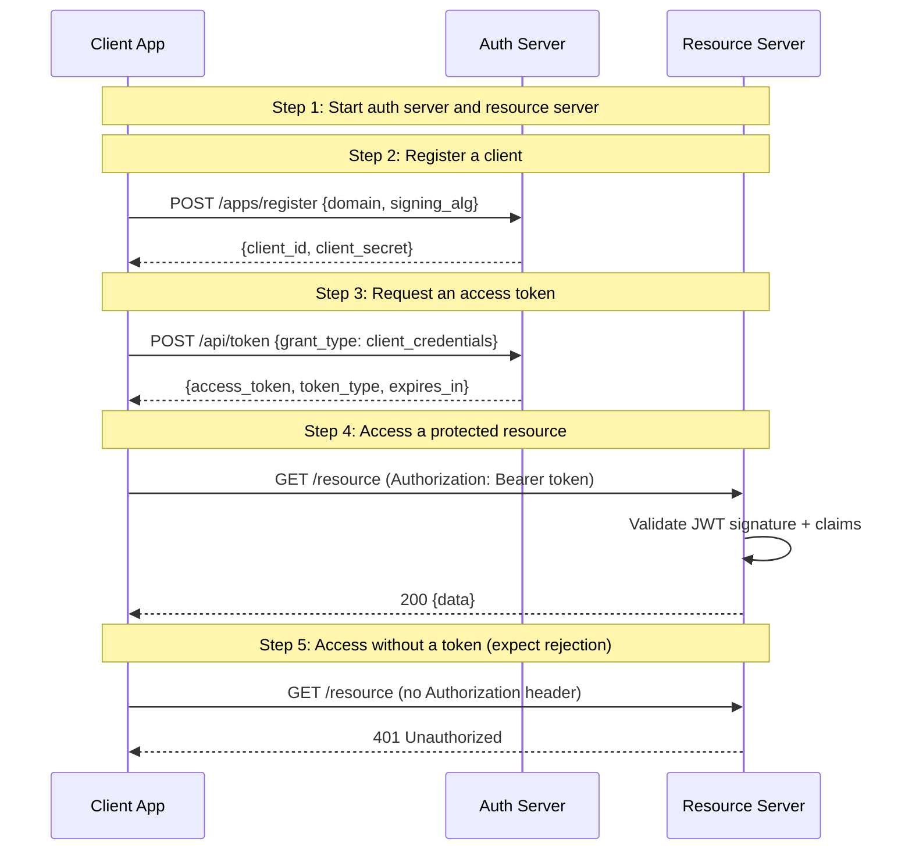

# 01: Client Credentials Flow

Non-UI | No infrastructure needed | RFC 6749 §4.4

## What you'll learn

- **Start auth server and resource server** — We spin up two in-process HTTP servers: one for the AS (issues tokens) and one for the RS (validates them). Both share the same KeyStore.
- **Register a client** — The client receives credentials it will use to authenticate in the next step.
- **Request an access token** — The AS verifies the client credentials and returns a signed JWT. The token carries sub=client_id (no user context in this flow).
- **Access a protected resource** — The resource server validates the JWT signature and extracts claims from it. No network call to the auth server.
- **Access without a token (expect rejection)** — Without a valid Bearer token, the resource server rejects the request.

## Flow



## Steps

### About this example

**Actors:** App (a bot), Auth Server (AS), Resource Server (RS).
Think: a GitHub bot posting to Slack's API. [What are these?](../README.md#cast-of-characters)

The `client_credentials` grant is the standard OAuth 2.0 machine-to-machine
flow. No user is involved — the bot authenticates directly with its own
credentials and receives an access token.

Common use cases: service-to-service calls, background jobs, CLI tools.

### Step 1: Start auth server and resource server

We spin up two in-process HTTP servers: one for the AS (issues tokens) and one for the RS (validates them). Both share the same KeyStore.

### How client registration works

Before a client can get tokens, it needs to register with the auth server
and receive a `client_id` + `client_secret` pair. This is the equivalent
of going to GitHub Developer Settings → OAuth Apps → "New OAuth App".

In this example, registration is **open** (`NewNoAuth()`) for simplicity.
In production, gate registration with authentication — see
[How does an App get registered?](../README.md#how-does-an-app-get-registered)
for the full spectrum from web dashboards to automated DCR.

**The `client_secret` is a backend credential.** It lives in your server,
not in a browser or mobile app. Never expose it in frontend code.

### Step 2: Register a client

> **References:** [RFC 7591 — Dynamic Client Registration](https://www.rfc-editor.org/rfc/rfc7591)

The client receives credentials it will use to authenticate in the next step.

### Step 3: Request an access token

> **References:** [RFC 6749 §4.4 — Client Credentials Grant](https://www.rfc-editor.org/rfc/rfc6749#section-4.4), [RFC 7519 — JSON Web Token (JWT)](https://www.rfc-editor.org/rfc/rfc7519)

The AS verifies the client credentials and returns a signed JWT. The token carries sub=client_id (no user context in this flow).

### What's in the JWT?

The access token is a signed JWT containing:
- `sub`: the client_id (who this token represents)
- `scopes`: the granted scopes
- `iss`: the issuer URL
- `exp`/`iat`: expiry and issued-at timestamps
- `jti`: unique token ID (for revocation)

The resource server can validate this token locally by checking the
signature — no callback to the auth server needed.

### Step 4: Access a protected resource

> **References:** [RFC 6750 — Bearer Token Usage](https://www.rfc-editor.org/rfc/rfc6750), [RFC 7515 — JSON Web Signature (JWS)](https://www.rfc-editor.org/rfc/rfc7515)

The resource server validates the JWT signature and extracts claims from it. No network call to the auth server.

### Step 5: Access without a token (expect rejection)

> **References:** [RFC 6750 — Bearer Token Usage](https://www.rfc-editor.org/rfc/rfc6750)

Without a valid Bearer token, the resource server rejects the request.

### What's next?

In [02 — Resource Token (HS256)](../02-resource-token-hs256/), you'll see
how a registered app can mint tokens *for individual users*, not just for
itself. This is the federated authentication pattern used by OneAuth's
multi-app architecture.

## References

- [RFC 7519 — JSON Web Token (JWT)](https://www.rfc-editor.org/rfc/rfc7519)
- [RFC 6750 — Bearer Token Usage](https://www.rfc-editor.org/rfc/rfc6750)
- [RFC 7515 — JSON Web Signature (JWS)](https://www.rfc-editor.org/rfc/rfc7515)
- [RFC 7591 — Dynamic Client Registration](https://www.rfc-editor.org/rfc/rfc7591)
- [RFC 6749 §4.4 — Client Credentials Grant](https://www.rfc-editor.org/rfc/rfc6749#section-4.4)

## Run it

```bash
go run ./examples/01-client-credentials/
```

Pass `--non-interactive` to skip pauses:

```bash
go run ./examples/01-client-credentials/ --non-interactive
```
