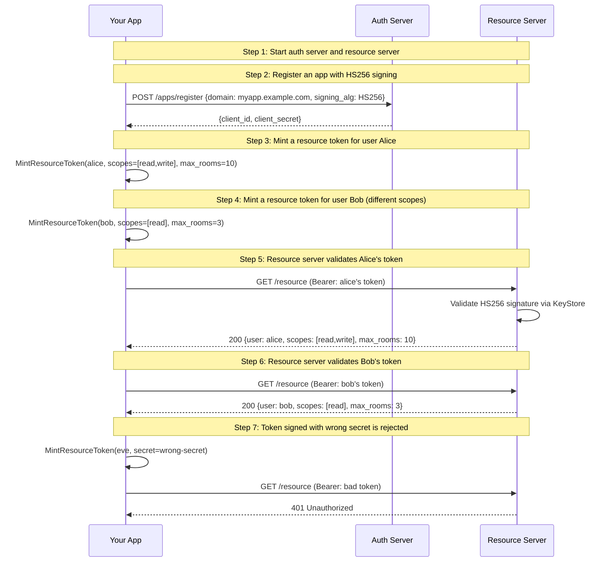

# 02: Resource Token with HS256 (Federated Auth)

Non-UI | No infrastructure needed | Builds on Example 01

## What you'll learn

- **Start auth server and resource server** — Same as Example 01, but now the resource server also extracts the `client_id` claim to know which app minted the token.
- **Register an app with HS256 signing** — The app gets a client_id and a shared secret. The secret is stored in the KeyStore — both the app and resource server can use it for signing/verification.
- **Mint a resource token for user Alice** — The app creates a JWT with sub=alice, signed with its HS256 secret. The token includes quota claims (max_rooms) for resource-level enforcement.
- **Mint a resource token for user Bob (different scopes)** — Same app, different user, different permissions. Bob gets read-only access with a lower room quota.
- **Resource server validates Alice's token** — The resource server validates the JWT using the app's key from the shared KeyStore. It extracts the user ID, scopes, and quota claims.
- **Resource server validates Bob's token** — Same resource server, different user — Bob's token has fewer scopes and a lower quota.
- **Token signed with wrong secret is rejected** — A token signed with the wrong secret fails signature verification — the resource server rejects it immediately.

## Flow



## Steps

### How this differs from Example 01

**Actors:** App, Auth Server (AS), Resource Server (RS).
Think: the GitHub bot now posts to Slack *as Alice*, not as itself.
[What are these?](../README.md#cast-of-characters)

In [01 — Client Credentials](../01-client-credentials/), the bot got a token
representing *itself* (sub=client_id). That's machine-to-machine auth.

Here, the app registers with the auth server and gets a shared secret (HS256).
Then it uses `admin.MintResourceToken()` to create JWTs *for individual users*.
Each token carries:
- `sub` = the user's ID (not the app's)
- `client_id` = the app that minted it
- `scopes` = what this user can do
- Quota claims (max_rooms, max_msg_rate) for resource-level limits

The resource server validates these tokens using the same KeyStore — it trusts
the app's signing key without calling back to the auth server.

### Step 1: Start auth server and resource server

Same as Example 01, but now the resource server also extracts the `client_id` claim to know which app minted the token.

### Step 2: Register an app with HS256 signing

> **References:** [RFC 7515 — JSON Web Signature (JWS)](https://www.rfc-editor.org/rfc/rfc7515)

The app gets a client_id and a shared secret. The secret is stored in the KeyStore — both the app and resource server can use it for signing/verification.

### MintResourceToken vs client_credentials

`MintResourceToken` is a library call, not an HTTP endpoint. The app calls it
directly in its own process to create a JWT signed with the shared secret.

This is different from the `client_credentials` grant in Example 01, where the
app POSTs to the auth server's token endpoint. Here the app is trusted to mint
tokens itself — the auth server just manages key registration.

Think of it like this:
- **client_credentials**: "Auth server, give ME a token"
- **MintResourceToken**: "I'll make a token FOR this user, signed with my key"

### Step 3: Mint a resource token for user Alice

> **References:** [RFC 7519 — JSON Web Token (JWT)](https://www.rfc-editor.org/rfc/rfc7519), [RFC 7515 — JSON Web Signature (JWS)](https://www.rfc-editor.org/rfc/rfc7515), [RFC 7638 — JWK Thumbprint (kid)](https://www.rfc-editor.org/rfc/rfc7638)

The app creates a JWT with sub=alice, signed with its HS256 secret. The token includes quota claims (max_rooms) for resource-level enforcement.

### Step 4: Mint a resource token for user Bob (different scopes)

> **References:** [RFC 7519 — JSON Web Token (JWT)](https://www.rfc-editor.org/rfc/rfc7519)

Same app, different user, different permissions. Bob gets read-only access with a lower room quota.

### Step 5: Resource server validates Alice's token

> **References:** [RFC 6750 — Bearer Token Usage](https://www.rfc-editor.org/rfc/rfc6750), [RFC 7515 — JSON Web Signature (JWS)](https://www.rfc-editor.org/rfc/rfc7515)

The resource server validates the JWT using the app's key from the shared KeyStore. It extracts the user ID, scopes, and quota claims.

### Step 6: Resource server validates Bob's token

Same resource server, different user — Bob's token has fewer scopes and a lower quota.

### Step 7: Token signed with wrong secret is rejected

> **References:** [RFC 7515 — JSON Web Signature (JWS)](https://www.rfc-editor.org/rfc/rfc7515)

A token signed with the wrong secret fails signature verification — the resource server rejects it immediately.

### What's next?

In [03 — Resource Token (RS256 + JWKS)](../03-resource-token-rs256-jwks/),
you'll see the asymmetric version: the app registers a public key, serves it
via JWKS, and the resource server discovers it automatically. No shared
secrets — the resource server never sees the private key.

## References

- [RFC 7638 — JWK Thumbprint (kid)](https://www.rfc-editor.org/rfc/rfc7638)
- [RFC 6750 — Bearer Token Usage](https://www.rfc-editor.org/rfc/rfc6750)
- [RFC 7515 — JSON Web Signature (JWS)](https://www.rfc-editor.org/rfc/rfc7515)
- [RFC 7519 — JSON Web Token (JWT)](https://www.rfc-editor.org/rfc/rfc7519)

## Run it

```bash
go run ./examples/02-resource-token-hs256/
```

Pass `--non-interactive` to skip pauses:

```bash
go run ./examples/02-resource-token-hs256/ --non-interactive
```
