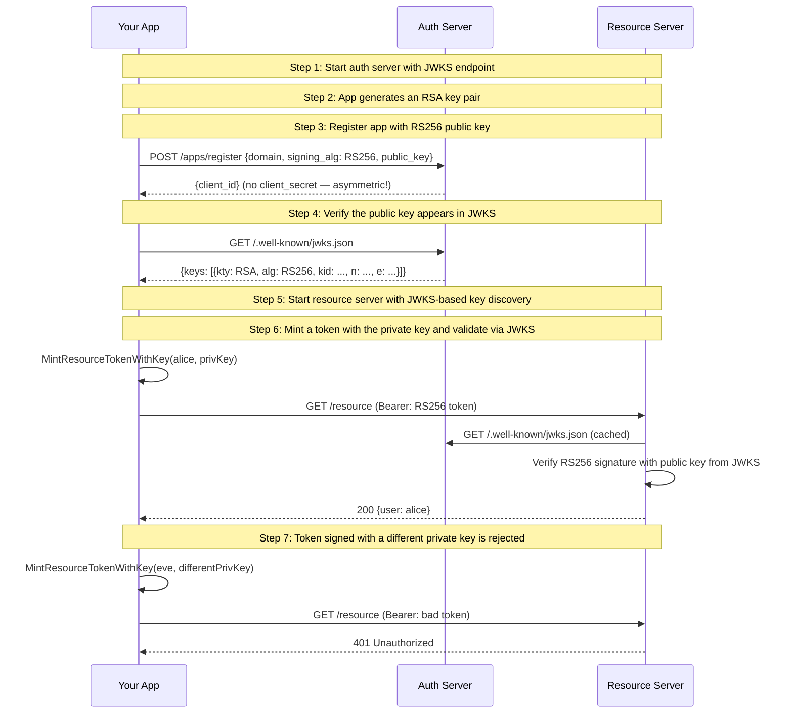

# 03: Resource Token with RS256 + JWKS Discovery

Non-UI | No infrastructure needed | Builds on Example 02

## What you'll learn

- **Start auth server with JWKS endpoint** — The auth server now serves two endpoints: /apps/ for registration and /.well-known/jwks.json for public key discovery.
- **App generates an RSA key pair** — The app generates a 2048-bit RSA key pair. The private key stays with the app. The public key will be registered with the auth server.
- **Register app with RS256 public key** — Unlike HS256 registration, no secret is returned. The auth server stores the public key and serves it via JWKS.
- **Verify the public key appears in JWKS** — The JWKS endpoint serves only public keys — HS256 secrets are never exposed. Each key includes a kid (Key ID) computed from the key thumbprint (RFC 7638).
- **Start resource server with JWKS-based key discovery** — The resource server points its JWKSKeyStore at the auth server's JWKS URL. It automatically fetches and caches the public keys.
- **Mint a token with the private key and validate via JWKS** — The token's kid header tells the resource server which key to use. The signature is verified with the public key — the private key was never shared.
- **Token signed with a different private key is rejected** — Even though the token is a valid JWT, its kid doesn't match any key in JWKS, or the signature doesn't verify with the registered public key.

## Flow



## Steps

### Why asymmetric signing?

**Actors:** App, Auth Server (AS), Resource Server (RS).
Think: the GitHub bot gets its own key pair — Slack's API never sees the private key.
[What are these?](../README.md#cast-of-characters)

In [02 — HS256](../02-resource-token-hs256/), both the app and resource server
share the same secret. That works, but it means:
- The resource server *could* forge tokens (it has the signing key)
- Compromising the resource server compromises the signing key
- Rotating keys requires coordinating both sides

With RS256 (asymmetric):
- The app keeps the private key — only it can sign tokens
- The resource server only has the public key — it can verify but never forge
- The public key is served via JWKS — resource servers discover it automatically
- Key rotation is seamless: publish a new key to JWKS, resource servers pick it up

### Step 1: Start auth server with JWKS endpoint

> **References:** [RFC 7517 — JSON Web Key (JWK)](https://www.rfc-editor.org/rfc/rfc7517)

The auth server now serves two endpoints: /apps/ for registration and /.well-known/jwks.json for public key discovery.

### Step 2: App generates an RSA key pair

> **References:** [RFC 7515 — JSON Web Signature (JWS)](https://www.rfc-editor.org/rfc/rfc7515)

The app generates a 2048-bit RSA key pair. The private key stays with the app. The public key will be registered with the auth server.

### Step 3: Register app with RS256 public key

> **References:** [RFC 7517 — JSON Web Key (JWK)](https://www.rfc-editor.org/rfc/rfc7517)

Unlike HS256 registration, no secret is returned. The auth server stores the public key and serves it via JWKS.

### Step 4: Verify the public key appears in JWKS

> **References:** [RFC 7517 — JSON Web Key (JWK)](https://www.rfc-editor.org/rfc/rfc7517), [RFC 7638 — JWK Thumbprint (kid)](https://www.rfc-editor.org/rfc/rfc7638)

The JWKS endpoint serves only public keys — HS256 secrets are never exposed. Each key includes a kid (Key ID) computed from the key thumbprint (RFC 7638).

### How JWKS discovery works

The resource server doesn't need the auth server's key ahead of time.
It uses `JWKSKeyStore` which:
1. Fetches `/.well-known/jwks.json` from the auth server
2. Caches the keys locally
3. When a token arrives with a `kid` header, looks up the matching key
4. Periodically refreshes to pick up new/rotated keys

This is the same mechanism Keycloak, Auth0, and other IdPs use.

### Step 5: Start resource server with JWKS-based key discovery

> **References:** [RFC 7517 — JSON Web Key (JWK)](https://www.rfc-editor.org/rfc/rfc7517)

The resource server points its JWKSKeyStore at the auth server's JWKS URL. It automatically fetches and caches the public keys.

### Step 6: Mint a token with the private key and validate via JWKS

> **References:** [RFC 7519 — JSON Web Token (JWT)](https://www.rfc-editor.org/rfc/rfc7519), [RFC 7515 — JSON Web Signature (JWS)](https://www.rfc-editor.org/rfc/rfc7515), [RFC 7638 — JWK Thumbprint (kid)](https://www.rfc-editor.org/rfc/rfc7638)

The token's kid header tells the resource server which key to use. The signature is verified with the public key — the private key was never shared.

### Step 7: Token signed with a different private key is rejected

> **References:** [RFC 7515 — JSON Web Signature (JWS)](https://www.rfc-editor.org/rfc/rfc7515)

Even though the token is a valid JWT, its kid doesn't match any key in JWKS, or the signature doesn't verify with the registered public key.

### HS256 vs RS256 — when to use which

| | HS256 (Example 02) | RS256 (this example) |
|---|---|---|
| **Key type** | Shared secret | Public/private key pair |
| **Who can sign** | Anyone with the secret | Only the private key holder |
| **Who can verify** | Anyone with the secret | Anyone with the public key |
| **Key distribution** | Must be kept secret on both sides | Public key is... public |
| **JWKS** | Secrets excluded from JWKS | Public keys served via JWKS |
| **Best for** | Simple setups, trusted environments | Multi-service, zero-trust |

**Rule of thumb:** Use RS256 when the resource server is a separate service.
Use HS256 when the app and resource server are the same process or fully trusted.

### What's next?

In [04 — Discovery](../04-discovery/), you'll see how clients can
auto-discover the auth server's endpoints (token, JWKS, introspection)
without hardcoding URLs. This is the foundation for interoperability
with external IdPs like Keycloak and Auth0.

## References

- [RFC 7638 — JWK Thumbprint (kid)](https://www.rfc-editor.org/rfc/rfc7638)
- [RFC 7519 — JSON Web Token (JWT)](https://www.rfc-editor.org/rfc/rfc7519)
- [RFC 7517 — JSON Web Key (JWK)](https://www.rfc-editor.org/rfc/rfc7517)
- [RFC 7515 — JSON Web Signature (JWS)](https://www.rfc-editor.org/rfc/rfc7515)

## Run it

```bash
go run ./examples/03-resource-token-rs256-jwks/
```

Pass `--non-interactive` to skip pauses:

```bash
go run ./examples/03-resource-token-rs256-jwks/ --non-interactive
```
