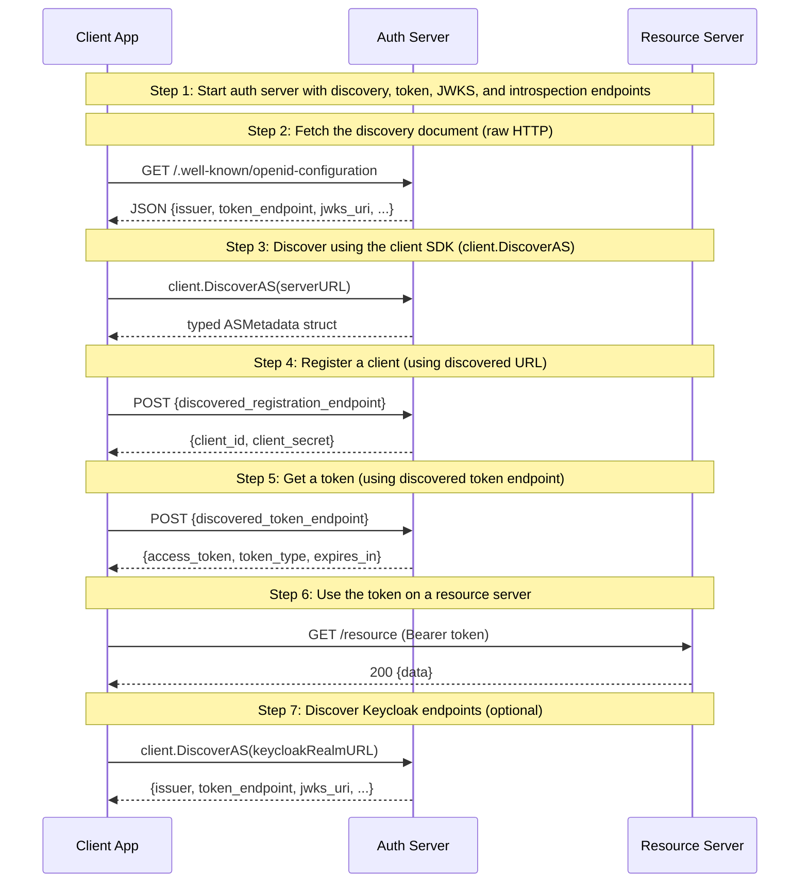

# 04: AS Metadata Discovery

Non-UI | No infrastructure needed | Builds on Examples 01-03

## What you'll learn

- **Start auth server with discovery, token, JWKS, and introspection endpoints** — This is the most complete auth server we've built so far — it serves discovery, tokens, JWKS, introspection, and registration.
- **Fetch the discovery document (raw HTTP)** — The discovery document is a JSON object listing every endpoint the server supports. This is the same format Keycloak, Auth0, and Google use.
- **Discover using the client SDK (client.DiscoverAS)** — client.DiscoverAS() fetches and parses the metadata into a typed Go struct. Production code should use this — no manual JSON parsing needed.
- **Register a client (using discovered URL)** — Instead of hardcoding /apps/register, we use the registration_endpoint from discovery. The same code works against OneAuth, Keycloak, or any RFC 8414-compliant server.
- **Get a token (using discovered token endpoint)** — We use discoveredMeta.TokenEndpoint instead of hardcoding /api/token. This is the key benefit — the same client code works against any compliant AS.
- **Use the token on a resource server** — The resource server validates the token as in previous examples. Discovery doesn't change how tokens work — it only changes how the client finds the endpoints.
- **Discover Keycloak endpoints (optional)** — Same DiscoverAS() call, completely different server. If Keycloak isn't running, this step is skipped — run 'make upkcl' in examples/ to start it.

## Flow



## Steps

### About this example

**Actors:** App (a bot), Auth Server (AS), Resource Server (RS).
Think: the GitHub bot doesn't know Slack's token URL — it discovers it.
[What are these?](../README.md#cast-of-characters)

In Examples 01-03, we hardcoded the auth server's URLs:
```go
http.PostForm(authServer.URL + "/api/token", ...)  // hardcoded path
```

In production, you don't know the paths ahead of time. Different auth servers
use different URL structures (Keycloak: `/realms/{name}/protocol/openid-connect/token`,
Auth0: `/oauth/token`, OneAuth: `/api/token`).

RFC 8414 solves this: every auth server publishes a JSON document at
`/.well-known/openid-configuration` listing all its endpoints.
Clients fetch this once and use the discovered URLs for everything.

### Step 1: Start auth server with discovery, token, JWKS, and introspection endpoints

> **References:** [RFC 8414 — AS Metadata Discovery](https://www.rfc-editor.org/rfc/rfc8414)

This is the most complete auth server we've built so far — it serves discovery, tokens, JWKS, introspection, and registration.

### Step 2: Fetch the discovery document (raw HTTP)

> **References:** [RFC 8414 — AS Metadata Discovery](https://www.rfc-editor.org/rfc/rfc8414)

The discovery document is a JSON object listing every endpoint the server supports. This is the same format Keycloak, Auth0, and Google use.

### What's in the metadata?

| Field | What it tells the client |
|-------|------------------------|
| `issuer` | The AS's canonical URL — must match the `iss` claim in tokens |
| `token_endpoint` | Where to POST for tokens (client_credentials, auth code) |
| `jwks_uri` | Where to GET public keys for token verification |
| `introspection_endpoint` | Where to POST for token introspection (RFC 7662) |
| `registration_endpoint` | Where to POST for dynamic client registration (RFC 7591) |
| `scopes_supported` | What scopes the AS recognizes |
| `grant_types_supported` | What OAuth grant types are available |
| `token_endpoint_auth_methods_supported` | How clients can authenticate (basic, post) |
| `code_challenge_methods_supported` | PKCE methods (S256) |

A client only needs to know the server's base URL. Everything else is discovered.

### Step 3: Discover using the client SDK (client.DiscoverAS)

> **References:** [RFC 8414 — AS Metadata Discovery](https://www.rfc-editor.org/rfc/rfc8414)

client.DiscoverAS() fetches and parses the metadata into a typed Go struct. Production code should use this — no manual JSON parsing needed.

### Step 4: Register a client (using discovered URL)

Instead of hardcoding /apps/register, we use the registration_endpoint from discovery. The same code works against OneAuth, Keycloak, or any RFC 8414-compliant server.

### Step 5: Get a token (using discovered token endpoint)

> **References:** [RFC 6749 §4.4 — Client Credentials Grant](https://www.rfc-editor.org/rfc/rfc6749#section-4.4)

We use discoveredMeta.TokenEndpoint instead of hardcoding /api/token. This is the key benefit — the same client code works against any compliant AS.

### Step 6: Use the token on a resource server

> **References:** [RFC 6750 — Bearer Token Usage](https://www.rfc-editor.org/rfc/rfc6750)

The resource server validates the token as in previous examples. Discovery doesn't change how tokens work — it only changes how the client finds the endpoints.

### Step 7: Discover Keycloak endpoints (optional)

> **References:** [RFC 8414 — AS Metadata Discovery](https://www.rfc-editor.org/rfc/rfc8414)

Same DiscoverAS() call, completely different server. If Keycloak isn't running, this step is skipped — run 'make upkcl' in examples/ to start it.

### Why discovery matters

Without discovery, switching auth providers means updating every URL in your code.
With discovery, you change one base URL and everything else adapts:

```go
// Works against OneAuth, Keycloak, Auth0 — same code
meta, _ := client.DiscoverAS("https://auth.example.com")
http.PostForm(meta.TokenEndpoint, ...)       // discovered
jwksKS := keys.NewJWKSKeyStore(meta.JWKSURI) // discovered
```

This is especially important for the [Keycloak interop tests](../../tests/keycloak/)
where the same test code validates against both Keycloak and OneAuth.

### What's next?

In [05 — Introspection](../05-introspection/), you'll see how resource
servers can validate tokens remotely by asking the auth server "is this
token valid?" — an alternative to local JWT verification that works even
for opaque tokens.

## References

- [RFC 6749 §4.4 — Client Credentials Grant](https://www.rfc-editor.org/rfc/rfc6749#section-4.4)
- [RFC 6750 — Bearer Token Usage](https://www.rfc-editor.org/rfc/rfc6750)
- [RFC 8414 — AS Metadata Discovery](https://www.rfc-editor.org/rfc/rfc8414)

## Run it

```bash
go run ./examples/04-discovery/
```

Pass `--non-interactive` to skip pauses:

```bash
go run ./examples/04-discovery/ --non-interactive
```
