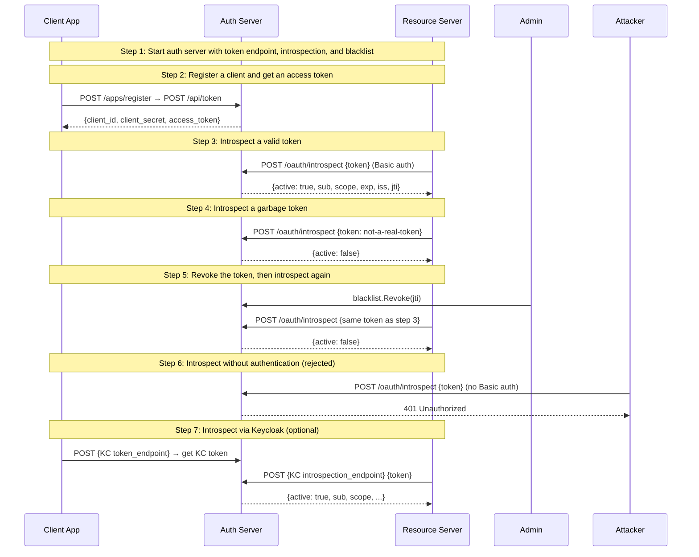

# 05: Token Introspection

Non-UI | No infrastructure needed | Builds on Example 04

## What you'll learn

- **Start auth server with token endpoint, introspection, and blacklist** — The auth server now has a blacklist for token revocation. The introspection endpoint checks it before responding.
- **Register a client and get an access token** — Same as Example 01 — register, then client_credentials grant. The token includes a jti (JWT ID) claim used for revocation.
- **Introspect a valid token** — The RS authenticates with its own credentials (same client in this example). The response includes the token's claims — the RS doesn't need to decode the JWT itself.
- **Introspect a garbage token** — Invalid tokens always return {active: false} — the AS never reveals why. This is a security requirement of RFC 7662.
- **Revoke the token, then introspect again** — After revocation, the same token that was valid in step 3 now returns active=false. This is the key advantage over local JWT validation — revocation takes effect immediately.
- **Introspect without authentication (rejected)** — The introspection endpoint requires the caller to authenticate. An unauthenticated request is rejected — you can't fish for valid tokens.
- **Introspect via Keycloak (optional)** — Same introspection flow against Keycloak. If KC isn't running, this step is skipped — run 'make upkcl' in examples/ to start it.

## Flow



## Steps

### About this example

**Actors:** App, Auth Server (AS), Resource Server (RS).
Think: Slack's API asks Slack's identity service "is this bot's token still valid?"
[What are these?](../README.md#cast-of-characters)

In Examples 01-04, the resource server validated JWTs locally — fast, but
it can't detect revoked tokens until they expire.

Token introspection (RFC 7662) is the alternative: the RS sends the token
to the AS's introspection endpoint and gets back `{active: true/false}` plus
the token's claims. The AS checks its blacklist before responding.

**When to use which:**
| Method | Speed | Revocation | Use when |
|--------|-------|-----------|----------|
| Local JWT validation | Fast (no network) | Not immediate | Most requests, short-lived tokens |
| Introspection | Slower (HTTP call) | Immediate | Sensitive ops, long-lived tokens, revocation needed |
| Both (hybrid) | Best of both | Immediate | Validate locally, introspect on failure or for critical ops |

### Step 1: Start auth server with token endpoint, introspection, and blacklist

> **References:** [RFC 7662 — Token Introspection](https://www.rfc-editor.org/rfc/rfc7662)

The auth server now has a blacklist for token revocation. The introspection endpoint checks it before responding.

### Step 2: Register a client and get an access token

> **References:** [RFC 6749 §4.4 — Client Credentials Grant](https://www.rfc-editor.org/rfc/rfc6749#section-4.4), [RFC 7519 — JSON Web Token (JWT)](https://www.rfc-editor.org/rfc/rfc7519)

Same as Example 01 — register, then client_credentials grant. The token includes a jti (JWT ID) claim used for revocation.

### How introspection works

The resource server POSTs the token to `/oauth/introspect` and authenticates
itself with HTTP Basic auth (its own client_id + secret). The AS:

1. Authenticates the caller (is this a registered resource server?)
2. Validates the token (signature, expiry)
3. Checks the blacklist (has this token been revoked?)
4. Returns `{active: true, sub, scope, exp, ...}` or `{active: false}`

**Security:** The introspection endpoint never reveals *why* a token is invalid.
Expired, revoked, malformed — all return `{active: false}`. This prevents
information leakage to potentially malicious callers.

### Step 3: Introspect a valid token

> **References:** [RFC 7662 — Token Introspection](https://www.rfc-editor.org/rfc/rfc7662)

The RS authenticates with its own credentials (same client in this example). The response includes the token's claims — the RS doesn't need to decode the JWT itself.

### Step 4: Introspect a garbage token

> **References:** [RFC 7662 — Token Introspection](https://www.rfc-editor.org/rfc/rfc7662)

Invalid tokens always return {active: false} — the AS never reveals why. This is a security requirement of RFC 7662.

### Step 5: Revoke the token, then introspect again

> **References:** [RFC 7662 — Token Introspection](https://www.rfc-editor.org/rfc/rfc7662)

After revocation, the same token that was valid in step 3 now returns active=false. This is the key advantage over local JWT validation — revocation takes effect immediately.

### Step 6: Introspect without authentication (rejected)

> **References:** [RFC 7662 — Token Introspection](https://www.rfc-editor.org/rfc/rfc7662)

The introspection endpoint requires the caller to authenticate. An unauthenticated request is rejected — you can't fish for valid tokens.

### Step 7: Introspect via Keycloak (optional)

> **References:** [RFC 7662 — Token Introspection](https://www.rfc-editor.org/rfc/rfc7662)

Same introspection flow against Keycloak. If KC isn't running, this step is skipped — run 'make upkcl' in examples/ to start it.

### Introspection vs local validation — the tradeoff

```
Local JWT validation:     RS checks signature locally
  + No network call        ← fast
  + Works offline          ← resilient
  - Can't detect revocation until token expires

Introspection:            RS asks AS on every request
  + Revocation is immediate
  + Works with opaque (non-JWT) tokens
  - Adds latency (HTTP round-trip)
  - AS becomes a dependency

Hybrid (production pattern):
  1. Validate JWT locally first (fast path)
  2. If local validation fails, fall back to introspection
  3. For critical operations, always introspect
```

OneAuth's `APIMiddleware` supports the hybrid model via the `Introspection`
field — set it to enable automatic fallback to introspection.

### What's next?

In [06 — Dynamic Client Registration](../06-dynamic-client-registration/),
you'll see how apps can register themselves programmatically via RFC 7591 —
no admin dashboard needed. This is how third-party integrations onboard.

## References

- [RFC 7662 — Token Introspection](https://www.rfc-editor.org/rfc/rfc7662)
- [RFC 6749 §4.4 — Client Credentials Grant](https://www.rfc-editor.org/rfc/rfc6749#section-4.4)
- [RFC 7519 — JSON Web Token (JWT)](https://www.rfc-editor.org/rfc/rfc7519)

## Run it

```bash
go run ./examples/05-introspection/
```

Pass `--non-interactive` to skip pauses:

```bash
go run ./examples/05-introspection/ --non-interactive
```
