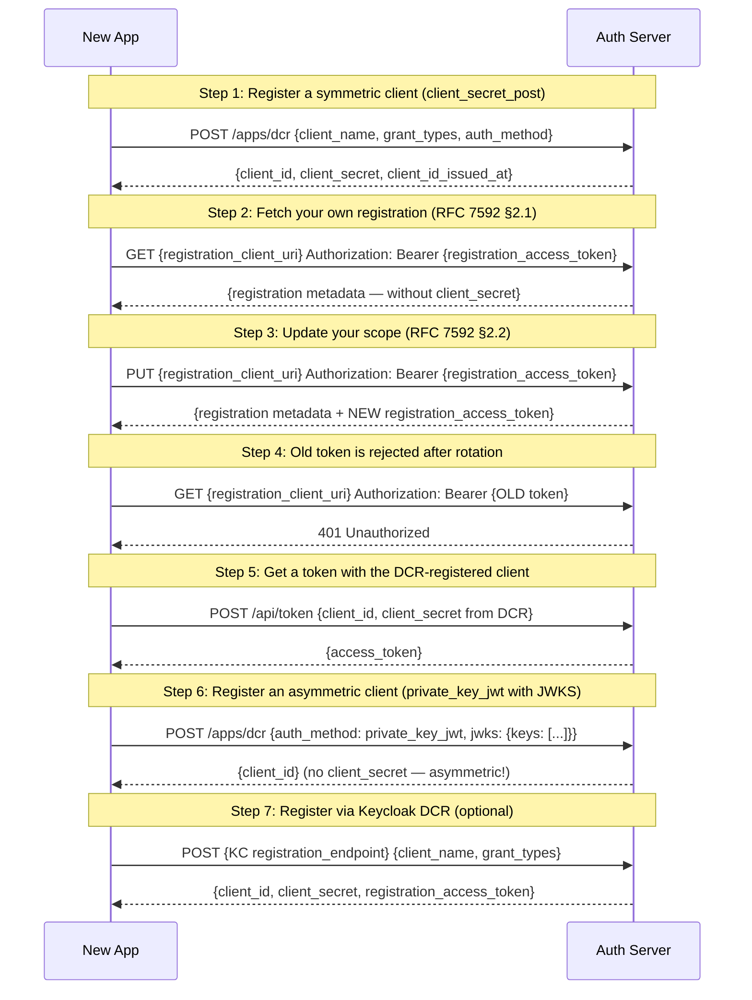

# 06: Dynamic Client Registration

Non-UI | No infrastructure needed | Builds on Example 04

## What you'll learn

- **Register a symmetric client (client_secret_post)** — The simplest DCR: the AS generates both a client_id and client_secret. The client uses client_secret_post to authenticate at the token endpoint.
- **Fetch your own registration (RFC 7592 §2.1)** — client.GetRegistration is a thin SDK wrapper. Note the response intentionally omits client_secret on read — re-emitting symmetric credentials on every fetch enlarges disclosure if the access token leaks. Clients that lose the secret will rotate via PUT (#169).
- **Update your scope (RFC 7592 §2.2)** — PUT is a full replacement (not PATCH-style merge): any field omitted from the body is cleared. The AS rotates the registration_access_token on success — the response includes a NEW token that supersedes the one passed in. The OneAuth server also rejects token_endpoint_auth_method changes (those require re-keying; clients DELETE + re-register instead).
- **Old token is rejected after rotation** — After PUT rotates the token, attempting to reuse the *previous* registration_access_token must fail with 401 — even though the client_id is still valid. This is the security guarantee of rotation: a leaked-then-rotated token cannot be replayed.
- **Get a token with the DCR-registered client** — The dynamically registered client works exactly like a manually registered one — the AS doesn't distinguish between registration methods.
- **Register an asymmetric client (private_key_jwt with JWKS)** — For asymmetric auth, the client sends its public key as a JWK set. No secret is returned — the client authenticates with signed JWTs using its private key.
- **Register via Keycloak DCR (optional)** — Same DCR request format against Keycloak. KC returns additional fields like registration_access_token for client management. If KC isn't running, this step is skipped.

## Flow



## Steps

### About this example

**Actors:** App (a new third-party integration), Auth Server (AS).
Think: a developer builds a new Slack bot and registers it via API — no admin dashboard needed.
[What are these?](../README.md#cast-of-characters)

In Examples 01-05, we registered via `/apps/register` — OneAuth's proprietary
endpoint. RFC 7591 defines a standard registration API that works across providers:

| Endpoint | Standard | Works with |
|----------|----------|-----------|
| `/apps/register` | OneAuth proprietary | OneAuth only |
| `/apps/dcr` | RFC 7591 | OneAuth, Keycloak, Auth0, any compliant AS |

DCR lets apps self-register by posting their metadata (name, redirect URIs,
grant types, auth method). The AS creates the client and returns credentials.

### DCR request format (RFC 7591 §2)

A DCR request is a JSON object with client metadata:
```json
{
  "client_name": "My Bot",
  "client_uri": "https://mybot.example.com",
  "grant_types": ["client_credentials"],
  "token_endpoint_auth_method": "client_secret_post",
  "scope": "read write"
}
```

The AS responds with the registered client metadata plus generated credentials:
```json
{
  "client_id": "app_abc123...",
  "client_secret": "7f3e8a...",
  "client_id_issued_at": 1700000000,
  "client_name": "My Bot",
  "token_endpoint_auth_method": "client_secret_post"
}
```

### Step 1: Register a symmetric client (client_secret_post)

> **References:** [RFC 7591 — Dynamic Client Registration](https://www.rfc-editor.org/rfc/rfc7591)

The simplest DCR: the AS generates both a client_id and client_secret. The client uses client_secret_post to authenticate at the token endpoint.

#### Reproduce on the wire

```bash
curl -s -X POST http://localhost:8081/apps/dcr \
  -H 'Content-Type: application/json' \
  -d '{
    "client_name":"My Example Bot",
    "client_uri":"https://bot.example.com",
    "grant_types":["client_credentials"],
    "token_endpoint_auth_method":"client_secret_post",
    "scope":"read write"
  }' | jq
```

### RFC 7592: managing your own registration

Notice the response above includes two extra fields:

- `registration_access_token` — a Bearer token tied to **this specific client_id**
- `registration_client_uri` — the management endpoint for this registration

These come from RFC 7592 (Dynamic Client Registration *Management*). Once a client
is registered, holding the access token lets the client read, update, or delete
its own registration without going through an admin — a self-service lifecycle.

OneAuth issue 168 ships GET (read); 169 / 170 will add PUT (update) and DELETE.

### Step 2: Fetch your own registration (RFC 7592 §2.1)

> **References:** [RFC 7592 — Dynamic Client Registration Management](https://www.rfc-editor.org/rfc/rfc7592)

client.GetRegistration is a thin SDK wrapper. Note the response intentionally omits client_secret on read — re-emitting symmetric credentials on every fetch enlarges disclosure if the access token leaks. Clients that lose the secret will rotate via PUT (#169).

#### Reproduce on the wire

```bash
curl -s -X GET '<registration_client_uri>' \
  -H 'Authorization: Bearer <registration_access_token>' | jq
```

### Step 3: Update your scope (RFC 7592 §2.2)

> **References:** [RFC 7592 — Dynamic Client Registration Management](https://www.rfc-editor.org/rfc/rfc7592)

PUT is a full replacement (not PATCH-style merge): any field omitted from the body is cleared. The AS rotates the registration_access_token on success — the response includes a NEW token that supersedes the one passed in. The OneAuth server also rejects token_endpoint_auth_method changes (those require re-keying; clients DELETE + re-register instead).

#### Reproduce on the wire

```bash
curl -s -X PUT '<registration_client_uri>' \
  -H 'Authorization: Bearer <registration_access_token>' \
  -H 'Content-Type: application/json' \
  -d '{
    "client_id":"<from registration>",
    "client_name":"My Example Bot",
    "client_uri":"https://bot.example.com",
    "grant_types":["client_credentials"],
    "token_endpoint_auth_method":"client_secret_post",
    "scope":"read write admin"
  }' | jq
```

### Step 4: Old token is rejected after rotation

> **References:** [RFC 7592 — Dynamic Client Registration Management](https://www.rfc-editor.org/rfc/rfc7592)

After PUT rotates the token, attempting to reuse the *previous* registration_access_token must fail with 401 — even though the client_id is still valid. This is the security guarantee of rotation: a leaked-then-rotated token cannot be replayed.

### Step 5: Get a token with the DCR-registered client

> **References:** [RFC 6749 §4.4 — Client Credentials Grant](https://www.rfc-editor.org/rfc/rfc6749#section-4.4)

The dynamically registered client works exactly like a manually registered one — the AS doesn't distinguish between registration methods.

#### Reproduce on the wire

```bash
curl -s -X POST http://localhost:8081/api/token \
  -d 'grant_type=client_credentials' \
  -d 'client_id=<from DCR>' \
  -d 'client_secret=<from DCR>' \
  -d 'scope=read' | jq
```

### Step 6: Register an asymmetric client (private_key_jwt with JWKS)

> **References:** [RFC 7591 — Dynamic Client Registration](https://www.rfc-editor.org/rfc/rfc7591), [RFC 7517 — JSON Web Key (JWK)](https://www.rfc-editor.org/rfc/rfc7517)

For asymmetric auth, the client sends its public key as a JWK set. No secret is returned — the client authenticates with signed JWTs using its private key.

#### Reproduce on the wire

```bash
# Replace JWK_JSON with a single JWK for your public key (kty/n/e for RSA, kty/x/y for EC)
JWK_JSON='{"kty":"RSA","alg":"RS256","kid":"...","n":"...","e":"AQAB"}'
curl -s -X POST http://localhost:8081/apps/dcr \
  -H 'Content-Type: application/json' \
  -d "{
    \"client_name\":\"My Secure Service\",
    \"grant_types\":[\"client_credentials\"],
    \"token_endpoint_auth_method\":\"private_key_jwt\",
    \"jwks\":{\"keys\":[$JWK_JSON]}
  }" | jq
```

### Symmetric vs asymmetric DCR

| | client_secret_post / basic | private_key_jwt |
|---|---|---|
| **DCR sends** | Just metadata | Metadata + JWKS (public key) |
| **AS returns** | client_id + client_secret | client_id only (no secret) |
| **Token auth** | Send secret in request | Sign a JWT with private key |
| **Key in JWKS** | Not in JWKS (secret) | Public key served in JWKS |
| **Best for** | Simple integrations | High-security, multi-service |

### Step 7: Register via Keycloak DCR (optional)

> **References:** [RFC 7591 — Dynamic Client Registration](https://www.rfc-editor.org/rfc/rfc7591)

Same DCR request format against Keycloak. KC returns additional fields like registration_access_token for client management. If KC isn't running, this step is skipped.

### What's next?

In [07 — Client SDK](../07-client-sdk/), you'll see production patterns:
automatic token caching, background refresh, scope step-up, and discovery-driven
configuration — all wrapped in a simple `TokenSource` interface.

## References

- [RFC 6749 §4.4 — Client Credentials Grant](https://www.rfc-editor.org/rfc/rfc6749#section-4.4)
- [RFC 7517 — JSON Web Key (JWK)](https://www.rfc-editor.org/rfc/rfc7517)
- [RFC 7591 — Dynamic Client Registration](https://www.rfc-editor.org/rfc/rfc7591)
- [RFC 7592 — Dynamic Client Registration Management](https://www.rfc-editor.org/rfc/rfc7592)

## Run it

```bash
go run ./examples/06-dynamic-client-registration/
```

Pass `--non-interactive` to skip pauses:

```bash
go run ./examples/06-dynamic-client-registration/ --non-interactive
```
