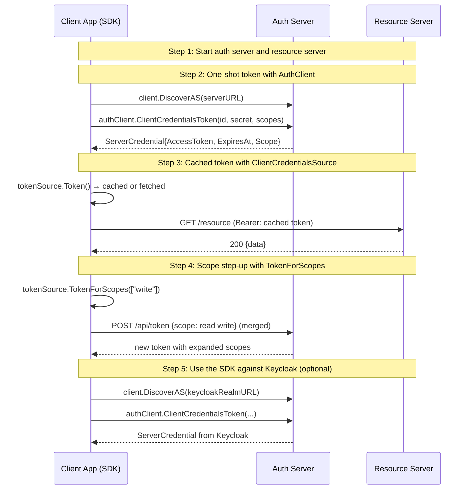

# 07: Client SDK — Production Patterns

Non-UI | No infrastructure needed | Builds on Examples 01-06

## What you'll learn

- **Start auth server and resource server** — Same auth server as previous examples. We also pre-register a client since the SDK focuses on token acquisition, not registration.
- **One-shot token with AuthClient** — AuthClient is the low-level SDK: discover endpoints, then make a single token request. Good for one-off calls. Uses discovery to find the token endpoint automatically.
- **Cached token with ClientCredentialsSource** — ClientCredentialsSource implements TokenSource: Token() returns a cached token if still valid, or fetches a new one. Multiple goroutines can safely call Token() concurrently.
- **Scope step-up with TokenForScopes** — When your app needs additional permissions, TokenForScopes merges the new scopes with existing ones, invalidates the cache, and fetches a fresh token.
- **Use the SDK against Keycloak (optional)** — Same SDK code, pointed at Keycloak. DiscoverAS finds the KC token endpoint automatically. If KC isn't running, this step is skipped.

## Flow



## Steps

### About this example

**Actors:** App (using the client SDK), Auth Server (AS), Resource Server (RS).
Think: the GitHub bot in production — not making raw HTTP calls, but using a library.
[What are these?](../README.md#cast-of-characters)

In Examples 01-06, we made raw `http.Post` calls to the token endpoint.
That works for learning, but production code needs:
- **Discovery** — don't hardcode URLs (Example 04)
- **Token caching** — don't fetch a new token on every request
- **Auto-refresh** — renew tokens before they expire
- **Scope step-up** — request additional scopes when needed

OneAuth's client SDK wraps all of this in a `TokenSource` interface:
```go
token, err := tokenSource.Token()  // cached, auto-refreshed
```

### Step 1: Start auth server and resource server

Same auth server as previous examples. We also pre-register a client since the SDK focuses on token acquisition, not registration.

### Step 2: One-shot token with AuthClient

> **References:** [RFC 6749 §4.4 — Client Credentials Grant](https://www.rfc-editor.org/rfc/rfc6749#section-4.4), [RFC 8414 — AS Metadata Discovery](https://www.rfc-editor.org/rfc/rfc8414)

AuthClient is the low-level SDK: discover endpoints, then make a single token request. Good for one-off calls. Uses discovery to find the token endpoint automatically.

### AuthClient vs ClientCredentialsSource

| | AuthClient | ClientCredentialsSource |
|---|---|---|
| **Use case** | One-shot token requests | Long-running services |
| **Caching** | None — new request every time | Automatic — reuses valid tokens |
| **Refresh** | Manual | Automatic (on next Token() call) |
| **Interface** | `ClientCredentialsToken()` | `Token() string` (TokenSource) |
| **Scope step-up** | Manual | `TokenForScopes()` |

### Step 3: Cached token with ClientCredentialsSource

> **References:** [RFC 6749 §4.4 — Client Credentials Grant](https://www.rfc-editor.org/rfc/rfc6749#section-4.4)

ClientCredentialsSource implements TokenSource: Token() returns a cached token if still valid, or fetches a new one. Multiple goroutines can safely call Token() concurrently.

### Step 4: Scope step-up with TokenForScopes

When your app needs additional permissions, TokenForScopes merges the new scopes with existing ones, invalidates the cache, and fetches a fresh token.

### TokenSource in practice

The `TokenSource` interface (`Token() (string, error)`) is designed to
plug into HTTP clients, gRPC interceptors, or any code that needs a token:

```go
// Create once, reuse everywhere
ts := &client.ClientCredentialsSource{
    TokenEndpoint: meta.TokenEndpoint,
    ClientID:      "my-app",
    ClientSecret:  "my-secret",
    Scopes:        []string{"read"},
}

// In your HTTP client middleware
token, _ := ts.Token()  // fast: returns cached token
req.Header.Set("Authorization", "Bearer " + token)
```

The interface matches `mcpkit/core.TokenSource` by structural typing —
no cross-module import needed.

### Step 5: Use the SDK against Keycloak (optional)

> **References:** [RFC 8414 — AS Metadata Discovery](https://www.rfc-editor.org/rfc/rfc8414), [RFC 6749 §4.4 — Client Credentials Grant](https://www.rfc-editor.org/rfc/rfc6749#section-4.4)

Same SDK code, pointed at Keycloak. DiscoverAS finds the KC token endpoint automatically. If KC isn't running, this step is skipped.

### What's next?

In [08 — Rich Authorization Requests](../08-rich-authorization-requests/),
you'll see how to go beyond flat scopes: request fine-grained permissions
like "transfer 45 EUR to Merchant A" using RFC 9396.

## References

- [RFC 6749 §4.4 — Client Credentials Grant](https://www.rfc-editor.org/rfc/rfc6749#section-4.4)
- [RFC 8414 — AS Metadata Discovery](https://www.rfc-editor.org/rfc/rfc8414)

## Run it

```bash
go run ./examples/07-client-sdk/
```

Pass `--non-interactive` to skip pauses:

```bash
go run ./examples/07-client-sdk/ --non-interactive
```
