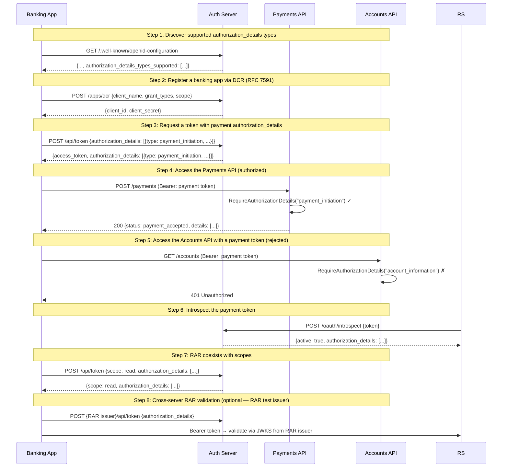

    Auth server:   http://127.0.0.1:60340
    Payments API:  http://127.0.0.1:60341
    Accounts API:  http://127.0.0.1:60342

# 08: Rich Authorization Requests (RFC 9396)

Non-UI | No infrastructure needed | Builds on all previous examples

## What you'll learn

- **Discover supported authorization_details types** — RFC 9396 §10: the AS advertises which authorization_details types it supports. Clients check this before requesting.
- **Register a banking app via DCR (RFC 7591)** — Using standards-compliant DCR (Example 06) instead of the proprietary endpoint. A banking app should be fully standards-based.
- **Request a token with payment authorization_details** — The token request includes structured authorization_details — not just 'scope=payments' but the exact payment to initiate. The AS validates, embeds in the JWT, and echoes in the response.
- **Access the Payments API (authorized)** — The Payments API uses RequireAuthorizationDetails middleware — it checks that the token has a payment_initiation authorization_details entry. The details are available in the request context.
- **Access the Accounts API with a payment token (rejected)** — The payment token has type=payment_initiation but the Accounts API requires type=account_information. Fine-grained enforcement: a payment token can't read account data.
- **Introspect the payment token** — Introspection returns the authorization_details alongside the standard claims. Resource servers that use introspection (instead of local JWT validation) get the same fine-grained information.
- **RAR coexists with scopes** — Scopes and authorization_details are independent — you can use both in the same request. Scopes for coarse-grained access, RAR for fine-grained.
- **Cross-server RAR validation (optional — RAR test issuer)** — No open-source IdP supports RFC 9396 on standard OAuth flows yet. We built a RAR test issuer (cmd/rar-test-issuer) for interop testing. Run 'make uprar' to start it. When Keycloak adds RAR support, this step will migrate to KC.

## Flow



## Steps

### About this example

**Actors:** Banking App, Auth Server (AS), Payments API (RS), Accounts API (RS).
Think: a fintech app that needs to initiate a specific payment — not just "access payments".
[What are these?](../README.md#cast-of-characters)

**The problem with scopes:**
```
scope=payments              ← "can do anything with payments" (too broad)
scope=payments:initiate     ← better, but can't express amount/recipient
scope=payments:initiate:45EUR:merchant-a  ← this is getting silly
```

**RFC 9396 solution — authorization_details:**
```json
{
  "type": "payment_initiation",
  "actions": ["initiate"],
  "instructedAmount": {"currency": "EUR", "amount": "45.00"},
  "creditorName": "Merchant A"
}
```

Structured, typed, with API-specific extension fields. This is what banks,
fintechs, and any regulated industry needs.

### Step 1: Discover supported authorization_details types

> **References:** [RFC 9396 — Rich Authorization Requests](https://www.rfc-editor.org/rfc/rfc9396), [RFC 8414 — AS Metadata Discovery](https://www.rfc-editor.org/rfc/rfc8414)

RFC 9396 §10: the AS advertises which authorization_details types it supports. Clients check this before requesting.

#### Reproduce on the wire

```bash
curl -s http://localhost:8081/.well-known/openid-configuration \
  | jq '.authorization_details_types_supported'
```

### Step 2: Register a banking app via DCR (RFC 7591)

> **References:** [RFC 7591 — Dynamic Client Registration](https://www.rfc-editor.org/rfc/rfc7591)

Using standards-compliant DCR (Example 06) instead of the proprietary endpoint. A banking app should be fully standards-based.

#### Reproduce on the wire

```bash
curl -s -X POST http://localhost:8081/apps/dcr \
  -H 'Content-Type: application/json' \
  -d '{
    "client_name":"Fintech Payment App",
    "grant_types":["client_credentials"],
    "token_endpoint_auth_method":"client_secret_post",
    "scope":"payments accounts"
  }' | jq
```

### Step 3: Request a token with payment authorization_details

> **References:** [RFC 9396 — Rich Authorization Requests](https://www.rfc-editor.org/rfc/rfc9396), [RFC 6749 §4.4 — Client Credentials Grant](https://www.rfc-editor.org/rfc/rfc6749#section-4.4)

The token request includes structured authorization_details — not just 'scope=payments' but the exact payment to initiate. The AS validates, embeds in the JWT, and echoes in the response.

#### Reproduce on the wire

```bash
curl -s -X POST http://localhost:8081/api/token \
  -H 'Content-Type: application/json' \
  -d '{
    "grant_type":"client_credentials",
    "client_id":"<from previous step>",
    "client_secret":"<from previous step>",
    "authorization_details":[{
      "type":"payment_initiation",
      "actions":["initiate"],
      "locations":["http://localhost:8082/payments"],
      "instructedAmount":{"currency":"EUR","amount":"45.00"},
      "creditorName":"Merchant A"
    }]
  }' | jq
```

### What's in the JWT?

The access token now carries `authorization_details` as a JWT claim:
```json
{
  "sub": "app_abc123",
  "scopes": [...],
  "authorization_details": [
    {
      "type": "payment_initiation",
      "actions": ["initiate"],
      "instructedAmount": {"currency": "EUR", "amount": "45.00"},
      "creditorName": "Merchant A"
    }
  ]
}
```
The resource server reads this claim to enforce fine-grained access.

### Step 4: Access the Payments API (authorized)

> **References:** [RFC 9396 — Rich Authorization Requests](https://www.rfc-editor.org/rfc/rfc9396)

The Payments API uses RequireAuthorizationDetails middleware — it checks that the token has a payment_initiation authorization_details entry. The details are available in the request context.

#### Reproduce on the wire

```bash
curl -s -X POST http://localhost:8082/payments \
  -H "Authorization: Bearer <payment token>" | jq
```

### Step 5: Access the Accounts API with a payment token (rejected)

> **References:** [RFC 9396 — Rich Authorization Requests](https://www.rfc-editor.org/rfc/rfc9396)

The payment token has type=payment_initiation but the Accounts API requires type=account_information. Fine-grained enforcement: a payment token can't read account data.

#### Reproduce on the wire

```bash
curl -s -o /dev/null -w '%{http_code}\n' http://localhost:8083/accounts \
  -H "Authorization: Bearer <payment token>"
```

### Step 6: Introspect the payment token

> **References:** [RFC 9396 — Rich Authorization Requests](https://www.rfc-editor.org/rfc/rfc9396), [RFC 7662 — Token Introspection](https://www.rfc-editor.org/rfc/rfc7662)

Introspection returns the authorization_details alongside the standard claims. Resource servers that use introspection (instead of local JWT validation) get the same fine-grained information.

#### Reproduce on the wire

```bash
curl -s -u "<client_id>:<client_secret>" \
  -d "token=<payment token>" \
  http://localhost:8081/oauth/introspect | jq
```

### Step 7: RAR coexists with scopes

> **References:** [RFC 9396 — Rich Authorization Requests](https://www.rfc-editor.org/rfc/rfc9396)

Scopes and authorization_details are independent — you can use both in the same request. Scopes for coarse-grained access, RAR for fine-grained.

#### Reproduce on the wire

```bash
curl -s -X POST http://localhost:8081/api/token \
  -H 'Content-Type: application/json' \
  -d '{
    "grant_type":"client_credentials",
    "client_id":"<id>","client_secret":"<secret>",
    "scope":"read write",
    "authorization_details":[{"type":"account_information","actions":["list_accounts"]}]
  }' | jq '{scope, authorization_details}'
```

### Step 8: Cross-server RAR validation (optional — RAR test issuer)

> **References:** [RFC 9396 — Rich Authorization Requests](https://www.rfc-editor.org/rfc/rfc9396)

No open-source IdP supports RFC 9396 on standard OAuth flows yet. We built a RAR test issuer (cmd/rar-test-issuer) for interop testing. Run 'make uprar' to start it. When Keycloak adds RAR support, this step will migrate to KC.

### RFC 9396 in OneAuth — what we built

| Layer | What | RFC section |
|-------|------|------------|
| Data model | `core.AuthorizationDetail` with JSON flattening | §2 |
| Token endpoint | Parse, validate, embed in JWT, return in response | §5 |
| Form-encoded | `authorization_details` as JSON string in form params | §6.1 |
| Introspection | Include in introspection response | §9.1 |
| AS metadata | `authorization_details_types_supported` | §10 |
| DCR | `authorization_details_types` on client registration | §10 |
| Middleware | `RequireAuthorizationDetails()` enforcement | §2 |
| Client SDK | `AuthorizationDetails` on token requests/responses | §5 |
| Error handling | `invalid_authorization_details` error code | §5.2 |

### What's next?

In [09 — Key Rotation](../09-key-rotation/), you'll see how to rotate
signing keys with a grace period — old tokens keep working during the
transition, then fail after the grace window closes.

## References

- [RFC 9396 — Rich Authorization Requests](https://www.rfc-editor.org/rfc/rfc9396)
- [RFC 8414 — AS Metadata Discovery](https://www.rfc-editor.org/rfc/rfc8414)
- [RFC 7591 — Dynamic Client Registration](https://www.rfc-editor.org/rfc/rfc7591)
- [RFC 6749 §4.4 — Client Credentials Grant](https://www.rfc-editor.org/rfc/rfc6749#section-4.4)
- [RFC 7662 — Token Introspection](https://www.rfc-editor.org/rfc/rfc7662)

## Run it

```bash
go run ./examples/08-rich-authorization-requests/
```

Pass `--non-interactive` to skip pauses:

```bash
go run ./examples/08-rich-authorization-requests/ --non-interactive
```
