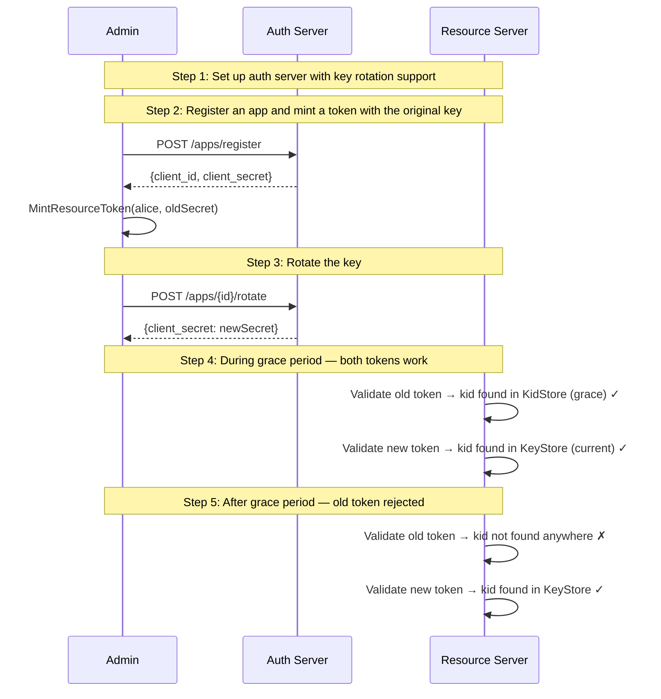

# 09: Key Rotation with Grace Periods

Non-UI | No infrastructure needed | Builds on Example 02

## What you'll learn

- **Set up auth server with key rotation support** — The auth server uses a KidStore alongside the main KeyStore. On rotation, the old key moves to KidStore with a grace period TTL. The CompositeKeyLookup checks both.
- **Register an app and mint a token with the original key** — The app gets a client_secret (HS256). We mint a token for Alice — this token's kid header is derived from the old key.
- **Rotate the key** — Rotation replaces the key in the main KeyStore and moves the old key to KidStore with a grace period TTL. Both keys are now valid.
- **During grace period — both tokens work** — The CompositeKeyLookup checks the main KeyStore first, then falls back to KidStore. Old tokens find their key in the grace store; new tokens find theirs in the main store.
- **After grace period — old token rejected** — After the grace period expires (100ms in this demo), the old key is removed from KidStore. Tokens signed with it are now rejected.

## Flow



## Steps

### About this example

**Actors:** Admin, Auth Server (AS), Resource Server (RS).
Think: Slack rotates its signing keys — existing bot tokens must keep working during the transition.
[What are these?](../README.md#cast-of-characters)

**The problem:** You rotate an app's signing key. Tokens signed with the old
key are still in flight — users have them cached, they haven't expired yet.
If the resource server only knows the new key, those tokens break.

**The solution:** A grace period. After rotation, the old key stays valid for
a configurable window. Both old and new tokens work. After the grace period,
old tokens are rejected.

```
Time: ──────────────────────────────────────────────────►
       ┌─── old key valid ───┐
       │                     │ ← grace period
       ├─── rotation ────────┤
       │                     ├─── new key valid ──────►
       │  both keys work     │  only new key works
```

### Step 1: Set up auth server with key rotation support

> **References:** [RFC 7517 — JSON Web Key (JWK)](https://www.rfc-editor.org/rfc/rfc7517), [RFC 7638 — JWK Thumbprint (kid)](https://www.rfc-editor.org/rfc/rfc7638)

The auth server uses a KidStore alongside the main KeyStore. On rotation, the old key moves to KidStore with a grace period TTL. The CompositeKeyLookup checks both.

### Step 2: Register an app and mint a token with the original key

> **References:** [RFC 7519 — JSON Web Token (JWT)](https://www.rfc-editor.org/rfc/rfc7519)

The app gets a client_secret (HS256). We mint a token for Alice — this token's kid header is derived from the old key.

### Step 3: Rotate the key

> **References:** [RFC 7517 — JSON Web Key (JWK)](https://www.rfc-editor.org/rfc/rfc7517)

Rotation replaces the key in the main KeyStore and moves the old key to KidStore with a grace period TTL. Both keys are now valid.

### Step 4: During grace period — both tokens work

> **References:** [RFC 7638 — JWK Thumbprint (kid)](https://www.rfc-editor.org/rfc/rfc7638)

The CompositeKeyLookup checks the main KeyStore first, then falls back to KidStore. Old tokens find their key in the grace store; new tokens find theirs in the main store.

### Step 5: After grace period — old token rejected

After the grace period expires (100ms in this demo), the old key is removed from KidStore. Tokens signed with it are now rejected.

### How it works under the hood

```
CompositeKeyLookup
  ├── KeyStore (current keys)     ← new key lives here
  └── KidStore (grace period)     ← old key lives here temporarily

Token arrives with kid header:
  1. Check KeyStore by kid → found? validate with that key
  2. Not found → check KidStore by kid → found and not expired? validate
  3. Not found anywhere → reject
```

The kid (Key ID) in the JWT header is a RFC 7638 thumbprint of the signing
key. Each key has a unique kid, so the lookup is deterministic — there's no
ambiguity about which key to use for verification.

### What's next?

In [10 — Security](../10-security/), you'll see attack prevention:
algorithm confusion (CVE-2015-9235), cross-app token forgery, and
JWKS security properties.

## References

- [RFC 7517 — JSON Web Key (JWK)](https://www.rfc-editor.org/rfc/rfc7517)
- [RFC 7638 — JWK Thumbprint (kid)](https://www.rfc-editor.org/rfc/rfc7638)
- [RFC 7519 — JSON Web Token (JWT)](https://www.rfc-editor.org/rfc/rfc7519)

## Run it

```bash
go run ./examples/09-key-rotation/
```

Pass `--non-interactive` to skip pauses:

```bash
go run ./examples/09-key-rotation/ --non-interactive
```
