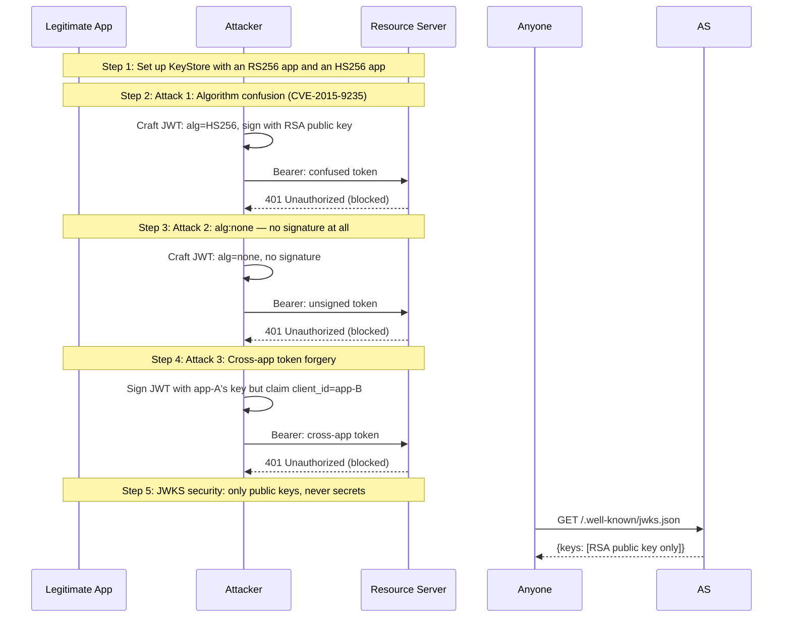

# 10: Security — Attack Prevention

Non-UI | No infrastructure needed | Standalone

## What you'll learn

- **Set up KeyStore with an RS256 app and an HS256 app** — Two apps coexist: one with an RSA key pair (RS256), one with a shared secret (HS256). The resource server validates tokens from both.
- **Attack 1: Algorithm confusion (CVE-2015-9235)** — The attack: The attacker knows the RSA public key (it's public, served via JWKS). They craft a JWT with alg:HS256 and sign it using the public key bytes as the HMAC secret. A naive server reads alg:HS256, grabs the stored key bytes, and verifies — which passes because the attacker used those same bytes.

OneAuth's defense: The middleware checks that the token's alg header matches the KeyRecord.Algorithm. Store says RS256, token says HS256 → mismatch → rejected before any signature check.
- **Attack 2: alg:none — no signature at all** — The attack: The attacker sends a JWT with alg:none — no signature at all. Some JWT libraries accept this as valid.

OneAuth uses golang-jwt/v5 which rejects alg:none by default unless explicitly opted in with UnsafeAllowNoneSignatureType.
- **Attack 3: Cross-app token forgery** — The attack: App A's key is compromised. The attacker signs a token claiming to be App B (client_id=app-B) using App A's key. If the resource server only checks the signature and not which app owns the key, the token validates.

OneAuth's defense: The middleware checks that the kid's owning client matches the client_id claim. App A's key → kid owned by app-A → client_id claim says app-B → mismatch → rejected.
- **JWKS security: only public keys, never secrets** — JWKS serves only asymmetric public keys. HS256 secrets are excluded entirely. RSA keys include only public components (n, e) — private fields (d, p, q) are structurally absent from the JWK type.

## Flow



## Steps

### About this example

This example demonstrates real JWT attacks and OneAuth's defenses.
Each attack is executed live — you'll see both the attack and the defense in action.

**Attacks covered:**
1. Algorithm confusion (CVE-2015-9235) — the most famous JWT vulnerability
2. Cross-app token forgery — using one app's key with another app's client_id
3. `alg: none` — disabling signature verification entirely
4. JWKS private key leakage — checking that secrets stay secret

### Step 1: Set up KeyStore with an RS256 app and an HS256 app

> **References:** [RFC 7517 — JSON Web Key (JWK)](https://www.rfc-editor.org/rfc/rfc7517)

Two apps coexist: one with an RSA key pair (RS256), one with a shared secret (HS256). The resource server validates tokens from both.

### Step 2: Attack 1: Algorithm confusion (CVE-2015-9235)

> **References:** [CVE-2015-9235 — JWT Algorithm Confusion](https://nvd.nist.gov/vuln/detail/CVE-2015-9235), [RFC 7515 — JSON Web Signature (JWS)](https://www.rfc-editor.org/rfc/rfc7515)

The attack: The attacker knows the RSA public key (it's public, served via JWKS). They craft a JWT with alg:HS256 and sign it using the public key bytes as the HMAC secret. A naive server reads alg:HS256, grabs the stored key bytes, and verifies — which passes because the attacker used those same bytes.

OneAuth's defense: The middleware checks that the token's alg header matches the KeyRecord.Algorithm. Store says RS256, token says HS256 → mismatch → rejected before any signature check.

### Step 3: Attack 2: alg:none — no signature at all

> **References:** [CVE-2015-9235 — JWT Algorithm Confusion](https://nvd.nist.gov/vuln/detail/CVE-2015-9235)

The attack: The attacker sends a JWT with alg:none — no signature at all. Some JWT libraries accept this as valid.

OneAuth uses golang-jwt/v5 which rejects alg:none by default unless explicitly opted in with UnsafeAllowNoneSignatureType.

### Step 4: Attack 3: Cross-app token forgery

The attack: App A's key is compromised. The attacker signs a token claiming to be App B (client_id=app-B) using App A's key. If the resource server only checks the signature and not which app owns the key, the token validates.

OneAuth's defense: The middleware checks that the kid's owning client matches the client_id claim. App A's key → kid owned by app-A → client_id claim says app-B → mismatch → rejected.

### Step 5: JWKS security: only public keys, never secrets

> **References:** [RFC 7517 — JSON Web Key (JWK)](https://www.rfc-editor.org/rfc/rfc7517)

JWKS serves only asymmetric public keys. HS256 secrets are excluded entirely. RSA keys include only public components (n, e) — private fields (d, p, q) are structurally absent from the JWK type.

### Summary of defenses

| Attack | How it works | OneAuth's defense |
|--------|-------------|------------------|
| Algorithm confusion (CVE-2015-9235) | Sign HS256 with RSA public key | alg must match KeyRecord.Algorithm |
| alg:none | No signature at all | golang-jwt/v5 rejects by default |
| Cross-app forgery | Sign with app A's key, claim app B | kid owner must match client_id claim |
| JWKS private key leak | Serve private key fields | JWK struct cannot carry private fields |
| HS256 secret in JWKS | Expose shared secret via JWKS | HS256 keys excluded from JWKS output |

These defenses are built into the middleware and key management layers —
they're always active, not opt-in. You get them by using `APIMiddleware`
and `JWKSHandler`.

### End of the journey

You've completed all 10 examples! Here's what you've learned:

| # | Concept | RFC |
|---|---------|-----|
| 01 | Client credentials — get a token | RFC 6749 §4.4 |
| 02 | Resource tokens — per-user JWTs | RFC 7519 |
| 03 | Asymmetric signing + JWKS discovery | RFC 7517, 7515 |
| 04 | AS metadata discovery | RFC 8414 |
| 05 | Token introspection + revocation | RFC 7662 |
| 06 | Dynamic client registration | RFC 7591 |
| 07 | Client SDK production patterns | — |
| 08 | Rich Authorization Requests | RFC 9396 |
| 09 | Key rotation with grace periods | RFC 7638 |
| 10 | Security — attack prevention | CVE-2015-9235 |

## References

- [CVE-2015-9235 — JWT Algorithm Confusion](https://nvd.nist.gov/vuln/detail/CVE-2015-9235)
- [RFC 7515 — JSON Web Signature (JWS)](https://www.rfc-editor.org/rfc/rfc7515)
- [RFC 7517 — JSON Web Key (JWK)](https://www.rfc-editor.org/rfc/rfc7517)

## Run it

```bash
go run ./examples/10-security/
```

Pass `--non-interactive` to skip pauses:

```bash
go run ./examples/10-security/ --non-interactive
```
