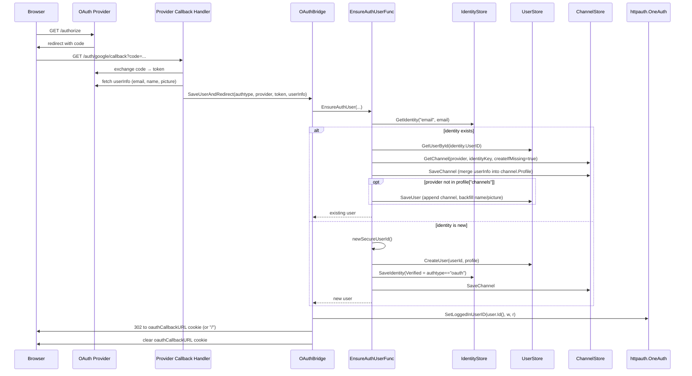
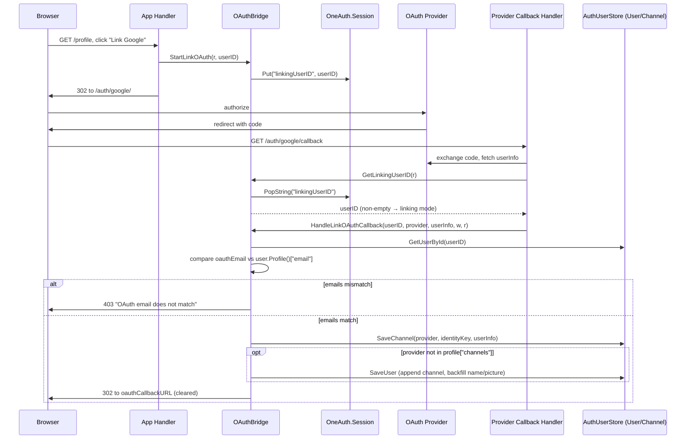

# federatedauth

Provider-mediated authentication orchestration — the seam between OAuth/SAML callback handlers and OneAuth's account model. Owns the post-token-exchange flow: turn provider userInfo into an `accounts.User` (creating, linking, or fetching as needed), then hand off to `httpauth` to set the logged-in session.

This package is deliberately narrow. It does **not** own:

- Username/password flows — those live in `localauth/`.
- The `User`/`Identity`/`Channel` data model — that's `accounts/`.
- Session cookies, CSRF, JWT — that's `httpauth/`.

What it owns is the channel-aware bookkeeping that sits *between* a provider callback and the session-setter: email-identity lookup, new-channel linking onto existing users, first-login user creation with `Verified=true` for OAuth-trusted emails, and the two-step "link an additional provider" flow that stashes a user ID in session across the OAuth round-trip.

## Contents

- [Entities](#entities)
- [Flows](#flows)
  - [First-time OAuth login or returning user](#first-time-oauth-login-or-returning-user)
  - [Linking a new provider to an existing user](#linking-a-new-provider-to-an-existing-user)
- [Gotchas](#gotchas)
- [Depends on](#depends-on)

## Entities

| Entity | Kind | Role | Why |
|---|---|---|---|
| `AuthUserStore` | interface | `accounts.UserStore` + `IdentityStore` + `ChannelStore` plus `EnsureAuthUser` | Callbacks always want the bundle; one composite keeps the bridge constructor honest. |
| `OAuthBridge` | struct | Holds `*httpauth.OneAuth` + `AuthUserStore`; dispatch target for callbacks | The seam between provider-shape callbacks and session establishment, owning per-instance wiring. |
| `NewOAuthBridge` | function | Constructs an `OAuthBridge` | Explicit DI — host app owns the graph, no globals. |
| `OAuthBridge.SaveUserAndRedirect` | method | Post-token-exchange entry — ensure user, set session, redirect | Shape that OAuth provider handlers call into; centralises session-setting so providers don't each reinvent it. |
| `OAuthBridge.HandleLinkOAuthCallback` | method | Links a provider channel onto an already-logged-in user (no new login) | Login vs link share token-exchange but diverge afterwards; one method per intent keeps the email-match security check explicit. |
| `OAuthBridge.StartLinkOAuth` | method | Stashes `linkingUserID` in session before redirecting to provider | OAuth round-trip carries no app state; session is the only place to remember "who clicked Link". |
| `OAuthBridge.GetLinkingUserID` | method | Pop-reads `linkingUserID` from session inside the callback | Pop (not peek) so a callback can't be replayed against the link path. |
| `EnsureAuthUserConfig` | struct | Bundle of stores for `NewEnsureAuthUserFunc` | Struct-shaped config beats a 4-arg constructor; `UsernameStore` is optional and naturally split out. |
| `EnsureAuthUserFunc` | type | Signature for `(authtype, provider, token, userInfo) → accounts.User` | Hiding the factory behind a func type lets test doubles and localauth's password path slot in. |
| `NewEnsureAuthUserFunc` | function | Factory; dispatches to `handleExistingUser` vs `handleNewUser` on email-identity lookup | Keeps new-vs-existing branching out of HTTP handlers — bridge stays a thin shim. |
| `handleExistingUser` | function | Links a new channel to an existing user keyed by email identity | Two users with the same email shouldn't exist; email→identity is the join key for channel linking. |
| `handleNewUser` | function | Creates `User` + `Identity` (`Verified = authtype=="oauth"`) + `Channel` | Bootstrap of the account graph; the `Verified` flag distinguishes OAuth-trusted emails from unverified local signups. |
| `containsString` | function | Slice-contains helper for the channels list | Avoid a dependency or `slices.Contains` import for a five-line helper. |
| `newSecureUserId` | function | 16 random bytes hex-encoded | User IDs must not be guessable or collide across providers; `crypto/rand` is the right primitive. |

## Flows

### First-time OAuth login or returning user

The headline flow — what runs when a user clicks "Login with Google". `SaveUserAndRedirect` is the post-token-exchange entry; the new-vs-existing decision happens inside `EnsureAuthUser` based on whether the email identity already exists.

### Linking a new provider to an existing user

The branch a provider callback takes when `GetLinkingUserID` returns non-empty — the user is *already* logged in and is adding (say) Google to a local-only account. Critically, this path never calls `EnsureAuthUser`; it bypasses the new-user creation logic entirely and enforces an email-match check.

## Gotchas

- **Why `EnsureAuthUser` is separate from the callback handler.** `SaveUserAndRedirect` is HTTP plumbing — read a cookie, set a cookie, redirect. `EnsureAuthUser` is store orchestration — three-store transactional-ish bookkeeping with new/existing branching. Keeping them on opposite sides of `AuthUserStore` means localauth's password flow can reuse the same orchestrator without touching anything HTTP-shaped, and tests can drive the orchestrator directly without spinning up a server.

- **Email is the join key for channel linking.** Two channels with the same email (e.g., `local` + `google` both for `alice@example.com`) deliberately collapse onto one `User` via the shared email `Identity`. This is the whole point of the channel model. The consequence: a user who signed up locally and then clicks "Login with Google" with the same email lands on their *existing* account, not a new one. `profile["channels"]` tracks which providers have been linked.

- **`Verified = authtype == "oauth"` is load-bearing.** New-user creation in `handleNewUser` trusts OAuth providers to have verified the email (Google, GitHub, etc., all return verified email). Local signups create the identity with `Verified=false` and must go through the email-verification flow before the identity is trusted for linking. If you ever add an OAuth provider that doesn't verify emails, this flag has to flip — otherwise it's an account-takeover vector.

- **Account-linking requires email match — strictly.** `HandleLinkOAuthCallback` refuses to link a Google account whose email differs from the logged-in user's email (case-insensitive compare, but otherwise exact). Without this, a logged-in user could link an attacker's Google account and then "Login with Google" would give the attacker the user's session. The `EqualFold` check at `callback.go` is the hijack-prevention point.

- **`GetLinkingUserID` uses `PopString`, not `GetString`.** The linking user ID is single-use — once a callback consumes it, the session slot is cleared. Without pop semantics a stale `linkingUserID` could redirect a normal login into the linking path on the next OAuth round-trip.

- **`oauthCallbackURL` cookie carries return-to state across the OAuth round-trip.** Set by the caller before kicking off OAuth, read on the way back, and explicitly cleared on success. If the cookie is missing or empty, the redirect falls back to `"/"`. Scheme-less URLs get prefixed with `OAUTH2_BASE_URL` — relative paths are accepted, but an attacker-controlled fully-qualified URL is not normalised (this is an open-redirect surface to be aware of when wiring up the cookie source).

- **`AuthUserStore.EnsureAuthUser` is a method on the store interface, not on the bridge.** Counter-intuitive — you might expect orchestration to live on the bridge. But the store impl is where the three sub-stores (`UserStore`, `IdentityStore`, `ChannelStore`) all live together, so the closure produced by `NewEnsureAuthUserFunc` naturally attaches to the store-impl-side. The bridge is then dependency-light: just call `b.UserStore.EnsureAuthUser(...)`.

- **`OAUTH2_BASE_URL` is read from the process environment inside `SaveUserAndRedirect`.** Not from config, not from `OneAuth`. If you're standing up a new deployment and the redirect after login ends up scheme-less, this is the env var to set.

## Depends on

- `../accounts` — `User`, `BasicUser`, `Identity`, `Channel`, `IdentityKey`, `LinkedChannels`, `UserStore`, `IdentityStore`, `ChannelStore`, `UsernameStore` (the account model and store interfaces composed into `AuthUserStore` and consumed by `EnsureAuthUserFunc`).
- `../httpauth` — `OneAuth` (held on `OAuthBridge` for session/cookie lifecycle via `SetLoggedInUserID` and the `linkingUserID` session round-trip).
