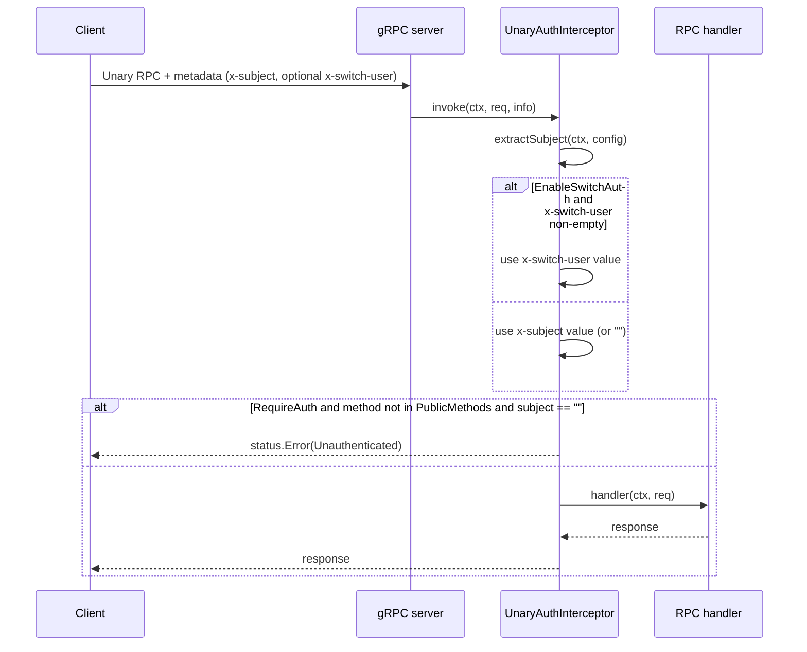
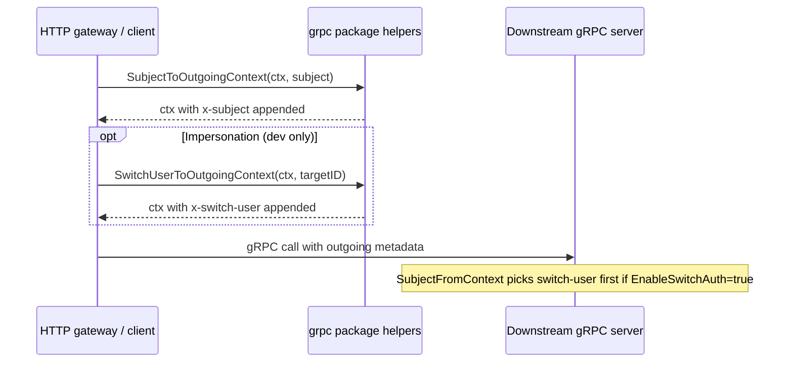

# grpc

A small standalone sub-module of helpers for using OneAuth identity inside gRPC services. It standardizes how the authenticated subject (RFC 7519 `sub` — a user ID for human flows, a `client_id` for `client_credentials`) rides across the wire as gRPC metadata under the default key `x-subject`, provides outgoing helpers for clients and HTTP-to-gRPC gateways to attach that header, and ships unary plus stream server interceptors that enforce per-method auth with a `PublicMethods` bypass set and an opt-in switch-user impersonation header for dev/testing.

The package deliberately does **not** verify identity. It trusts whatever value arrives in the metadata header. Cryptographic verification (JWT signature, introspection, expiry checks) is expected to have already happened upstream — typically in an HTTP gateway sitting in front of the gRPC service — and this layer's only job is to propagate the already-authenticated subject into gRPC handlers without re-running validation on every call.

## Contents

- [Entities](#entities)
- [Flows](#flows)
  - [Incoming unary request: enforce per-method auth](#incoming-unary-request-enforce-per-method-auth)
  - [Outgoing client call: attach identity and optional impersonation](#outgoing-client-call-attach-identity-and-optional-impersonation)
- [Gotchas](#gotchas)

## Entities

| Entity | Kind | Role | Why |
|---|---|---|---|
| `DefaultMetadataKeySubject` | const | Default metadata key (`x-subject`) carrying the authenticated subject. | gRPC normalizes metadata keys to lowercase; named "subject" instead of "user-id" so it covers both human users and `client_credentials` clients. |
| `DefaultMetadataKeySwitchUser` | const | Default metadata key (`x-switch-user`) for impersonating another user. | Retains the "user" wording because impersonation is human-scoped by design; honored only when `EnableSwitchAuth` is set. |
| `Config` | struct | Metadata-key names plus the `EnableSwitchAuth` toggle. | Keys are customizable so callers can avoid collisions with other application metadata; switch-auth defaults off so impersonation is never silently available. |
| `DefaultConfig` | func | Returns a `Config` with default keys and switch-auth disabled. | Safe default — impersonation is opt-in, not a default. |
| `Config.EnsureDefaults` | method | Fills empty key fields with default values in place. | Accept a partially populated `Config` without nil/empty-key bugs (`md.Get("")` silently returns nothing). |
| `SubjectFromContext` | func | Extracts the subject from incoming gRPC metadata using defaults. | Returns `""` rather than erroring so callers decide how to treat anonymous requests. |
| `SubjectFromContextWithConfig` | func | Same extraction, caller-supplied `Config` (nil falls back to default). | Switch-user key is checked before the real subject when `EnableSwitchAuth` is on. |
| `SubjectToOutgoingContext` | func | Appends the subject to outgoing metadata under the default key. | Used by HTTP gateways and clients to forward identity into downstream gRPC calls. |
| `SubjectToOutgoingContextWithKey` | func | Same as above with a custom metadata key. | Mirrors the configurable key on the extraction side. |
| `SwitchUserToOutgoingContext` | func | Appends a switch-user impersonation header (default key) to outgoing metadata. | No effect unless the server has `EnableSwitchAuth` set — clients cannot self-grant. |
| `SwitchUserToOutgoingContextWithKey` | func | Switch-user append with a custom key. | Pairs with the custom-key extraction path. |
| `IsAuthenticated` | func | Reports whether the context carries a non-empty subject (default config). | Convenience predicate over `SubjectFromContext`. |
| `IsAuthenticatedWithConfig` | func | Authentication predicate with an explicit `Config`. | Uses the same switch-user precedence as extraction so the two never disagree. |
| `InterceptorConfig` | struct | Embeds `*Config` and adds `RequireAuth` plus a `PublicMethods` bypass set. | `PublicMethods` keys are full `/pkg.Service/Method` names matched against `info.FullMethod`. |
| `DefaultInterceptorConfig` | func | Returns a config that requires auth on every method with no public bypass. | Secure-by-default posture for new servers. |
| `NewPublicMethodsConfig` | func | Builds a require-auth config seeded with the given unauthenticated methods. | Common case — most servers expose a few health/login methods without auth. |
| `OptionalAuthConfig` | func | Returns a config that lets unauthenticated requests through. | For services that read identity opportunistically but never reject. |
| `UnaryAuthInterceptor` | func | Unary server interceptor that extracts the subject and enforces per-method auth. | Only rejects with `codes.Unauthenticated` when `RequireAuth` is set and the method is not public; does not inject identity into the context — downstream code calls `SubjectFromContext`. |
| `StreamAuthInterceptor` | func | Stream-side counterpart enforcing the same per-method rules at stream open. | Checks `ss.Context()` once when the stream opens; per-message identity is not re-validated. |
| `extractSubject` | func | Internal helper used by both interceptors to read the subject from metadata. | Single source of truth for switch-user precedence and key lookup. |

## Flows

### Incoming unary request: enforce per-method auth

The stream interceptor follows the same shape, except it reads `ss.Context()` once when the stream opens and never re-checks per message.

### Outgoing client call: attach identity and optional impersonation

## Gotchas

- **Interceptor does not inject the subject into the context.** `UnaryAuthInterceptor` and `StreamAuthInterceptor` only read the metadata to decide whether to reject the call; they pass the original `ctx` straight through to the handler. Downstream code must call `SubjectFromContext(ctx)` itself — there is no separate context-value key set by this package, so a `ctx.Value(...)` lookup will not find the subject.
- **No identity verification happens here.** The interceptors trust whatever value arrives in the metadata header. Cryptographic verification (JWT, introspection) must have happened upstream — typically in an HTTP gateway — before the request reaches the gRPC layer. This sub-module is purely about propagating an already-authenticated subject.
- **Switch-user is server-controlled, not client-controlled.** `SwitchUserToOutgoingContext` always appends the header, but the server ignores it unless `Config.EnableSwitchAuth` is `true`. Treat this as a dev/testing affordance only — leaving `EnableSwitchAuth` off in production is the entire security model around impersonation.
- **Empty `x-switch-user` falls back to `x-subject`.** When switch-auth is enabled, an empty switch header is treated as "no override" and the real subject is used instead (covered by `TestSubjectFromContext_SwitchUserEmpty`). Sending an empty switch header is therefore safe but pointless.
- **`PublicMethods` keys must match `info.FullMethod` exactly.** That means the leading slash and the full `/package.Service/Method` form (e.g. `/pkg.Svc/Method1`), not bare method names. A typo silently turns into "auth required" for that endpoint, which surfaces as an `Unauthenticated` error rather than a configuration warning.
- **Metadata keys are lowercase.** gRPC normalizes header keys, so the defaults are `x-subject` and `x-switch-user`. Custom keys supplied via `Config` must also be lowercase — otherwise the `md.Get(...)` lookup silently returns nothing.
- **Stream auth is checked once, at stream open.** `StreamAuthInterceptor` reads `ss.Context()` when the stream is established. Mid-stream identity changes are out of scope; there is no per-message re-check.
- **Error mapping is fixed at `codes.Unauthenticated`.** Failed auth always produces `status.Error(codes.Unauthenticated, "authentication required")`. There is no hook to differentiate "missing identity" from "invalid identity" because invalid identity isn't a concept at this layer (see the verification gotcha above).
- **Standalone sub-module.** `grpc/go.mod` declares `github.com/panyam/oneauth/grpc` with only `google.golang.org/grpc` as a direct dependency — it deliberately does not depend on the rest of OneAuth, so it stays cheap to import from any gRPC service.
