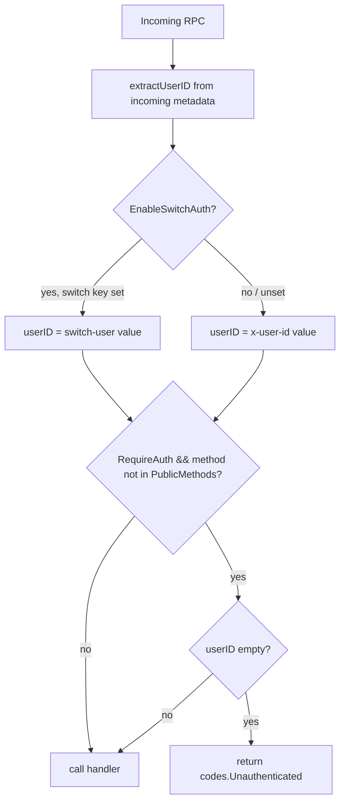
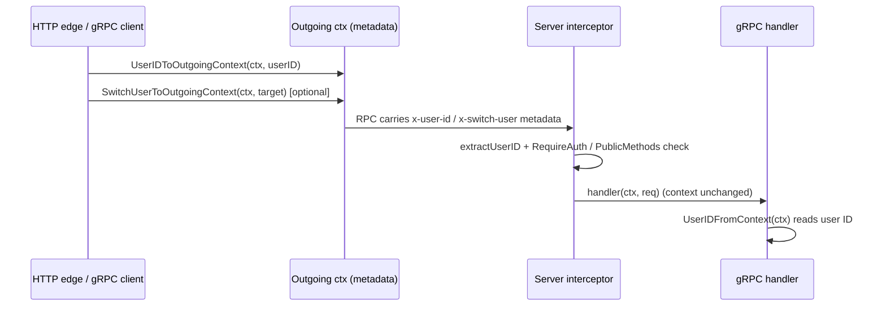

# grpc — Flows

### Interceptor auth enforcement and public-method bypass

How `UnaryAuthInterceptor` / `StreamAuthInterceptor` decide whether to admit a
call. The interceptor only enforces *presence* of an identity; it does not add
the identity to the context, so handlers still read it via `UserIDFromContext`.

### HTTP-to-gRPC context propagation

How an authenticated identity established at an HTTP edge reaches a downstream
gRPC handler. The client side appends metadata to the outgoing context; the
server side reads it back. Switch-user is honored only if the server enabled it.

