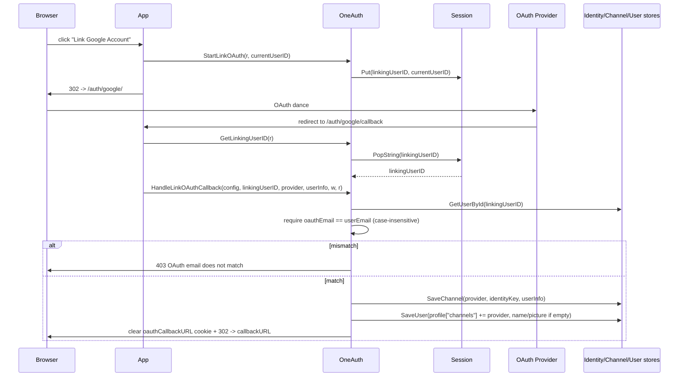

# httpauth

HTTP-layer plumbing for session-based auth: a session/JWT-aware login mux (`OneAuth`) that hosts OAuth-provider sub-handlers and owns the login/logout cookie lifecycle, a pluggable `Middleware` that resolves "who is logged in" from context/session/bearer tokens, and three standalone middlewares (CSRF, request-body limit, OWASP security headers) callers can mount with or without the rest. The package deliberately stays browser-flow focused — token issuance/validation specifics live elsewhere and are injected via `VerifyToken`.

## Contents

- [Entities](#entities)
- [Flows](#flows)
  - [Session login via OAuth callback](#session-login-via-oauth-callback)
  - [Per-request user resolution](#per-request-user-resolution)
  - [CSRF double-submit lifecycle](#csrf-double-submit-lifecycle)
  - [OAuth account linking](#oauth-account-linking)
- [Gotchas](#gotchas)
- [Depends on](#depends-on)

## Entities

| Entity | Kind | Role | Why |
|---|---|---|---|
| `OneAuth` | struct | Top-level session-auth coordinator owning the mux, scs session manager, JWT minting/verification, and login/logout cookie lifecycle. | Defaults to a hardcoded JWT secret if neither field nor `ONEAUTH_JWT_SECRET_KEY` is set — fine for tests, unsafe in prod. |
| `AuthUserStore` | interface | Composite store (`UserStore` + `IdentityStore` + `ChannelStore`) with `EnsureAuthUser` as the OAuth/local creation entry point. | Composed rather than a god interface so impls only satisfy what they back; `EnsureAuthUser` orchestrates cross-store creation. |
| `New` | func | Constructs a `OneAuth` with the given app name and applies `EnsureDefaults`. | Single entry point so callers never see a half-initialized struct. |
| `OneAuth.EnsureDefaults` | method | Fills app name, session timeout, JWT issuer/secret, cookie name, and wires `verifyJWT` as the default token verifier. | Idempotent; called repeatedly from handlers so any field set after `New` still gets backfilled. |
| `OneAuth.Handler` | method | Returns the configured `ServeMux` after route setup. | Lazily builds routes so the logout handler exists even if `AddAuth` was never called. |
| `OneAuth.AddAuth` | method | Mounts an auth provider handler under a prefix with subtree matching plus a 308 redirect from the bare prefix. | Uses 308 (not 301) to preserve POST method; reads `r.RequestURI` to recover the path lost by parent `StripPrefix`. |
| `OneAuth.SaveUserAndRedirect` | method | OAuth callback sink — ensures the user via the store, sets login cookies, and redirects to the saved `oauthCallbackURL`. | Prefixes relative callback URLs with `OAUTH2_BASE_URL` and clears the callback cookie so it is single-use. |
| `OneAuth.HandleLinkOAuthCallback` | method | Links an OAuth provider to an existing local user after verifying the OAuth email matches the account email. | Email-match check is the security boundary preventing account hijacking via a mismatched provider email. |
| `OneAuth.StartLinkOAuth` | method | Stashes the user ID in session under `linkingUserID` to flag a subsequent callback as a linking flow. | Paired with `GetLinkingUserID` to thread linking intent through the redirect round-trip. |
| `OneAuth.GetLinkingUserID` | method | Pops (reads and clears) the `linkingUserID` session value. | Pop semantics ensure linking mode is consumed exactly once. |
| `LinkOAuthConfig` | struct | Bundles the three stores needed by `HandleLinkOAuthCallback`. | Passed per-call rather than held on `OneAuth` so linking can use a different store set than login. |
| `Middleware` | struct | Request-scoped user resolver reading user ID from context, session, or `Authorization` header/cookie via a pluggable `VerifyToken`. | `VerifyToken` is injected to keep JWT specifics out of the middleware (decoupling TODO noted in source). |
| `Middleware.EnsureReasonableDefaults` | method | Backfills param/header names to sensible defaults before use. | Lets a zero-value `Middleware` work without explicit config. |
| `Middleware.GetLoggedInUserId` | method | Resolves the current user ID, checking context, then `SessionGetter`, then bearer tokens/cookies. | Truncates token to 20 chars in warn logs to avoid leaking full credentials. |
| `Middleware.ExtractUser` | method | Middleware that loads the user ID into request context without enforcing presence. | Non-redirecting variant for pages that work for both anonymous and logged-in users. |
| `Middleware.EnsureUser` | method | Middleware that requires a logged-in user, redirecting (302) to login or returning 401. | Redirect only fires if `GetRedirURL` is set, else falls back to a hard 401. |
| `CSRFMiddleware` | struct | Double-submit-cookie CSRF protector with configurable cookie/field/header names and exemption. | Cookie is intentionally non-HttpOnly so JS can echo it in an AJAX header; bearer requests exempt by default. |
| `CSRFMiddleware.Protect` | method | Middleware enforcing CSRF — issues a token cookie on safe methods, validates a matching token on unsafe methods. | Validation uses constant-time compare to resist token-guessing timing attacks. |
| `CSRFToken` | func | Extracts the CSRF token from request context. | Returns empty string when middleware is inactive rather than panicking. |
| `CSRFTemplateField` | func | Renders a hidden HTML input carrying the CSRF token for form templates. | HTML-escapes the token value to prevent injection into the rendered form. |
| `LimitBody` | func | Middleware rejecting oversized request bodies with 413, also wrapping body in `MaxBytesReader`. | Upfront `ContentLength` check plus `MaxBytesReader` covers chunked transfers where `ContentLength` is -1 (CWE-400). |
| `LimitBodyReader` | func | In-handler helper wrapping the body with `MaxBytesReader` without upfront rejection. | For handlers that want lazy enforcement on read rather than middleware. |
| `IsBodyTooLargeError` | func | Detects whether an error came from exceeding a `MaxBytesReader` limit. | Checks `*http.MaxBytesError` plus `io.ErrUnexpectedEOF` fallback across Go versions. |
| `DefaultMaxBodySize` | const | Default 1MB body size cap. | Sane ceiling for JSON auth payloads. |
| `SecurityHeaders` | func | Middleware applying default OWASP security headers to every response. | Thin wrapper over `SecurityHeadersWithConfig(DefaultSecurityHeadersConfig())`. |
| `SecurityHeadersConfig` | struct | Per-header configuration; empty string disables an individual header. | Each header is opt-out via `""` (or 0 for HSTS) so callers can relax CSP without forking the middleware. |
| `DefaultSecurityHeadersConfig` | func | Returns the secure-by-default header set (HSTS, CSP, frame, COOP/COEP/CORP, etc.). | Centralizes the recommended baseline. |
| `SecurityHeadersWithConfig` | func | Middleware applying a caller-supplied header configuration. | Skips any header left empty so disabling is explicit and per-field. |

## Flows

### Session login via OAuth callback

```mermaid
sequenceDiagram
    participant Browser
    participant ProviderHandler as OAuth provider handler
    participant OneAuth
    participant Store as AuthUserStore
    participant Session as scs Session
    Browser->>ProviderHandler: GET /auth/google/callback?code=...
    ProviderHandler->>ProviderHandler: exchange code, fetch userInfo
    ProviderHandler->>OneAuth: SaveUserAndRedirect(authtype, provider, token, userInfo, w, r)
    OneAuth->>Store: EnsureAuthUser(authtype, provider, token, userInfo)
    Store-->>OneAuth: core.User
    OneAuth->>OneAuth: mint JWT (HS256, exp=1h) with sub=user.Id
    OneAuth->>Session: Put(loggedInUserId, AuthTokenSessionVar=jwt)
    OneAuth->>Browser: Set-Cookie loggedInUserId + AuthTokenSessionVar (per CookieDomain)
    OneAuth->>Browser: Set-Cookie oauthCallbackURL=; MaxAge=-1
    OneAuth->>Browser: 302 -> callbackURL (or "/" or OAUTH2_BASE_URL + path)
```

### Per-request user resolution

```mermaid
sequenceDiagram
    participant Req as http.Request
    participant MW as Middleware.ExtractUser / EnsureUser
    participant Ctx as request.Context
    participant SessionGetter
    participant Verifier as VerifyToken
    MW->>Ctx: lookup middlewareContextKey(UserParamName)
    alt found
        Ctx-->>MW: userId
    else not in context
        MW->>SessionGetter: r, UserParamName
        alt session has userId
            SessionGetter-->>MW: userId
        else
            MW->>Req: Header.Values(AuthTokenHeaderName) + CookiesNamed(AuthTokenCookieName)
            loop each token
                MW->>MW: strip "Bearer " prefix
                MW->>Verifier: VerifyToken(token)
                alt valid
                    Verifier-->>MW: userId
                else error
                    Verifier-->>MW: err (logged with truncated token)
                end
            end
        end
    end
    alt userId == "" and EnsureUser
        MW->>Req: 302 to GetRedirURL?CallbackURLParam=<orig> OR 401
    else
        MW->>Ctx: WithValue(userId); next.ServeHTTP
    end
```

### CSRF double-submit lifecycle

```mermaid
flowchart TD
    Start([incoming request]) --> Exempt{isExempt?<br/>(bearer auth by default)}
    Exempt -- yes --> Pass[next.ServeHTTP]
    Exempt -- no --> Safe{safe method?<br/>(GET/HEAD/OPTIONS)}
    Safe -- yes --> GetOrCreate[get cookie token<br/>or generate 32-byte hex]
    GetOrCreate --> SetCookie[Set-Cookie csrf_token<br/>HttpOnly=false, SameSite=Strict]
    SetCookie --> CtxA[ctx.WithValue csrfContextKey] --> Pass
    Safe -- no --> CookieRead{cookie present?}
    CookieRead -- no --> Err[ErrorHandler 403]
    CookieRead -- yes --> Submitted[read FormValue or Header]
    Submitted --> Match{constant-time match?}
    Match -- no --> Err
    Match -- yes --> CtxB[ctx.WithValue csrfContextKey] --> Pass
```

### OAuth account linking



## Gotchas

- **Hardcoded JWT secret fallback.** `OneAuth.EnsureDefaults` falls back to the literal `"MyTestJWTSecretKey123456"` when both `JWTSecretKey` and `ONEAUTH_JWT_SECRET_KEY` are empty. Convenient for tests, catastrophic in prod — no warning is logged. Production deployments must set the env var (or the field) before `New` or any handler call.
- **`AddAuth` 308 redirect uses `r.RequestURI`.** Because `AddAuth` lives behind a parent `StripPrefix`, the bare-prefix redirect handler reads `r.RequestURI` (not `r.URL.Path`) to recover the original full path before reconstructing the trailing-slash target. Code that wraps `OneAuth.Handler()` in additional middleware that mutates `RequestURI` will break the redirect; the 308 (not 301) is also load-bearing so POSTs survive the bounce.
- **Cookie domains include `""` by default.** `setLoggedInUser` always appends an empty domain if not present, so cookies are also issued for the request host. If `CookieDomains` is non-empty but missing `""`, you still get a host-only cookie — which is usually what you want, but means you cannot opt out of the host-only cookie by setting `CookieDomains`.
- **CSRF cookie is non-HttpOnly by design.** JS must read `csrf_token` to echo it back as `X-CSRF-Token`, so HttpOnly is explicitly false. This is the standard double-submit tradeoff — any XSS read of cookies includes this token, but the token alone isn't enough to make state-changing requests across origins (`SameSite=Strict` plus the matching cookie/header check are the actual defense).
- **CSRF exempts all `Bearer ` auth.** The default `ExemptFunc` skips validation when `Authorization` starts with `Bearer ` (case-insensitive), reasoning that bearer-token clients aren't subject to browser CSRF. If you ever accept bearer tokens *from a browser cookie/localStorage* (which the same JS could phish), supply a custom `ExemptFunc` — the default trusts the header at face value.
- **`Middleware` silently warns when `VerifyToken` is nil.** If no token verifier is wired (and the user isn't in context or session), `GetLoggedInUserId` logs `"No auth token verifier found"` and returns `""`. `EnsureUser` then 401s/redirects without any clearer signal — easy to misdiagnose as a session bug.
- **`LimitBody` and `LimitBodyReader` enforce differently.** `LimitBody` rejects upfront via `ContentLength` (returning 413 before the handler runs) *and* wraps the body. `LimitBodyReader` only wraps — the handler will see an error on `Read` past the limit. If you mount `LimitBody` then call `LimitBodyReader` inside the handler, the inner call replaces the outer `MaxBytesReader` with a fresh one wrapping the already-wrapped body; usually harmless but worth knowing.
- **`SecurityHeadersWithConfig` always sets `X-Content-Type-Options: nosniff`.** Every other header is gated on the config field being non-empty (or non-zero for HSTS), but `nosniff` is unconditional and cannot be disabled without forking. This is intentional — there is no legitimate reason to allow MIME sniffing on auth responses.
- **`CSRFMiddleware` zero-value `SameSite` becomes `Strict`.** Go's `http.SameSite` zero value is `SameSiteDefaultMode`, which the package treats as "unset" and replaces with `SameSiteStrictMode`. To actually request browser default behavior you must set `SameSite: http.SameSiteLaxMode` (or whatever) explicitly.

## Depends on

- [`core/`](../core/DESIGN.md) — `User`, `BasicUser`, `Channel`, `IdentityKey`, `UserStore`, `IdentityStore`, `ChannelStore`
