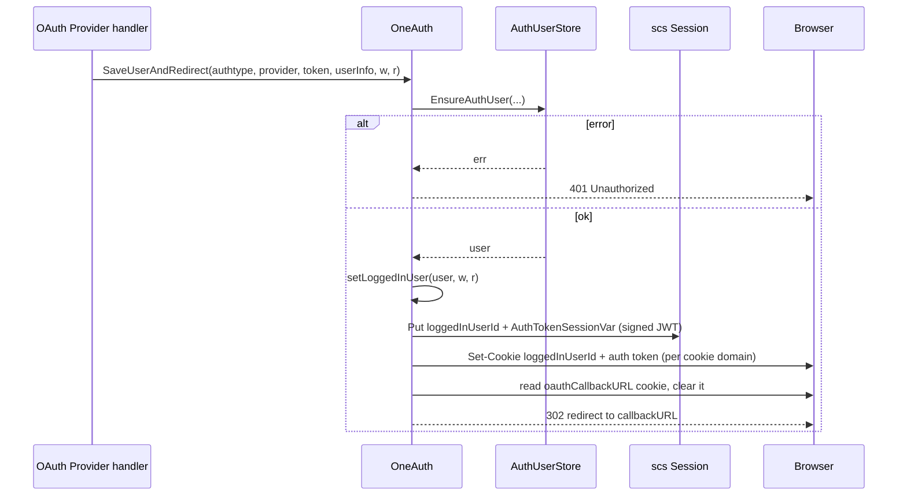
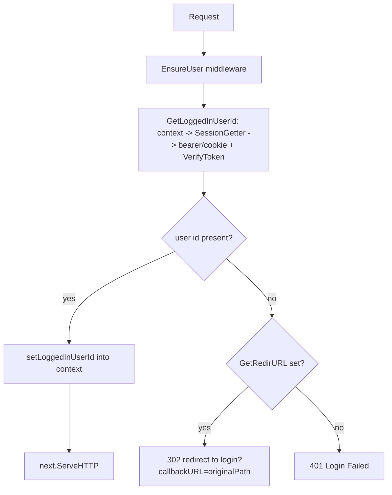
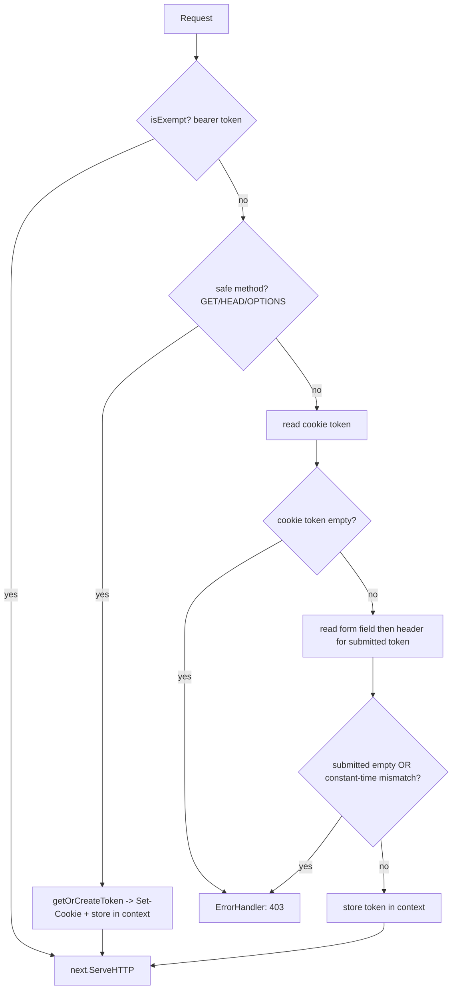

# httpauth flows

### OAuth login callback lifecycle (SaveUserAndRedirect)

```mermaid
sequenceDiagram
    participant P as OAuth Provider handler
    participant OA as OneAuth
    participant US as AuthUserStore
    participant S as scs Session
    participant B as Browser

    P->>OA: SaveUserAndRedirect(authtype, provider, token, userInfo, w, r)
    OA->>US: EnsureAuthUser(...)
    alt error
        US-->>OA: err
        OA-->>B: 401 Unauthorized
    else ok
        US-->>OA: user
        OA->>OA: setLoggedInUser(user, w, r)
        OA->>S: Put loggedInUserId + AuthTokenSessionVar (signed JWT)
        OA->>B: Set-Cookie loggedInUserId + auth token (per cookie domain)
        OA->>B: read oauthCallbackURL cookie, clear it
        OA-->>B: 302 redirect to callbackURL
    end
```

### EnsureUser request gate

```mermaid
flowchart TD
    A[Request] --> B[EnsureUser middleware]
    B --> C[GetLoggedInUserId: context -> SessionGetter -> bearer/cookie + VerifyToken]
    C --> D{user id present?}
    D -- yes --> E[setLoggedInUserId into context]
    E --> F[next.ServeHTTP]
    D -- no --> G{GetRedirURL set?}
    G -- yes --> H[302 redirect to login?callbackURL=originalPath]
    G -- no --> I[401 Login Failed]
```

### CSRF double-submit validation (Protect)

```mermaid
flowchart TD
    A[Request] --> B{isExempt? bearer token}
    B -- yes --> Z[next.ServeHTTP]
    B -- no --> C{safe method? GET/HEAD/OPTIONS}
    C -- yes --> D[getOrCreateToken -> Set-Cookie + store in context]
    D --> Z
    C -- no --> E[read cookie token]
    E --> F{cookie token empty?}
    F -- yes --> X[ErrorHandler: 403]
    F -- no --> G[read form field then header for submitted token]
    G --> H{submitted empty OR constant-time mismatch?}
    H -- yes --> X
    H -- no --> I[store token in context]
    I --> Z
```
