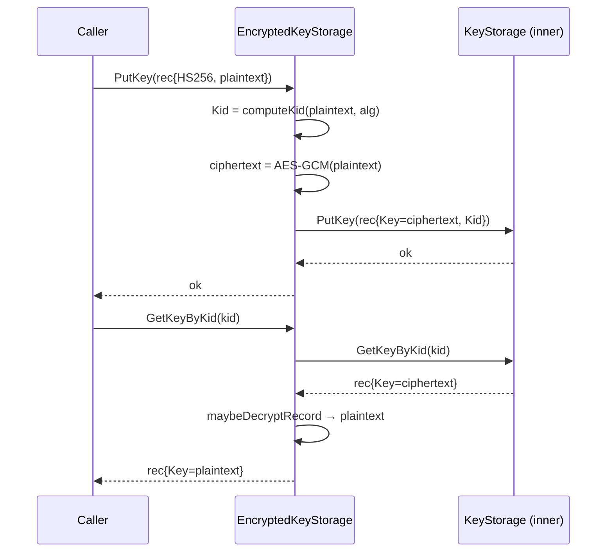
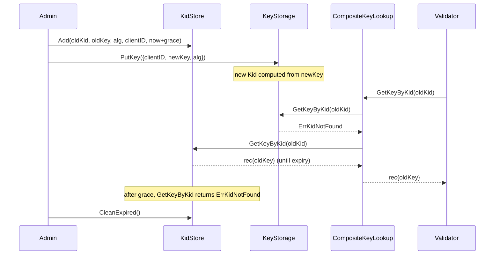
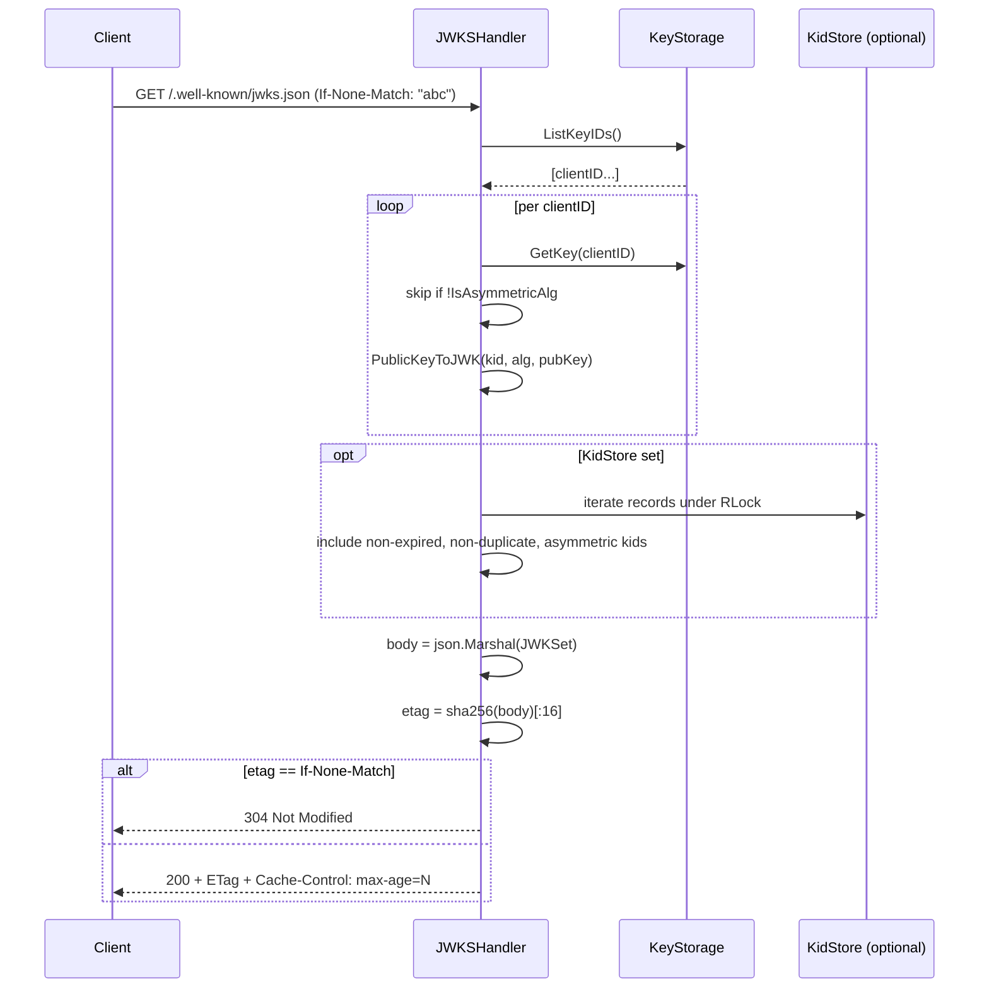

# keys

`package keys` owns every JWT signing key OneAuth touches: how they are stored (in memory, encrypted at rest, or fetched from a remote JWKS), how they are looked up (by `clientID` or by `kid`), and how they are published. The package is deliberately storage-agnostic — `KeyStorage` and `KidStorage` are interfaces that the `stores/{fs,gorm,gae}` backends and the `EncryptedKeyStorage` decorator all implement, while `JWKSHandler` and `JWKSKeyStore` form the publish/subscribe edges that face the outside world. What it deliberately does *not* own: JWT minting/parsing, scopes, or client registration — those live in `apiauth/`, `core/`, and `admin/`.

## Contents

- [Entities](#entities)
- [Flows](#flows)
  - [Encrypted PutKey then kid lookup](#encrypted-putkey-then-kid-lookup)
  - [Key rotation with grace period](#key-rotation-with-grace-period)
  - [JWKS publish with conditional caching](#jwks-publish-with-conditional-caching)
  - [Remote JWKS consumption with on-demand refresh](#remote-jwks-consumption-with-on-demand-refresh)
- [Gotchas](#gotchas)
- [Depends on](#depends-on)

## Entities

| Entity | Kind | Role | Why |
|---|---|---|---|
| `KeyRecord` | struct | Value type carrying `ClientID`, `Key`, `Algorithm`, `Kid` for every key op. | Collapses four per-field accessors into one record so decorators forward one value, not many getters. |
| `KeyLookup` | interface | Read-only contract: `GetKey(clientID)` and `GetKeyByKid(kid)`. | Lets read-only sources like a remote JWKS plug in without faking writes; is the unit `CompositeKeyLookup` composes. |
| `KeyStorage` | interface | `KeyLookup` + `PutKey` / `DeleteKey` / `ListKeyIDs` for clientID-keyed backends. | Narrow 5-method write surface so encryption decorators and persistent backends implement the same thing. |
| `KidStorage` | interface | `KeyLookup` + `Add` / `Remove` / `CleanExpired`, keyed by `kid` with optional expiry. | Lets retired grace-period keys persist across restarts in `stores/` backends rather than only in memory. |
| `ErrKeyNotFound` | const | Sentinel for missing-clientID lookups. | Stable signal middleware branches on without parsing error strings. |
| `ErrAlgorithmMismatch` | const | Sentinel for alg/key mismatch. | Lets validators reject alg-substitution attacks distinctly from missing-key. |
| `ErrKidNotFound` | const | Sentinel for unknown or expired kid. | Distinguishes "grace period elapsed" from "client never registered". |
| `InMemoryKeyStore` | struct | Thread-safe in-memory `KeyStorage` with kid->clientID secondary index. | Keeps `GetKeyByKid` O(1) and the two maps consistent across overwrite and delete. |
| `NewInMemoryKeyStore` | func | Constructs an empty `InMemoryKeyStore`. | Standard entry point for tests and single-process deployments. |
| `InMemoryKeyStore.PutKey` | method | Stores a record; auto-computes `Kid` if empty and rewires the kid index. | Centralising kid computation here means callers never have to remember it. |
| `InMemoryKeyStore.GetKey` | method | Returns a `KeyRecord` for a clientID under RLock. | RWMutex lets reads be concurrent while writes serialise. |
| `InMemoryKeyStore.GetKeyByKid` | method | Resolves through the secondary index then re-validates the entry's `Kid`. | Re-check defends against a stale index slot after a rotation overwrite. |
| `InMemoryKeyStore.DeleteKey` | method | Removes a clientID and drops its kid from the secondary index. | Keeps the two maps consistent so deleted kids do not resurrect. |
| `InMemoryKeyStore.ListKeyIDs` | method | Returns all registered clientIDs. | Drives `JWKSHandler`'s iteration. |
| `InMemoryKeyStore.RegisterKey` | method | Legacy shim wrapping `PutKey` with a fresh `KeyRecord`. | Keeps pre-`KeyRecord` callers compiling. |
| `InMemoryKeyStore.GetVerifyKey` | method | Legacy shim returning just `Key`. | Preserves the old field-accessor API during migration. |
| `InMemoryKeyStore.GetSigningKey` | method | Legacy shim aliasing `GetVerifyKey`. | In-memory store does not distinguish sign vs verify. |
| `InMemoryKeyStore.GetExpectedAlg` | method | Legacy shim returning just `Algorithm`. | Old validators called this directly. |
| `InMemoryKeyStore.ListKeys` | method | Legacy alias for `ListKeyIDs`. | Older callers used this name. |
| `InMemoryKeyStore.GetCurrentKid` | method | Legacy shim returning the `Kid`. | Old rotation code asked by name; `KeyRecord` now carries it. |
| `EncryptedKeyStorage` | struct | `KeyStorage` decorator that AES-256-GCM encrypts HMAC secrets at rest; asymmetric keys pass through. | Wraps `KeyStorage` (not field accessors), so only 5 methods to forward; pre-encryption kid keeps kid lookups working. |
| `NewEncryptedKeyStorage` | func | Builds the decorator from a 64-hex-char master key, deriving the AES key via HKDF-SHA256. | HKDF + fixed info string ensures the on-disk key is never the raw master and is domain-separated from any other use. |
| `EncryptedKeyStorage.PutKey` | method | Computes `Kid` from plaintext, encrypts HMAC bytes, delegates to inner. | Pre-encryption kid means `GetKeyByKid` still resolves even though stored `Key` is ciphertext. |
| `EncryptedKeyStorage.GetKey` | method | Reads through and decrypts HMAC values on the way out. | Single decrypt path via `maybeDecryptRecord` avoids duplication. |
| `EncryptedKeyStorage.GetKeyByKid` | method | Kid-indexed read through inner, decrypted on return. | Decoration is purely on the `Key` field; inner owns the kid index. |
| `EncryptedKeyStorage.DeleteKey` | method | Passthrough to inner. | Nothing to decrypt on delete. |
| `EncryptedKeyStorage.ListKeyIDs` | method | Passthrough to inner. | ClientIDs are not secret. |
| `KidStore` | struct | In-memory `KidStorage` holding kid->key records with optional expiry. | A rotated-out key keeps validating tokens until grace lapses. |
| `NewKidStore` | func | Constructs an empty `KidStore`. | Entry point when grace-period rotation runs in process memory. |
| `KidStore.Add` | method | Registers a kid->key mapping with optional expiry; re-adding overwrites. | Step 1 of rotation — record the outgoing key with a future `ExpiresAt` before `PutKey` replaces the current slot. |
| `KidStore.Remove` | method | Deletes a kid; absent kids are not an error. | Idempotent removal simplifies admin tooling. |
| `KidStore.GetKey` | method | Always returns `ErrKeyNotFound` — `KidStore` is kid-indexed. | Honours `KeyLookup` while making clear clientID lookups belong on `KeyStorage`. |
| `KidStore.GetKeyByKid` | method | Returns a `KeyRecord`; treats expired entries as missing. | Expired-as-missing keeps callers from accidentally using a key whose grace elapsed. |
| `KidStore.CleanExpired` | method | Removes all entries past `ExpiresAt`. | Lazy GC — caller decides when to reclaim memory. |
| `KidStore.Len` | method | Count of entries including unswept expired ones. | Test and admin visibility into rotation accounting. |
| `CompositeKeyLookup` | struct | Tries multiple `KeyLookup`s in order, first hit wins. | Fuses current keys (`KeyStorage`) and grace keys (`KidStore`) behind one read-side interface without coupling them. |
| `CompositeKeyLookup.GetKey` | method | Walks `Lookups` for a clientID match. | Ordering controls which source's current key wins on overlap. |
| `CompositeKeyLookup.GetKeyByKid` | method | Walks `Lookups` for a kid match. | Lets validators find a kid whether it lives in the current or grace store, transparently. |
| `JWKSHandler` | struct | HTTP handler publishing `/.well-known/jwks.json` from a `KeyStorage` (+ optional `KidStore`). | Filters to asymmetric algs so HMAC secrets never leak; the `KidStore` branch surfaces retired keys inside grace so clients can verify in-flight tokens. |
| `JWKSHandler.ServeHTTP` | method | Builds the JWK set, computes SHA-256 ETag, honours `If-None-Match`, emits `Cache-Control`. | Conditional caching cuts JWKS bandwidth; ETag keys off content so any rotation invalidates downstream caches automatically. |
| `JWKSKeyStore` | struct | Read-only `KeyLookup` that fetches and caches public keys from a remote JWKS URL, kid-indexed. | Foreign issuers expose keys via JWKS, not clientID maps; storing by kid matches the protocol. |
| `NewJWKSKeyStore` | func | Constructor with `JWKSOption` functional options. | Defaults `RefreshInterval=1h`, `MinRefreshGap=5s` so misconfigured deployments still behave sanely. |
| `JWKSKeyStore.Start` | method | Initial fetch + launches background refresher. | Hard-failing the initial fetch surfaces a bad URL at boot, not on first token. |
| `JWKSKeyStore.Stop` | method | Closes `stopCh` to halt the refresher. | Lets tests and shutdown paths reclaim the ticker. |
| `JWKSKeyStore.GetVerifyKey` | method | Cached public key for a clientID, refreshes on miss. | On-demand refresh (rate-limited by `MinRefreshGap`) covers freshly rotated keys without waiting for the tick. |
| `JWKSKeyStore.GetSigningKey` | method | Always errors — JWKS exposes only public keys. | Hard-fails callers that try to sign with a remote-only store instead of silently doing the wrong thing. |
| `JWKSKeyStore.GetKey` | method | Always returns `ErrKeyNotFound` — JWKS has no clientID map. | Forces validators to use `kid` (what JWKS actually carries) instead of guessing. |
| `JWKSKeyStore.GetKeyByKid` | method | Cached public key by kid, refreshes on miss. | Matches the protocol — kids are the lookup primitive in JWKS-driven federation. |
| `JWKSKeyStore.GetExpectedAlg` | method | Returns the alg for a key. | Symmetric with `GetVerifyKey` for legacy callers. |
| `JWKSOption` | type | Functional option type for `JWKSKeyStore`. | Standard Go options pattern keeps the constructor stable. |
| `WithHTTPClient` | func | Option to inject a custom `*http.Client`. | Lets callers control timeouts, proxies, TLS without subclassing. |
| `WithRefreshInterval` | func | Option to set background refresh cadence. | Tunes freshness vs upstream load. |
| `WithMinRefreshGap` | func | Option to set the minimum gap between refreshes. | Prevents miss-driven refreshes from stampeding the upstream. |

## Flows

### Encrypted PutKey then kid lookup



### Key rotation with grace period



### JWKS publish with conditional caching



### Remote JWKS consumption with on-demand refresh

```mermaid
sequenceDiagram
    participant Validator
    participant J as JWKSKeyStore
    participant Upstream as Remote JWKS

    Validator->>J: GetKeyByKid(kid)
    J->>J: RLock; lookup in keys[]
    alt hit
        J-->>Validator: rec{pub, alg, kid}
    else miss
        J->>J: refresh()
        J->>J: if since(lastFetch) < MinRefreshGap → no-op
        J->>Upstream: GET JWKSURL
        Upstream-->>J: JWKSet
        J->>J: build newKeys; Lock; replace; lastFetch=now
        J->>J: RLock; lookup again
        alt hit on retry
            J-->>Validator: rec{pub, alg, kid}
        else still miss
            J-->>Validator: ErrKidNotFound
        end
    end

    Note over J,Upstream: backgroundRefresh() ticks every RefreshInterval (default 1h)
```

## Gotchas

- **HMAC secrets must never appear in JWKS.** `JWKSHandler.ServeHTTP` filters with `utils.IsAsymmetricAlg` before emitting any key, and the same check gates the `KidStore` branch. Adding a new key type means updating `IsAsymmetricAlg` in `utils/` — not relaxing the filter here. This is also why `JWKSKeyStore.GetSigningKey` returns a hard error instead of degrading silently.
- **`EncryptedKeyStorage` computes `Kid` from plaintext, not ciphertext.** If you swap the encryption layer (e.g. move encryption inside a backend), preserve this ordering or every kid in the persisted store will become unreachable. Tests in `encrypted_test.go` exercise the round trip via `keystoretest.RunAll`.
- **Decryption failure is logged and treated as plaintext, not an error.** `maybeDecryptRecord` is intentionally lenient so a deployment can roll out `EncryptedKeyStorage` over a store of pre-existing plaintext HMAC secrets. Once migration is complete this fallback is a footgun — a corrupted ciphertext will silently surface as garbage `Key` bytes. Wrap with an integrity check (or remove the fallback) once migration is verified.
- **`JWKSKeyStore` keys its internal cache by JWKS `kid`, not clientID.** `GetVerifyKey(clientID)` / `GetExpectedAlg(clientID)` will only succeed if the upstream JWKS happens to use the clientID as the `kid`. New code should prefer `GetKeyByKid`; the clientID-shaped methods exist for legacy validators that assume a local keystore shape.
- **`InMemoryKeyStore.GetKeyByKid` re-validates `entry.Kid == kid` after the index hit.** Without that check, a `PutKey` overwrite that reused an old clientID with new key material could leave a stale `kidIndex` entry pointing at the new entry's kid; the re-check makes the lookup self-correcting. Persistent backends in `stores/` must preserve this invariant.
- **`JWKSHandler` reads `KidStore.records` directly under `KidStore.mu.RLock()`.** This couples the handler to `KidStore`'s internals (lowercase field), so the handler only works with the concrete in-memory `KidStore`, not arbitrary `KidStorage` implementations. If/when persistent `KidStorage` backends need to surface grace keys in JWKS, this branch needs an interface-level iteration method.
- **`refresh()` swaps the entire `keys` map under `Lock`.** A kid that briefly disappears from the upstream JWKS will vanish from the cache on the next refresh, even if it was valid moments ago. Use `KidStore` (locally) to keep retired-but-still-valid keys around through grace; do not rely on `JWKSKeyStore` for that semantic.

## Depends on

- [`utils/`](../utils/DESIGN.md) — `JWK`, `JWKSet`, `IsAsymmetricAlg`, `DecodeVerifyKey`, `ComputeKid`, `PublicKeyToJWK`, `JWKToPublicKey`, `GenerateRSAKeyPair`, `GenerateECDSAKeyPair`, `ParsePublicKeyPEM`, `ParsePrivateKeyPEM`, `RSAPublicKeyToJWK`, `ECDSAPublicKeyToJWK`
- [`admin/`](../admin/DESIGN.md) — `AppRegistrar`, `NewAppRegistrar`, `NoAuth`, `AppQuota`, `MintResourceToken`, `MintResourceTokenWithKey`
- [`apiauth/`](../apiauth/DESIGN.md) — `APIMiddleware`, `APIAuth`, `GetUserIDFromAPIContext`, `GetCustomClaimsFromContext`
- [`keystoretest/`](../keystoretest/DESIGN.md) — `RunAll`
- [`kidstoretest/`](../kidstoretest/DESIGN.md) — `RunAll`
