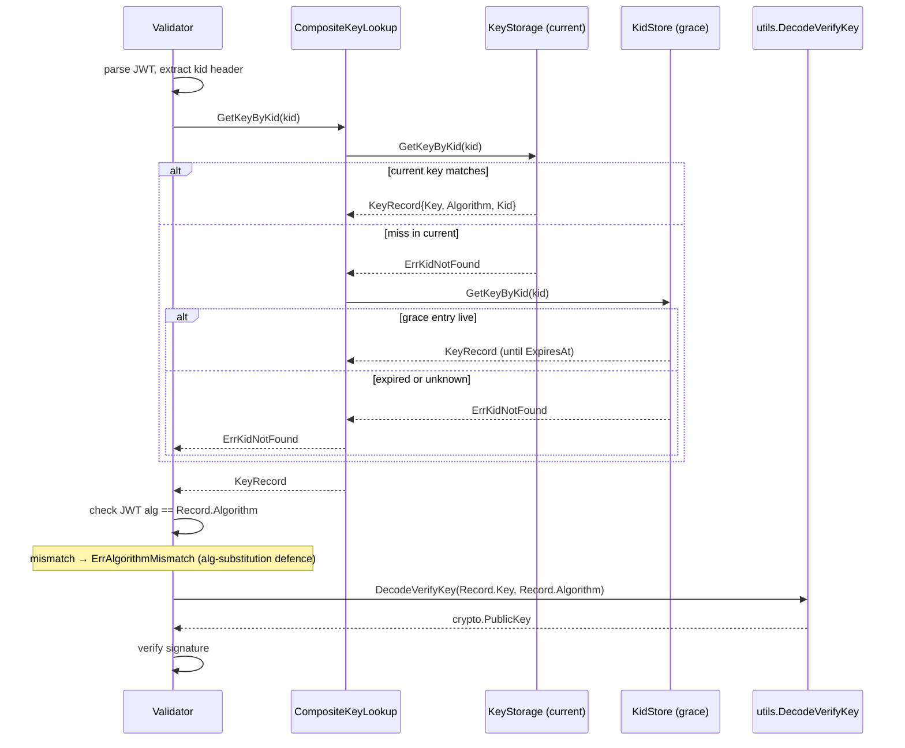

# keys

`package keys` owns every JWT signing key OneAuth touches: how they are stored (in memory, encrypted at rest, or fetched from a remote JWKS), how they are looked up (by `clientID` or by `kid`), and how they are published. The package is deliberately storage-agnostic — `KeyStorage` and `KidStorage` are interfaces that the `stores/{fs,gorm,gae}` backends and the `EncryptedKeyStorage` decorator all implement, while `JWKSHandler` and `JWKSKeyStore` form the publish/subscribe edges that face the outside world. What it deliberately does *not* own: JWT minting/parsing, scopes, or client registration — those live in `apiauth/`, `core/`, and `admin/`.

The decomposition is itself a deliberate lesson: an earlier iteration had a single god `KeyStore` interface with per-field accessors (`GetSigningKey`, `GetVerifyKey`, `GetExpectedAlg`, `GetCurrentKid`, plus rotation hooks). Each new concern — encryption, kid rotation, remote JWKS — forced another method onto every implementation. After the #204a refactor, the contract is uniformly `(ctx, *XRequest) → (*XResponse, error)` and the API split into `KeyLookup` (read-by-id/kid), `KeyStorage` (clientID-keyed writes), and `KidStorage` (kid-keyed grace storage), all carrying a single `KeyRecord` value. Each implementation now honours only the concern it actually serves: `JWKSKeyStore` is `KeyLookup`-only, `EncryptedKeyStorage` decorates `KeyStorage` with five methods, and `KidStore` lives entirely on `KidStorage`.

## Contents

- [Entities](#entities)
- [Flows](#flows)
  - [Kid-based verification across current and grace stores](#kid-based-verification-across-current-and-grace-stores)
  - [Key rotation with grace period](#key-rotation-with-grace-period)
- [Gotchas](#gotchas)
- [Depends on](#depends-on)

## Entities

| Entity | Kind | Role | Why |
|---|---|---|---|
| `KeyRecord` | struct | Value type carrying `ClientID`, `Key`, `Algorithm`, `Kid` for every key op. | Collapses four per-field accessors into one record so decorators forward one value, not many getters. |
| `KeyLookup` | interface | Read-only contract: `GetKey(ctx, *GetKeyRequest)` and `GetKeyByKid(ctx, *GetKeyByKidRequest)`. | Lets read-only sources like a remote JWKS plug in without faking writes; is the unit `CompositeKeyLookup` composes. |
| `KeyStorage` | interface | `KeyLookup` + `PutKey` / `DeleteKey` / `ListKeyIDs` for clientID-keyed backends. | Narrow 5-method write surface so encryption decorators and persistent backends implement the same thing. |
| `KidStorage` | interface | `KeyLookup` + `Add` / `Remove` / `CleanExpired`, keyed by `kid` with optional expiry. | Lets retired grace-period keys persist across restarts in `stores/` backends rather than only in memory. |
| `GetKeyRequest` / `GetKeyResponse` | structs | Request/response pair carrying `ClientID` in, `*KeyRecord` out. | Standard gRPC-shape so middleware can swap implementations without touching call sites. |
| `GetKeyByKidRequest` / `GetKeyByKidResponse` | structs | Request/response pair carrying `Kid` in, `*KeyRecord` out. | Kid is the JWT-header primitive; first-class request type makes it impossible to confuse with `ClientID`. |
| `PutKeyRequest` / `PutKeyResponse` | structs | Carry a `*KeyRecord` into `KeyStorage.PutKey`. | Pointer-to-record means the implementation can mutate `Kid` (auto-compute) without an extra return value. |
| `DeleteKeyRequest` / `DeleteKeyResponse` | structs | Request/response pair for `KeyStorage.DeleteKey` by `ClientID`. | Symmetric shape with the rest of the API, even though `DeleteKeyResponse` is empty today. |
| `ListKeyIDsRequest` / `ListKeyIDsResponse` | structs | Empty request, `[]string` of clientIDs in response. | Empty request still exists so the gRPC-shape rule has no exceptions. |
| `AddKidRequest` / `AddKidResponse` | structs | Request carrying `Kid`, `Key`, `Algorithm`, `ClientID`, `ExpiresAt` into `KidStorage.Add`. | `ExpiresAt` zero-value means no expiry, so the same call covers current-key registration and grace-period entries. |
| `RemoveKidRequest` / `RemoveKidResponse` | structs | Request/response pair for `KidStorage.Remove` by `Kid`. | Idempotent — removing an absent kid is not an error. |
| `CleanExpiredRequest` / `CleanExpiredResponse` | structs | Empty request, `Removed int` count in response. | Surfacing the count lets callers log how many entries the lazy GC reclaimed. |
| `ErrKeyNotFound` | var | Sentinel for missing-clientID lookups. | Stable signal middleware branches on without parsing error strings. |
| `ErrAlgorithmMismatch` | var | Sentinel for alg/key mismatch. | Lets validators reject alg-substitution attacks distinctly from missing-key. |
| `ErrKidNotFound` | var | Sentinel for unknown or expired kid. | Distinguishes "grace period elapsed" from "client never registered". |
| `InMemoryKeyStore` | struct | Thread-safe in-memory `KeyStorage` with `kid → clientID` secondary index. | Keeps `GetKeyByKid` O(1) and the two maps consistent across overwrite and delete. |
| `NewInMemoryKeyStore` | func | Constructs an empty `InMemoryKeyStore`. | Standard entry point for tests and single-process deployments. |
| `InMemoryKeyStore.PutKey` | method | Stores a record; auto-computes `Kid` if empty and rewires the kid index. | Centralising kid computation here means callers never have to remember it. |
| `InMemoryKeyStore.GetKey` | method | Returns a `KeyRecord` for a clientID under `RLock`. | `RWMutex` lets reads be concurrent while writes serialise. |
| `InMemoryKeyStore.GetKeyByKid` | method | Resolves through the secondary index then re-validates the entry's `Kid`. | Re-check defends against a stale index slot after a rotation overwrite. |
| `InMemoryKeyStore.DeleteKey` | method | Removes a clientID and drops its kid from the secondary index. | Keeps the two maps consistent so deleted kids do not resurrect. |
| `InMemoryKeyStore.ListKeyIDs` | method | Returns all registered clientIDs. | Drives `JWKSHandler`'s iteration. |
| `EncryptedKeyStorage` | struct | `KeyStorage` decorator that AES-256-GCM encrypts HMAC secrets at rest; asymmetric keys pass through. | Wraps `KeyStorage` (not field accessors), so only 5 methods to forward; pre-encryption kid keeps kid lookups working. |
| `NewEncryptedKeyStorage` | func | Builds the decorator from a 64-hex-char master key, deriving the AES key via HKDF-SHA256. | HKDF + fixed info string ensures the on-disk key is never the raw master and is domain-separated from any other use. |
| `EncryptedKeyStorage.PutKey` | method | Computes `Kid` from plaintext, encrypts HMAC bytes, delegates to inner. | Pre-encryption kid means `GetKeyByKid` still resolves even though stored `Key` is ciphertext. |
| `EncryptedKeyStorage.GetKey` | method | Reads through and decrypts HMAC values on the way out. | Single decrypt path via `maybeDecryptRecord` avoids duplication. |
| `EncryptedKeyStorage.GetKeyByKid` | method | Kid-indexed read through inner, decrypted on return. | Decoration is purely on the `Key` field; inner owns the kid index. |
| `EncryptedKeyStorage.DeleteKey` | method | Passthrough to inner. | Nothing to decrypt on delete. |
| `EncryptedKeyStorage.ListKeyIDs` | method | Passthrough to inner. | ClientIDs are not secret. |
| `KidStore` | struct | In-memory `KidStorage` holding `kid → record` with optional expiry. | A rotated-out key keeps validating tokens until grace lapses. |
| `NewKidStore` | func | Constructs an empty `KidStore`. | Entry point when grace-period rotation runs in process memory. |
| `KidStore.Add` | method | Registers a kid→key mapping with optional expiry; re-adding overwrites. | Step 1 of rotation — record the outgoing key with a future `ExpiresAt` before `PutKey` replaces the current slot. |
| `KidStore.Remove` | method | Deletes a kid; absent kids are not an error. | Idempotent removal simplifies admin tooling. |
| `KidStore.GetKey` | method | Always returns `ErrKeyNotFound` — `KidStore` is kid-indexed. | Honours `KeyLookup` while making clear clientID lookups belong on `KeyStorage`. |
| `KidStore.GetKeyByKid` | method | Returns a `KeyRecord`; treats expired entries as missing. | Expired-as-missing keeps callers from accidentally using a key whose grace elapsed. |
| `KidStore.CleanExpired` | method | Removes all entries past `ExpiresAt`. | Lazy GC — caller decides when to reclaim memory. |
| `KidStore.Len` | method | Count of entries including unswept expired ones. | Test and admin visibility into rotation accounting. |
| `CompositeKeyLookup` | struct | Tries multiple `KeyLookup`s in order, first hit wins. | Fuses current keys (`KeyStorage`) and grace keys (`KidStore`) behind one read-side interface without coupling them. |
| `CompositeKeyLookup.GetKey` | method | Walks `Lookups` for a clientID match. | Ordering controls which source's current key wins on overlap. |
| `CompositeKeyLookup.GetKeyByKid` | method | Walks `Lookups` for a kid match. | Lets validators find a kid whether it lives in the current or grace store, transparently. |
| `JWKSHandler` | struct | HTTP handler publishing `/.well-known/jwks.json` from a `KeyStorage` (+ optional `KidStore`). | Filters to asymmetric algs so HMAC secrets never leak; the `KidStore` branch surfaces retired keys inside grace so clients can verify in-flight tokens. |
| `JWKSHandler.ServeHTTP` | method | Builds the JWK set, computes SHA-256 ETag, honours `If-None-Match`, emits `Cache-Control`. | Conditional caching cuts JWKS bandwidth; ETag keys off content so any rotation invalidates downstream caches automatically. |
| `JWKSKeyStore` | struct | Read-only `KeyLookup` that fetches and caches public keys from a remote JWKS URL, kid-indexed. | Foreign issuers expose keys via JWKS, not clientID maps; storing by kid matches the protocol. |
| `NewJWKSKeyStore` | func | Constructor with `JWKSOption` functional options. | Defaults `RefreshInterval=1h`, `MinRefreshGap=5s` so misconfigured deployments still behave sanely. |
| `JWKSKeyStore.Start` | method | Initial fetch + launches background refresher. | Hard-failing the initial fetch surfaces a bad URL at boot, not on first token. |
| `JWKSKeyStore.Stop` | method | Closes `stopCh` to halt the refresher. | Lets tests and shutdown paths reclaim the ticker. |
| `JWKSKeyStore.GetKey` | method | Always returns `ErrKeyNotFound` — JWKS has no clientID map. | Forces validators to use `kid` (what JWKS actually carries) instead of guessing. |
| `JWKSKeyStore.GetKeyByKid` | method | Cached public key by kid; calls `refresh()` on miss and retries. | Matches the protocol — kids are the lookup primitive in JWKS-driven federation, and the miss-driven refresh covers freshly rotated keys without waiting for the tick. |
| `JWKSOption` | type | Functional option type for `JWKSKeyStore`. | Standard Go options pattern keeps the constructor stable. |
| `WithHTTPClient` | func | Option to inject a custom `*http.Client`. | Lets callers control timeouts, proxies, TLS without subclassing. |
| `WithRefreshInterval` | func | Option to set background refresh cadence. | Tunes freshness vs upstream load. |
| `WithMinRefreshGap` | func | Option to set the minimum gap between refreshes. | Prevents miss-driven refreshes from stampeding the upstream. |

## Flows

### Kid-based verification across current and grace stores

A JWT arrives at the resource server with a `kid` header. The validator must resolve that `kid` to a `KeyRecord` whether the key is the current signing key (in `KeyStorage`), a recently retired key still inside its grace window (in `KidStore`), or — for federated tokens — fetched from a remote JWKS. `CompositeKeyLookup` is the glue: it tries each `KeyLookup` in order and returns the first hit, so the validator never has to know which store the key lives in.



### Key rotation with grace period

Zero-downtime rotation depends on a strict ordering: register the *outgoing* key in `KidStore` with a future `ExpiresAt` **before** calling `KeyStorage.PutKey` with the new material. Reverse that order and there is a window where tokens signed with the previous key fail verification because nothing remembers their `kid`. Once grace elapses, `CleanExpired` reclaims the memory.

```mermaid
sequenceDiagram
    participant Admin
    participant KS as KeyStorage
    participant Kid as KidStore
    participant Validator
    participant Comp as CompositeKeyLookup

    Note over Admin: rotation begins; oldRec is the current key
    Admin->>Kid: Add(oldKid, oldKey, alg, clientID, now+grace)
    Kid-->>Admin: ok
    Admin->>KS: PutKey({clientID, newKey, alg})
    Note over KS: new Kid auto-computed from newKey; secondary index rewired
    KS-->>Admin: ok

    Note over Validator: in-flight token signed with oldKid arrives
    Validator->>Comp: GetKeyByKid(oldKid)
    Comp->>KS: GetKeyByKid(oldKid)
    KS-->>Comp: ErrKidNotFound (current slot now holds newKid)
    Comp->>Kid: GetKeyByKid(oldKid)
    Kid-->>Comp: KeyRecord{oldKey} (ExpiresAt not yet passed)
    Comp-->>Validator: KeyRecord{oldKey}

    Note over Kid: time passes; ExpiresAt elapses
    Validator->>Comp: GetKeyByKid(oldKid)
    Comp->>KS: GetKeyByKid(oldKid)
    KS-->>Comp: ErrKidNotFound
    Comp->>Kid: GetKeyByKid(oldKid)
    Kid-->>Comp: ErrKidNotFound (isExpired() == true)
    Comp-->>Validator: ErrKidNotFound

    Admin->>Kid: CleanExpired()
    Kid-->>Admin: Removed=N
```

## Gotchas

- **The god-interface lesson that produced this decomposition.** The earlier `KeyStore` interface bundled `GetSigningKey` / `GetVerifyKey` / `GetExpectedAlg` / `GetCurrentKid` / write methods / rotation hooks into one contract. Three workarounds piled up — `JWKSKeyStore` fake-erroring on writes, encryption requiring per-field hooks, kid rotation grafted on as a sidecar — before the #204a refactor split the API into `KeyLookup` / `KeyStorage` / `KidStorage`, all returning a single `KeyRecord` and all on the `(ctx, *XRequest) → (*XResponse, error)` shape. The rule going forward: if you find yourself adding a method that several implementations will stub out, decompose by concern instead. See `memories/feedback_god_interface.md`.
- **JWKS exposes only asymmetric keys.** `JWKSHandler.ServeHTTP` filters with `utils.IsAsymmetricAlg` before emitting any key, and the same check gates the `KidStore` branch. HS256 secrets are *correctly* omitted — that is not a bug. Adding a new key type means updating `IsAsymmetricAlg` in `utils/`, not relaxing the filter here. The same logic is why `JWKSKeyStore.GetKey` returns a hard error rather than degrading silently.
- **Algorithm mismatch is a separate sentinel from kid-not-found.** `ErrAlgorithmMismatch` exists so a validator can distinguish "we found a key but the JWT's `alg` header disagrees" (a likely alg-substitution attack) from "we have never heard of this kid" (a rotation/registration issue). Callers that fold them into one branch lose the attack signal.
- **`EncryptedKeyStorage` computes `Kid` from plaintext, not ciphertext.** If you swap the encryption layer (e.g. move encryption inside a backend), preserve this ordering or every kid in the persisted store will become unreachable — the on-disk ciphertext changes on every write (random nonce), so kids derived from ciphertext would never match across writes. Tests in `encrypted_test.go` exercise the round trip.
- **Decryption failure is logged and treated as plaintext, not an error.** `maybeDecryptRecord` is intentionally lenient so a deployment can roll out `EncryptedKeyStorage` over a store of pre-existing plaintext HMAC secrets. Once migration is complete this fallback is a footgun — a corrupted ciphertext will silently surface as garbage `Key` bytes. Wrap with an integrity check (or remove the fallback) once migration is verified.
- **`InMemoryKeyStore.GetKeyByKid` re-validates `entry.Kid == kid` after the secondary-index hit.** Without that check, a `PutKey` overwrite that reused an old clientID with new key material could leave a stale `kidIndex` entry pointing at the new entry's kid; the re-check makes the lookup self-correcting. Persistent backends in `stores/` must preserve this invariant.
- **`JWKSHandler` reads `KidStore.records` directly under `KidStore.mu.RLock()`.** This couples the handler to `KidStore`'s internals (lowercase field), so the JWKS-grace branch only works with the concrete in-memory `KidStore`, not arbitrary `KidStorage` implementations. If/when persistent `KidStorage` backends need to surface grace keys in JWKS, this branch needs an interface-level iteration method.
- **`JWKSKeyStore.refresh()` swaps the entire `keys` map under `Lock`.** A kid that briefly disappears from the upstream JWKS will vanish from the local cache on the next refresh, even if it was valid moments ago. Use `KidStore` (locally) to keep retired-but-still-valid keys around through grace; do not rely on `JWKSKeyStore` for that semantic.
- **Rotation contract is `KidStore.Add` *then* `KeyStorage.PutKey`, never the reverse.** Reversing the order opens a window where the new kid is live but the old kid is unknown, so any in-flight token signed by the previous key fails verification. The `Admin->>Kid: Add` step in the rotation flow is load-bearing for zero-downtime rotation, and `KidStore.CleanExpired` is the eventual reclamation step.

## Depends on

- [`utils/`](../utils/DESIGN.md) — `ComputeKid`, `DecodeVerifyKey`, `IsAsymmetricAlg`, `JWK`, `JWKSet`, `JWKToPublicKey`, `PublicKeyToJWK`
