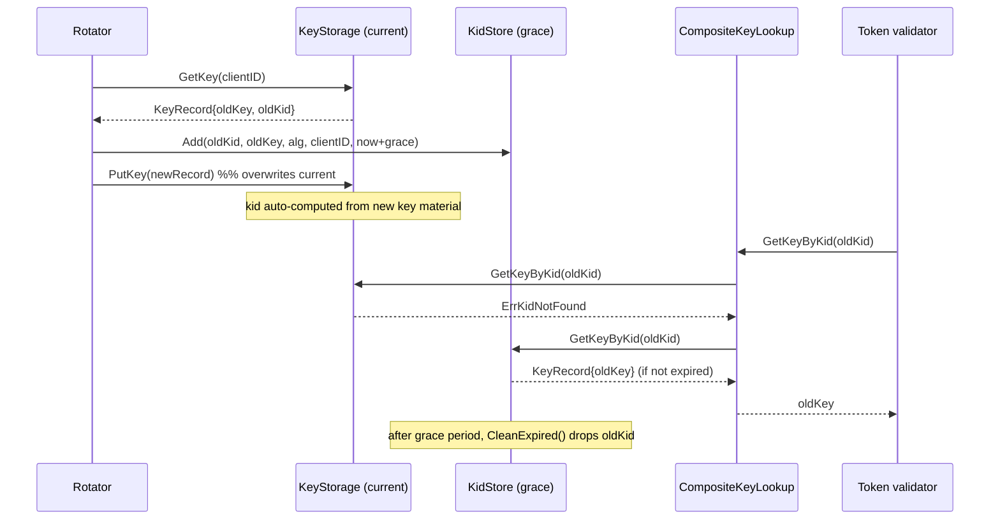

# keys — Flows

### Key rotation with grace-period KidStore

When a client's signing key rotates, the old key must keep validating
already-issued tokens until they expire. The old kid is parked in a KidStore
with an expiry; a CompositeKeyLookup then resolves either the current or the
retired key by kid.



### JWKS publication merging current + grace-period keys

JWKSHandler builds the published key set from the live KeyStore, then folds in
any non-duplicate, unexpired asymmetric keys still held in the KidStore, so
relying parties can verify tokens signed by a just-rotated key.

```mermaid
sequenceDiagram
    participant RP as Relying party
    participant H as JWKSHandler
    participant KS as KeyStore
    participant Kid as KidStore

    RP->>H: GET /.well-known/jwks.json (If-None-Match?)
    H->>KS: ListKeyIDs()
    KS-->>H: [clientIDs]
    loop each clientID
        H->>KS: GetKey(clientID)
        KS-->>H: KeyRecord
        Note over H: skip non-asymmetric; decode pubkey; compute kid; to JWK
    end
    opt KidStore set
        H->>Kid: iterate records (RLock)
        Note over H: include unexpired asymmetric kids not already seen
    end
    Note over H: marshal set; ETag = sha256(body)
    alt If-None-Match == ETag
        H-->>RP: 304 Not Modified
    else
        H-->>RP: 200 + JWKS + Cache-Control + ETag
    end
```
