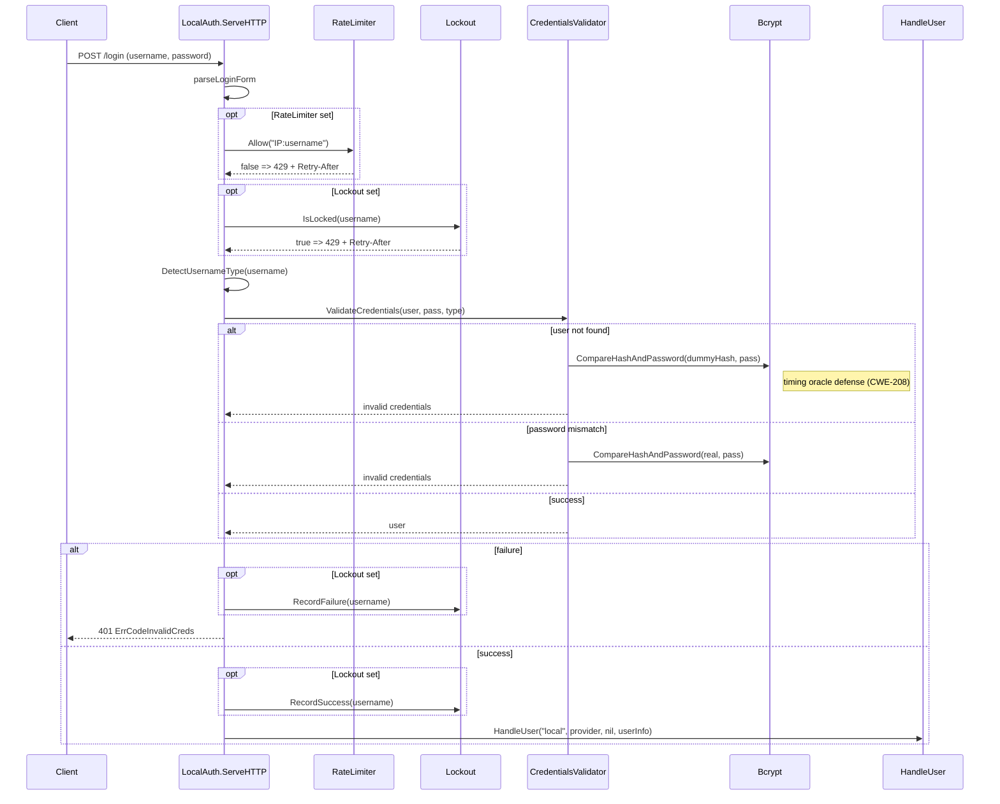
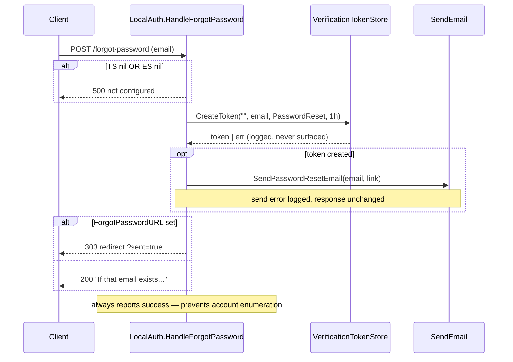

# localauth

Local (non-federated) username/password authentication. Provides HTTP handlers for signup, login, email verification, forgot/reset password, and credential linking — plus the store-backed callback factories (`New*Func`) that wire those handlers to pluggable User/Identity/Channel/Token stores.

The package is config-driven: `LocalAuth` is a struct of optional fields, and nil fields cleanly disable features (no `TokenStore` => no password reset, no `EmailSender` => no verification email). Validation comes in two flavors: the newer declarative `SignupPolicy` and the older imperative `SignupValidator` (kept for backwards compatibility, policy wins when both are set). Login defenses are layered: optional per-`IP:username` rate limiter, optional `AccountLockout` after consecutive failures, and an always-on dummy-bcrypt compare for missing users to defeat timing-based enumeration.

## Contents

- [Entities](#entities)
- [Flows](#flows)
  - [Signup with optional email verification](#signup-with-optional-email-verification)
  - [Login with rate limit + lockout](#login-with-rate-limit--lockout)
  - [Forgot password request](#forgot-password-request)
  - [Reset password confirm](#reset-password-confirm)
  - [Link local credentials to OAuth user](#link-local-credentials-to-oauth-user)
- [Gotchas](#gotchas)
- [Depends on](#depends-on)

## Entities

| Entity | Kind | Role | Why |
|---|---|---|---|
| `LocalAuth` | struct | Config-as-struct that wires credential validators, stores, email sender, signup policy, error handlers, rate limiter, and lockout into the local-auth HTTP handlers. | All behavior is driven by which optional fields are set; nil fields disable features rather than erroring at construction. |
| `LocalAuth.ServeHTTP` | method | Login POST handler — parses form, rate-limits, checks lockout, validates credentials, fires HandleUser on success. | Rate-limit and lockout checks run BEFORE credential validation so attackers can't bypass them via timing/state; key is `IP:username`. |
| `LocalAuth.HandleSignup` | method | Registration POST handler — parses form, validates against `SignupPolicy` or legacy validator, enforces username uniqueness, creates user, optionally emails verification, auto-logs-in. | Auto-login is skipped only when `RequireEmailVerification` AND `EmailSender` are both set; CreateUser error substrings map to `ErrCodeEmailExists`. |
| `LocalAuth.HandleVerifyEmail` | method | GET handler that verifies an email-verification token from the `?token` query param via the configured `VerifyEmail` callback. | Only token plumbing lives here; identity-marking is delegated to the configured func so backends stay swappable. |
| `LocalAuth.HandleForgotPasswordForm` | method | GET handler that either redirects to `ForgotPasswordURL` or renders a minimal built-in HTML form. | Dual-mode (redirect vs built-in form) lets apps own the UI without forcing them to ship one. |
| `LocalAuth.HandleForgotPassword` | method | POST handler that mints a password-reset token and emails a reset link, always returning success. | Always reports success even if the email is unknown or token creation fails, to prevent account enumeration. |
| `LocalAuth.HandleResetPasswordForm` | method | GET handler that redirects to `ResetPasswordURL` or renders a built-in reset form with the token embedded. | Embeds token via `html/template.HTMLEscapeString` to prevent reflected XSS (gosec G705). |
| `LocalAuth.HandleResetPassword` | method | POST handler that validates the reset token + type, enforces min length, updates the password, and deletes the one-time token. | Enforces an inline 8-char minimum independent of `SignupPolicy`; deletes token after use so links can't be replayed. |
| `LocalAuth.HandleLinkCredentials` | method | Returns a protected-route handler that adds a local password (and optional username) to an existing logged-in OAuth-only user. | Requires a caller-supplied `GetLoggedInUserFunc`; maps "already exist" errors to 409 Conflict. |
| `SignupPolicy` | struct | Declarative signup requirements — which fields are required, uniqueness flags, min password length, username regex. | Replaces the older imperative `SignupValidator`; presets cover common shapes. |
| `DefaultSignupPolicy` | func | Returns email+password required, username optional, min 8, default username pattern. | Used implicitly when `LocalAuth.SignupPolicy` is nil but called through the policy path. |
| `PolicyUsernameRequired` | var | Preset policy — username + email + password required. | Common preset for apps where username is the primary identifier. |
| `PolicyEmailOnly` | var | Preset — email + password required, username optional. | Common preset for email-first products. |
| `PolicyFlexible` | var | Preset — everything optional except still validates format if provided. | OAuth-friendly path where the OAuth provider supplies identity. |
| `SignupPolicy.GetUsernamePattern` | method | Returns the compiled username regexp, falling back to default if empty. | Cheap recompile per call lets callers hot-swap policies. |
| `SignupPolicy.GetMinPasswordLength` | method | Returns `MinPasswordLength`, defaulting to 8 if zero or negative. | Defensive default keeps misconfigured policies from accepting empty passwords. |
| `Credentials` | struct | Holds Username, Email, Phone, Password for signup/login; Email/Phone are `*string`. | Pointer-optional fields distinguish "not provided" from empty; on login `Username` carries username/email/phone interchangeably. |
| `SignupValidator` | type | `func(creds *Credentials) error` — legacy imperative signup validator. | Backwards compatibility; `SignupPolicy` takes precedence when set. |
| `CredentialsValidator` | type alias | Alias for `accounts.CredentialsValidator` — the login-side credential check. | Re-exported so localauth callers don't need a second import. |
| `CreateUserFunc` | type | `func(creds *Credentials) (accounts.User, error)` — pluggable user-creation hook. | Default impl produced by `NewCreateUserFunc`; apps can inject custom logic. |
| `DefaultSignupValidator` | var | Built-in `SignupValidator` — 3-20 alnum username, email-or-phone required, basic formats, min 8-char password. | Used when `SignupPolicy` is nil and no custom validator is set, so signup is usable out of the box. |
| `DetectUsernameType` | func | Re-export of `accounts.DetectUsernameType`; classifies input as `email`/`phone`/`username`. | Saves localauth users from importing `accounts/` for this one helper. |
| `VerificationType` | type | String-typed enum (`email_verification`, `password_reset`). | Renamed from `core.TokenType` to avoid colliding with OAuth tokens; string values kept stable for persisted data. |
| `VerificationToken` | struct | `Token`, `Type`, `Subject`, `Email`, `CreatedAt`, `ExpiresAt`. | Renamed from `core.AuthToken` to reflect verification (not OAuth) semantics; `Subject` (was `UserID`) is empty for password-reset so the AS can avoid revealing whether the email belongs to a registered user. |
| `VerificationTokenStore` | interface | CRUD for verification tokens — `CreateToken`, `GetToken`, `DeleteToken`, `DeleteSubjectTokens`, all in the `(ctx, *Req) → (*Resp, error)` shape. | Storage-agnostic; backends in `stores/` implement it. Migrated to gRPC-shape in #204d so the interface evolves additively. |
| `CreateVerificationTokenRequest` / `Response` | struct | Inputs/outputs for `CreateToken` — `Subject`, `Email`, `Type`, `ExpiryDuration` → `*VerificationToken`. | Request-shape lets the AS pass an empty `Subject` on password-reset without overloading the signature. |
| `GetVerificationTokenRequest` / `Response` | struct | Inputs/outputs for `GetToken` — `Token` lookup → `*VerificationToken`. | Same `(ctx, *Req) → (*Resp, error)` shape as the rest of the AS. |
| `DeleteVerificationTokenRequest` / `Response` | struct | Inputs/outputs for `DeleteToken` — one-time-use deletion by token string. | Used by both `NewVerifyEmailFunc` (after verification) and `HandleResetPassword` (after reset). |
| `DeleteSubjectVerificationTokensRequest` / `Response` | struct | Inputs/outputs for `DeleteSubjectTokens` — bulk-delete tokens by `Subject` + `Type`. | Renamed from the older `DeleteUser`-style name to match the project-wide `Subject` vocab from PR 2a. |
| `VerificationToken.IsExpired` | method | True if `time.Now()` is past `ExpiresAt`. | Helper kept on the struct so backends don't re-implement. |
| `VerificationToken.IsValid` | method | True if Type matches expected AND not expired. | Collapses the two checks every handler needs. |
| `VerificationExpiryEmail` | const | 24-hour default expiry for email-verification. | Survives overnight signup gaps. |
| `VerificationExpiryPasswordReset` | const | 1-hour default expiry for password-reset. | Short window limits blast radius of a stolen reset link. |
| `SendEmail` | interface | App-provided email transport — `SendVerificationEmail`, `SendPasswordResetEmail`. | localauth never speaks SMTP directly; apps inject their provider. |
| `ConsoleEmailSender` | struct | Dev-only `SendEmail` that logs to stdout. | Lets examples and tests run without a mail server. |
| `VerifyEmailFunc` | type | `func(token string) error` — verify-email callback. | Decouples `LocalAuth` from store wiring; built by `NewVerifyEmailFunc`. |
| `UpdatePasswordFunc` | type | `func(email, newPassword string) error` — password-update callback. | Decouples `LocalAuth` from store wiring; built by `NewUpdatePasswordFunc`. |
| `GetLoggedInUserFunc` | type | `func(r *http.Request) (userID string, err error)` — app-supplied session resolver. | `HandleLinkCredentials` needs the current user but localauth has no session model. |
| `LinkCredentialsConfig` | struct | Stores bundle for `HandleLinkCredentials`. | Converted internally to `LinkLocalCredentialsConfig` so the HTTP path reuses the helper. |
| `LinkLocalCredentialsConfig` | struct | Store bundle for `LinkLocalCredentials`. | Self-contained so localauth doesn't import federatedauth for this cross-cutting flow. |
| `NewCreateUserFunc` | func | Builds a `CreateUserFunc` that creates User + (unverified) Identity + local Channel with bcrypt hash. | Rejects signup if email/phone identity exists; email or phone is required as primary identity. |
| `NewCredentialsValidator` | func | Builds an email/phone-login validator that verifies bcrypt against the local channel. | Runs bcrypt on `dummyBcryptHash` for missing users to defeat CWE-208 timing oracle. |
| `NewCredentialsValidatorWithUsername` | func | Like above but also resolves username logins via `UsernameStore`. | Falls back to email/phone for non-username inputs; does NOT include the dummy-hash timing defense. |
| `NewVerifyEmailFunc` | func | Builds a `VerifyEmailFunc` that validates type, marks identity verified, deletes token. | Token deletion failure is logged but non-fatal so verification still succeeds. |
| `NewUpdatePasswordFunc` | func | Builds an `UpdatePasswordFunc` that rehashes and stores a new password, creating a local channel if none exists. | Auto-creates a local channel so OAuth-only users can set a password via reset. |
| `LinkLocalCredentials` | func | Adds a local password channel to an existing user, reserves username, appends `"local"` to `profile["channels"]`. | Verifies the email belongs to the userID and rejects if a local channel already exists. |
| `dummyBcryptHash` | var | Pre-computed bcrypt hash used to equalize timing on missing-user lookups. | CWE-208 mitigation; without this, missing users return ~1ms while real users take ~50ms. |

## Flows

### Signup with optional email verification

```mermaid
sequenceDiagram
    participant Client
    participant LA as LocalAuth.HandleSignup
    participant Pol as SignupPolicy
    participant US as UsernameStore
    participant CU as CreateUserFunc
    participant TS as VerificationTokenStore
    participant ES as SendEmail
    participant HU as HandleUser

    Client->>LA: POST /signup (form/JSON)
    LA->>LA: parseSignupForm
    LA->>Pol: validate (policy or legacy validator)
    Pol-->>LA: AuthError | ok
    alt username set + UsernameStore + EnforceUsernameUnique
        LA->>US: GetUserByUsername
        US-->>LA: found => ErrCodeUsernameTaken
    end
    LA->>CU: CreateUser(creds)
    CU-->>LA: user (or "already registered" => ErrCodeEmailExists)
    opt username set
        LA->>US: ReserveUsername(name, userID)
        Note over LA,US: best-effort; failure logged, signup still succeeds
    end
    opt email + ES + TS + BaseURL
        LA->>TS: CreateToken(userID, email, Email, 24h)
        LA->>ES: SendVerificationEmail(link)
    end
    alt !RequireEmailVerification OR ES nil
        LA->>HU: HandleUser("local", provider, nil, userInfo)
    else require verification
        LA-->>Client: {"message":"Check your email","user_id":...}
    end
```

### Login with rate limit + lockout



### Forgot password request



### Reset password confirm

```mermaid
sequenceDiagram
    participant Client
    participant LA as LocalAuth.HandleResetPassword
    participant TS as VerificationTokenStore
    participant UP as UpdatePasswordFunc
    participant CS as ChannelStore

    Client->>LA: POST /reset-password (token, password)
    alt TS nil OR UP nil
        LA-->>Client: 500 not configured
    end
    LA->>TS: GetToken(token)
    TS-->>LA: authToken | err
    alt err OR Type != PasswordReset
        LA-->>Client: 400 invalid/expired
    end
    alt len(password) < 8
        LA-->>Client: 400 too short
    end
    LA->>UP: UpdatePassword(authToken.Email, password)
    UP->>CS: GetChannel("local", emailKey)
    alt no local channel
        UP->>CS: SaveChannel(new local with password_hash)
        Note over UP,CS: OAuth-only user gains a password
    else local channel exists
        UP->>CS: SaveChannel(updated password_hash)
    end
    UP-->>LA: ok
    LA->>TS: DeleteToken(token)
    Note over LA,TS: one-time use; delete failure logged, response unchanged
    LA-->>Client: 200 / 303 success
```

### Link local credentials to OAuth user

```mermaid
sequenceDiagram
    participant Client
    participant H as HandleLinkCredentials handler
    participant App as GetLoggedInUserFunc
    participant US as UserStore
    participant Pol as SignupPolicy
    participant UNS as UsernameStore
    participant LLC as LinkLocalCredentials
    participant IS as IdentityStore
    participant CS as ChannelStore

    Client->>H: POST /auth/link-credentials (password, username?)
    H->>App: getUser(r)
    App-->>H: userID | unauth => 401
    H->>US: GetUserById(userID)
    US-->>H: user (profile["email"])
    H->>Pol: GetMinPasswordLength / GetUsernamePattern
    H->>H: validate password length + username format
    opt username + UsernameStore
        H->>UNS: GetUserByUsername(name)
        UNS-->>H: existing userID != this => ErrCodeUsernameTaken
    end
    H->>LLC: LinkLocalCredentials(config, userID, name, pass, email)
    LLC->>IS: GetIdentity("email", email)
    IS-->>LLC: identity; reject if identity.UserID != userID
    LLC->>CS: GetChannel("local", identityKey)
    alt local channel already exists
        CS-->>LLC: existing => "already exist" => 409 Conflict
    end
    LLC->>CS: SaveChannel(local + bcrypt(password))
    opt username + UNS
        LLC->>UNS: ReserveUsername(name, userID) (best-effort)
    end
    LLC->>US: SaveUser(profile + "channels"+="local")
    LLC-->>H: ok
    H-->>Client: 200 success
```

## Gotchas

- **Rate-limit and lockout run BEFORE credential validation.** `LocalAuth.ServeHTTP` checks `RateLimiter.Allow("IP:username")` first, then `Lockout.IsLocked(username)`, then validates credentials. Reversing this order would let attackers bypass throttling by exploiting fast-path responses for unknown users. The 429 + `Retry-After: 60` response shape is identical for both, so probing can't distinguish rate-limited vs locked.
- **Dummy-bcrypt timing defense is only in `NewCredentialsValidator`, not the username variant.** `NewCredentialsValidator` runs `bcrypt.CompareHashAndPassword(dummyBcryptHash, ...)` whenever the channel lookup fails, so missing-user latency matches real-user latency (CWE-208). `NewCredentialsValidatorWithUsername` was added later and does NOT include this defense — apps that need it should layer a `RateLimiter` on top.
- **`SignupPolicy` wins over `SignupValidator` when both are set.** `validateSignupCredentials` checks `SignupPolicy != nil` first and uses policy validation; the legacy `ValidateSignup` field is only consulted when policy is nil. Don't set both expecting them to compose — they don't.
- **Forgot-password always reports success.** `HandleForgotPassword` returns 200 (or redirects with `?sent=true`) regardless of whether the email exists, whether token creation succeeded, or whether the send failed. This prevents account enumeration but also masks legitimate misconfiguration — check server logs for `error creating reset token` / `error sending reset email` when debugging.
- **Reset password enforces its own 8-char minimum.** `HandleResetPassword` does NOT consult `SignupPolicy.GetMinPasswordLength()`; it hard-codes `len(password) < 8`. If your policy raises the minimum to 12, the reset path will silently allow shorter passwords. Worth tracking.
- **`VerificationType` was renamed from `core.TokenType`.** Stable string values (`email_verification`, `password_reset`) were preserved so persisted tokens survive the rename, but Go type names changed. The motivation was to stop confusing these short-lived email-mediated tokens with OAuth access/refresh tokens.
- **`VerificationTokenStore` follows the gRPC `(ctx, *Req) → (*Resp, error)` shape.** Per #204d every method takes a typed request and returns a typed response, even when the operation is a single-field call (`Token` lookup). Request types are explicit so the interface can grow new fields without breaking implementations; the JSON tag on `VerificationToken.Subject` is still `"subject"` so persisted tokens round-trip across the `UserID → Subject` rename from PR 2a.
- **`VerificationExpiryEmail = 24h` vs `VerificationExpiryPasswordReset = 1h` is deliberately asymmetric.** Email verification has to survive overnight signup gaps; password reset is much higher-stakes if intercepted, so it's intentionally short.
- **Error codes are distinct per failure mode** (`ErrCodeMissingField`, `ErrCodeInvalidEmail`, `ErrCodeInvalidPhone`, `ErrCodeInvalidUsername`, `ErrCodeWeakPassword`, `ErrCodeUsernameTaken`, `ErrCodeEmailExists`, `ErrCodeInvalidCreds`). This lets frontends highlight the offending field. `LocalAuth.handleLoginError` maps missing-field/invalid-email/invalid-username to HTTP 400, everything else to 401.
- **`HandleSignup` substring-matches CreateUser errors** for `"already registered"` / `"already exists"` to map to `ErrCodeEmailExists`. Custom `CreateUserFunc` impls should include one of those phrases when returning an "identity exists" error so the error code is preserved.
- **Username uniqueness is enforced only if BOTH** `creds.Username != ""` **AND** `a.UsernameStore != nil` **AND** `policy.EnforceUsernameUnique` are true. The `ReserveUsername` call after `CreateUser` is best-effort — its failure is logged but signup still succeeds, which can leave a race-condition gap if two signups land at the same instant.
- **`HandleResetPasswordForm` HTML-escapes the token** via `html/template.HTMLEscapeString` before embedding it in the built-in form (gosec G705). Apps using the redirect mode (`ResetPasswordURL` set) own this concern themselves.
- **`LinkLocalCredentials` rejects if a local channel already exists** — it does not "update password" via the link path. Use the reset flow (`UpdatePasswordFunc`) for that. The 409 Conflict mapping in `HandleLinkCredentials` triggers on the `"already exist"` substring in the error message.
- **`LocalAuth` is a struct of pointers/interfaces, not a constructor.** Apps build it field-by-field. No `NewLocalAuth(...)` is provided because the optional-field surface is large and a constructor would just be a long list of nilable params.

## Depends on

- `../accounts` — account model and store interfaces wired through nearly every handler and helper: `User`, `BasicUser`, `Identity`, `Channel`, `IdentityKey`, `LinkedChannels`, `HandleUserFunc`, `DetectUsernameType`, `UserStore`, `IdentityStore`, `ChannelStore`, `UsernameStore`, `CredentialsValidator` (re-exported as a type alias), `AuthError` / `NewAuthError` / `AuthErrorHandler`, and the stable error-code constants `ErrCodeEmailExists`, `ErrCodeUsernameTaken`, `ErrCodeWeakPassword`, `ErrCodeInvalidUsername`, `ErrCodeInvalidEmail`, `ErrCodeInvalidPhone`, `ErrCodeMissingField`, `ErrCodeInvalidCreds`.
- `../core` — login-defense primitives plugged into `LocalAuth`: `RateLimiter` (per-`IP:username` throttle) and `AccountLockout` (consecutive-failure binary lock).
