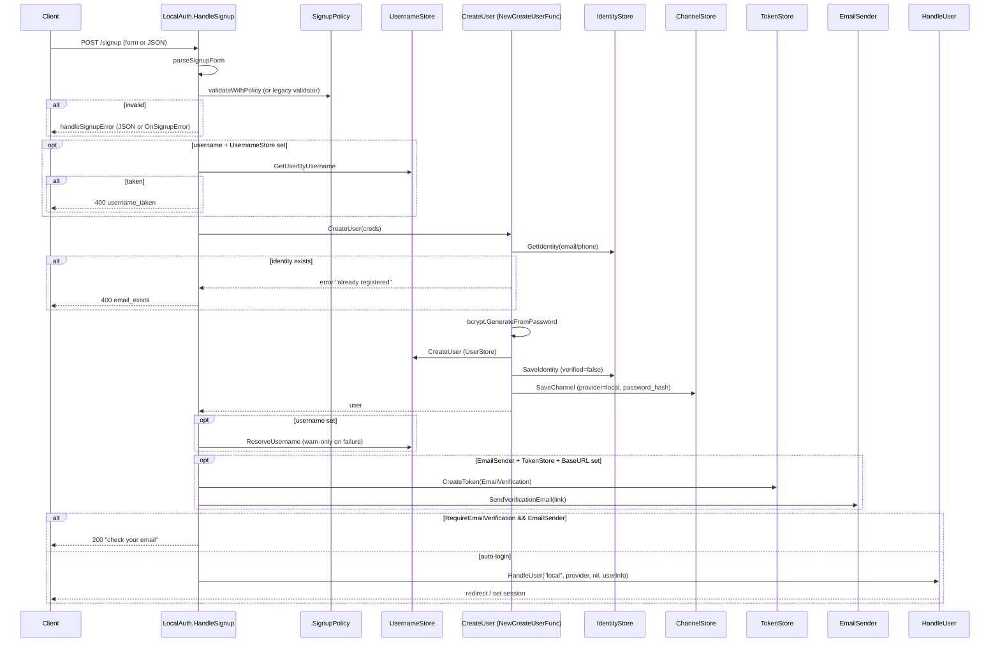
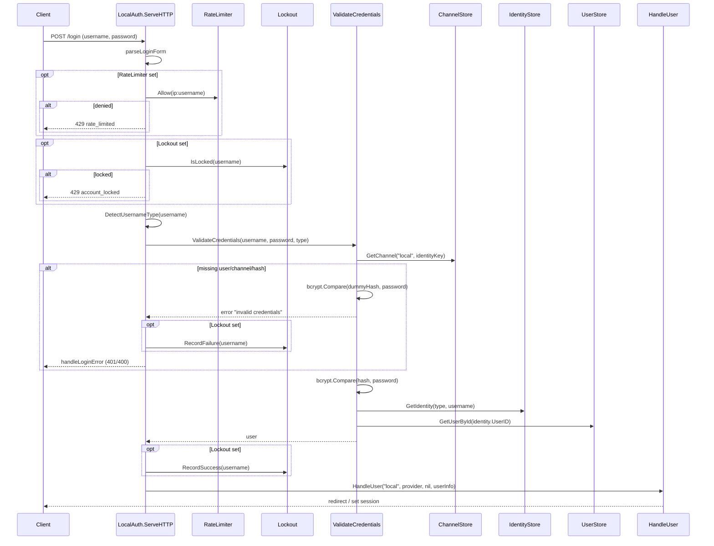
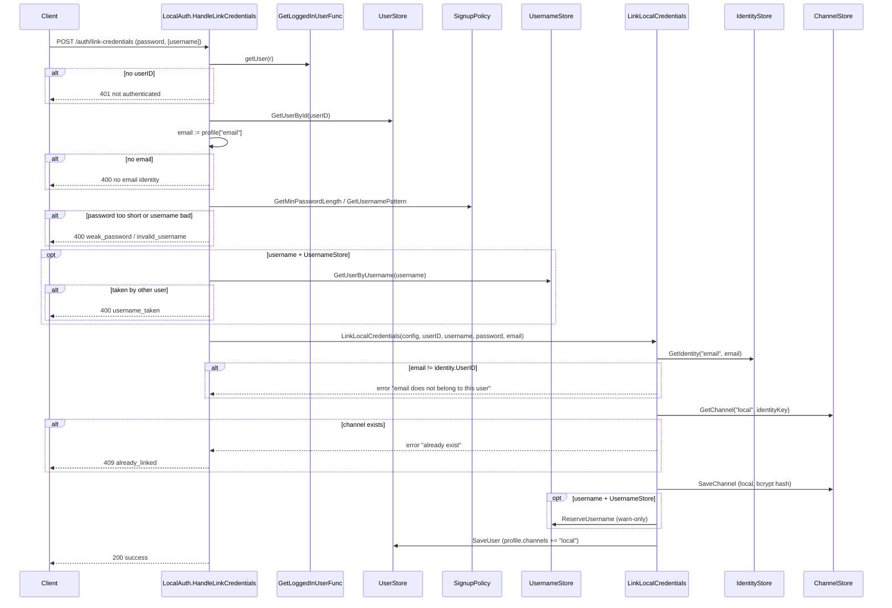

# localauth

`localauth` owns first-party (non-OAuth) authentication: signup, login, email verification, forgot/reset password, and credential linking that grafts a local password onto an existing OAuth-only user. It is implemented as a single `LocalAuth` config-struct whose optional fields gate features — nil `TokenStore` disables reset, nil `EmailSender` disables verification email, nil `RateLimiter`/`Lockout` disables abuse defenses. Behind the HTTP layer, package-level `New*Func` helpers wire `core.UserStore` / `IdentityStore` / `ChannelStore` / `TokenStore` / `UsernameStore` into the small callback types (`CredentialsValidator`, `CreateUserFunc`, `VerifyEmailFunc`, `UpdatePasswordFunc`) that `LocalAuth` actually invokes, keeping the handlers store-agnostic. The package deliberately defers two concerns to the caller: session/JWT decoding (via `GetLoggedInUserFunc` for credential linking) and the final user-redirect after success (via `core.HandleUserFunc`).

## Contents

- [Entities](#entities)
- [Flows](#flows)
  - [Signup](#signup)
  - [Login](#login)
  - [Forgot and reset password](#forgot-and-reset-password)
  - [Link local credentials onto OAuth user](#link-local-credentials-onto-oauth-user)
  - [EnsureAuthUser (OAuth callback / channel linking)](#ensureauthuser-oauth-callback--channel-linking)
- [Gotchas](#gotchas)
- [Depends on](#depends-on)

## Entities

| Entity | Kind | Role | Why |
|---|---|---|---|
| `LocalAuth` | struct | Config-as-struct holder wiring credential validators, stores, email sender, policy, and error handlers into the local auth HTTP handlers. | All behavior is driven by which optional fields are set; nil fields disable features rather than erroring at construction. |
| `LocalAuth.ServeHTTP` | method | Login POST handler — parses form, rate-limits, checks lockout, validates credentials, fires HandleUser on success. | Rate-limit and lockout checks run before credential validation so attackers can't bypass them via timing/state; key is IP:username. |
| `LocalAuth.HandleSignup` | method | Registration POST handler — parses form, validates, enforces username uniqueness, creates user, optionally emails verification link, auto-logs-in. | Auto-login is skipped only when `RequireEmailVerification` AND an `EmailSender` are both set; substring-matches `CreateUser` errors to map to `ErrCodeEmailExists`. |
| `LocalAuth.HandleVerifyEmail` | method | Verifies an email-verification token from the `?token` query param via the configured `VerifyEmail` callback. | Only token plumbing lives here; identity-marking is delegated so backends stay swappable. |
| `LocalAuth.HandleForgotPasswordForm` | method | GET handler that either redirects to `ForgotPasswordURL` or renders a minimal built-in HTML form. | Dual-mode (redirect vs built-in form) lets apps own the UI without forcing them to. |
| `LocalAuth.HandleForgotPassword` | method | POST handler that mints a password-reset token and emails a reset link, always returning success. | Always reports success even if email is unknown or token creation fails, to prevent account enumeration. |
| `LocalAuth.HandleResetPasswordForm` | method | GET handler that redirects to `ResetPasswordURL` or renders a built-in reset form with the token embedded. | Embeds token via `html/template` escaping to prevent reflected XSS (G705). |
| `LocalAuth.HandleResetPassword` | method | POST handler that validates the reset token + type, enforces min length, updates the password, and deletes the one-time token. | Inline 8-char minimum is hardcoded (independent of `SignupPolicy`); deletes token after use so links can't be replayed. |
| `LocalAuth.HandleLinkCredentials` | method | Returns a protected-route handler that adds a local password (and optional username) to an existing logged-in OAuth-only user. | Requires a caller-supplied `GetLoggedInUserFunc`; maps "already exist" errors to 409 Conflict. |
| `VerifyEmailFunc` | type | `func(token string) error` callback that verifies an email by token. | Decouples `LocalAuth` from store wiring; constructed by `NewVerifyEmailFunc`. |
| `UpdatePasswordFunc` | type | `func(email, newPassword string) error` callback that updates a user's password. | Decouples `LocalAuth` from store wiring; constructed by `NewUpdatePasswordFunc`. |
| `GetLoggedInUserFunc` | type | `func(r *http.Request) (userID string, err error)` — app-supplied resolver for the current session user. | `HandleLinkCredentials` needs the logged-in user but localauth has no session model; the app owns session/JWT decoding. |
| `LinkCredentialsConfig` | struct | Bundles `UserStore`, `IdentityStore`, `ChannelStore`, and optional `UsernameStore` for `HandleLinkCredentials`. | Converted internally to `EnsureAuthUserConfig` so the link path reuses the same store helpers. |
| `EnsureAuthUserConfig` | struct | Store bundle (User/Identity/Channel + optional Username) shared by the ensure-user and credential-linking helpers. | A single config type lets OAuth login, local signup, and linking share channel-aware user creation logic. |
| `NewCreateUserFunc` | func | Builds a `core.CreateUserFunc` that creates User + (unverified) Identity + local Channel with a bcrypt password hash. | Rejects signup if the email/phone identity already exists; email or phone is required as the primary identity. |
| `NewCredentialsValidator` | func | Builds a `core.CredentialsValidator` for email/phone login that verifies bcrypt password against the local channel. | Runs bcrypt against a dummy hash on missing user to defeat the CWE-208 timing oracle; username login is unsupported here. |
| `NewCredentialsValidatorWithUsername` | func | Like `NewCredentialsValidator` but also resolves username logins via `UsernameStore` to the user's email identity. | Falls back to email/phone lookup for non-username inputs; does NOT include the dummy-hash timing defense. |
| `NewVerifyEmailFunc` | func | Builds a `VerifyEmailFunc` that validates the token type, marks the email identity verified, and deletes the token. | Token deletion failure is logged but non-fatal so verification still succeeds. |
| `NewUpdatePasswordFunc` | func | Builds an `UpdatePasswordFunc` that rehashes and stores a new password, creating a local channel if none exists. | Auto-creates a local channel so OAuth-only users can set a password via the reset flow. |
| `NewEnsureAuthUserFunc` | func | Builds the `AuthUserStore.EnsureAuthUser` logic — links a new channel to an existing email-matched user or creates a fresh user/identity/channel. | Email is the linking key across providers; OAuth identities are created verified, local ones unverified. |
| `LinkLocalCredentials` | func | Adds a local password channel to an existing user, reserves username, and appends "local" to `profile["channels"]`. | Verifies the email belongs to the userID and rejects if a local channel already exists, preventing hijack. |

## Flows

### Signup



### Login



### Forgot and reset password

```mermaid
sequenceDiagram
    participant Client
    participant LA_F as LocalAuth.HandleForgotPassword
    participant TS as TokenStore
    participant ES as EmailSender
    participant LA_R as LocalAuth.HandleResetPassword
    participant UP as UpdatePassword (NewUpdatePasswordFunc)
    participant CS as ChannelStore
    participant IS as IdentityStore

    Client->>LA_F: POST /forgot-password (email)
    LA_F->>TS: CreateToken(userID="", email, PasswordReset)
    note over LA_F,TS: errors swallowed; always reports success
    opt token created
        LA_F->>ES: SendPasswordResetEmail(resetLink)
    end
    alt ForgotPasswordURL set
        LA_F-->>Client: 303 redirect ?sent=true
    else
        LA_F-->>Client: 200 "if that email exists..."
    end

    Client->>LA_R: POST /reset-password (token, password)
    LA_R->>TS: GetToken(token)
    alt invalid / wrong type
        LA_R-->>Client: resetPasswordError (redirect ?error=... or JSON)
    end
    alt len(password) < 8
        LA_R-->>Client: resetPasswordError
    end
    LA_R->>UP: UpdatePassword(authToken.Email, password)
    UP->>IS: GetIdentity("email", email)
    UP->>CS: GetChannel("local", identityKey)
    alt no local channel
        UP->>UP: build new local channel (OAuth-only user)
    end
    UP->>UP: bcrypt.GenerateFromPassword
    UP->>CS: SaveChannel
    LA_R->>TS: DeleteToken(token) (one-time)
    alt ResetPasswordURL set
        LA_R-->>Client: 303 redirect ?success=true
    else
        LA_R-->>Client: 200 JSON success
    end
```

### Link local credentials onto OAuth user



### EnsureAuthUser (OAuth callback / channel linking)

```mermaid
sequenceDiagram
    participant Caller as OAuth callback / SaveUserAndRedirect
    participant EAU as NewEnsureAuthUserFunc closure
    participant IS as IdentityStore
    participant US as UserStore
    participant CS as ChannelStore

    Caller->>EAU: ensureAuthUser(authtype, provider, token, userInfo)
    EAU->>EAU: email := userInfo["email"]
    alt no email
        EAU-->>Caller: error "email required"
    end
    EAU->>IS: GetIdentity("email", email)
    alt identity exists (existing user)
        EAU->>US: GetUserById(identity.UserID)
        EAU->>CS: GetChannel(provider, identityKey, create=true)
        EAU->>EAU: merge userInfo into channel.Profile
        EAU->>CS: SaveChannel
        opt provider not in profile["channels"]
            EAU->>EAU: append provider; fill name/picture if empty
            EAU->>US: SaveUser
        end
        EAU-->>Caller: user
    else new user
        EAU->>EAU: generateSecureUserId (crypto/rand)
        EAU->>US: CreateUser(id, profile{email, channels:[provider]})
        EAU->>IS: SaveIdentity(verified = (authtype=="oauth"))
        EAU->>CS: SaveChannel(provider, identityKey, userInfo)
        EAU-->>Caller: user
    end
```

## Gotchas

- **Timing oracle defense is uneven across validators.** `NewCredentialsValidator` runs `bcrypt.CompareHashAndPassword` against a package-level `dummyBcryptHash` whenever the user/channel/hash isn't found (CWE-208 mitigation, called out in comments). `NewCredentialsValidatorWithUsername` does NOT — every miss path returns instantly. If you enable username login on a high-value target, you've widened the enumeration surface unless you front it with rate limiting or your own constant-time wrapper.
- **Rate-limit/lockout key is `IP:username`.** Cycling either dimension defeats the limiter. `getClientIP` reads `X-Forwarded-For` / `X-Real-IP` blindly without checking that the request actually came through a trusted proxy, so spoofed headers can rotate the IP component for free. Deploy behind a proxy that strips client-supplied forwarding headers.
- **Reset-password min length is hardcoded to 8 and ignores `SignupPolicy`.** `HandleResetPassword` has its own `len(password) < 8` check; if your signup policy requires 12 chars, the reset flow lets users regress to 8. `HandleLinkCredentials` does the opposite — it reads `policy.GetMinPasswordLength()`. Three password-setting paths, two policies.
- **`HandleForgotPassword` always swallows errors.** Both token-creation failure and email-send failure are logged-and-ignored; the response is identical to success. Good for enumeration resistance, bad for ops — a misconfigured `EmailSender` produces silent dropped resets unless you watch the logs.
- **Reset tokens carry only an email, not a user ID.** `TokenStore.CreateToken(userID="", email, PasswordReset, ...)` is intentional so we don't have to resolve the user (and reveal existence) on the forgot path, but it means `UpdatePassword` lives with whatever `IdentityStore.GetIdentity("email", ...)` resolves to at reset time. If an email is reassigned between request and reset, the new owner takes the password change.
- **Signup field name `"username"` is hardcoded; `LocalAuth.UsernameField` only affects login.** The asymmetry is deliberate (`parseSignupForm` comments it) but surprising — set `UsernameField: "user"` and signup forms still need `username=` while login accepts `user=`.
- **`HandleSignup` detects "email already exists" by substring matching the `CreateUser` error.** The matcher looks for the literal strings `"already registered"` or `"already exists"`. Custom `CreateUserFunc` implementations that return differently-worded errors will get a generic `create_failed` code instead of `ErrCodeEmailExists`, and the client can't distinguish duplicate-email from real failures.
- **`NewUpdatePasswordFunc` silently creates a local channel for OAuth-only users.** That's the documented feature (lets Google-signup users add a password via "forgot password"), but combined with the always-success forgot-password response it means *any* email that exists as an OAuth identity can have a local channel materialized by a stranger who knows the email — they still need the emailed token, but the attack surface is the email account, not "did the user opt in to local auth".
- **`EnsureAuthUser` trusts `userInfo["email"]` as the cross-provider link key.** Two providers that both vouch for the same email collapse onto one user. If a provider returns an unverified email (or one the user doesn't control), an attacker who controls that provider account can hijack the existing local user. The package assumes upstream OAuth providers only return verified emails — that's a per-provider trust assumption the caller has to enforce.
- **`HandleLinkCredentials` content-type detection is `application/json` prefix only.** Anything else (including no Content-Type) falls through to `r.ParseForm()` whose error is ignored. A JSON body sent without the header is silently dropped to empty fields.

## Depends on

- [`core/`](../core/DESIGN.md) — `User`, `BasicUser`, `Identity`, `Channel`, `IdentityKey`, `UserStore`, `IdentityStore`, `ChannelStore`, `UsernameStore`, `TokenStore`, `AuthToken`, `TokenTypeEmailVerification`, `TokenTypePasswordReset`, `TokenExpiryEmailVerification`, `TokenExpiryPasswordReset`, `Credentials`, `CredentialsValidator`, `CreateUserFunc`, `SignupValidator`, `DefaultSignupValidator`, `SignupPolicy`, `DefaultSignupPolicy`, `DetectUsernameType`, `HandleUserFunc`, `SendEmail`, `RateLimiter`, `AccountLockout`, `AuthError`, `NewAuthError`, `AuthErrorHandler`, `ErrCodeEmailExists`, `ErrCodeInvalidCreds`, `ErrCodeInvalidEmail`, `ErrCodeInvalidPhone`, `ErrCodeInvalidUsername`, `ErrCodeMissingField`, `ErrCodeUsernameTaken`, `ErrCodeWeakPassword`
