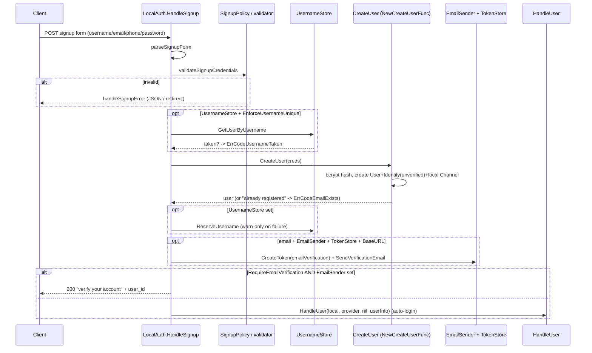
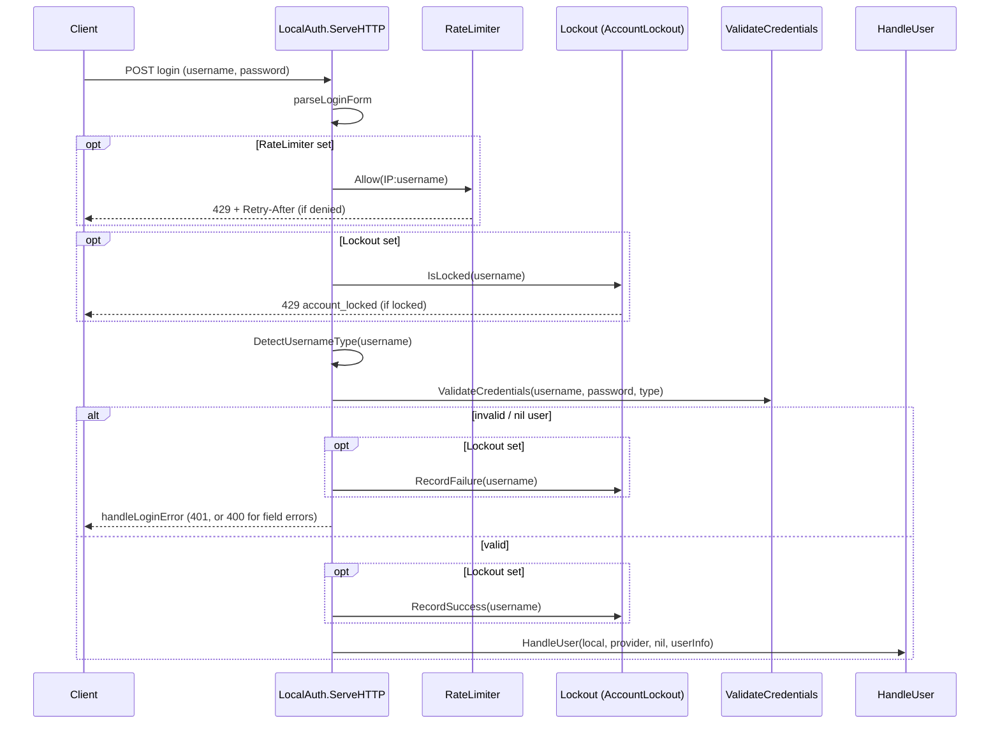
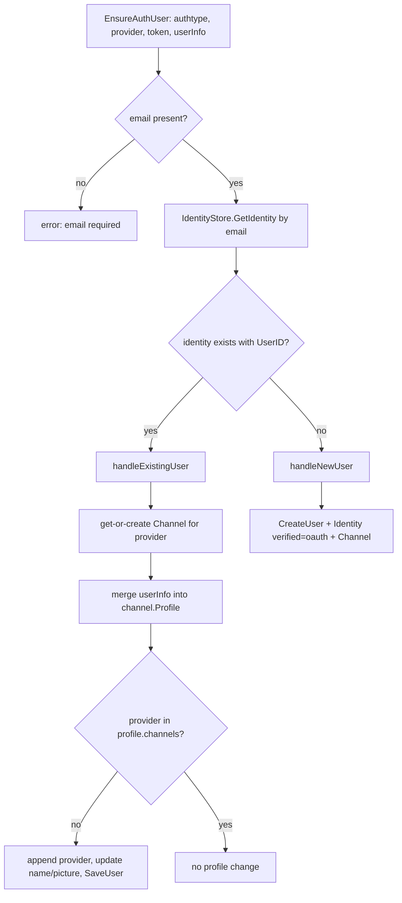

# localauth diagrams

Sequence diagrams for the multi-step local-auth flows. Generated from the package
source; see `doc.go` for the entity reference.

### Signup (with optional email verification)



### Login (rate limit + account lockout)



Note: `NewCredentialsValidator` runs bcrypt against a dummy hash when the user is not
found, keeping response time constant to defeat the CWE-208 timing oracle.

### Password reset (forgot -> reset)

```mermaid
sequenceDiagram
    participant C as Client
    participant FP as HandleForgotPassword
    participant TS as TokenStore
    participant ES as EmailSender
    participant RP as HandleResetPassword
    participant UP as UpdatePassword (NewUpdatePasswordFunc)

    C->>FP: POST forgot-password (email)
    FP->>TS: CreateToken(passwordReset)
    FP->>ES: SendPasswordResetEmail(resetLink)
    FP-->>C: 200 "if that email exists..." (always success)
    Note over C,FP: Always-success response prevents account enumeration

    C->>RP: POST reset-password (token, new password)
    RP->>TS: GetToken(token)
    RP->>RP: check Type == passwordReset, len >= 8
    RP->>UP: UpdatePassword(email, newPassword)
    UP->>UP: bcrypt hash; get-or-create local channel; SaveChannel
    RP->>TS: DeleteToken (one-time use)
    RP-->>C: 200 success / redirect ?success=true
```

### Channel linking via NewEnsureAuthUserFunc (OAuth or local)


