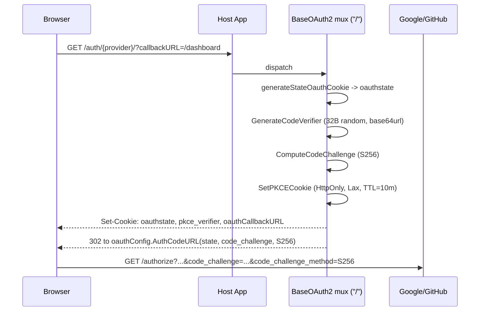
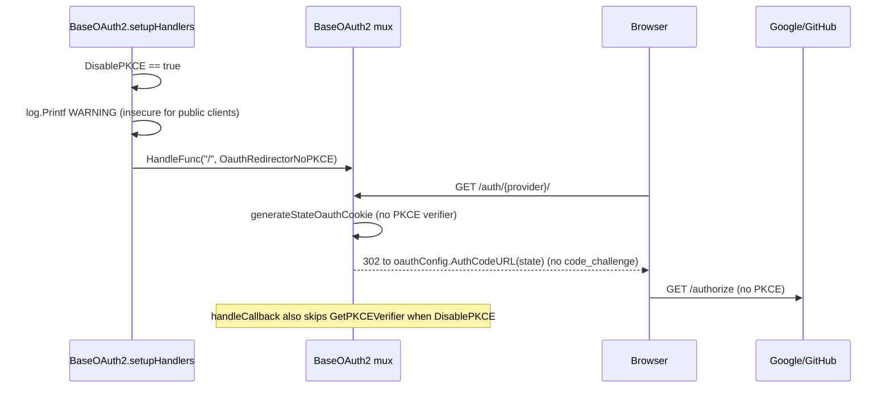

# oauth2

Self-contained OAuth2 social-login adapter for Google and GitHub, packaged as a separate Go module (`github.com/panyam/oneauth/oauth2`) so applications can pull in social login without dragging in the rest of oneauth. A `BaseOAuth2` struct centralises shared concerns — client credentials (with `OAUTH2_*` env-var fallback), an `oauth2.Config` from `golang.org/x/oauth2`, a per-provider `*http.ServeMux`, PKCE (RFC 7636) state, and a `SecureCookies` flag — while `GoogleOAuth2` and `GithubOAuth2` embed it to add their endpoint, scopes, and provider-specific userinfo fetch. The package never persists users: every successful login fans out through a host-supplied `HandleUserFunc(authtype, provider, token, userInfo, w, r)`, leaving session and user-store concerns to the embedding application. CSRF protection uses an `oauthstate` cookie compared against the callback's `state` query param; PKCE is enabled by default and stored verifier-side in an HttpOnly `pkce_verifier` cookie with a 10-minute TTL.

## Contents

- [Entities](#entities)
- [Flows](#flows)
  - [Authorization code initiation with PKCE](#authorization-code-initiation-with-pkce)
  - [Callback, state check, and code exchange](#callback-state-check-and-code-exchange)
  - [PKCE-disabled initiation](#pkce-disabled-initiation)
- [Gotchas](#gotchas)
- [Depends on](#depends-on)

## Entities

| Entity | Kind | Role | Why |
|---|---|---|---|
| `HandleUserFunc` | type | Callback the host supplies to receive `(authtype, provider, token, userInfo, w, r)` once provider login succeeds. | Decouples the package from any session/user-store; the package never persists users itself. |
| `BaseOAuth2` | struct | Shared provider state (client creds, callback URL, `oauth2.Config`, mux, PKCE/secure-cookie flags) embedded by each concrete provider. | Centralises credential, PKCE, and CSRF wiring so each provider only adds its endpoint, scopes, and userinfo fetch. |
| `NewBaseOAuth2` | func | Builds a `BaseOAuth2`, falling back to `OAUTH2_*` env vars for empty creds and wiring the redirect handler at `/`. | Env fallback lets deployments configure without code; called by each provider constructor. |
| `BaseOAuth2.Handler` | method | Returns the provider's `*http.ServeMux` for mounting under a route prefix. | Host mounts this to expose both the `/` redirect and the provider's `/callback/` route. |
| `BaseOAuth2.SetHTTPClient` | method | Injects an `*http.Client` used for userinfo requests (and via `ExchangeContext`, token exchange). | Test seam for mock servers; nil defaults to `http.DefaultClient`. |
| `BaseOAuth2.SetOAuthEndpoint` | method | Overrides the `oauth2.Endpoint` (auth/token URLs). | Test seam to redirect token exchange to a mock OAuth server. |
| `BaseOAuth2.ExchangeContext` | method | Returns a context carrying the injected HTTP client via the `oauth2.HTTPClient` context key. | `golang.org/x/oauth2` reads the client off the context, not the struct, so token exchange must use this. |
| `GoogleOAuth2` | struct | Google provider; embeds `BaseOAuth2` and registers a callback handler that exchanges code and fetches userinfo. | Encapsulates Google's endpoint, scopes, and access-token-as-query-param userinfo convention. |
| `NewGoogleOAuth2` | func | Constructs the Google provider with email/profile scopes and registers `/callback/`. | Uses `OAUTH2_GOOGLE_*` env fallbacks distinct from the generic `OAUTH2_*` ones. |
| `GithubOAuth2` | struct | GitHub provider; embeds `BaseOAuth2` and registers a callback handler that exchanges code and fetches userinfo. | Encapsulates GitHub's endpoint, scopes, and Bearer-header userinfo convention. |
| `NewGithubOAuth2` | func | Constructs the GitHub provider with `read:user`/`user:email` scopes and registers `/callback/`. | Uses `OAUTH2_GITHUB_*` env fallbacks. |
| `OauthRedirectorWithPKCE` | func | Builds the auth-initiation handler that sets state + PKCE cookies and redirects to the provider's auth URL with an S256 challenge. | Default initiation path; also stores a `callbackURL` cookie so the app knows where to land post-login. |
| `OauthRedirectorNoPKCE` | func | Same initiation but without PKCE params/cookie, for providers that reject PKCE. | Selected when `DisablePKCE` is set; intentionally weaker, used only when a provider rejects PKCE. |
| `OauthRedirector` | func | Convenience wrapper that calls `OauthRedirectorWithPKCE` with `secure=false`. | Back-compat default entry point. |
| `GenerateCodeVerifier` | func | Produces a 32-byte crypto-random base64url verifier (43 chars) per RFC 7636 §4.1. | 32 bytes is the RFC-minimum length after encoding. |
| `ComputeCodeChallenge` | func | Returns `BASE64URL(SHA256(verifier))` — the S256 challenge per RFC 7636 §4.2. | Sent on the auth request; verifier proves possession at exchange time. |
| `SetPKCECookie` | func | Stores the verifier in an HttpOnly (optionally Secure) `SameSite=Lax` cookie for the OAuth round-trip. | HttpOnly keeps the verifier away from JS; 10-minute TTL bounds the flow window. |
| `GetPKCEVerifier` | func | Reads the verifier cookie from the callback request, returning `""` if absent. | Empty result triggers a "verifier missing/expired" 400 in the callback handlers. |
| `ClearPKCECookie` | func | Expires the PKCE verifier cookie after exchange. | Single-use hygiene; verifier should not survive the flow. |
| `PKCECookieName` | const | Cookie name (`pkce_verifier`) for the stored verifier. | Shared between set/get/clear helpers. |
| `PKCECookieTTL` | const | Verifier cookie lifetime (10 minutes). | Covers the OAuth round-trip without lingering. |
| `CodeVerifierLength` | const | Verifier byte length (32) before base64 encoding. | Yields the RFC-minimum 43-char verifier. |

## Flows

### Authorization code initiation with PKCE



### Callback, state check, and code exchange

```mermaid
sequenceDiagram
    participant Browser
    participant Mux as Provider mux
    participant Cb as handleCallback
    participant Cfg as oauthConfig (golang.org/x/oauth2)
    participant Provider as Google/GitHub
    participant Fn as HandleUserFunc

    Provider-->>Browser: 302 to /callback/?code=...&state=...
    Browser->>Mux: GET /callback/ (Cookie: oauthstate, pkce_verifier)
    Mux->>Cb: dispatch
    Cb->>Cb: compare r.FormValue("state") vs oauthstate cookie
    alt missing or mismatch
        Cb-->>Browser: 400 "invalid oauth state" (clear oauthstate)
    else state ok
        Cb->>Cb: GetPKCEVerifier(r) (skipped if DisablePKCE)
        alt PKCE on and verifier empty
            Cb-->>Browser: 400 "PKCE verifier missing — flow may have expired"
        else verifier present (or PKCE off)
            Cb->>Cb: ClearPKCECookie(w)
            Cb->>Cfg: Exchange(ExchangeContext, code, code_verifier=...)
            Cfg->>Provider: POST /token
            Provider-->>Cfg: *oauth2.Token
            Cb->>Provider: GET UserInfoURL (Google: ?access_token=; GitHub: Authorization: Bearer)
            Provider-->>Cb: userInfo JSON
            Cb->>Fn: HandleUser("oauth", "google"/"github", token, userInfo, w, r)
        end
    end
    alt exchange or userinfo error
        Cb-->>Browser: 307 redirect to AuthFailureUrl
    end
```

### PKCE-disabled initiation



## Gotchas

- **`golang.org/x/oauth2` reads the HTTP client off the context, not the struct.** A bare `oauthConfig.Exchange(context.Background(), ...)` will use `http.DefaultClient` even after `SetHTTPClient` — that's why `handleCallback` always passes `g.ExchangeContext()` instead. Userinfo requests sidestep this by calling `getHTTPClient()` directly. Anyone calling `Exchange` outside the package needs the same context dance, or the injected test client is silently bypassed.

- **PKCE is on by default; opting out logs a loud warning.** `setupHandlers` picks `OauthRedirectorWithPKCE` unless `DisablePKCE=true`, in which case it logs `WARNING: PKCE disabled for OAuth2 provider (client_id=...)` and points at RFC 7636. Both Google and GitHub callbacks gate the verifier read on `!g.DisablePKCE`, so flipping the flag mid-flight breaks callbacks already in progress (verifier cookies will look unexpected). Treat `DisablePKCE` as a static deployment-time decision per provider.

- **`code_verifier` lives in a 10-minute HttpOnly cookie, not in server state.** If the user lingers past `PKCECookieTTL` (`10 * time.Minute`) the callback returns `400 "PKCE verifier missing — authorization flow may have expired"`. That's also what you get from a fresh tab hitting `/callback/` without first going through `/`. The single-use guarantee comes from `ClearPKCECookie` running immediately after a successful read; error paths skip the clear, but the cookie still expires at TTL. `SameSite=Lax` is fine for the top-level provider redirect but loses the cookie inside iframes/embedded contexts.

- **`SecureCookies` only flags the PKCE cookie, not `oauthstate` or `oauthCallbackURL`.** `SetPKCECookie` honours the `secure` argument, but `generateStateOauthCookie` and the `oauthCallbackURL` cookie in `utils.go` set neither `Secure` nor `HttpOnly`. On HTTPS deployments this means `oauthstate` can leak over a downgrade, and the post-login redirect target is JS-readable. Mount the package behind HTTPS and treat `oauthCallbackURL` as untrusted input on read.

- **`oauthCallbackURL` is taken verbatim from the query string.** Both `OauthRedirectorWithPKCE` and `OauthRedirectorNoPKCE` copy `r.URL.Query().Get("callbackURL")` straight into a cookie with no allowlist or origin check. The package never reads it back itself — that's the host app's job — but a host that blindly redirects to its value is an open-redirect waiting to happen. Validate against an allowlist on the consuming side.

- **State-cookie expiry mismatch.** The oauthstate cookie uses `Expires: now+10m` (absolute) while the `oauthCallbackURL` cookie uses `MaxAge: 120` (2 minutes) with a 24h `Expires`. The shorter `MaxAge` wins on compliant browsers, so a slow user can lose the callbackURL even if the state cookie is still valid. On failure, the mismatch branch in `handleCallback` does explicitly zero the state cookie (`MaxAge: 0`).

- **`OauthRedirector` (no suffix) is *not* the PKCE-disabled path.** Despite the naming, `OauthRedirector(cfg)` calls `OauthRedirectorWithPKCE(cfg, false)` — the `false` is `secure=false`, not "PKCE off". For "PKCE off" you want `OauthRedirectorNoPKCE`. `BaseOAuth2` wires the right one automatically via `DisablePKCE`; reach for these helpers directly only if you're bypassing `BaseOAuth2`.

- **Provider env-var prefixes shadow the generic ones.** `NewBaseOAuth2` falls back to `OAUTH2_CLIENT_ID` / `OAUTH2_CLIENT_SECRET` / `OAUTH2_CALLBACK_URL`, but `NewGoogleOAuth2` and `NewGithubOAuth2` each look for `OAUTH2_GOOGLE_*` / `OAUTH2_GITHUB_*` *before* delegating to the base. If a provider-specific var is set, it wins; otherwise the base picks up the generic ones. Set the provider-specific vars in multi-provider deployments to avoid silent cross-wiring.

- **Provider userinfo conventions differ.** Google takes the access token as `?access_token=` query parameter on `oauth2/v2/userinfo`; GitHub requires `Authorization: Bearer <token>` plus `Accept: application/json` on `/user`. Both `UserInfoURL` fields are public for test override, but a generic switch isn't possible — the call sites differ.

- **Each provider gets its own `http.ServeMux`.** `BaseOAuth2.mux` is private and only reachable via `Handler()`. Two providers must be mounted under distinct route prefixes by the host (e.g., `/auth/google/` and `/auth/github/`) — they cannot share a mux. The `/` and `/callback/` patterns inside each mux are relative to the mount prefix.

- **Separate Go module — no oneauth import path.** `go.mod` is `github.com/panyam/oneauth/oauth2` with only `golang.org/x/oauth2` and `testify` as deps; the rest of oneauth is not importable from here, and `go.work` wires it via a replace directive for local dev. Don't reach for `core/` or `apiauth/` types here — that breaks the "embed social login without the rest" guarantee.

## Depends on

*(no sibling-folder dependencies)*
