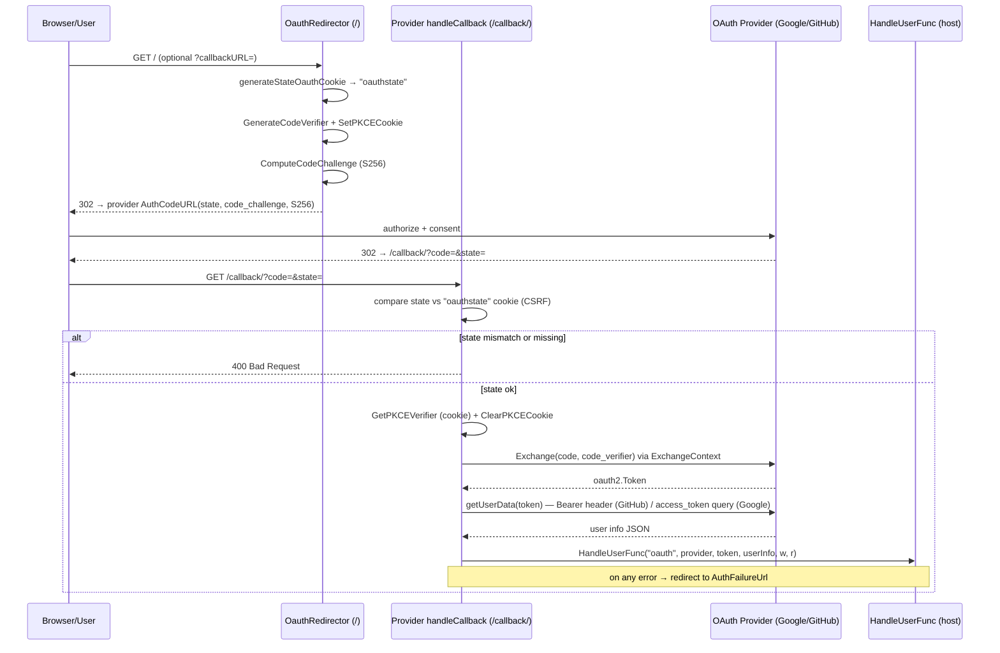

# oauth2 — Diagrams

### Authorization-code flow with PKCE (initiation through callback)

Covers `OauthRedirectorWithPKCE` (the `/` route) and a provider's
`handleCallback` (the `/callback/` route). State cookie provides CSRF
protection; PKCE cookie carries the verifier across the round-trip.

