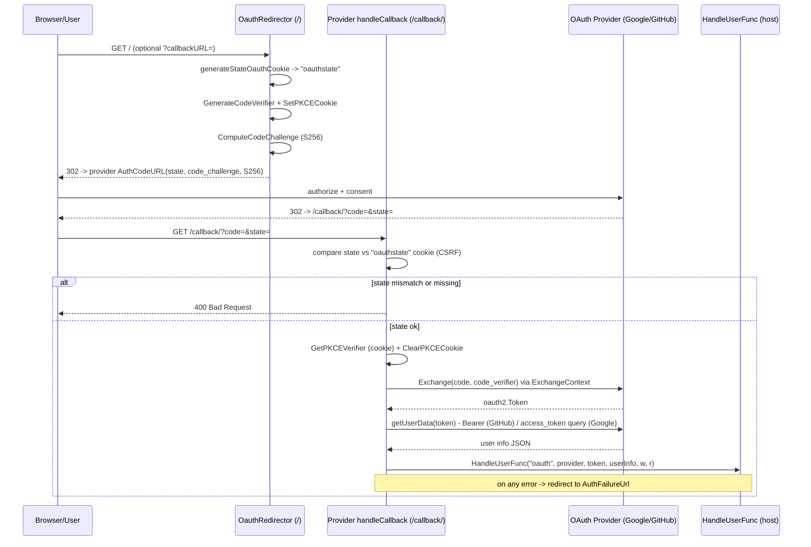
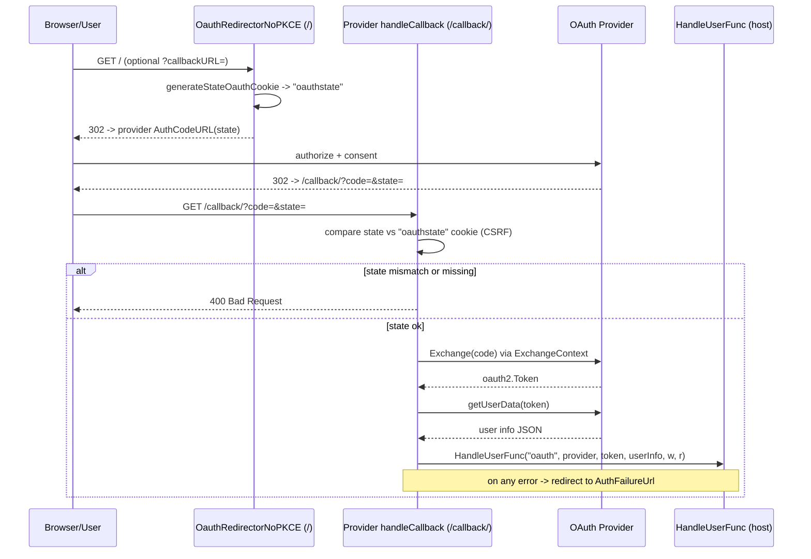

# oauth2 — Diagrams

### Authorization-code flow with PKCE (initiation through callback)

The default flow used by both `GoogleOAuth2` and `GithubOAuth2` whenever
`BaseOAuth2.DisablePKCE` is false (its zero value). Covers
`OauthRedirectorWithPKCE` on the `/` route and a provider's
`handleCallback` on the `/callback/` route. The `oauthstate` cookie
provides CSRF protection; the `pkce_verifier` cookie carries the
verifier across the round-trip so no server-side session is needed.

### Non-PKCE flow (DisablePKCE=true)

Selected only when a provider rejects PKCE. `NewBaseOAuth2` logs a
startup warning when `DisablePKCE` is true. Same shape as the PKCE flow
minus the verifier/challenge pair, so an attacker who intercepts the
authorization code can redeem it on their own client.

