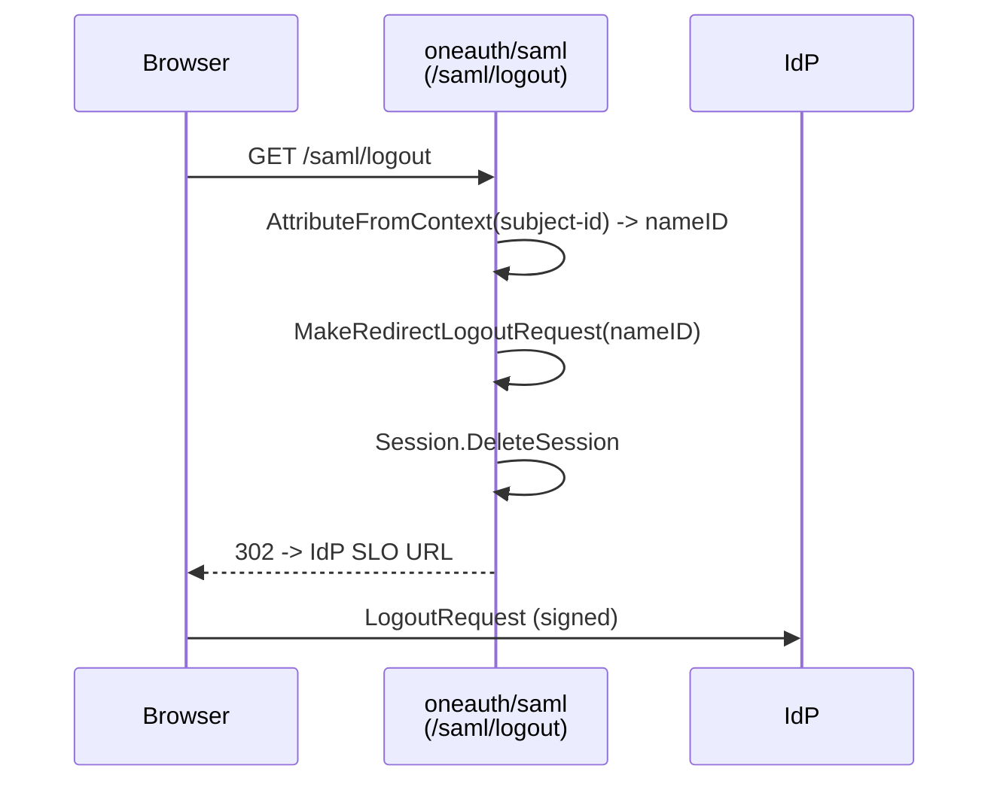

# saml

POC SAML 2.0 Service Provider adapter built on `crewjam/saml`. `RegisterSamlAuth` loads an SP keypair from the process working directory, fetches IdP metadata over HTTP, instantiates a `samlsp.Middleware`, and mounts SP-initiated SSO routes (`/saml/login`, `/saml/acs`, `/saml/logout`, plus the catch-all `/saml/`) onto a caller-supplied `gorilla/mux` router. The handlers are deliberately custom rather than relying on `samlsp.RequireAccount`, so SAML can sit alongside OAuth providers behind a single multi-provider `/login` page; the ACS handler synthesizes an `oauth2.Token` and reuses the host app's `HandleUserFunc` callback so SAML logins flow through the same persistence path as OAuth ones. The in-file `HACK ALERT` comment flags this as a POC slated for replacement.

## Contents

- [Entities](#entities)
- [Flows](#flows)
- [Gotchas](#gotchas)
- [Depends on](#depends-on)

## Entities

| Entity | Kind | Role | Why |
|---|---|---|---|
| `RegisterSamlAuth` | func | Loads SP keypair + IdP metadata, builds `samlsp.Middleware`, mounts `/saml/login`, `/saml/acs`, `/saml/logout`, `/saml/` on the router. | Single entry point host apps call to wire SAML in; the custom `/saml/login` lets SAML coexist as one option on a multi-provider login page rather than gating every page with `RequireAccount`. |
| `HandleUserFunc` | type | Callback signature invoked after a successful ACS assertion, receiving a synthesized `*oauth2.Token` and extracted attributes. | Reuses the host app's OAuth user-persistence path by masking the SAML assertion as an OAuth token. |
| `logout` | func | Builds a SAML SLO redirect using the `subject-id` attribute, deletes the local session, and 302s to the IdP logout URL. | Implements `/saml/logout` so callers get single-logout without touching crewjam internals. |
| `samlMiddleware` | var | Package-level `*samlsp.Middleware` shared by login, ACS, and logout closures. | Handlers are registered as closures on the router but all need the same `ServiceProvider`, `Session`, and `RequestTracker`; package scope avoids threading it through every signature. |
| `SAML_ISSUER` | var | Issuer string returned to the user callback as the provider name; read from `SAML_ISSUER` env var. | Identifies which IdP authenticated the user for audit/storage. |
| `SAML_CALLBACK_URL` | var | Callback URL captured from `SAML_CALLBACK_URL` env var. | Held for future configuration; the active callback today is the `callbackUrl` argument to `RegisterSamlAuth`. |
| `SAML_LOGIN_URL` | var | IdP SSO endpoint from `SAML_LOGIN_URL`, used as the destination of `MakeAuthenticationRequest`. | Tells the SP where to send the browser to start SP-initiated SSO. |
| `SAML_METADATA_URL` | var | IdP metadata URL from `SAML_METADATA_URL`, fetched once at registration. | Provides the IdP's signing certs and endpoint bindings without checking them into the repo. |
| `SAML_CERT_FILE` | const | Hardcoded path `saml_service.cert` for the SP X.509 certificate. | Loaded with the private key to sign AuthnRequests; marked TODO for migration to configmap. |
| `SAML_KEY_FILE` | const | Hardcoded path `saml_service.key` for the SP RSA private key. | Paired with `SAML_CERT_FILE` to form the SP keypair; marked TODO for migration to configmap. |

## Flows

### SP-initiated SSO

```mermaid
sequenceDiagram
    participant Browser
    participant SP as oneauth/saml<br/>(/saml/login, /saml/acs)
    participant IdP

    Browser->>SP: GET /saml/login?returnTo=...
    SP->>SP: MakeAuthenticationRequest(SAML_LOGIN_URL)
    SP->>SP: RequestTracker.TrackRequest (relayState)
    SP-->>Browser: 302 -> IdP SSO URL + RelayState
    Browser->>IdP: AuthnRequest (HTTP-Redirect binding, signed)
    IdP-->>Browser: Login page; user authenticates
    Browser->>SP: POST /saml/acs (SAMLResponse, RelayState)
    SP->>SP: ParseResponse against tracked request IDs
    SP->>SP: Session.CreateSession(assertion)
    SP->>SP: Extract */claims/emailaddress -> userInfo["email"]
    SP->>SP: Synthesize oauth2.Token{AccessToken:"auth_token", +1h}
    SP->>SP: handleUser("saml", SAML_ISSUER, token, userInfo, w, r)
```

### SP-initiated SLO



## Gotchas

- **Author flags this as POC.** The `HACK ALERT` comment in `RegisterSamlAuth` explicitly notes the intent to replace this with a purpose-built middleware once the use case settles. Don't treat the current shape as load-bearing — none of the other oneauth packages depend on it, and there are no tests in this module.
- **Package-level `samlMiddleware` is process-global.** `RegisterSamlAuth` writes to a package var, so calling it twice (e.g. two routers, two IdPs) silently overwrites the previous configuration. Single-tenant SP only.
- **`samlsp.New` error is dropped.** The `_` in `samlMiddleware, _ = samlsp.New(...)` swallows construction errors; if the SP can't be built, the handlers register against a nil middleware and panic on first request rather than failing `RegisterSamlAuth`.
- **TODO error handling is `panic`.** The logout handler and the root-URL parse both `panic(err)` with a `TODO handle error` comment. In a long-running server this brings the goroutine down on transient failures.
- **`returnTo` parsing errors are ignored.** `/saml/login` does `url.Parse(r2)` and reassigns `err` without checking; a malformed `returnTo` silently degrades to the base URL — benign here, but also masks open-redirect-style probing.
- **SP cert/key loaded from CWD.** `SAML_CERT_FILE` / `SAML_KEY_FILE` are bare filenames (`saml_service.cert`, `saml_service.key`). Servers must be started with the right working directory.
- **Env vars read at package init.** `SAML_ISSUER`, `SAML_LOGIN_URL`, `SAML_METADATA_URL`, `SAML_CALLBACK_URL` are captured into vars at import time; `OAUTH2_BASE_URL` is read inside `RegisterSamlAuth`. Setting the first four after `init()` (e.g. from a config file loaded in `main`) has no effect.
- **Attribute extraction is hardcoded to one claim.** Only attributes whose name ends in `/claims/emailaddress` populate `userInfo["email"]`. Other attributes are logged via `log.Println` and discarded; there's no `sub`, `name`, or group propagation.
- **Synthetic OAuth token is a literal string.** The ACS handler returns `AccessToken: "auth_token"` with a one-hour expiry. It's a stand-in so the existing `HandleUserFunc` shape can be reused, not a real bearer; downstream code that treats it as one will be broken.
- **`SignRequest: true` is unconditional.** Set so SLO requests are signed (some IdPs require it), but this also signs AuthnRequests and assumes the SP cert is registered with the IdP for signature verification.

## Depends on

*(no sibling-folder dependencies)*
