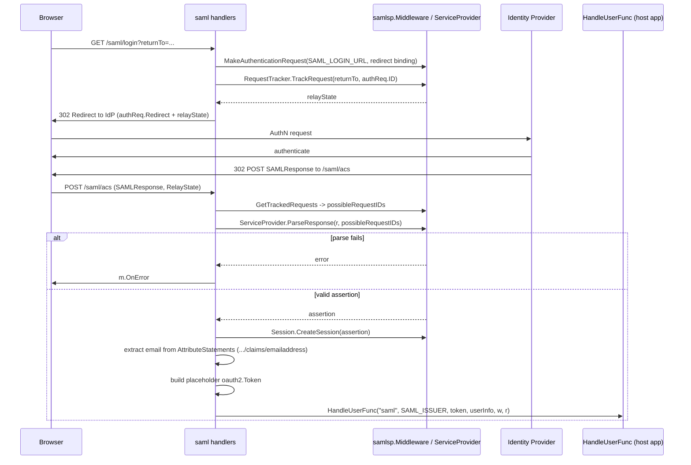
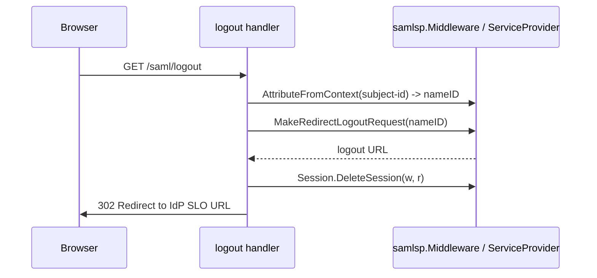

# saml diagrams

### SP-initiated SSO login (login → ACS → user handoff)

```mermaid
sequenceDiagram
    participant U as Browser
    participant SP as saml handlers
    participant MW as samlsp.Middleware / ServiceProvider
    participant IdP as Identity Provider
    participant App as HandleUserFunc (host app)

    U->>SP: GET /saml/login?returnTo=...
    SP->>MW: MakeAuthenticationRequest(SAML_LOGIN_URL, redirect binding)
    SP->>MW: RequestTracker.TrackRequest(returnTo, authReq.ID)
    MW-->>SP: relayState
    SP->>U: 302 Redirect to IdP (authReq.Redirect + relayState)
    U->>IdP: AuthN request
    IdP->>U: authenticate
    IdP->>U: 302 POST SAMLResponse to /saml/acs

    U->>SP: POST /saml/acs (SAMLResponse, RelayState)
    SP->>MW: GetTrackedRequests -> possibleRequestIDs
    SP->>MW: ServiceProvider.ParseResponse(r, possibleRequestIDs)
    alt parse fails
        MW-->>SP: error
        SP->>U: m.OnError
    else valid assertion
        MW-->>SP: assertion
        SP->>MW: Session.CreateSession(assertion)
        SP->>SP: extract email from AttributeStatements (.../claims/emailaddress)
        SP->>SP: build placeholder oauth2.Token
        SP->>App: HandleUserFunc("saml", SAML_ISSUER, token, userInfo, w, r)
    end
```

### Logout (SLO)

```mermaid
sequenceDiagram
    participant U as Browser
    participant SP as logout handler
    participant MW as samlsp.Middleware / ServiceProvider

    U->>SP: GET /saml/logout
    SP->>MW: AttributeFromContext(subject-id) -> nameID
    SP->>MW: MakeRedirectLogoutRequest(nameID)
    MW-->>SP: logout URL
    SP->>MW: Session.DeleteSession(w, r)
    SP->>U: 302 Redirect to IdP SLO URL
```
