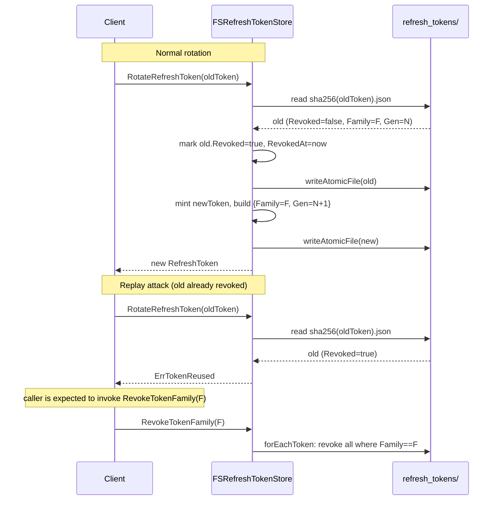
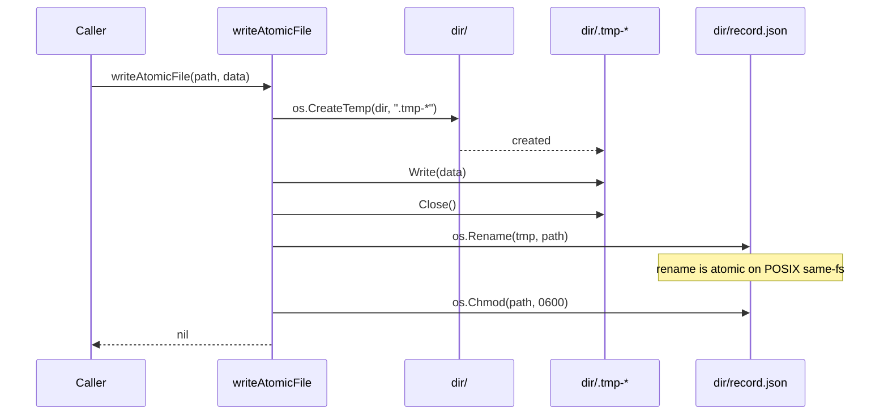

# fs

Filesystem-backed store implementations for OneAuth. One JSON file per record across nine separate stores (signing keys, kid grace entries, app registrations, users, usernames, identities, channels, verification/reset tokens, refresh tokens, API keys), each rooted at a configurable `StoragePath` and shelled into a fixed subdirectory (`signing_keys/`, `kid_keys/`, `apps/`, `users/`, `usernames/`, `identities/`, `channels/`, `tokens/`, `refresh_tokens/`, `api_keys/`). All identifiers from caller input flow through `safeName` before becoming path components, and all writes go through `writeAtomicFile` so a crash leaves either the old or the new file but never a half-written one. Intended for single-process dev and small deployments; multi-process production should use the GORM backend.

## Contents

- [Entities](#entities)
- [Flows](#flows)
- [Gotchas](#gotchas)
- [Depends on](#depends-on)

## Entities

| Entity | Kind | Role | Why |
|---|---|---|---|
| `safeName` | func | Single point of defense sanitizing user-supplied identifiers before use in filesystem paths. | Rejects empty/null-byte/absolute/`..` inputs and folds `/ \ :` to underscores so callers cannot escape the storage dir. |
| `writeAtomicFile` | func | Writes data atomically via tempfile in the same dir, `os.Rename`, then chmod 0600. | A crash mid-write leaves either the old or the new file, never a half-written one; final 0600 ensures owner-only access. |
| `FSKeyStore` | struct | `keys.KeyStorage` impl with one signing-key JSON file per clientID under `signing_keys/`. | Keys must be `[]byte` else `ErrAlgorithmMismatch`; `GetKeyByKid` scans all files because the layout is clientID-indexed. |
| `NewFSKeyStore` | func | Constructor for `FSKeyStore`. | Directory is created lazily on first `PutKey`, not at construction time. |
| `FSKeyStore.PutKey` | method | Persists a `KeyRecord`, computing kid via `utils.ComputeKid` when not supplied. | Atomic write keeps the on-disk view consistent and kid auto-derivation matches in-memory `KeyStore` semantics. |
| `FSKeyStore.GetKeyByKid` | method | Linear scan of `signing_keys/` matching `entry.Kid`. | ClientID-indexed layout means kid lookup has no direct path; acceptable at dev-scale key counts. |
| `fsKeyEntry` | struct | On-disk JSON shape for a signing key (ClientID, Key, Algorithm, Kid). | Decouples the persisted layout from the `keys.KeyRecord` domain type. |
| `FSKidStore` | struct | `keys.KidStorage` impl with one kid-indexed JSON file per kid under `kid_keys/`. | Each entry carries a grace-period `ExpiresAt` (zero = never); expired entries are filtered on read and purged by `CleanExpired`. |
| `NewFSKidStore` | func | Constructor for `FSKidStore`. | `GetKey(clientID)` on a `KidStorage` always returns `ErrKeyNotFound` by design, matching the in-memory `KidStore`. |
| `FSKidStore.GetKeyByKid` | method | Direct kid->path lookup with on-read expiry filter. | Kid is the primary key here (unlike `FSKeyStore`) so lookup is O(1) on disk. |
| `FSKidStore.CleanExpired` | method | Sweeps `kid_keys/` and removes entries whose `ExpiresAt` is in the past. | Maintenance hook; on-read filtering already hides expired entries but disk would grow without this. |
| `fsKidEntry` | struct | On-disk JSON shape for a kid->key grace entry with `ExpiresAt`. | Mirrors `fsKeyEntry` but keyed by kid and carries the rotation grace-period TTL. |
| `isExpired` | func | Helper matching `keys.kidRecord.isExpired` - zero time means never expires. | Centralizes the grace-period predicate so on-read filtering and `CleanExpired` agree. |
| `FSAppStore` | struct | `admin.AppRegistrationStore` impl with one `AppRegistration` JSON file per client_id under `apps/`. | `GetApp` distinguishes a corrupt file (parse error) from an absent registration (`ErrAppNotFound`); `ListApps` silently skips corrupt files so one hand-corrupted file cannot lock out admin tooling. |
| `NewFSAppStore` | func | Constructor for `FSAppStore`. | Single-process only; multi-process deployments need a backend with real transaction semantics (e.g. `GORMAppStore`). |
| `FSAppStore.ListApps` | method | Reads every `.json` under `apps/` and returns parseable entries, skipping corrupt ones silently. | Partial recovery beats total failure for admin tooling; loop var aliasing is avoided via explicit clone. |
| `FSUserStore` | struct | `core.UserStore` impl with one user JSON file per userId under `users/`. | `SaveUser` converts foreign `core.User` implementations into `FSUser`, best-effort preserving `created_at` from the profile map. |
| `NewFSUserStore` | func | Constructor for `FSUserStore`. | No mutex; relies on `writeAtomicFile` plus the single-process assumption. |
| `FSUser` | struct | Persisted user record (UserId, IsActive, UserProfile map, CreatedAt, UpdatedAt) implementing `core.User`. | Open profile map keeps the persisted shape extensible without schema migration. |
| `FSUsernameStore` | struct | `UsernameStore` impl enforcing uniqueness via one file per normalized (lowercase) username under `usernames/`. | Optimistic Version field plus atomic file writes; `ChangeUsername` is best-effort restore on failure (not atomic across files). |
| `NewFSUsernameStore` | func | Constructor for `FSUsernameStore`. | Concurrent same-name reservations resolve last-write-wins. |
| `FSUsernameStore.ChangeUsername` | method | Two-file rename (delete old, write new) with best-effort restore if new write fails. | No cross-file atomicity on the filesystem; documented as "use GORM backend for high-concurrency production". |
| `FSUsername` | struct | Persisted username record carrying both NormalizedUsername (key) and original-case Username plus Version. | Lets lookups be case-insensitive while display preserves original case; Version enables optimistic concurrency. |
| `FSIdentityStore` | struct | `IdentityStore` impl with one identity JSON file per type+value key under `identities/`. | `createIfMissing` seeds an unassigned (empty UserID, unverified) identity; reverse lookups (`GetUserIdentities`) scan the directory. |
| `NewFSIdentityStore` | func | Constructor for `FSIdentityStore`. | Uses `filepath.Base` on the composed identity key for path safety (not `safeName`) - inconsistent but already safe per security tests. |
| `FSChannelStore` | struct | `ChannelStore` impl with one channel JSON file per provider+identityKey under `channels/`. | `SaveChannel` auto-bumps Version and CreatedAt/UpdatedAt; reverse lookup by identityKey scans the directory. |
| `NewFSChannelStore` | func | Constructor for `FSChannelStore`. | `createIfMissing` seeds empty credentials/profile maps. |
| `FSTokenStore` | struct | Verification/reset token store with one `AuthToken` JSON file per token value under `tokens/`. | `GetToken` auto-deletes and rejects expired tokens; `DeleteUserTokens` scans the directory filtering by userID and type. |
| `NewFSTokenStore` | func | Constructor for `FSTokenStore`. | Filename is the (`safeName`-sanitized) token itself, so the secret appears on disk in the path - acceptable for short-lived single-use tokens. |
| `FSRefreshTokenStore` | struct | `RefreshToken` store with rotation and family-based theft detection, one file per token under `refresh_tokens/`. | Filename is the SHA256 hash of the token (not the raw value) so the secret never appears in a path; `RotateRefreshToken` returns `ErrTokenReused` when an already-revoked token is replayed. |
| `NewFSRefreshTokenStore` | func | Constructor for `FSRefreshTokenStore`. | Uses `RWMutex` plus `getTokenUnsafe`/`forEachToken` internals so multi-token sweeps hold a single lock. |
| `FSRefreshTokenStore.RotateRefreshToken` | method | Revokes old token, mints new token in same Family with Generation+1, atomically writes both. | Replay of an already-revoked token returns `ErrTokenReused` as the signal for callers to `RevokeTokenFamily`. |
| `FSRefreshTokenStore.RevokeTokenFamily` | method | Sweeps every token sharing a Family value and marks them revoked. | Family-based theft detection - one compromised generation invalidates the whole chain. |
| `FSRefreshTokenStore.CleanupExpiredTokens` | method | Removes tokens that are expired or revoked more than 24h ago. | Bounded retention for revoked tokens preserves a short forensic window before reclaiming disk. |
| `FSAPIKeyStore` | struct | `APIKey` store with one file per keyID under `api_keys/` and bcrypt-hashed secrets. | `CreateAPIKey` returns the full `oa_keyid_secret` once; `ValidateAPIKey` parses the triple and bcrypt-compares; listings clear `KeyHash` before returning. |
| `NewFSAPIKeyStore` | func | Constructor for `FSAPIKeyStore`. | Only the bcrypt hash of the secret is persisted; the raw secret leaves the store exactly once at creation. |
| `FSAPIKeyStore.ValidateAPIKey` | method | Parses `oa_<keyID>_<secret>`, loads the keyID record, checks revoked/expired, bcrypt-compares. | Constant-time bcrypt compare avoids timing leaks on secret comparison. |

## Flows

### Refresh-token rotation with family-based theft detection

### Atomic JSON write

## Gotchas

- **`safeName` is the only path-safety primitive — stores that don't call it can leak.** Security tests (`security_test.go`) document that `FSIdentityStore` and `FSRefreshTokenStore` are already safe by other means (`filepath.Base` on a composed key, SHA256 hash of the token), but every other store funnels caller input through `safeName` and an unsanitized identifier is a path-traversal bug waiting to happen. Empty strings, `..`, embedded `..`, null bytes, absolute paths, and the path separators `/ \ :` are all handled; `.` and `..` are rejected even after sanitization.
- **`writeAtomicFile` chmods to 0600 after the rename, not before.** There is a sub-millisecond window where the file exists with the umask-default mode. Combined with directories created at 0700 via `os.MkdirAll`, this is acceptable on single-user hosts but is not a substitute for a real secret-store backend.
- **No multi-process safety.** Per-store `sync.RWMutex` only serializes within one Go process. Two processes pointed at the same `StoragePath` will race on the rename and (worse) on multi-file flows like `FSUsernameStore.ChangeUsername` and `FSRefreshTokenStore.RotateRefreshToken`. The CLAUDE.md / `FSAppStore` godoc both call this out: production deployments should use the GORM backend.
- **Reverse lookups are O(n) directory scans.** `FSKeyStore.GetKeyByKid`, `FSIdentityStore.GetUserIdentities`, `FSChannelStore.GetChannelsByIdentity`, `FSRefreshTokenStore.GetUserTokens`/`RevokeUserTokens`/`RevokeTokenFamily`/`CleanupExpiredTokens`, `FSAPIKeyStore.ListUserAPIKeys`, and `FSTokenStore.DeleteUserTokens` all walk the whole subdirectory and parse every JSON file. Fine for dev, fails at production scale.
- **Refresh-token filename is the SHA256 of the token; verification-token filename is the token itself.** `FSRefreshTokenStore` deliberately hashes the token into the path so the secret never appears on disk in plaintext. `FSTokenStore` does not — `safeName(token)` becomes the filename, so the verification/reset token value is on disk as a path component. Acceptable for short-lived single-use tokens but worth knowing.
- **API key secrets are bcrypt-hashed at rest and stripped from listings.** `FSAPIKeyStore.CreateAPIKey` is the only path that ever holds the raw secret; it returns `oa_<keyID>_<secret>` once and persists only the bcrypt hash. `ListUserAPIKeys` clears `KeyHash` before returning so listing endpoints can't leak the hash either. `ValidateAPIKey` parses the triple `oa_<keyID>_<secret>` — the `oa_` prefix is hard-coded in `core.GenerateAPIKeyID`.
- **`FSRefreshTokenStore.GetUserTokens` zeros `Token` in its copies.** Listings return per-token metadata for an admin UI but explicitly clear the secret field on the copy. Callers cannot use a `GetUserTokens` result to authenticate; they must hold the original token value.
- **`FSAppStore.GetApp` vs `ListApps` treat corruption differently.** `GetApp` returns the parse error so callers can distinguish "registration absent" from "registration unreadable". `ListApps` skips corrupt files silently so a single hand-edited bad file doesn't lock out admin tooling. Periodic external `fsck` is the recommended belt-and-braces.
- **`FSUserStore.SaveUser` accepts any `core.User` and synthesizes an `FSUser` if needed.** When the input isn't already an `*FSUser`, it best-effort reads `created_at` from `Profile()["created_at"]` (typed as `time.Time`); if absent it stamps `time.Now()`. Round-tripping through a non-FS implementation can therefore reset `CreatedAt`.
- **`FSKeyStore` stores keys as `[]byte` only.** `PutKey` type-asserts `rec.Key.([]byte)` and returns `ErrAlgorithmMismatch` otherwise. Asymmetric keys must be pre-serialized (PEM/DER) by the caller; the store does not parse or validate them.
- **Kid grace-period zero-value means "never expires".** `FSKidStore` and the shared `isExpired` helper treat a zero `time.Time` as no-expiry. Forgetting to set `ExpiresAt` on an `Add` call quietly creates a permanent entry.
- **`FSUsernameStore.ChangeUsername` is not atomic across files.** It deletes the old file, writes the new one, and if the new write fails it attempts to restore the old file as best-effort. A crash between delete and write loses the reservation. The store godoc explicitly says "for production systems with high concurrency, consider using a database-backed store instead."
- **`FSChannelStore.SaveChannel` auto-bumps Version and stamps timestamps even when callers pre-set them.** If `CreatedAt.IsZero()` it sets both timestamps and Version=1; otherwise it always increments Version. Callers cannot suppress the bump.

## Depends on

- [`core/`](../../core/DESIGN.md) — `User`, `UserStore`, `Identity`, `IdentityStore`, `Channel`, `ChannelStore`, `IdentityKey`, `RefreshToken`, `RefreshTokenStore`, `APIKey`, `APIKeyStore`, `AuthToken`, `TokenType`, `TokenStore`, `UsernameStore`, `GenerateSecureToken`, `GenerateAPIKeyID`, `GenerateAPIKeySecret`, `ErrTokenNotFound`, `ErrTokenExpired`, `ErrTokenRevoked`, `ErrTokenReused`, `ErrAPIKeyNotFound`
- [`keys/`](../../keys/DESIGN.md) — `KeyStorage`, `KidStorage`, `KeyRecord`, `ErrKeyNotFound`, `ErrAlgorithmMismatch`, `ErrKidNotFound`
- [`admin/`](../../admin/DESIGN.md) — `AppRegistrationStore`, `AppRegistration`, `ErrAppNotFound`
- [`utils/`](../../utils/DESIGN.md) — `ComputeKid`
