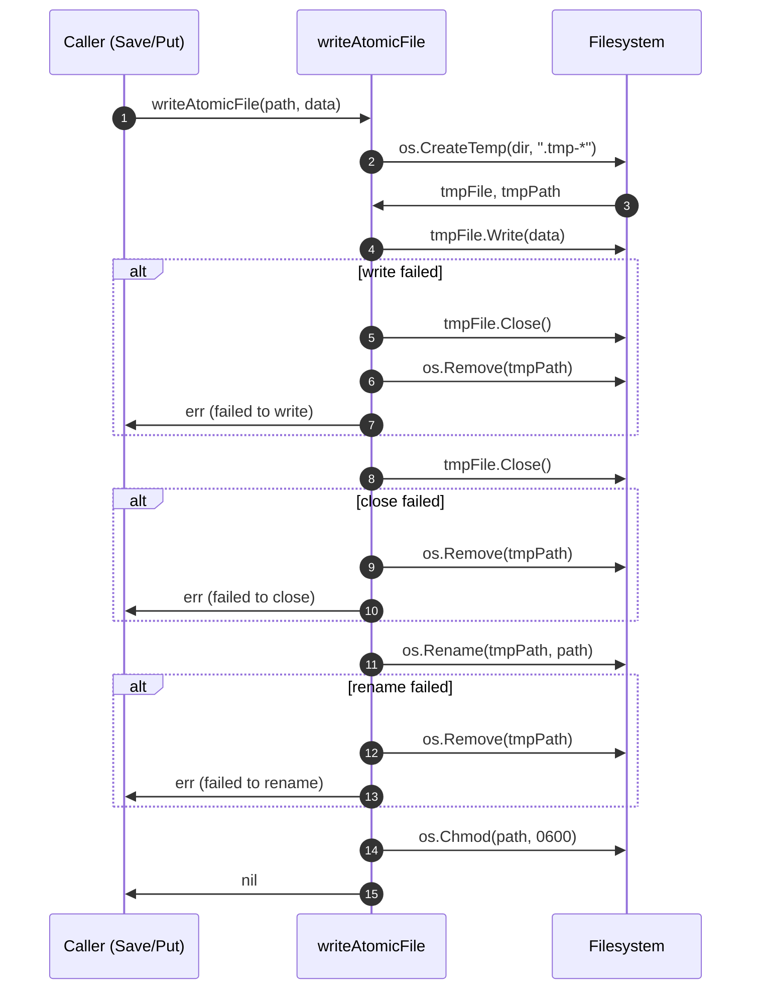

# fs — sequence diagrams

Sequence diagrams for the multi-step flows in the filesystem store
package. Diagrams are pure illustrations of code in this package and
do not change behavior.

## Atomic write (writeAtomicFile)

The shared write primitive used by every store. Crash anywhere before
`os.Rename` and the original file is untouched; crash after and the new
file is in place.



## Refresh-token rotation with theft detection

`RotateRefreshToken` is the security-critical flow: replaying an
already-revoked token is interpreted as theft (`ErrTokenReused`) and
the caller is expected to revoke the whole family.

```mermaid
sequenceDiagram
    autonumber
    participant Client
    participant Store as FSRefreshTokenStore
    participant FS as Filesystem

    Client->>Store: RotateRefreshToken(oldToken)
    Store->>Store: mu.Lock()
    Store->>FS: ReadFile(hash(oldToken).json)
    alt file missing
        Store->>Client: ErrTokenNotFound
    end
    Store->>Store: json.Unmarshal -> old
    alt old.Revoked
        Note over Store: replay of revoked token => theft
        Store->>Client: ErrTokenReused
    end
    alt old.IsExpired()
        Store->>Client: ErrTokenExpired
    end
    Store->>Store: old.Revoked = true; old.RevokedAt = now
    Store->>FS: writeAtomicFile(old)
    Store->>Store: GenerateSecureToken() -> newToken
    Store->>Store: build successor (same Family, Generation+1)
    Store->>FS: writeAtomicFile(new)
    Store->>Client: new RefreshToken
```

## API-key validation

`ValidateAPIKey` parses the user-facing triple `oa_keyid_secret`,
loads the persisted record by keyID, and bcrypt-compares the secret
against the stored hash.

```mermaid
sequenceDiagram
    autonumber
    participant Client
    participant Store as FSAPIKeyStore
    participant FS as Filesystem
    participant Bcrypt as bcrypt

    Client->>Store: ValidateAPIKey("oa_keyid_secret")
    Store->>Store: strings.SplitN(fullKey, "_", 3)
    alt parts != 3 or parts[0] != "oa"
        Store->>Client: ErrAPIKeyNotFound
    end
    Store->>Store: keyID = "oa_" + parts[1]; secret = parts[2]
    Store->>FS: ReadFile(api_keys/{keyID}.json)
    alt file missing
        Store->>Client: ErrAPIKeyNotFound
    end
    Store->>Store: json.Unmarshal -> apiKey
    alt apiKey.Revoked
        Store->>Client: ErrTokenRevoked
    end
    alt apiKey.IsExpired()
        Store->>Client: ErrTokenExpired
    end
    Store->>Bcrypt: CompareHashAndPassword(apiKey.KeyHash, secret)
    alt mismatch
        Store->>Client: ErrAPIKeyNotFound
    end
    Store->>Client: apiKey
```

## Username change (best-effort restore)

`ChangeUsername` is not atomic across files. If creating the new
username file fails after the old file has been removed, the store
attempts to restore the old reservation — best-effort only.

```mermaid
sequenceDiagram
    autonumber
    participant Client
    participant Store as FSUsernameStore
    participant FS as Filesystem

    Client->>Store: ChangeUsername(oldName, newName, userID)
    Store->>Store: oldNorm, newNorm = lower(oldName), lower(newName)
    alt oldNorm == newNorm
        Store->>FS: ReadFile(usernames/{oldNorm}.json)
        Store->>Store: verify existing.UserID == userID
        Store->>Store: existing.Username = newName; Version++
        Store->>FS: writeAtomicFile(existing)
        Store->>Client: nil
    end
    Store->>FS: ReadFile(usernames/{oldNorm}.json) -> oldRecord
    Store->>Store: verify oldRecord.UserID == userID
    Store->>FS: ReadFile(usernames/{newNorm}.json) -> newRecord
    alt newRecord != nil
        Store->>Client: "new username already taken"
    end
    Store->>FS: os.Remove(usernames/{oldNorm}.json)
    Store->>FS: writeAtomicFile(usernames/{newNorm}.json)
    alt write failed
        Note over Store: best-effort restore of oldRecord
        Store->>FS: writeAtomicFile(usernames/{oldNorm}.json)
        Store->>Client: "failed to create new username"
    end
    Store->>Client: nil
```
