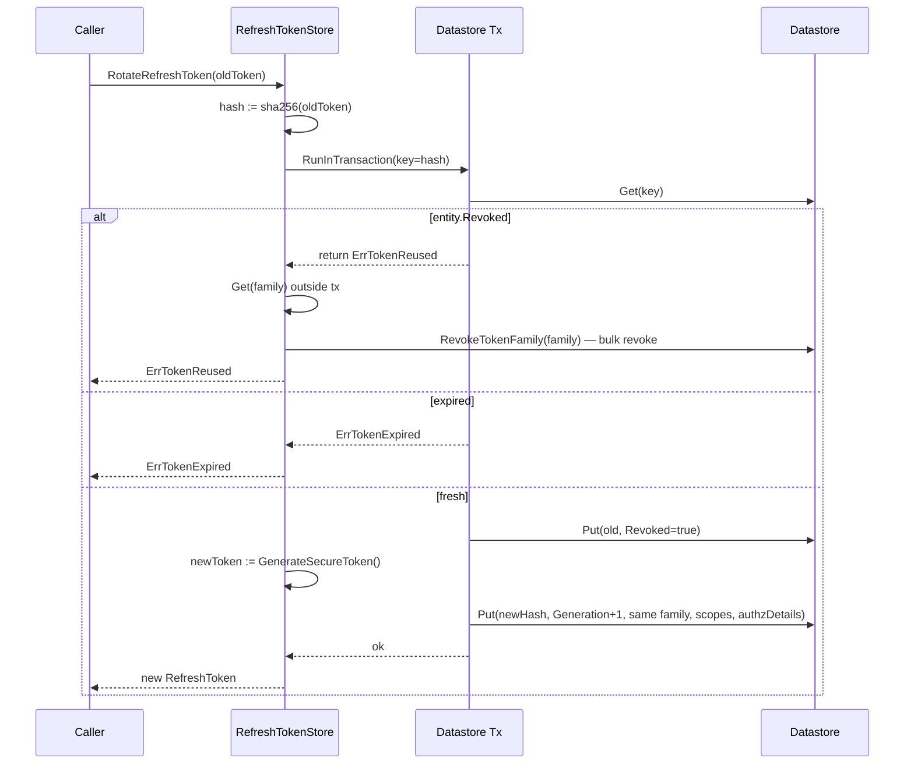
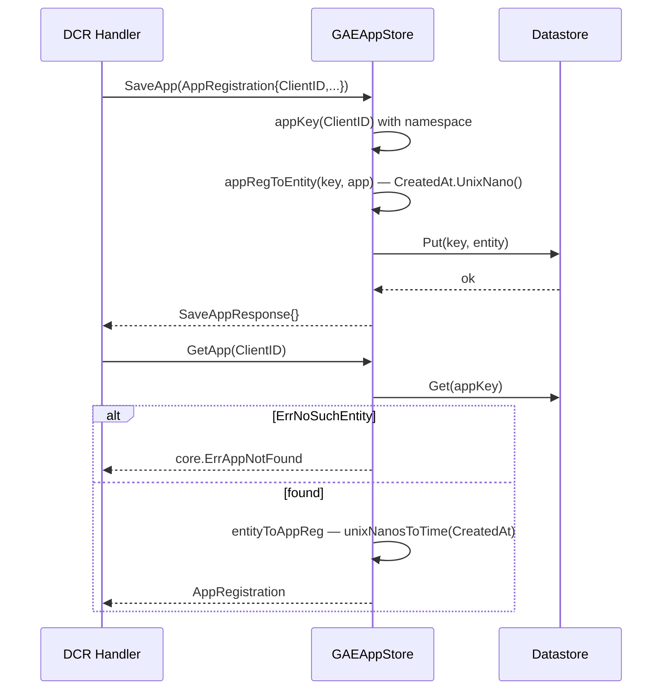

# gae

Google Cloud Datastore implementations of oneauth's storage interfaces — accounts (User / Identity / Channel / Username), credentials (verification tokens, refresh tokens, API keys), signing-key material (`keys.KeyStorage` + `keys.KidStorage`), and as of this PR DCR app registrations (`core.AppRegistrationStore`). Every store takes the same `(*datastore.Client, namespace)` pair and routes through `datastore.NameKey(Kind, name, nil)` with `key.Namespace = s.namespace`, so a single Datastore client services all of oneauth in one project and tests can sandbox themselves to a per-suite namespace. All files carry the `//go:build !wasm` tag because the cloud Datastore client is not available under wasm.

## Contents

- [Entities](#entities)
- [Flows](#flows)
- [Gotchas](#gotchas)
- [Depends on](#depends-on)

## Entities

| Entity | Kind | Role | Why |
|---|---|---|---|
| `UserEntity` | struct | Datastore model for users (User kind) — IsActive flag, JSON profile blob (noindex), timestamps, version. | Persistent shape decoupled from `accounts.User` so JSON profiles can be unindexed. |
| `IdentityEntity` | struct | Datastore model for identities (Identity kind) — keyed by `"type:value"`, indexed `user_id` for reverse lookups. | Allows `GetUserIdentities` reverse-index queries while keeping the key human-readable. |
| `ChannelEntity` | struct | Datastore model for auth channels (Channel kind) — keyed by `"provider:identityKey"`, carries credentials/profile JSON. | One row per (provider, identity); indexed `identity_key` enables "all channels for this identity". |
| `VerificationTokenEntity` | struct | Datastore model for localauth verification tokens (AuthToken kind) — token is the key name. | Direct key lookup avoids indexes; bulk delete is filterable by subject + type. |
| `RefreshTokenEntity` | struct | Datastore model for refresh tokens — token-hash key, family/generation, JSON scopes + RFC 9396 `authorization_details`. | Hash-keyed for O(1) lookup; family field indexed so a reuse attack can revoke the whole family. |
| `APIKeyEntity` | struct | Datastore model for API keys — KeyID is the key, bcrypt KeyHash unindexed, HasExpiry flag. | `HasExpiry` bool avoids omitempty pitfalls on `time.Time` zero-value when `ExpiresAt` is unset. |
| `UsernameEntity` | struct | Datastore model for username→userID reservations — keyed by lowercased username, original case preserved in a field. | Case-insensitive uniqueness via normalised key, but original casing is retained for display. |
| `SigningKeyEntity` | struct | Datastore model for per-client signing keys (SigningKey kind) — clientID key, kid indexed for JWKS lookup. | Two-way lookup (by clientID for signing, by kid for verification) on the same row. |
| `KidKeyEntity` | struct | Datastore model for kid→key grace entries (KidKey kind) — kid is the key name, `ExpiresAt` unindexed. | Grace store for verification during key rotation; `CleanExpired` scans in Go because Datastore can't combine "not zero" with "less than". |
| `AppRegistrationEntity` | struct | Datastore model for DCR app registrations (AppRegistration kind) — client_id is the key name, every field `noindex`, CreatedAt stored as unix nanos. | All fields `noindex` sidesteps Datastore's 1500-byte property index limit (which would reject long `registration_client_uri` values or large `redirect_uris` arrays); unix-nano `CreatedAt` avoids the microsecond truncation Datastore applies to `time.Time` properties so the conformance suite's equality check passes. |
| `GAEUser` | struct | Concrete `accounts.User` returned by `UserStore` — id, profile, active flag, timestamps. | Plain DTO returned from CreateUser/GetUserById; `SaveUser` type-asserts on this to read back `IsActive`. |
| `UserStore` | struct | `accounts.UserStore` impl — CreateUser / GetUserById / SaveUser keyed by userId in the configured namespace. | Maps the public store interface onto a single User kind. |
| `IdentityStore` | struct | `accounts.IdentityStore` impl — Get/Save identities, set UserID, mark verified, reverse-lookup by user_id. | Transactions guard `SetUserForIdentity` and `MarkIdentityVerified` to keep `Version` monotonic. |
| `ChannelStore` | struct | `accounts.ChannelStore` impl — Get/Save channels and list channels for an identity key. | Single Channel kind with composite name plus indexed `identity_key` for fan-out. |
| `TokenStore` | struct | `core.TokenStore` impl for localauth verification tokens — CreateToken / GetToken (auto-deletes if expired) / DeleteToken / DeleteSubjectTokens. | Keys-only filter + `DeleteMulti` gives a single batched purge for "all reset tokens for this subject". |
| `RefreshTokenStore` | struct | `core.RefreshTokenStore` impl — Create / Get / Rotate (transactional, reuse-detection) / Revoke{Refresh,Subject,Family} / GetSubjectTokens / CleanupExpired. | Implements RFC 6749 §10.4 refresh-token rotation with family-wide revocation on reuse. |
| `APIKeyStore` | struct | `core.APIKeyStore` impl — Create (bcrypt hash, `"oa_keyid_secret"` format) / GetByID / Validate / Revoke / ListSubject / UpdateLastUsed. | Tracks both KeyID (lookup) and a bcrypt hash of the secret (validation); `HasExpiry` flag avoids omitempty on `time.Time`. |
| `UsernameStore` | struct | `accounts.UsernameStore` impl — Reserve / Get / Release / Change with case-insensitive normalisation. | `ChangeUsername` runs Get-then-Put in one transaction to prevent races between two users grabbing the same name. |
| `GAEKeyStore` | struct | `keys.KeyStorage` impl — PutKey / GetKey / GetKeyByKid / DeleteKey / ListKeyIDs over the SigningKey kind. | One row per client lets either direction (clientID or kid) resolve a key via composite indexing. |
| `GAEKidStore` | struct | `keys.KidStorage` impl — Add / Remove (idempotent) / GetKeyByKid (honours `ExpiresAt`) / CleanExpired; `GetKey` deliberately returns `ErrKeyNotFound`. | Verification-only grace cache for old kids during rotation; intentionally not a primary-key store. |
| `GAEAppStore` | struct | `core.AppRegistrationStore` impl — SaveApp / GetApp / ListApps / DeleteApp over the AppRegistration kind. | New in this PR; shared client + namespace pattern means `cmd/oneauth-server` can swap backends with one line and reuse the `appstoretest` conformance suite. |
| `NewUserStore` | func | Constructor — returns a `UserStore` bound to a datastore client + namespace. | Constructor injection of the shared `*datastore.Client` keeps the store agnostic to dial/credentials wiring. |
| `NewIdentityStore` | func | Constructor — returns an `IdentityStore` bound to a datastore client + namespace. | Same shared-client pattern across every store in this package. |
| `NewChannelStore` | func | Constructor — returns a `ChannelStore` bound to a datastore client + namespace. | Same shared-client pattern across every store in this package. |
| `NewTokenStore` | func | Constructor — returns a `TokenStore` bound to a datastore client + namespace. | Same shared-client pattern across every store in this package. |
| `NewRefreshTokenStore` | func | Constructor — returns a `RefreshTokenStore` bound to a datastore client + namespace. | Same shared-client pattern across every store in this package. |
| `NewAPIKeyStore` | func | Constructor — returns an `APIKeyStore` bound to a datastore client + namespace. | Same shared-client pattern across every store in this package. |
| `NewUsernameStore` | func | Constructor — returns a `UsernameStore` bound to a datastore client + namespace. | Same shared-client pattern across every store in this package. |
| `NewKeyStore` | func | Constructor — returns a `GAEKeyStore` bound to a datastore client + namespace. | Same shared-client pattern across every store in this package. |
| `NewKidStore` | func | Constructor — returns a `GAEKidStore` bound to a datastore client + namespace. | Same shared-client pattern across every store in this package. |
| `NewAppStore` | func | Constructor — returns a `GAEAppStore` bound to a datastore client + namespace. | Same shared-client pattern; lets `cmd/oneauth-server` slot the gae app backend in with a one-line dial just like every other store here. |
| `IdentityToEntity` | func | Converts a public `accounts.Identity` into an `IdentityEntity` bound to the supplied key. | Datastore key depends on namespace, so callers must pass it in rather than have the converter derive it. |
| `VerificationTokenToEntity` | func | Converts a `localauth.VerificationToken` into a `VerificationTokenEntity` bound to the supplied key. | Same key-injection pattern as `IdentityToEntity` for namespace-aware writes. |
| `IdentityEntity.ToIdentity` | method | Round-trips an `IdentityEntity` back into `accounts.Identity` (no key fields). | Public store API hands out interface values, never entity structs. |
| `VerificationTokenEntity.ToVerificationToken` | method | Round-trips a `VerificationTokenEntity` back into `localauth.VerificationToken` (token name carried as `Key.Name`). | Public store API hands out interface values, never entity structs. |
| `GAEUser.Id` | method | `accounts.User` impl — returns the UserID. | Implements the `User` interface as a plain struct (no DB round-trip on read). |
| `GAEUser.Profile` | method | `accounts.User` impl — returns the user profile map. | Implements the `User` interface as a plain struct (no DB round-trip on read). |
| `KindUser`, `KindIdentity`, `KindChannel`, `KindAuthToken`, `KindRefreshToken`, `KindAPIKey`, `KindUsername`, `KindSigningKey`, `KindKidKey`, `KindAppRegistration` | const | Datastore "kind" names for every entity type in this package. | Single source of truth referenced from queries, keys, and tests. |

## Flows

### Refresh-token rotation with reuse detection

### App registration round-trip

## Gotchas

- **AppRegistration timestamps stored as unix nanos.** Datastore truncates `time.Time` properties to microseconds, which breaks equality checks the `appstoretest` conformance suite makes against the in-memory result. `AppRegistrationEntity.CreatedAt` is therefore `int64` (nanos), and `unixNanosToTime` round-trips zero → `time.Time{}` so a never-set timestamp doesn't appear as `1970-01-01` (matching the GORM/FS/InMemory zero-default).
- **Every AppRegistration field is `noindex`.** Datastore rejects indexed properties larger than 1500 bytes; a long `registration_client_uri` or a `redirect_uris` array with many entries would hit that limit. Because the only access pattern is "lookup by `client_id` (the key)", nothing in the value needs to be indexed, so all fields are marked `noindex`.
- **`GAEKidStore.GetKey` is intentionally stubbed.** It satisfies the interface but always returns `ErrKeyNotFound` — `KidStorage` is a verification-only grace cache keyed by kid, not by clientID. Routing a clientID lookup here would silently miss; this is by design.
- **`CleanExpired` (kid) and `CleanupExpiredTokens` (refresh) scan in Go, not in the query.** Datastore can't express "field is not the zero time AND field < now" in one inequality filter, so both methods fetch candidates and filter on the client. The refresh-token version does run two separate queries (one for `expires_at < now`, one for `revoked = true AND revoked_at < cutoff`), each as a keys-only + `DeleteMulti`.
- **`RotateRefreshToken` family revocation happens outside the transaction.** When reuse is detected the tx returns `ErrTokenReused`, then `RevokeTokenFamily` runs as a separate write loop. If the process crashes between the two calls the attacker's reused token is already failed (tx returned the error), but the family is still live until the next reuse attempt or a manual revoke — acceptable because reuse detection is the trigger, not a separate guarantee.
- **`UserStore.GetUserById` logs the key on every call.** `log.Println("UserStore Key: ", key, ...)` in `stores.go` is dev-leftover noise that ends up in production logs — worth cleaning up but not load-bearing.
- **`RotateRefreshToken` updates `LastUsedAt` only on the new entity.** The old (now-revoked) entity keeps its prior `LastUsedAt`; only `RevokedAt` records when rotation happened. Audit consumers should read `RevokedAt`, not `LastUsedAt`, to see when rotation occurred.
- **Sub-test cleanup runs before each conformance sub-test.** `keystore_test.go` / `kidstore_test.go` / `appstore_test.go` each call their cleanup closure inside the `RunAll` factory so every sub-test sees an empty namespace — necessary because the conformance suites reuse the same client across sub-tests.

## Depends on

- [`core/`](../../core/DESIGN.md) — `AppRegistration`, `AppRegistrationStore`, `SaveAppRequest`/`Response`, `GetAppRequest`/`Response`, `ListAppsRequest`/`Response`, `DeleteAppRequest`/`Response`, `ErrAppNotFound`, `RefreshToken`, `RefreshTokenStore` + its Create/Get/Rotate/Revoke{,Subject,Family}/GetSubjectTokens/CleanupExpiredTokens request/response pairs, `APIKey`, `APIKeyStore` + its Create/GetByID/Validate/Revoke/ListSubject/UpdateLastUsed request/response pairs, `ErrAPIKeyNotFound`, `ErrTokenNotFound` / `ErrTokenExpired` / `ErrTokenRevoked` / `ErrTokenReused`, `GenerateSecureToken`, `GenerateAPIKeyID`, `GenerateAPIKeySecret`, `TokenExpiryRefreshToken`, `AuthorizationDetail`.
- [`keys/`](../../keys/DESIGN.md) — `KeyStorage`, `KidStorage`, `KeyRecord`, `PutKey`/`GetKey`/`GetKeyByKid`/`DeleteKey`/`ListKeyIDs` request/response pairs, `AddKid`/`RemoveKid`/`CleanExpired` request/response pairs, `ErrKeyNotFound`, `ErrKidNotFound`, `ErrAlgorithmMismatch`.
- [`utils/`](../../utils/DESIGN.md) — `ComputeKid`.
- [`accounts/`](../../accounts/DESIGN.md) — `User`, `UserStore`, `IdentityStore`, `ChannelStore`, `UsernameStore`, `Identity`, `Channel`, plus all the Create/Get/Save/SetUserForIdentity/MarkIdentityVerified/GetUserIdentities/Reserve/Release/Change request and response types for those stores.
- [`localauth/`](../../localauth/DESIGN.md) — `VerificationToken`, `VerificationType`, and the Create/Get/Delete/DeleteSubject verification-token request/response pairs implemented by `TokenStore`.
