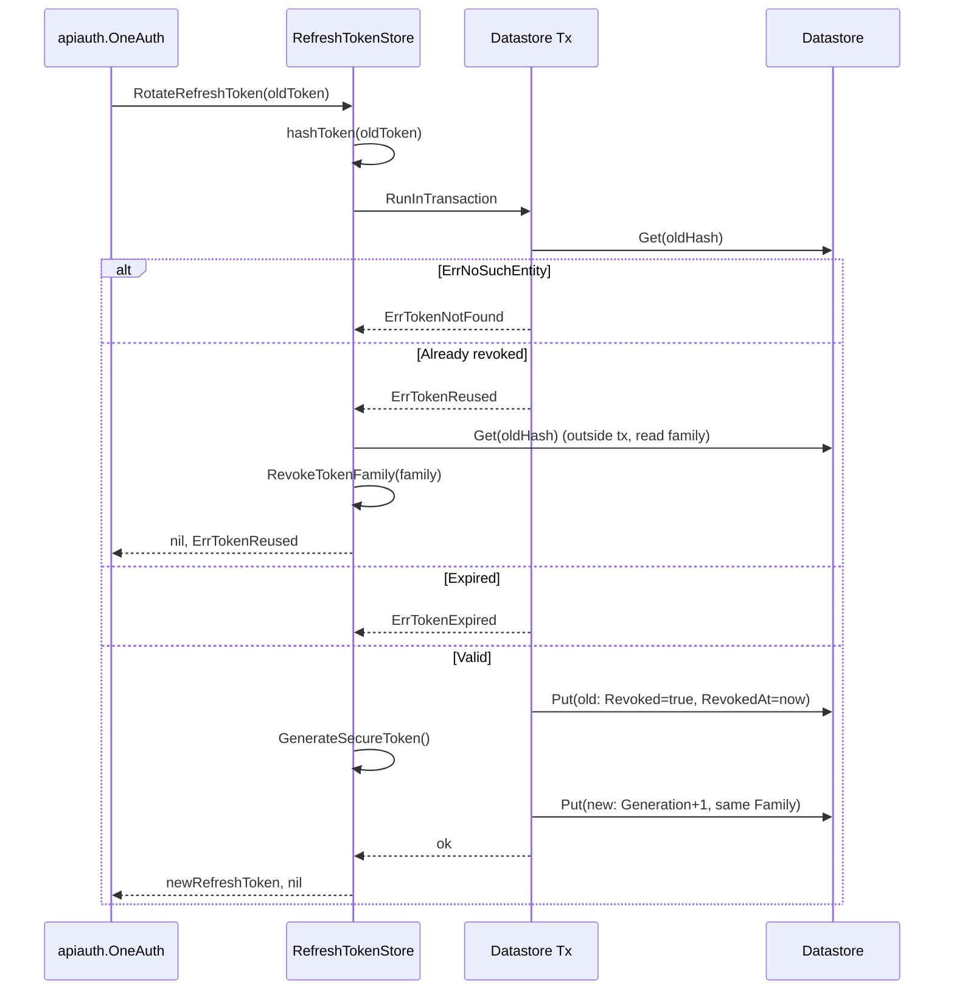
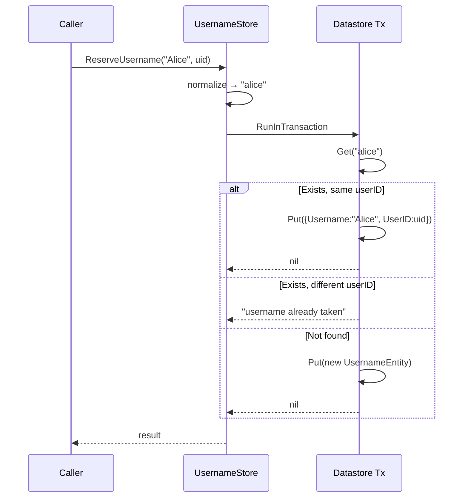
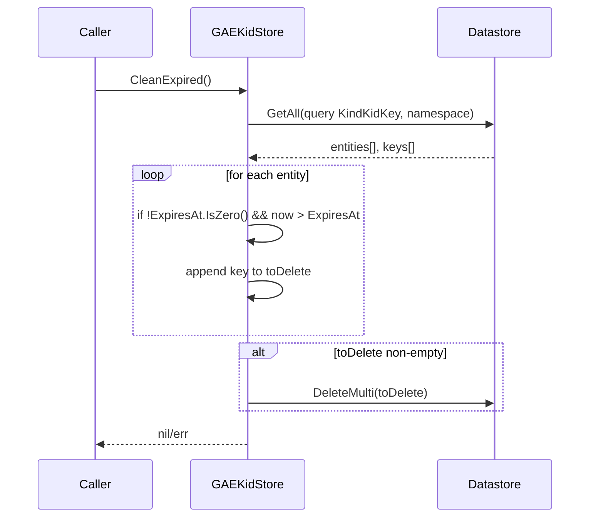
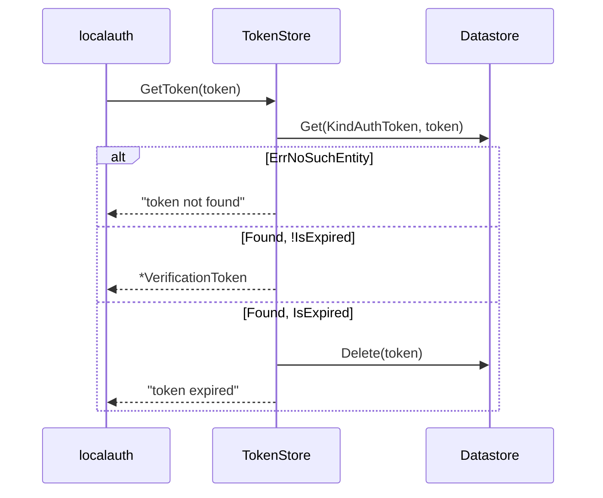

# gae

Google Cloud Datastore-backed implementation of every persistence interface OneAuth needs: signing keys, kid-grace entries, users, identities, channels, verification tokens, refresh tokens, API keys, and username reservations. Each store is an independent struct (no god object) that takes a `*datastore.Client` plus a per-tenant namespace, and exposes a `WithContext(ctx)` helper as a stop-gap until OneAuth completes its ctx-as-parameter migration (issues 110 / 175). The package is its own Go sub-module so consumers that don't run on GCP don't pay the Datastore dependency cost.

Two stylistic conventions thread through the file:

- **JSON-in-noindex-blob for sub-records.** Anything map- or slice-shaped (`profile`, `credentials`, `device_info`, `scopes`, `authorization_details`) is `json.Marshal`-ed into a `[]byte` field tagged `datastore:"...,noindex"`. This keeps schema churn out of Datastore indexes and side-steps Datastore's flat-property model. Top-level scalars that callers actually filter on (`user_id`, `family`, `identity_key`, `kid`, `revoked`, `expires_at`) stay indexed.
- **Composite key names instead of ancestor keys.** Identity keys are `"type:value"`, channel keys are `"provider:identityKey"`, username keys are the lowercased username. No entity groups are used, so every write is a single-key write and queries are flat (no strong-consistency window to worry about).

## Contents

- [Entities](#entities)
- [Flows](#flows)
  - [Refresh-token rotation with reuse detection](#refresh-token-rotation-with-reuse-detection)
  - [Username reservation with case-insensitive normalisation](#username-reservation-with-case-insensitive-normalisation)
  - [Kid grace-store cleanup](#kid-grace-store-cleanup)
  - [Verification-token lookup with lazy expiry](#verification-token-lookup-with-lazy-expiry)
- [Gotchas](#gotchas)
- [Depends on](#depends-on)

## Entities

| Entity | Kind | Role | Why |
|---|---|---|---|
| `UserEntity` | struct | Datastore model for the `User` kind — `IsActive`, JSON `profile` blob, timestamps, version. | Persistent shape decoupled from the public `accounts.User` interface so JSON profiles can be unindexed. |
| `IdentityEntity` | struct | Datastore model for the `Identity` kind — keyed `"type:value"`, indexed `user_id` for reverse lookup. | `IdentityStore.GetUserIdentities` is a reverse query, so `user_id` is the only field that must stay indexed. |
| `ChannelEntity` | struct | Datastore model for the `Channel` kind — keyed `"provider:identityKey"`, JSON `credentials`/`profile`. | One row per `(provider, identityKey)` lets `identity_key` be queried to fan-out "all channels for this identity". |
| `VerificationTokenEntity` | struct | Datastore model for the `AuthToken` kind — token string is the key name. | Direct key lookup avoids any index; bulk delete is filterable by `user_id` + `type`. |
| `RefreshTokenEntity` | struct | Datastore model for the `RefreshToken` kind — token-hash key, `family` + `generation`, JSON `scopes` and `authorization_details` (RFC 9396). | Hash-keyed for O(1) lookup; indexed `family` so a reuse attack can revoke the whole family. |
| `APIKeyEntity` | struct | Datastore model for the `APIKey` kind — `KeyID` is the key, bcrypt `KeyHash` unindexed, `HasExpiry` flag. | `HasExpiry` avoids ambiguity around `time.Time` zero values when an API key has no expiry. |
| `UsernameEntity` | struct | Datastore model for the `Username` kind — keyed by lowercased username, original case preserved in a field. | Case-insensitive uniqueness via normalised key, while still allowing the original casing to be displayed. |
| `SigningKeyEntity` | struct | Datastore model for the `SigningKey` kind — clientID key, indexed `kid`. | Two-way lookup (by clientID for signing, by `kid` for verification) on the same row. |
| `KidKeyEntity` | struct | Datastore model for the `KidKey` kind — `kid` is the key, `ExpiresAt` unindexed. | Grace store for verification during key rotation; cleanup scans in Go because Datastore can't combine "not zero" with "less than". |
| `GAEUser` | struct | Concrete `accounts.User` implementation returned by `UserStore`. | Plain DTO returned from `CreateUser`/`GetUserById`; `SaveUser` checks this type to read back `IsActive`. |
| `UserStore` | struct | `accounts.UserStore` impl — `UserStore.CreateUser`, `UserStore.GetUserById`, `UserStore.SaveUser`. | Maps the public store interface onto a single `User` kind. |
| `IdentityStore` | struct | `accounts.IdentityStore` impl — `IdentityStore.GetIdentity`, `IdentityStore.SaveIdentity`, `IdentityStore.SetUserForIdentity`, `IdentityStore.MarkIdentityVerified`, `IdentityStore.GetUserIdentities`. | Transactions on `SetUserForIdentity`/`MarkIdentityVerified` keep `Version` monotonic. |
| `ChannelStore` | struct | `accounts.ChannelStore` impl — `ChannelStore.GetChannel`, `ChannelStore.SaveChannel`, `ChannelStore.GetChannelsByIdentity`. | Composite key plus indexed `identity_key` for the fan-out query. |
| `TokenStore` | struct | `core.TokenStore` impl for localauth verification tokens — `TokenStore.CreateToken`, `TokenStore.GetToken` (auto-deletes expired), `TokenStore.DeleteToken`, `TokenStore.DeleteUserTokens`. | Keys-only filter + `DeleteMulti` gives a single batched purge for "all reset tokens for this user". |
| `RefreshTokenStore` | struct | `core.RefreshTokenStore` impl — `RefreshTokenStore.CreateRefreshToken`, `RefreshTokenStore.GetRefreshToken`, `RefreshTokenStore.RotateRefreshToken`, `RefreshTokenStore.RevokeRefreshToken`, `RefreshTokenStore.RevokeUserTokens`, `RefreshTokenStore.RevokeTokenFamily`, `RefreshTokenStore.GetUserTokens`, `RefreshTokenStore.CleanupExpiredTokens`. | Implements RFC 6749 §10.4 rotation with family-wide revocation on reuse. |
| `APIKeyStore` | struct | `core.APIKeyStore` impl — `APIKeyStore.CreateAPIKey`, `APIKeyStore.GetAPIKeyByID`, `APIKeyStore.ValidateAPIKey`, `APIKeyStore.RevokeAPIKey`, `APIKeyStore.ListUserAPIKeys`, `APIKeyStore.UpdateAPIKeyLastUsed`. | Tracks both `KeyID` (lookup) and a bcrypt hash of the secret (validation); `HasExpiry` flag avoids `omitempty` time.Time pitfalls. |
| `UsernameStore` | struct | `accounts.UsernameStore` impl — `UsernameStore.ReserveUsername`, `UsernameStore.GetUserByUsername`, `UsernameStore.ReleaseUsername`, `UsernameStore.ChangeUsername`. | `ChangeUsername` does Get-then-Put in one transaction to prevent races between two users grabbing the same name. |
| `GAEKeyStore` | struct | `keys.KeyStorage` impl — `GAEKeyStore.PutKey`, `GAEKeyStore.GetKey`, `GAEKeyStore.GetKeyByKid`, `GAEKeyStore.DeleteKey`, `GAEKeyStore.ListKeyIDs`, plus legacy aliases (`GAEKeyStore.RegisterKey`, `GAEKeyStore.GetVerifyKey`, `GAEKeyStore.GetSigningKey`, `GAEKeyStore.GetExpectedAlg`, `GAEKeyStore.ListKeys`, `GAEKeyStore.GetCurrentKid`). | One row per client; either direction (clientID or `kid`) resolves a key. |
| `GAEKidStore` | struct | `keys.KidStorage` impl — `GAEKidStore.Add`, `GAEKidStore.Remove` (idempotent), `GAEKidStore.GetKeyByKid` (honours `ExpiresAt`), `GAEKidStore.CleanExpired`; `GAEKidStore.GetKey` deliberately returns `ErrKeyNotFound`. | Verification-only grace cache for old kids during rotation; intentionally not a primary-key store. |
| `Kind` constants | const-group | `KindUser`, `KindIdentity`, `KindChannel`, `KindAuthToken`, `KindRefreshToken`, `KindAPIKey`, `KindUsername`, `KindSigningKey`, `KindKidKey`. | Single source of truth for Datastore kind names referenced from queries, keys, and tests. |
| `WithContext` pattern | idiom | Every store carries an embedded `ctx` and a `Store.WithContext(ctx)` clone method instead of taking `ctx` per-call. | Pre-dates the ctx-as-parameter migration; all stores follow the same shape. |

## Flows

### Refresh-token rotation with reuse detection

`RefreshTokenStore.RotateRefreshToken` is the centerpiece: a single Datastore transaction that revokes the old token and writes the next-generation token, plus an out-of-transaction family revocation if reuse is detected.

### Username reservation with case-insensitive normalisation

`UsernameStore.ReserveUsername` and `UsernameStore.ChangeUsername` collapse the same lowercased username to the same key, while still preserving the original casing in the entity body.

### Kid grace-store cleanup

`GAEKidStore.CleanExpired` scans the whole `KidKey` kind in the namespace and filters in Go, because `ExpiresAt` is `noindex` and Datastore can't combine an "is non-zero" predicate with a "less-than" range filter in one query.

### Verification-token lookup with lazy expiry

`TokenStore.GetToken` self-heals: if the token row exists but is past its `ExpiresAt`, it is deleted on the read path. This means a background cleanup job is not required for correctness, only for storage hygiene.

## Gotchas

- **`WithContext` is a stop-gap, not the destination.** Every store carries an embedded `ctx context.Context` and clones itself in `WithContext`. The real fix — ctx as a method parameter on every store call — is tracked under issues 110 / 175. Until then, do not share a store value across goroutines that need distinct contexts; always clone via `WithContext`.

- **JSON-in-blob payloads cannot be queried.** `profile`, `credentials`, `device_info`, `scopes`, `authorization_details` are all `[]byte` with `noindex`. You can't filter "all refresh tokens with scope X" at the Datastore level — you have to scan and decode. This is deliberate (Datastore's flat-property indexes are expensive), but a real surprise if you try.

- **Composite key names, not ancestors.** Identity keys are literally `"type:value"`, channel keys are `"provider:identityKey"`. There are no entity groups, so cross-entity transactions (`SetUserForIdentity`, `ChangeUsername`, refresh-token rotation) are cross-group writes and rely on Datastore's XG transaction limit (25 entity groups). Inside any single transaction in this package we only touch one or two rows, so this is fine — but if you add a flow that touches dozens of refresh tokens transactionally, you'll hit the cap.

- **`HasExpiry` flag for nullable timestamps.** Datastore stores `time.Time` zero-values as a real timestamp (the epoch), and `omitempty` on `time.Time` doesn't behave like it does for pointers. `APIKeyEntity.HasExpiry` is an explicit bool so the round-trip back to `*core.APIKey.ExpiresAt *time.Time` can decide whether to set the pointer at all. The same idiom is used for `RevokedAt` via `IsZero()` checks.

- **`omitempty` on bool fields does nothing.** Several entity fields use `datastore:"...,omitempty"` (e.g. `RefreshTokenEntity.ClientID`, `RefreshTokenEntity.RevokedAt`, `APIKeyEntity.ExpiresAt`, `APIKeyEntity.RevokedAt`). For zero-value `time.Time` and empty string this saves index entries; for bool zero values (`Revoked`) it does not, which is why we always write `Revoked` explicitly.

- **Kid cleanup scans the kind.** `GAEKidStore.CleanExpired` fetches every entity in the namespace, filters in Go, and `DeleteMulti`s the survivors. This works because kid grace stores stay small (a handful of entries per client during rotation), but it would not work as the design for a production refresh-token cleanup — which is why `RefreshTokenStore.CleanupExpiredTokens` uses indexed `expires_at` and `revoked`/`revoked_at` range filters instead.

- **Refresh-token reuse revokes the family outside the transaction.** When `RotateRefreshToken` detects a previously-revoked token, the rotation transaction returns `ErrTokenReused`, then a separate `Get` + `RevokeTokenFamily` runs outside the tx. The window between detection and family revocation is unprotected — if an attacker burns all generations in parallel, the family revocation will catch up but the race exists. This is the same tradeoff GORM-store makes; the alternative (looping every family member into the rotation tx) blows past the entity-group limit.

- **`RotateRefreshToken` builds the response inside the closure.** Watch the assignment to the outer `newRefreshToken *core.RefreshToken` inside `RunInTransaction` — if the transaction retries (Datastore can retry the closure on contention), the variable is overwritten on each attempt, which is fine, but if you ever add a side-effect that depends on `newRefreshToken` being final, it must run after the outer `err` check.

- **`UserStore.SaveUser` re-reads the row to preserve `CreatedAt`.** It does a Get-then-Put without a transaction; two concurrent `SaveUser` calls can both observe the same `CreatedAt` and both write — last writer wins. There's no `Version` check on the user row (unlike `IdentityEntity`/`ChannelEntity`), so user updates are last-writer-wins by design.

- **`SaveUser` only round-trips `IsActive` for `*GAEUser`.** If a caller passes some other `accounts.User` implementation, the entity is written with `IsActive: true` regardless of the actual state, because the value can only be read out via a type assertion.

- **Namespace plumbing on every query.** Each query builder repeats `if s.namespace != "" { query = query.Namespace(s.namespace) }`. Forget this on a new query and you'll silently read across tenants. There's no single helper for this — copy from an existing query.

- **`stores.go` has a stray `log.Println` in `GetUserById`.** It logs every user lookup including the userId. Noise in production; harmless but worth knowing.

- **`!wasm` build tag is on every `.go` file.** The package is excluded from WASM builds entirely. If you add a new file here, copy the `//go:build !wasm` header — without it the WASM build will try to compile Datastore.

- **Sub-module, replace directives.** This folder is its own Go module (`go.mod`/`go.sum` live here). When developing against an unreleased main-module change, the consumer needs a `replace` directive — see `docs/MIGRATION.md` and the project `go.work` for the canonical layout. Do not edit `go.mod` / `go.sum` as part of a design pass.

- **`GAEKidStore.GetKey` is intentionally broken.** It returns `ErrKeyNotFound` unconditionally because the kid store is a kid-indexed view, not a clientID-indexed primary store. The interface forces the method to exist; the implementation refuses to lie about it. Read `keys/SUMMARY.md` if this looks like a bug.

## Depends on

- [`../../accounts/DESIGN.md`](../../accounts/DESIGN.md) — the public account-side store interfaces this package implements: `accounts.UserStore` (with `accounts.User`), `accounts.IdentityStore` (with `accounts.Identity`), `accounts.ChannelStore` (with `accounts.Channel`), and `accounts.UsernameStore`. `GAEUser` is the concrete `accounts.User` returned by `UserStore.CreateUser` / `UserStore.GetUserById`.
- [`../../core/DESIGN.md`](../../core/DESIGN.md) — token-side primitives: `core.TokenStore`, `core.RefreshTokenStore` (`core.RefreshToken`, `core.AuthorizationDetail`, `core.TokenExpiryRefreshToken`), `core.APIKeyStore` (`core.APIKey`), the secure-token helpers `core.GenerateSecureToken` / `core.GenerateAPIKeyID` / `core.GenerateAPIKeySecret`, and the sentinel errors `core.ErrTokenNotFound`, `core.ErrTokenReused`, `core.ErrTokenExpired`, `core.ErrTokenRevoked`, `core.ErrAPIKeyNotFound` returned from `RefreshTokenStore.RotateRefreshToken` / `APIKeyStore.ValidateAPIKey`.
- [`../../keys/DESIGN.md`](../../keys/DESIGN.md) — the key-storage interfaces and DTO: `GAEKeyStore` implements `keys.KeyStorage`, `GAEKidStore` implements `keys.KidStorage`, both round-trip `keys.KeyRecord`, and they return `keys.ErrKeyNotFound` / `keys.ErrKidNotFound` / `keys.ErrAlgorithmMismatch` per the contract.
- [`../../keystoretest/DESIGN.md`](../../keystoretest/DESIGN.md) — `keystoretest.RunAll` drives the shared `keys.KeyStorage` conformance suite against `GAEKeyStore` in `keystore_test.go`.
- [`../../kidstoretest/DESIGN.md`](../../kidstoretest/DESIGN.md) — `kidstoretest.RunAll` drives the shared `keys.KidStorage` conformance suite against `GAEKidStore` in `kidstore_test.go`.
- [`../../localauth/DESIGN.md`](../../localauth/DESIGN.md) — the verification-token shape: `VerificationTokenEntity` persists `localauth.VerificationType` plus a `localauth.VerificationToken` round-trip, and `TokenStore.CreateToken` / `TokenStore.GetToken` / `TokenStore.DeleteUserTokens` expose those types directly.
- [`../../utils/DESIGN.md`](../../utils/DESIGN.md) — `utils.ComputeKid` derives the kid that `GAEKeyStore.PutKey` writes to `SigningKeyEntity.Kid` when the caller did not supply one.
