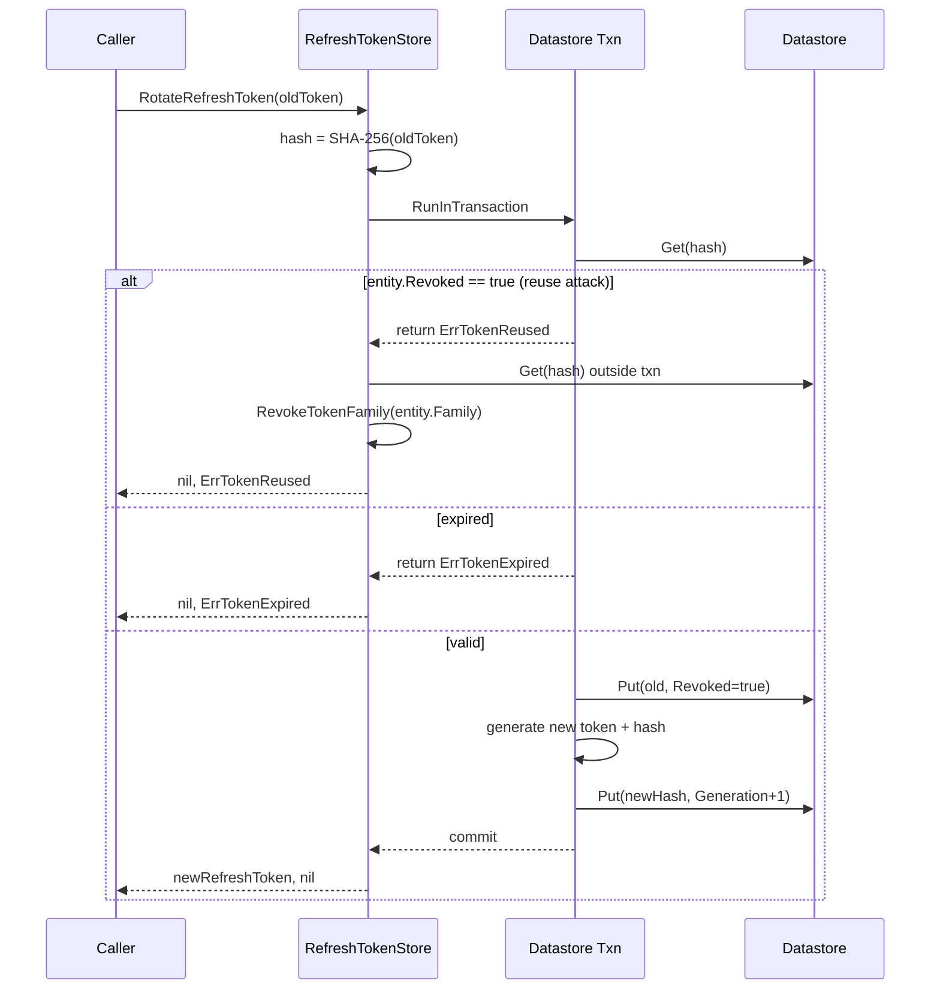
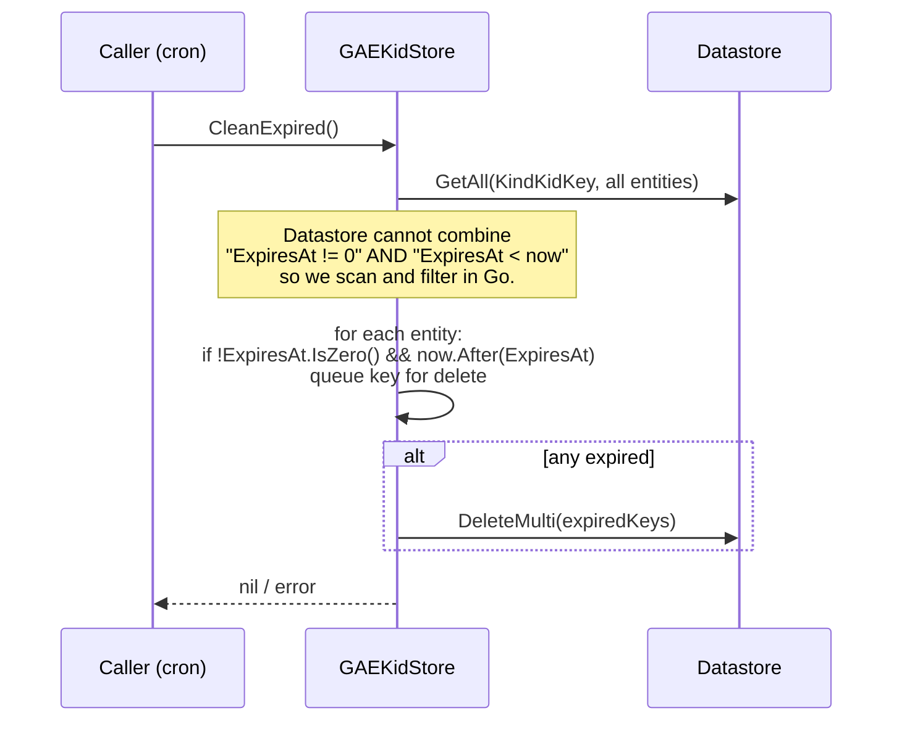

# gae

Google Cloud Datastore-backed implementation of every persistence interface OneAuth defines: signing keys, kid grace entries, users, identities, channels, verification tokens, refresh tokens, API keys, and username reservations. Each store is an independent struct (no god object) that takes a `*datastore.Client` plus a tenant namespace and exposes a `WithContext` helper as a stop-gap until the project completes its ctx-as-parameter migration. The package is its own Go sub-module so consumers who don't run on GCP don't pay the Datastore dependency cost.

## Contents

- [Entities](#entities)
- [Flows](#flows)
- [Gotchas](#gotchas)
- [Depends on](#depends-on)

## Entities

| Entity | Kind | Role | Why |
|---|---|---|---|
| `GAEKeyStore` | struct | `keys.KeyStorage` over Datastore for per-client signing keys. | Keyed by ClientID with kid indexed so `GetKeyByKid` can reverse-lookup via a query. |
| `NewKeyStore` | func | Constructs a `GAEKeyStore` for a namespace using a background ctx. | ctx is stored on the struct (pre-issue-110 pattern); use `WithContext` to scope per call. |
| `GAEKeyStore.WithContext` | method | Returns a shallow copy of the store carrying the given context. | Workaround until the ctx-as-parameter migration lands across all store interfaces. |
| `GAEKeyStore.PutKey` | method | Upserts a `SigningKeyEntity`, computing the kid from key bytes if not supplied. | Auto-derives kid so callers can register without pre-computing it. |
| `GAEKeyStore.GetKeyByKid` | method | Reverse-lookup by kid using a single-result indexed query. | The kid is a secondary index since the primary key is ClientID. |
| `GAEKeyStore.ListKeyIDs` | method | KeysOnly scan returning all registered client IDs in the namespace. | Cheap enumeration without fetching key bytes. |
| `SigningKeyEntity` | struct | Datastore entity for a per-client signing key. | `KeyBytes` is noindex (bulk data); `kid` is indexed to support reverse-lookup queries. |
| `KindSigningKey` | const | Datastore kind name for signing keys. | Shared between entity definitions and query construction. |
| `GAEKidStore` | struct | `keys.KidStorage` over Datastore for kid->key grace entries. | Keyed by the kid itself; `GetKey` (client-indexed) deliberately returns `ErrKeyNotFound`. |
| `NewKidStore` | func | Constructs a `GAEKidStore` for a namespace using a background ctx. | A `var _` assertion guarantees `keys.KidStorage` conformance at build time. |
| `GAEKidStore.CleanExpired` | method | Scans every kid entry and deletes those past their `ExpiresAt` in a single `DeleteMulti`. | Datastore cannot combine a not-zero filter with a less-than filter, so filtering happens in Go. |
| `KidKeyEntity` | struct | Datastore entity for a kid grace entry. | `ExpiresAt` is noindex; `CleanExpired` scans and filters in Go (see above). |
| `KindKidKey` | const | Datastore kind name for kid grace entries. | Shared between entity definitions and query construction. |
| `UserStore` | struct | `core.UserStore` over Datastore for user accounts with JSON profile blobs. | `SaveUser` reads-before-writes to preserve `CreatedAt` across updates. |
| `NewUserStore` | func | Constructs a `UserStore` for a namespace using a background ctx. | Matches the constructor shape used by every store struct in the package. |
| `UserStore.SaveUser` | method | Upserts a user; reads existing entity first to retain `CreatedAt` and the active flag. | The `core.User` interface lacks an `IsActive` getter, so the impl type-asserts to `*GAEUser`. |
| `GAEUser` | struct | `core.User` implementation carrying ID, active flag, and profile map. | `SaveUser` type-asserts to `*GAEUser` to recover the active flag; defaults to `active=true` otherwise. |
| `UserEntity` | struct | Datastore entity for a user; profile stored as noindex JSON. | Mirrors `core.User` with versioning and timestamps for Datastore persistence. |
| `KindUser` | const | Datastore kind name for users. | One of seven core kind constants declared in `stores.go`. |
| `IdentityStore` | struct | `core.IdentityStore`; identities keyed by `"type:value"`. | Composite string key avoids needing parent entity groups. |
| `NewIdentityStore` | func | Constructs an `IdentityStore` for a namespace using a background ctx. | Same shape as every other store constructor in the package. |
| `IdentityStore.SetUserForIdentity` | method | Transactionally rebinds an identity's `UserID` and bumps `Version`. | Read-modify-write must be atomic to avoid losing concurrent verification updates. |
| `IdentityStore.MarkIdentityVerified` | method | Transactionally flips `Verified` to true and bumps `Version`. | Same atomicity guarantee as `SetUserForIdentity`. |
| `IdentityEntity` | struct | Datastore entity for an identity (`type:value -> userID`). | `ToIdentity` and `IdentityToEntity` bridge to `core.Identity`. |
| `IdentityEntity.ToIdentity` | method | Converts a stored entity into a `core.Identity` value. | Keeps Datastore representation hidden from core consumers. |
| `IdentityToEntity` | func | Converts a `core.Identity` into an `IdentityEntity` for a given key. | Inverse of `ToIdentity` used on Save paths. |
| `KindIdentity` | const | Datastore kind name for identities. | One of seven core kind constants. |
| `ChannelStore` | struct | `core.ChannelStore`; auth channels keyed by `"provider:identityKey"`. | `SaveChannel` preserves `CreatedAt` and monotonically increments `Version`. |
| `NewChannelStore` | func | Constructs a `ChannelStore` for a namespace using a background ctx. | Same shape as every other store constructor in the package. |
| `ChannelEntity` | struct | Datastore entity for an auth channel (`provider:identityKey`). | Credentials and profile stored as noindex JSON; tracks expiry and version. |
| `KindChannel` | const | Datastore kind name for channels. | One of seven core kind constants. |
| `TokenStore` | struct | `core.TokenStore`; verification/reset tokens keyed by the token string. | `GetToken` self-deletes expired tokens before erroring, so reads opportunistically GC. |
| `NewTokenStore` | func | Constructs a `TokenStore` for a namespace using a background ctx. | Same shape as every other store constructor in the package. |
| `TokenStore.DeleteUserTokens` | method | KeysOnly query by `user_id` + `type`, then `DeleteMulti`. | Used to invalidate all outstanding verification/reset tokens for a user. |
| `AuthTokenEntity` | struct | Datastore entity for verification/reset tokens. | Key name is the token itself; `ToAuthToken`/`AuthTokenToEntity` bridge to `core.AuthToken`. |
| `KindAuthToken` | const | Datastore kind name for auth tokens. | One of seven core kind constants. |
| `RefreshTokenStore` | struct | `core.RefreshTokenStore`; refresh tokens keyed by SHA-256 hash. | Supports rotation, family revocation on reuse, and cleanup; raw tokens never land in Datastore. |
| `NewRefreshTokenStore` | func | Constructs a `RefreshTokenStore` for a namespace using a background ctx. | Same shape as every other store constructor in the package. |
| `RefreshTokenStore.RotateRefreshToken` | method | Transactionally revokes the old token and writes a new one; triggers family revocation if the old token was already revoked. | Reuse-detection per OAuth2 refresh-token best practice; the family sweep runs outside the txn to avoid blowing the entity-group limit. |
| `RefreshTokenStore.RevokeTokenFamily` | method | Marks every non-revoked token in a family as revoked. | Single-token compromise should invalidate the entire rotation lineage. |
| `RefreshTokenStore.CleanupExpiredTokens` | method | Deletes expired tokens plus revoked tokens older than 24h. | Two-stage GC: hard-expired now, revoked after a grace window for audit. |
| `RefreshTokenEntity` | struct | Datastore entity for a refresh token keyed by hash. | Carries family, generation, scopes, authorization_details, and revocation metadata. |
| `KindRefreshToken` | const | Datastore kind name for refresh tokens. | One of seven core kind constants. |
| `APIKeyStore` | struct | `core.APIKeyStore`; bcrypt-hashed API keys keyed by KeyID. | `ValidateAPIKey` parses the `"oa_keyid_secret"` format; hashes are stripped from listings. |
| `NewAPIKeyStore` | func | Constructs an `APIKeyStore` for a namespace using a background ctx. | Same shape as every other store constructor in the package. |
| `APIKeyStore.CreateAPIKey` | method | Generates keyID + secret, bcrypts the secret, persists, and returns the assembled full key once. | Plaintext secret only exists in the return value, never in Datastore. |
| `APIKeyStore.ValidateAPIKey` | method | Splits `"oa_keyid_secret"`, fetches by keyID, then bcrypt-compares. | Two-part key lets lookup be O(1) without scanning every hash. |
| `APIKeyEntity` | struct | Datastore entity for an API key keyed by KeyID. | Stores bcrypt hash plus scopes (JSON noindex) and optional expiry flagged by `HasExpiry`. |
| `KindAPIKey` | const | Datastore kind name for API keys. | One of seven core kind constants. |
| `UsernameStore` | struct | `core.UsernameStore`; case-insensitive username->userID reservations. | Lowercased keys with txn-guarded uniqueness; `ChangeUsername` atomically swaps old and new entries. |
| `NewUsernameStore` | func | Constructs a `UsernameStore` for a namespace using a background ctx. | Same shape as every other store constructor in the package. |
| `UsernameStore.ChangeUsername` | method | Transactional swap that deletes the old entry and creates the new one only if available. | Two-key atomic mutation without race windows where the username is dropped or duplicated. |
| `UsernameEntity` | struct | Datastore entity mapping lowercased username -> userID. | Original-case username preserved alongside the normalized key. |
| `KindUsername` | const | Datastore kind name for username reservations. | One of seven core kind constants. |

## Flows

### Refresh-token rotation with reuse detection



### Username change

```mermaid
sequenceDiagram
    participant Caller
    participant US as UsernameStore
    participant TX as Datastore Txn
    participant DS as Datastore

    Caller->>US: ChangeUsername(old, new, userID)
    US->>US: oldNorm = lower(old); newNorm = lower(new)
    alt oldNorm == newNorm (case-only change)
        US->>TX: RunInTransaction(oldKey)
        TX->>DS: Get(oldKey)
        TX->>TX: verify UserID matches
        TX->>DS: Put(oldKey, Username=new)
        TX-->>US: commit
    else different normalized
        US->>TX: RunInTransaction(oldKey, newKey)
        TX->>DS: Get(oldKey) — verify ownership
        TX->>DS: Get(newKey) — must be ErrNoSuchEntity
        TX->>DS: Delete(oldKey)
        TX->>DS: Put(newKey, ...)
        TX-->>US: commit
    end
    US-->>Caller: nil / error
```

### Kid-grace expiry sweep



## Gotchas

- **Stored ctx on every store** — every constructor caches `context.Background()` on the struct and exposes a `WithContext` helper that returns a shallow copy. This is a pre-issue-110 pattern; the long-term plan is to migrate every store interface to accept `ctx context.Context` as the first parameter. Until then, callers must use `store.WithContext(ctx).Method(...)` for cancellation/deadlines to propagate.
- **Datastore filter limitations on kid grace entries** — `KidKeyEntity.ExpiresAt` is stored as noindex precisely because Datastore can't express "ExpiresAt != 0 AND ExpiresAt < now" in a single query (no not-equal combined with less-than). `CleanExpired` therefore scans every entry and filters in Go. This is fine because kid grace tables are small by design (only active key-rotation windows).
- **Family revocation must escape the rotation transaction** — `RotateRefreshToken` detects reuse inside the txn and returns `ErrTokenReused`, then performs `RevokeTokenFamily` outside the transaction. Datastore transactions cap the number of distinct entity groups touched (25), and a family can have arbitrarily many tokens; sweeping the family inside the txn would blow the limit on any real-world family.
- **Plaintext API-key secret has a one-shot lifetime** — `CreateAPIKey` returns the assembled `"oa_keyid_secret"` exactly once. The bcrypt hash is what lands in Datastore; if the caller drops the returned string, the secret is unrecoverable. `ListUserAPIKeys` deliberately blanks `KeyHash` in its results so listings can't be used to attempt offline cracking.
- **`UserStore.SaveUser` type-asserts to `*GAEUser` to recover the active flag** — `core.User` only exposes `Id()` and `Profile()`, so if the caller passes a non-`*GAEUser` implementation, `SaveUser` defaults `IsActive` to `true`. Either always go through `CreateUser`/`GetUserById` (which return `*GAEUser`), or accept the default.
- **JWKS interop** — `SigningKeyEntity.KeyBytes` is treated as `[]byte` for both HMAC secrets and PEM-encoded asymmetric keys. The `keys.JWKSHandler` only exposes asymmetric keys publicly; HS256 secrets registered here are correctly omitted from JWKS responses. Tests that validate via JWKS must mint RS256/ES256 tokens.
- **Namespace per tenant, kind shared** — every constructor takes a `namespace` string and writes it onto each key (`key.Namespace = s.namespace`). Multi-tenancy is achieved by namespace isolation within shared kinds; there is no parent-child entity-group hierarchy. Queries must repeat `.Namespace(s.namespace)` because Datastore queries don't inherit namespace from keys.
- **Composite string keys instead of entity groups** — identities are keyed as `"type:value"`, channels as `"provider:identityKey"`, refresh tokens by SHA-256 hash, API keys by KeyID, usernames by lowercased value. This deliberately avoids parent-child entity groups, which trade query flexibility for in-group strong consistency. The trade-off: cross-key queries (e.g. `GetUserIdentities`) are eventually consistent. If a caller writes an identity and immediately queries by `user_id`, the result may not include the just-written row.
- **Sub-module isolation** — this folder has its own `go.mod` so consumers who don't deploy on GCP don't pull `cloud.google.com/go/datastore` and its OpenTelemetry/gRPC graph. Run tests inside the workspace (default) or with `GOWORK=off` for a clean-module check. Tests require `DATASTORE_PROJECT_ID` and skip otherwise — point them at the Datastore emulator (`DATASTORE_EMULATOR_HOST`) for local runs.

## Depends on

- [`core/`](../../core/DESIGN.md) — `User`, `UserStore`, `Identity`, `IdentityStore`, `Channel`, `ChannelStore`, `AuthToken`, `TokenStore`, `TokenType`, `RefreshToken`, `RefreshTokenStore`, `APIKey`, `APIKeyStore`, `UsernameStore`, `AuthorizationDetail`, `GenerateSecureToken`, `GenerateAPIKeyID`, `GenerateAPIKeySecret`, `ErrTokenNotFound`, `ErrTokenExpired`, `ErrTokenRevoked`, `ErrTokenReused`, `ErrAPIKeyNotFound`
- [`keys/`](../../keys/DESIGN.md) — `KeyStorage`, `KidStorage`, `KeyRecord`, `ErrKeyNotFound`, `ErrKidNotFound`, `ErrAlgorithmMismatch`
- [`utils/`](../../utils/DESIGN.md) — `ComputeKid`
