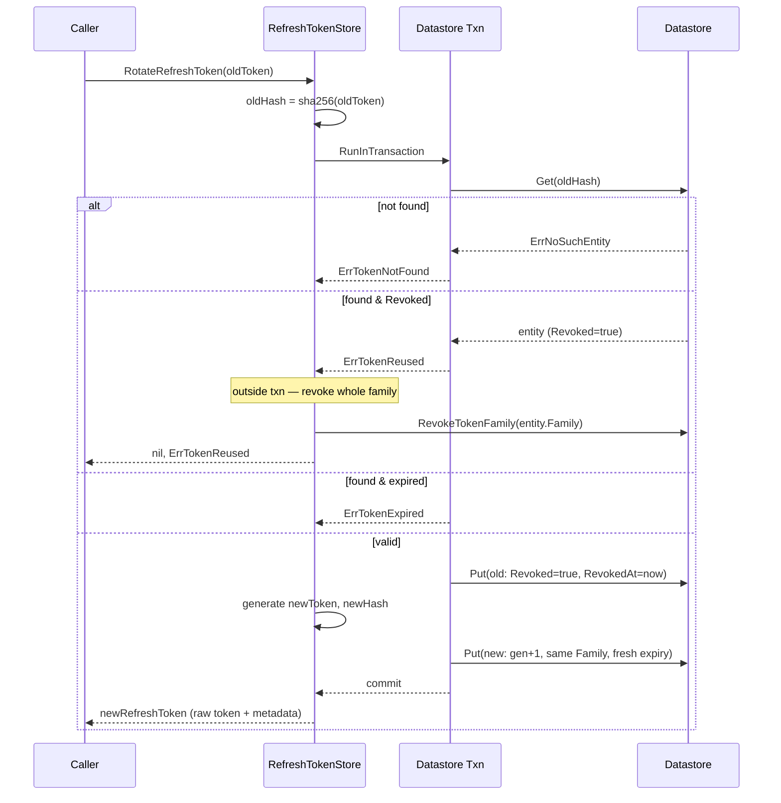

# gae — Flows

## Refresh-token rotation with reuse detection

`RefreshTokenStore.RotateRefreshToken` swaps a presented refresh token for the
next generation in the same family, inside a Datastore transaction. An
already-revoked token is treated as a reuse attack and triggers full-family
revocation (performed outside the transaction, since it spans many entities).

Key points:

- Tokens are stored under their SHA-256 hash; the raw value never lands in
  Datastore.
- Revoke-old + create-new happen atomically in one transaction so a crash
  cannot leave both live or both dead.
- Family revocation on reuse is deliberately outside the transaction because it
  iterates an unbounded set of entities (`RevokeTokenFamily` runs a query).
